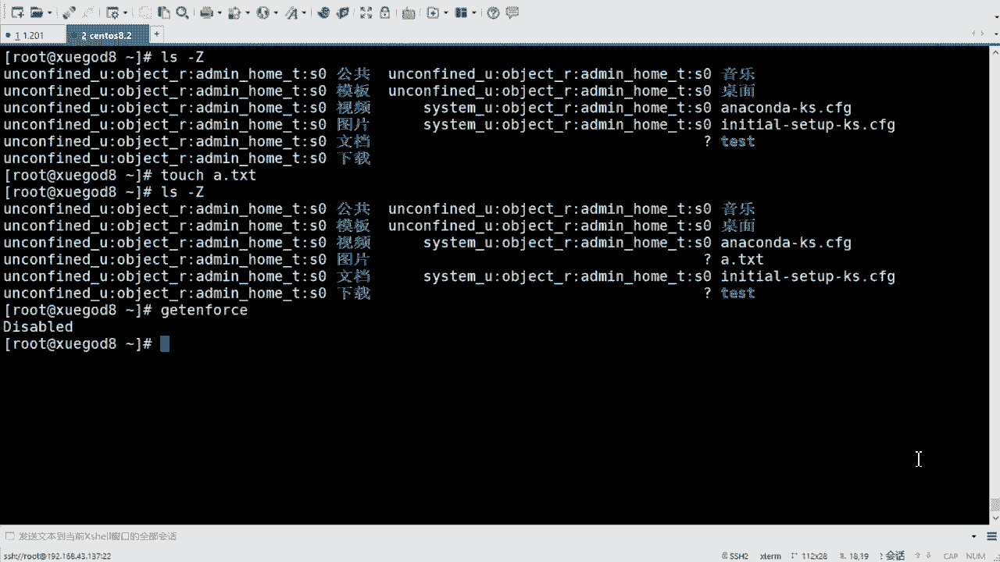
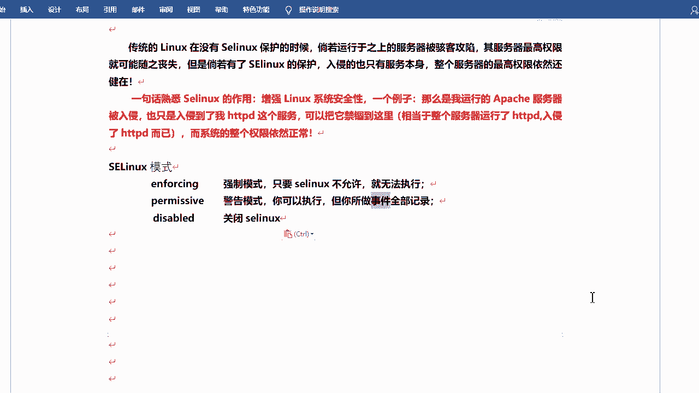

# rhel8-centos8-rhce-linux-stream-stratis-vdo-podman-dnf - P3：rhel8-e-1-3selinux - Linux最diao - BV16T4y1K7px

来看一下S以另ux啊。呃，这个的话也是个安全的东西啊，安全的机制可以说是啊。它叫什么呢？它叫security enhancedlinux SEE嘛是吧？安全性增强的linux啊。

由美国国家兴举NCA开发。构建于control轴上，有灵活的强制性访问控制结构。主要用在提高lining安全性，提供强劲的安全保障，可以防御未置攻击啊，它这个描述是完全没有问题的。好吧。

确实也很安全也很厉害，但是啊它太安全了，包括操作起来的话也很复杂，导致呢很多情况下咱们。😊，去去去装好系统之后，默认的话就是把它关掉的啊，关掉的啊。这东西只是比如等们考试的时候去去去开一下，好吧。

然后像正常的生产环境里面基本都是开都是关着的。啊，一般一般也不会去开啊嗯。呃，那么Slinux有多安全呢？它可以确定什么呢？哪个进程可以访问哪些文件目录和端口，它都可以控制，控制的非常的细啊非常的细啊。

一组安全的规则啊，然后每个文件进程目录和端口都具有一个专门的安全标签这个标签叫什么叫上下文S elinux的上下文啊，就是这个东西啊，这个东西啊，然后这个标签里包含什么呢？包含的种类也比较多啊。

包含这个这是几类四类啊用户。角色类型和敏感度级别啊这么几个。那么咱们一般去控制的话，去修改的话呢，改的是这个类型。好吧，感这他啊。然后目标策略看，会根据第三个上下文类型来制定自己的规则。

那么这个类型呢一般是以下划限T结尾的什么类型。那怎么去看呢？是吧？咱们可以通过RS杠大Z去看啊。😊。

L杠大Z去看。嗯，好吧，看我默认的话，它都会有这种规则啊，这个是用户。呃，角色啊类型，然后敏感度级别啊，这个下面T的话呢就是类型啊，这些可以改的啊，一般都可去改的。还有的话是一种问号的。嗯。

它比较特殊是吧？哎，他怎么没有呢？对不对？他怎么没有呢？是这样的啊。是这样的啊，因为这些的话呢是咱们系统自带的这个文件和目录。好吧，然后呢。放呃Ilink自动已经给他打标签了。😊，录已经打过了啊。

那么这些呢这个是我刚才创建的，这我再创建一个啊。我再创建一个，它是1个A1点TIT吧。然后你再去看。他也没有。为什么？因为我目前关的啊，目前咱们S应是关的啊。😊，Get enforce force。

是不是那关的话，他就不会再去打标签了。😊，好吧，除非你比如我我再去放开啊，再去设置那个inforcing开启。那么开启完之后呢，我再去重启系统。那么重启系统启动时候，它会去重新去打标签。重新大白签。

这个也是为什么咱们再去。😊，呃，译码的时候啊抛译码的时候，如果说你开SElink，你要去给它叫做touch一个根线的点albel，还记得吧？对不，那个就是其实就是出现大标签。啊，就是出现标签啊。

包括你密码密码改了是吧？你还改了什么ETC线的那个相对筛le文件，对吧？它会重新打标签，重新认识它啊才会生效的啊。你不创建那个relaable，它是不生效的，好吧嗯。😊。

这是查看啊。这是查看啊嗯。S杠大Z可以看啊。那么嗯在这儿啊简单来说一下它的它的功能是吧？简单来说一下啊。😊，呃，一句话啊呃叫什么呢？叫增强SElinux系统安全。举一个例子。

可就可以去知道它是有多安全啊。你比如说我们运行的一个阿帕奇的服务器，麦表服务器。对不对？那如果说他被入侵啊，被黑收入侵了是吧？那他只入侵到了我的HTTP这个服务，还有他箱的目录和文件是吧？

那么你的黑事可以随便搞，是不是？但是你是不能。突破这个界限的。啊，拖一些这叫什么？这叫筋固。是吧经过你只能在这里边玩，你到不了我的系统里边来，你更不能提全。是吧比方说你进来之后，你只是一个阿帕奇的选项。

你不能成为root。这是开的S一啊，他是不能去做的。如果说你没有开，那你会有这个风险啊。如果它入侵了你的阿帕奇的服务，那么从而呢可能会得到你的系统的权限。😊，系统的关联的权限可能会这样的啊。

S应可以避免这个问题啊，但是是吧？但是设置起来是是比较复杂的。好吧，是比较复杂的啊。对，考试时候都是开的啊都是开的啊。行，那。呃，咱们来看怎么设置啊，这个其实开关啥的咱们都讲过啊呃。😊。

修改那个配置文件是吧，ETCconfi下的SElink啊，然后S link等于啥inforcing开启强制开启。😊，permissive是警告告警模式啊，你可以日行。

但是它会去记录你的它会记录你所做的事儿啊，叫permissivediableable的话呢是彻底关闭是吧？彻底关闭啊。

就在这儿都都设置过吧，是吧？or。ETC says config啊。这你看我这也是关掉的是吧？如果说你想开启的话是吧，我改掉啊，改成infor。😊，inforcing别错啊。改完之后保存内中啊。

重启生效一下啊。

那么重启的时候就可能会比较慢啊，因为它会去重新打标签啊，重新打标签的啊。嗯。然后如果说你是已经开启的，我想去关闭或者叫临时关闭性可就啊，咱们可以用set in force。对不对？

set enforce啊。呃，sent voice0这个呢是临时切换为permissive状态，也相对于关闭是吧？它会去记录的啊，就是这个状态啊这个状态。然后呢，你还可以再设置回呃一。

然后设置成inforcing强制启用。但是如果说你已经是diableable的话，那你不能这样去切啊，diable的话不能这样去切啊，必须是inforcing的，你才你才可以去切啊零和一这样来回切啊。

diable我这写一下吧，是吧？第c步呃，应该说什么嗯如果。如果已经是。DC步状态。Disabled。没有错吧。状态。啊，不能。这样使用啊。不然的话，你们可以试一试啊，这肯定是不行的啊。好。

我现在重启是吧？重启的话。😊，我的风扇已经开始转了啊，因为它在工作。

我看起了吗嗯。嗯。还在起啊。来看一下啊。get in force是吧？来，现在forcingS杠大Z。是不是那这些刚才没有那个上下文标签的是吧，他都给你打上了，看到没有？都你打上，当然打的这是默认的啊。

默认标签。

啊，这就可以啊这就可以啊。😊，O。那如果说你想去控制。你想去这个更改它的话，是不是那会有相的命令可以去去控制它的啊。可以控制它的啊。叫什么呢？叫SEman啊，SE manage这个命令啊。

然后F contextt呢会设置文件，这是设置文件的SElinkux啊上下文啊，然后restore coin的话是让它生效。相当于咱们刚才设那个防火墙一样，设置防火墙之后reload是吧？

re coin的话呢也是去也是去这个让它生效。因为S一个的话，其实它会有一个数据库啊，里边会有记录，就是什么什么呃标签之类的啊，它会记录下来的。😊，还有一个就是称职CHCON啊这个东西。呃。

这东西的话呢，一般用用作于实验啊，一般不会去直接去用它啊，临时去用测试可以是吧？一般不是真正的去用它的啊。来。呃，SE manage就是SElin manageSE管管理的意思啊，呃。

F contact就是文件啊，用来声明文件的默认标签啊，然后使用re restorestore coin这个命令将上下文应用于文件。呃，真实coon的话用来也是可以去更改啊，然后也可以设置上下文。

它对于测试和实验很有用，但是它不能将上下文更改保存到SE leader上下文的数据库中，看到没有？当recor命令的时候，chcor的命令所做的更改也无法保存，也无法保留是吧？

所以说咱们就用这两个就可以啊。这两个就可以啊。好吧，那你去设置它的话呢，可以这样设置啊。试试他的话啊。可以呃可显示和修改。啊，然后用riscon来设设置默认下面的规则，它可以使用正则来指定路径和文件名。

就是你不用去干什么呢？你不用去呃单独修改一个，你可以修改一个目录下边的这些文件啊，都可以去修改的。啊，快眼正则的话一般可以这样用啊，小括号，然后斜杠点星小括号问号，这个代表就是呃目录下边的所有文件。

好吧，某个目录下边所有文件啊可以这样去表示的，可选择匹配后跟任何数量字符的这个斜杠啊，就是那个那个那个目录啊，那个目录啊，它将会匹配在表达式前列出的目录并递归的匹配该目录中所有内容啊，就是直接去修改。

这是一个正则啊，这是正则。如果说你理解不了的话，那你可以去先先死记一下吧。好吧，小号括起来里边的这个斜线点型小括问号。😊，其实什么意思呢？点星的话就是任意一个字符的啊，任意的次数。

其实相当于任意的那个啥任意的那个文件名啊，任意的文件名，然后问号啊出现零次或啊，不是啊，出现这个是一次或多次啊，政策啊，如果说不懂的话，可以。呃，看一下咱们那个郑泽的那个视频，可以去看一看啊。

什么问号新的，什么加号啥的啊，这个东西。

行，呃，可以简单来试一个啊，简单来试一个啊SE manage啊SE manage好吧，你看这个它是可以table的。它不单单可以设置F context啊，可以设置什么 nodeode port。

也可以设置端口号。啊，interface接口是吧，都可以去设置啊，user用户。对，咱们现在用的，包括咱们后期考试用的话，就是主要是这个F context啊文件啊文件。嗯。

F context这个能推我看啊啊，这个的话呢也会去显示一些参数是吧？什么杠A啊、杠D啊、杠E啊杠F啥的啊，嗯，主要用的就是这个A。D和L啊L。A的话是添加adD的话是删除啊。

deleL的话是列出啊列出啊呃，一般的话咱们用的话呢是可以先去列出。杠L去列出啊，它会列出你所有的可以使用的这个什么呢？这个这个标签啊，包括方式。啊，那我给你列出来，当然有很多有很多啊。

你可以gra一下，比如说。

gra HHTTT吧。好，关于阿帕奇的一些配置是吧，怎么去配置啊，然后怎么去写这个。😊，这个这个类型是吧，后边都会有例子啊，都会有例子的啊。😊，当然有很多是吧，到时候你得选择啊，你得选择啊嗯。

然后这是查看啊。查看啊。好，列出是吧？呃，我这儿有个截图啊，这个截图是咱们书上的啊，是咱们书上的啊。😊，为了确保您拥有管于SElinux上下文的功率。

请根据需要安装policyco utu软件包和policy cover upyython软件包。这两个软件包的话会提供咱们raor coin和SE manage这个命令。啊。

当然一般情况下都是给他们装好的啊，都是给他们装好的，你就是直接能用的。😊，好吧，直接能用的啊。如果说没有的话，那你再去装这两个包。好吧，一般都有的啊，这个你放心好吧，这个你放心啊。😊，呃。

然后下边的话咱们来做一个简单的一个一个一个例子啊一个例子啊。这例子是干什么呢？就是呃设置。887HTD吧，HDB服务啊可以访问。的目录啊。设这个这个啊。

啊，什么意思呢？就是默认情况下，比如说我有一个阿帕奇的服务啊，我看我这装过吗。😊，它的默认的网站跟目录呢就是可以访问的是哪呢？是咱们。嗯，Y下lab下的啊，不是Y下3WHM。没有装是吧，我装一下吧。

インスト。HTTPD啊，这个是咱们的阿帕奇的web服务啊。啊，这么多啊，然后它会生成一个目录啊，哇，像3W这见没有。那么这里边的话呢，它会去。干什么？他会去呃可以放置咱们的网站。

那么你就可以通过IP地址去访问咱们的网站了啊，是干这个的。好吧，当然默认里边是空的啊，现在啊L杠刚大家自己看一下吧。😊，嗯。Go。能看见吗？哦，能看到啊点和点点是吧？😊，嗯，我创建个文件吧，它是一个。

你看我创建这些文件。啊，包括包括这个这是这是隐藏文件啊，包括什么上级目录啥的啊。😊，那么这个里边呢，它会显示咱们嗯这个文件的类型，咱们主要看类型啊，第三个字段这是第一个第二个第三个，它是什么？

它是HTTPDs content T。这个类型。那么有这个类型之后，那我的帕奇才可以去访问到你的这个文件啊，是这个意思。啊，这个意思如果说我随便找个目录啊，比如说我看一下。home目录啊，刚拿这啊。

后目。对不对？还有CD一个目录CD这个目录。那么这个目录呢是user home点RRT这个类型。也就是说，你的阿巴奇是不能去访问这个目录下边的内容的。因为什么？因为类型不一样。你不是他。好吧。

那你是他的话，你才能去那个才能去访问的。那不是他的话，阿帕其实没有这个权限的。所以说Slinux控制的权限就是就是这么细，对吧？我就就这么细力度。对你没有这个权限，那你就不能访问。

你不能你甭跟我说它是什么RWX啊是吧，或者它的什么输入属组之类的呀。bosch啊，boss必须得是和它一样才能访问的。好吧，那咱们得去修改它一下是吧，修改它一下啊，那我创建一个新的那个啥吧。😊，嗯。

创一个新的目录啊嗯那个第。😊，跟一下那位数吧。啊，然后touchuch一个V首线。叫做index点HTM啊。然后看一下24杠纳Z。没一说。😔，对不对？它是什么default t啊，default t啊。

这是一个默认的一个类型。对不对？那那我去怎样呢？我去设置一下这个。设成HTTPDs content T啊，把它设成这个这个这个类型的。好吧，嗯，我复制一下吧，复制一下啊。呃，怎么去设置呢？

叫做SEman啊。F context是吧，杠A添加添加什么呢？添加类型啊，杠Ttap类型好吧，呃，什么类型呢？就是刚才咱们复制这个啊HTTPTs content t这个类型啊。好吧。

那你去对哪个目录或哪个文件去修改呢是吧？呃，那咱们可以用那个正则那个方式啊。呃，跟线的威手。啊，让我过起来，小会过起来啊。跟就是就是那个斜杠目录啊点儿。呃，芯儿。然后问号。你意思就是递归的意思啊。

它要目录下面的什么子文件子目录都给它去重新设置一下。好吧，都给的重新设置一下啊。😊，啊，他会把这个过程写入到那个数据库啊，可能会稍微慢一点啊，出来了是吧？出来之后咱们可以再看啊。为数。啊，那当然没有改。

还是它是吧，还是devo T啊，那我让它生效一下restore。Coin。杠RF啊R的话就是递归F的话是强制啊，可以设这个VV的话就是显示信息详应信息啊，然后是尾数。好吧，去设置一下啊。然后再看一下啊。

对吧这这就改过来了啊，这就改过来了啊，然后它会提示relabeled啊，重新打标签。看到有？注意的白签啊，从什么什么什么。到什么什么什么。对吧能看到吧？主要看类型啊，在这from to对不对？

然后这个是relabel啊，呃，这个首先是你的目录大标签，然后这个是你的文件index文件的大标签。😊，对吧这是整个的过程。

好吧，这是整个的过程啊。然后我把它。复制过来啊，然后你们可以敲一敲。嗯，好吧，当然这个类型的话呢，呃如果说你不知道怎么去去写的话，是吧？你就去看一下它默认可以去访问的那个文件或目录类型是个啥。

然后你可以把它直接复制过来。😊，好吧，可以把它直接复制过来的啊。😊。

S1N你个是2。

