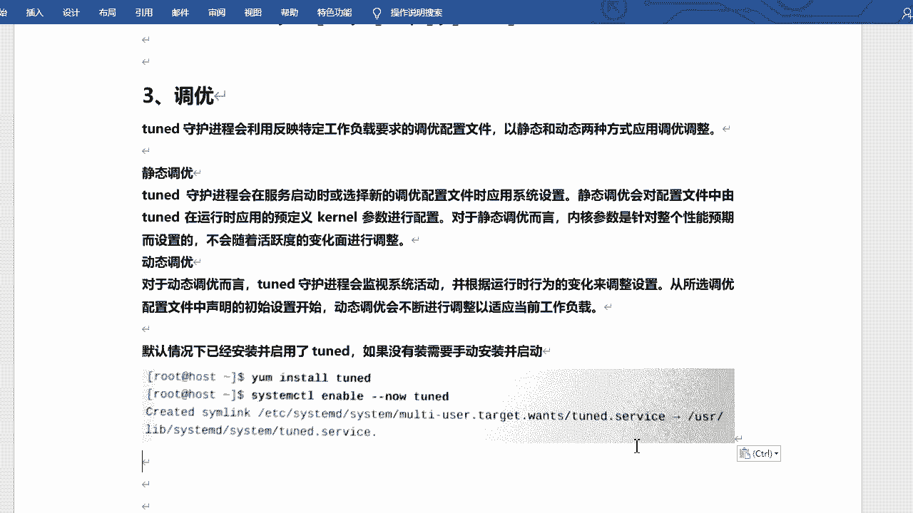
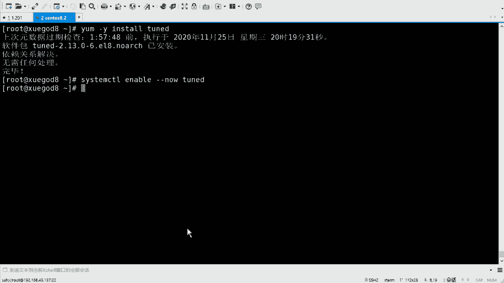
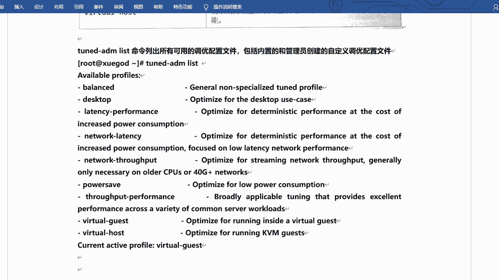
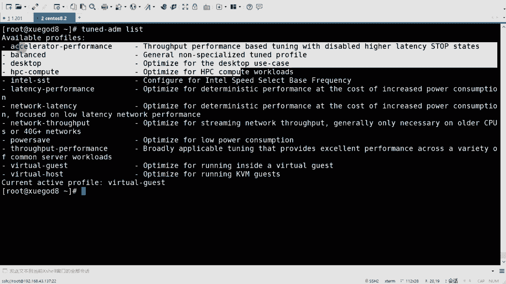
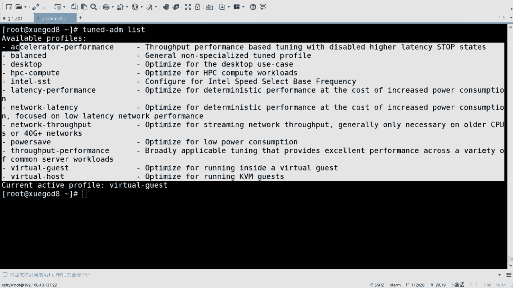
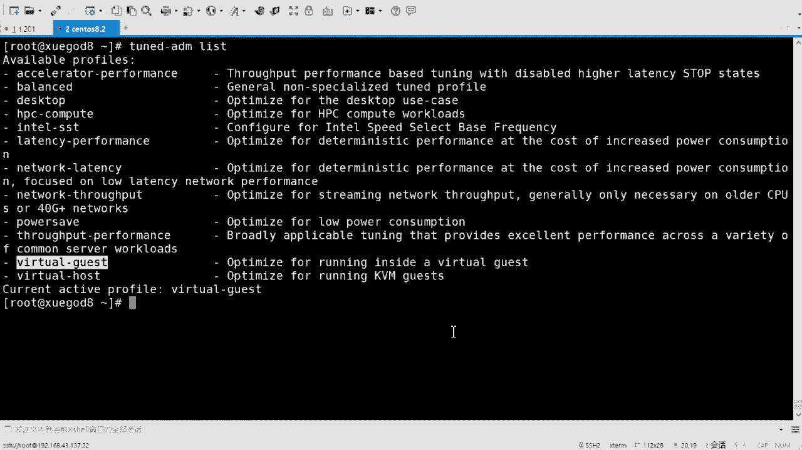
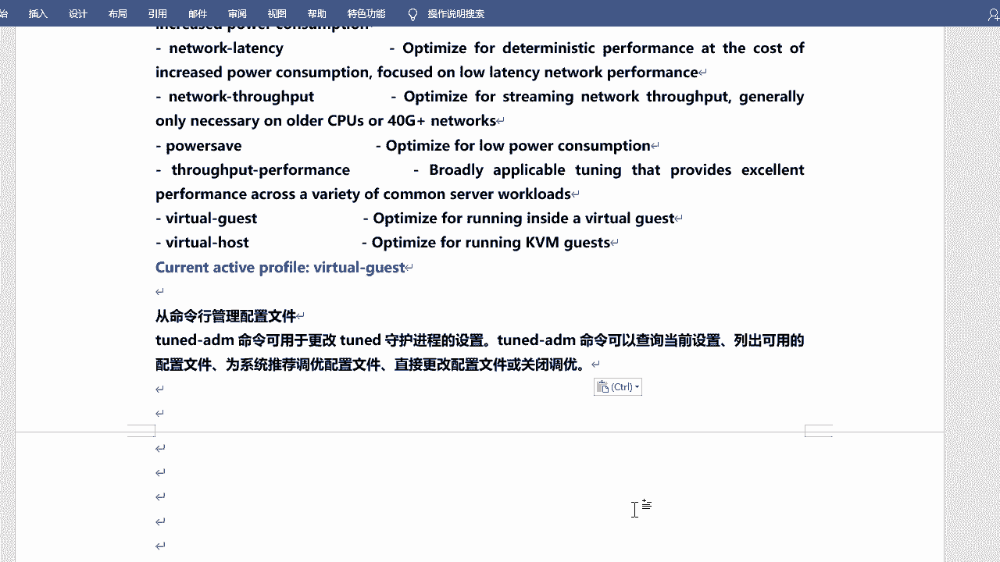
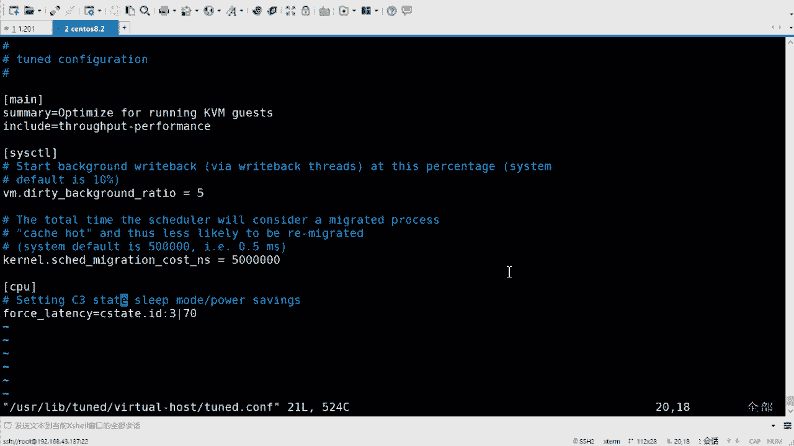
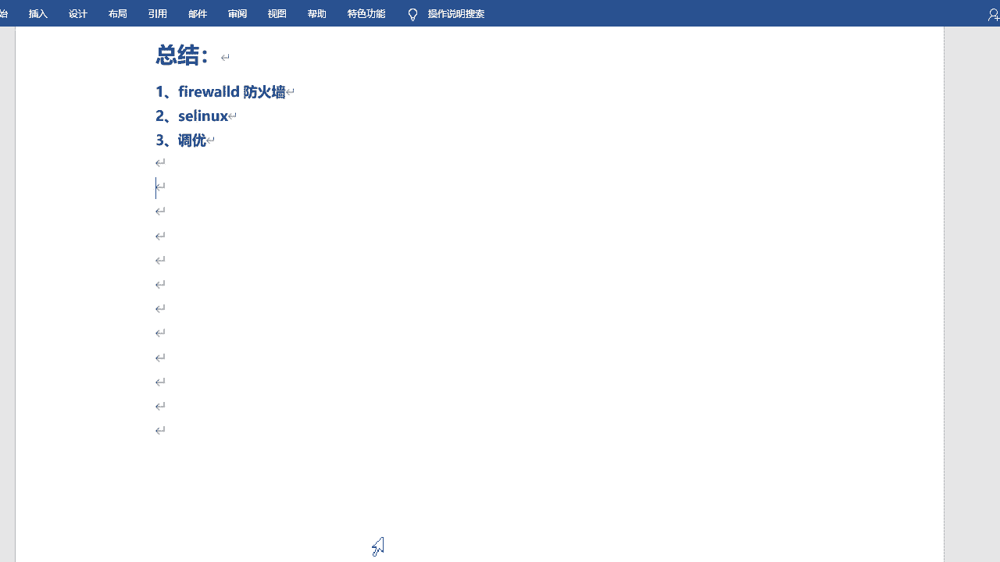

# rhel8-centos8-rhce-linux-stream-stratis-vdo-podman-dnf - P4：rhel8-e-1-4调优 - Linux最diao - BV16T4y1K7px

来看一下调优啊。调优的话呢也是咱们考试必考的啊，考试必考的啊。呃，然后其实他。看上去好像很很高大上一样是吧？调优嘛，改个参数什么的是吧？但是这个呢不需要咱们手动去改参数，它会给咱们一些配置文件。

你直要它生效就可以。😊，好吧。这样它生效就可以啊，叫做turned t叫t吧，是吧？ted啊TUNED啊，但是这个呢其实不是说在8系统里边才会才出现的。很早就有了啊，在6。6。3应该是我记得啊6。

3就已经存在了啊，但是但是可能你们没有用过是吧？啊，然后在八里边它又重新拿出来啊，重新去强调了一下啊，叫twin。😊，守绘进程啊，然后会利用反应特定工作负载要求的调优配置文件。

以静态和动态的方式来应用调优的整调整啊， twin的这是 twin的啊。呃，静态动态的话它都支持啊，不同的配置文件，它支持的这个方式不一太不太一样啊。啊，静态的静态的话，现在就是写死的啊。

会在服务启动的时候或选择新的调跃配置文件的时候，应用系统设置。现下调优会对配置文件中由t在运行时应用的预定义 kernelnel参数进行配置。对于静态调而言，内核参数是针对整个性能这个预期的设置的。

不会随着活跃度的变化而进行调整。啊，这是对于某个比如说某个调友来说的。啊，然后对于其他朋友呢，还可以支持动态的。😊，动态的话就是t的会监视文件呃监视这个系统的活动，并根据运行时行为的变化来调整设置。

从所选调优配置文件中声明和初始设置开始。多月调啊会不断的进行调整，以适应当前的工作负载。好吧，这个它都是支持的啊，真的啊都是支持的。呃，默认的话已经装过了啊，当然咱们也可以再去看一看，它有没有装过啊。

😊，TUNED啊。

直接装它就可以啊，我这看一下啊。样是吧。インスト。啊，当然你用DNF印到也可以啊，DNF是吧？看你想用哪个啊。嗯，TUNED。装过了是吧，然后服务的话给它起一下啊。😊，这条呃 enableable更状。

呃，T有NED啊嗯。行吧，然后我给它启动起来啊启动起来啊，启动起来之后呢，它大部分的这个啊不是大部分啊，它这个大概的情况是吧？去支持的配置文件，包括条约的类型呢有这么几种啊有这么几种。😊。

叫做节能型的配置文件啊，还有性能提升型的配置文件。啊，这这是两种啊。然后对于新成提升性的配置文件呢，又侧重于以下方面的配置文件，存储和网络的延迟低延迟。

存储和网络的高吞储虚拟机的性能和虚拟化主机的性能啊，就是虚拟机和宿主机相当于啊它他们的这个性能好吧，然后咱们书上的话呢是有这样的一个呃一个对应关系啊对应关系啊。但是书上的话这个。说实话啊。

这个这个翻译其实不太好。啊，还不如直接看英文的，说实话啊，你像前面有个均衡啊，这个叫balance，其实啊balance。😊，非常适合需要在节能和性能之间进行折中的系统是吧？

这个折中我不知道是不是真的这么细啊，就是就是取一个平衡点对吧？取一个非常均衡的一个值啊这个意思啊均衡。那么这个的话相当于它就是一个动态的调优的。😊，好吧，这就是动态调优的啊，然后还有dextop桌面啊。

从balance配置文件衍生而来，加快交互式的响应速度啊，还有什么throughput performance啊，这个叫吞吐量。怎荣亮啊。调优系统获得最大的充能量啊，还有什么这个这等等的嘛，是吧？

通过牺牲叫laticacy performance啊，需要牺牲能耗来获得低延迟的服务系统网络延迟啊，从这里边引身而来，可以启用额外的网络调优参数，以提供第一网络延迟。啊，网络吞储量啊。

就是从这个什么sawputperformance来的，应用其他网络参呃网络才用调优啊，然后获得最大的网络吞储量啊，还有节能的是吧？节能的啊，调优系统最大程度实现节能。这个节能是叫啥来着？呃。

叫power save啊，power save。对吧其实还不如还不如看英文的啊。呃，oracle是吧，是针对oracle做的负载的优化。visual gas就是虚拟主机呃，虚拟机啊，虚拟机啊。

当系统在虚拟上运行的时候，调优系统已获得最高性能host就是虚拟主机啊，就是宿主机，好吧，宿主机啊充当宿主机的。对吧这么几个。啊，这么几个。

然后它有这个英文的解呃英文的那个啥英文的这个一个一个对应关系吧。也可以看一下啊。英为对应关系的话呢，可以通过叫做。嗯，在这儿啊，把它复制过来吧。通过一个命令叫to的ADM list啊，就是去查看好吧。

查看啊。通过它可以去查看。

咱们可以看一下啊，这就是纯英文的了啊。啊，T闻ED。😔，嗯，TN。ED看命啊list。这个是他目前支持的这么多啊，然后呢，他也会给你说什么呢？叫做current active profile。

叫visual guest啊，当前的活跃的这个配置是吧？是什么呢？是visual guest啊，虚拟主机。

好吧，你可以看一下啊，虚主机，那就是它目前用的调油的参数就是它好吧，就是它啊，把这个也也标红吧。

飘红啊。通过turnadmin啊，然后去设置啊。呃，也也是命令行的设置是吧，命令行的设置啊。😊，那命令好的设置的话呢，主命令啊主要用的命令就是turn的命。啊，可以查询当前的设置，列出可用的配置文件。

为系统推荐调优的配置文件，直接更改配置文件或关闭调优都可以通过它来设置。好吧，通步它的设置啊，包括咱们其实在那个考试时候也会有一个调优嘛，它会他会让你去按照当前的那个那个推荐的调优，然后去去设置啊。

其实就比较简单啊。

来，咱们可以先看一看啊。😊，呃，刚才list呢是显示咱们可以使用的调入的参数啊或profile有哪些？有这些啊都可以使用的。啊。可以使用的啊，然后咱们可以看一下。然后的AEDM是吧。

active当前活跃的是谁？活跃的话就是visr guest嘛，是吧？就在这儿呢啊在这儿呢啊。😊，呃，然后的话呢。嗯，还有叫这个这个这个就是。Okay啊。这是。😔，这是查看啊这是查看啊。然后turn。

嗯，active我看见了是吧，看见了，然后咱们可以去去修改。😊，TN。D啊，然后ad me。怎么修改呢？修改的话叫profile啊，perfile修改。当然你也可以t一下，看有什么参数啊。😊。

off就是关闭啊，我不调优了是吧？list史的查看X5是活跃的perfile啊，是是是设置啊，然后reman的话就是推荐的veified的话就是那个啥就是就是。呃，审核相当于啊或者去查看。

Veryever fail。嗯，设置的话就是profile。比如说我设了一个啥呢？设置一个，你也可以，你也可以去t的啊，再会给你显示出来咱就可用的。我是成balance的吧，好吧，balance的啊。

复制一下。嗯。设设置完之后呢，再查看啊TUNED。里面然后XQ。目前活跃的就是balance的。啊，目前剩效的就是它。好吧，就是他啊，但是它合适吗？😊，对不对你想设置谁就设置谁嘛，对不对？

它会有叫recommanded啊，recommandremand的话就是那个啥recommand就是那个那个那个推荐系统推荐你用哪个设置啊，咱们可以看一下。😊，Amin jury commander。

他推荐咱们用的是visual guest，对不对？推荐用的是它啊。好，那我再改回来啊，那我再把它改成那个visual guest啊。好吧，你可以再改回来啊，然后的话呢可以再再看一下。

对吧那他就是we术cast了。好吧，就是re了啊，对吧？你就你就来回这样去操作就可以了。其实主要就是TNED。按那边是吧，然后t tape就可以啊，这么几个参数。主要就这么几个参数啊，好吧，然后呢。

它它的每一个这个调优的参数是吧？其实它会有一个。呃，默认的配置文件啊，在user lab下的叫做t。嗯。😊，你看啊会有箱的配置啊，比方说我我看一下吧。啊，我为M。有点 lab吧。存的。😔。

vis show guest是吧？里边的会有turn康复的啊，其他话也一样啊，us the lab。吞的。😔，回收。😔，回首 host吧。是吧你看它也会这个配置文件啊，可以看一下啊。

里边的话就是一些参数，内核的参数啊可以修改的。😊，是吧。VM什么 dirtyirty background。啊，看着我什么scched的。对吧什么force什么之类的，对不对？这都是它它默认的配置啊。

也就是说你去试它的话，其实它就是让这些参数生效。

好吧，让这些参数生效啊。就这个啊嗯。嗯，这个是从命令行配置，从命令行管理配置文件。从面的关联配置文件。我直接拿过来吧。😔，嗯。😊，主要用的就是turn呃dmin啊ADM这个命令是吧？可以修改，可以查询。

可以列出啊，可以关闭或调优啊，这时又多了一遍啊。Right。O。呃，active的话就是查看当前活跃的配置文件。对不对？你你可以看看这个路径里边都有啥。然后呢，可以设置设置的话是profile啊。

然后呢指定你的配置的参数。对吧本fa名字啊名字啊。然后查看，然后还可以查个recommand啊，recommandrecomd就是推荐的参数，好吧，推荐的参数啊。是吧调优这个其实你就直接去设置就可以。

好吧，装包呃，包的话默认也装好了，然后起伏。对不对？全完服务之后直接去你可以直接去查看那个啥是吧？直接去查看那个remon，推荐你用啥，你用啥就可以了。😊，对不对？其实就相当于是。嗯，两条命令吧是吧。

然后就可以搞定了。好吧，就可以搞定了啊。OK行，来总结一下啊。今天的三个方面是吧？主要的话就是防火墙啊，fairbo防护墙，然后SElinux和调优。啊，这三个部分的话其实都会去考是吧？都会去考啊。

但是。嗯，占的比重会比较小啊比较小啊啊，fair world会有一部分。其实是非常小啊。SElinkux的话在CAC里边有专门的一个题啊，调的话有专门的一个题。😊，好吧嗯。行，这是咱们今天的内容啊。

