# rhel8-centos8-rhce-linux-stream-stratis-vdo-podman-dnf - P5：rhel8-e-2-1NFS - Linux最diao - BV16T4y1K7px

来啊，今天的话呢给大家讲的是呃关于这个呃存储的啊，关于存储的，包括NF啊NF网络文件系统是吧？还有红包八新增加的两个啊，一个叫做strats啊，一个是叫做VO啊，然后这几个的话呢呃基本上都有考啊。

所以说大家这个这几个的话需要好好去。展赏一下啊，好好去看一看好吧，好好去看一看啊。来啊来。咱们先来看NFS好吧，先来看它啊。😊，这几个都是服务啊都是服务啊。NFS。是吧NFS叫什么呢？

叫做叫做应该是network啊，fe system啊，就叫网络文件系统。好吧，网络文件系统啊呃是由linux Uniux及类似操作系统。呃，使用的互联网标准协议啊。

可以作为它可作为他们的本地网络文件系统。它是一种啊这这这这是介绍啊，那们可以先看一下啊，它是一种仍在积极开发的增加的开放标准啊，它支持本地利用的权限的文件系统的功能。啊。

就是它可以去共享出来它的呃文件啊或者目录，对吧？它可以共享出来，然后大家可以去访问的啊，可以去访问的啊。然后呢，在咱们的红号8中是吧，默认FS的版本是4。2啊，4。

版本啊啊支持NFSV4V3的主要版本啊。V4的话呢仅使用TCP协议与服务器进行通信。啊，然后较早的呃NFS版本的话，可以使用TCP和UDP啊，这是之前的啊，现在都是TCP的。呃。

还有一个就是NFSV2的版本啊，已经被遗弃了是吧？已经不支持了啊，现在就是四合3，当然默认的话，咱们现在用的是4。24。2啊。😊，呃，工作流程什么呢？工作流程是AOS服务器会导出共享目录啊。

你要去共享谁是吧？别人可以去挂载的啊，可以挂载的。IS本件系统将导出的共享挂载到本地的挂载点啊，本地的挂载点或目录是吧？该挂载。该挂载呃，又多了个载是吧？该挂载点啊必须存在。

就是肯定这个目录还是存在的啊嗯。😊，然后可以通过多种方式挂载NFS共享啊，比如说mo特手动挂是吧？或者是说ETCFSCD呃，那个自动挂载，就是开机自动挂载啊。对。

按需域挂载啊啊还有使用auto FS的auto mount功能啊，自动挂载的功能。好吧，这个这个叫做呃自动挂载，也可以叫做触发式的挂载啊，就是你用的时候呢，它出来不用的时候呢。

它过几分钟自己就卸载掉了啊。这个东西呃，那么I的话呢和auto曼呃autoip的呃联合使用是吧？咱们一会儿就会去讲到的啊。😊，这是NFS网络稳件系统啊。嗯，再来个介绍啊，这个其实也可以简单来看一下啊。

😊，这个东西。network feel system啊就NFS是吧？呃，其实最早的话呢是1980年是吧，由散公司发展出来的啊。三公司啊三公司其实是属于一个历史的，相当于啊三公司。

也被那个oracle收购了是吧？收够了啊。呃，实现的系统间实现的磁盘文件共享的一种方法，它也是一种网呃一种文件的这个系统系统协议。支持应用程序在客户端通过网络存取位于服务器磁盘中的数据。

因为是网络文件系统马上可以挂载，然后可以访问你的服务端的文件。wifi基本原则是让不同的客户端啊及服务器，通过一种叫RPC啊，remote course叫远程过程调用，共享相同的文件系统。

它独立于操作系统，允许不同硬件及操作系统的。及操作系统的系统共同进行文件的共享。啊，虽然FS可以在网络中共享文件，但是呢它并没有呃提供数据传输的功能。

就是它只是一个相当于这个我不知道大家有没有了解理解过那个啥啊，那个FTP啊，它相当于是一个控制端口啊，或者叫控制服务啊，就是用来连建连接的，然后呢真正传输的话啊，出完传文件的话，或者写数据的话是吧？

是由RPC来帮忙去做的，需要借助RPC的功能啊。RRPC的话呢定义了一种进程间通过网络进行交互通信的机制啊，它允许客户端进程通过网络向远程服务器进程请求，而不需要了解服务器底层的通信协议啊。

直接用就可以。相当于啊。那么通过使用F用户和进程序，可以像访问本地文件一样，访问与远端系统上的文件。就像本地一样是吧，就像本地一样，就是就是挂载挂载完之后呢，你正常去用就可以了。创建啊是吧，文件呀是吧。

删除啥的都可以啊，都可以的。😊，好的啊，这是NNFS啊，然后说一下IPRPC啊，RPC的话也可以对咱再再再说一说啊，RPC。😊，嗯。😊，Yeah。RRPC。在这啊，其实在咱们七版本的考试的时候。

有这个NFS协议啊。呃，当时其实做的也挺多，但是八版本的话呢就没那么复杂。8版本的话呢把它放到了CSC里边啊，就简单了很多啊。嗯，这个可以作为了解啊，写一下吧。😊，可以作为了解啊。RPC的通行过程。嗯。

呃，RPC的通行过程是吧？当1个RPC建立开呃建立开始阶段，客户端建立过程调用，将调用参数发送给远程远程的这个服务器进程，并等待响应。取用到达时候呢，服务服务器通过客户端启动的服务调用指定的程序。

并将结果返回给客户端。RRPC调用结束，客户端将继续进行下一步的推行操作，是吧？那么NFS的话呢，是依赖于RPC和外部进行通信的。为保证NFS服务的正常啊，需要RPC注册相应的服务的端口的信息啊。

这样客户端向服务的RPC提交访问某个服务的请求时候，服务器才能正确的做出响应。这个其实呃大概说出来一部分啊，就是说呃咱们去启动NFS的时候，要先去启动RPC。先起它啊。

因为它会注册箱的这个服务端口信息的啊。你看注册的时候是吧，要先启用RPC才能保证NF注册成功。然后如果呃RPC服务重启了啊，保存的信息将会丢失啊，需要重新启动NF已注册这个账号信息啊。

否则端口呃否则客户端将无法访问NF服务，对吧？也就是说他们俩现在是绑定的。好吧，它这是绑定的啊，就是你起的话都得起来，而且的话得先起RPC是吧？先起RPC啊。😊，这了解就可以啊。😊，呃，行，那咱们来。

装一装是吧，做一做，看看他是怎么怎么去做的嗯。首先的话咱们先嗯安装一下NFS好吧，安装一下NFS啊。呃，我在这歇一下啊。直接去inst到就可以是吧？当然这个呢也是咱们的本地养文员就可以啊。

不用网络源的啊。不括考试的时候。理论上也没网络远是吧，就直接装就可以啊。

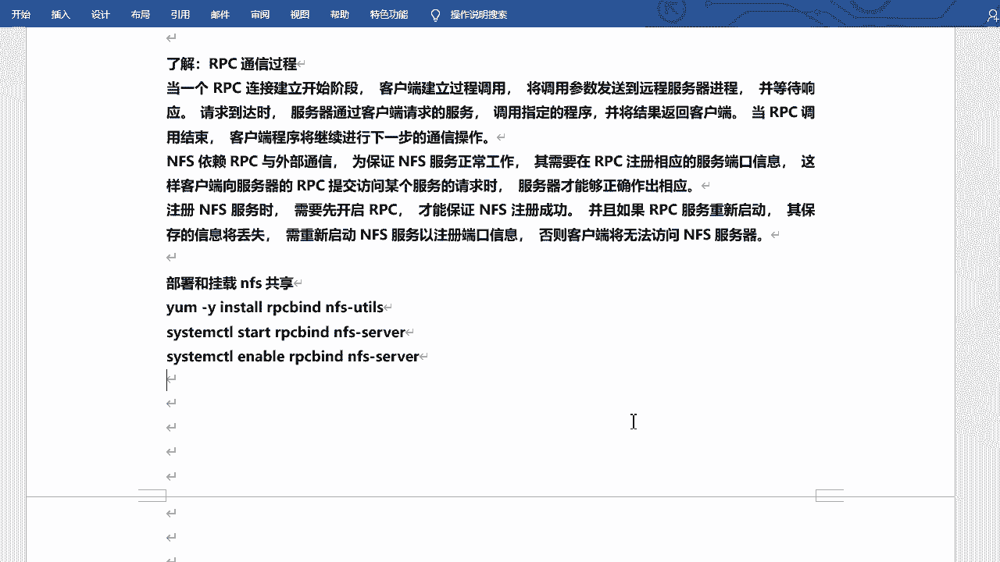

亚明色。我在这装一下啊嗯。呃。じミ党。一个叫RPCRPCband啊。还有一个是NFS。杠UTL啊，这个是两个必须要装的包，好吧，当然它会有依赖包是吧？它会有依赖包啊。呃，但是其实默认已经给咱们装好了啊。

但是也不一定是吧？所以说咱们装的时候呢，看一下有没有装好啊。😊，两个包啊RPC band和NFS杠UTF。装好之后呢，把服务起一下是吧？sstem detail呃，叫做enable啊，杠杠n。NF。

搞思位啊。服务端好吧，洗一下啊。有可能没有见过这个用没有见过这种用法，对不对？这个意思是相当于把两条命令简化成了一条啊。就是enableable是还是开机启动是吧？刚刚n的话呢是启动，就是立即启动啊。

这个是开机启动，相当于咱们把它start。

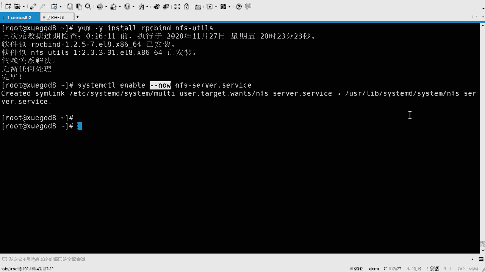

然后呢，再enable啊一样的。好吧，你想用这种方式都可以啊都可以啊，是吧？那么NF的话呢，默认情况下，其实配置是很很简单的啊很简单的啊，它有一个共享的目录的一个一个一个文件啊。😊。

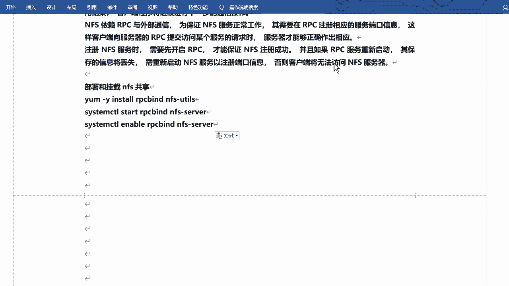

在这个ETC下的。叫做exports啊exports。默认里面是空的。这是干什么呢？这个是去呃就是去编辑咱们共享目录的。就是你想去共享谁，把谁共共享出去是吧？你可以写一个目录啊，比如说我把那个。😊。

嗯呃把那个跟下载media啊。😊，好吧，把这共享出去。共享给谁呢？是吧？你可以写一个地址，比如说1G21。8。对吧然后什么1。1。啊，这是1个IP地址啊，也可以先网段啊，什么0-24是吧。

这样写也可以啊，然后也可以写个星儿。😊，啊，形式的话就是任意地址啊，任意地址都可以都可以来连我，都可以呃看到这个共享，相当于啊。然后后边呢可以跟上这个参数或者叫选项啊，选项啊就是以什么方式的形式去共享。

😊，好吧，2W啊就是读写。读写的方式啊，当然这个读写的话呢，是对于呃NFS来说的，它还得去看你具体的呃这个文件或目录的权限是吧？你的用户有没有一些权限啊，这个就看你的用户和和目录的权限了啊。

这个是咱们呃NFS放开的啊，读写权限，好吧。😊，写完之后可以保存退出。😊，啊，可以保存退出啊，那我怎么去验证呢是吧？我怎么知道它有没有共享成功呢啊，咱们本本地或者叫服务端啊，可以去查看啊。

查看你共享的目录叫做exportexport。😊，FS啊。这不一个pose嘛是吧？一portF呃杠RV啊，其实就是显示的意思啊吧，它会给你显示出来前边的是地址啊，前面是地址啊，后边是你共享的目录。😊。

好吧，这是一个过程，这是这是服务端啊服务端。如果说客户端你想看的话，对吧？也可以啊，比这边是客户端啊，这边是客户端啊。😊，我的一个是sS呃，一个是学霸的帮啊，一个是IH18啊。这边怎么去怎么去看呢？

客户端啊，你可以执行一个叫书。Show much。杠一啊，指定你的服务端地址，好吧。呃，我算是我是一我是那个43啊，43。137吧，137。哎，是吧他也会给你列出来啊，export list for啊。

这个IP地址共享出来的那个啥呢？那个那个目录是谁呢？是media这个目录星啊，就是所有的主机都可以连接的，相当于。😊，好吧，都可以连接的啊。OK那好，那咱们就在着客户端操操操作啊，你已经共享出来了是吧？

客户端做操作的话呢。😊，那咱们去呃创建挂载点，好吧，把它挂载一下啊。呃，MK点2一下啊，然创建一个目录啊，比如说跟一下data一个目录。是吧嗯，哪去了？😊，D啊，这呢哇塞这这儿呢啊data啊。

然后我把它挂载一下，怎么挂呢？就是mount挂啊，mount挂就可以。😊，哎，忘能挂。呃。挂的话呢可以指定文件系统啊文件系统。因为咱们这是NS杠TNFS。好吧，然后还有个杠O杠O的话呢。

也是指定选项啊或参数的啊，就是RW读写的挂载是吧？XNC可以写一下啊，SNC的话代表同步啊，就是你的服务端客户端啊，里面的内容是同步的啊，然后挂谁呢？是吧？写上你的地址，服务端地址啊，也就是对吧。

点儿43兑话。43。137。是吧下的啊冒号。加上那个地址media。挂哪儿去呢？挂到data目录下。好吧，这么写啊这么写，挂断一下。😊，啊，关完之后，当然咱们可以看一下啊，DF刚打TH。😊，对吧哎。

这样就挂过来了。好吧，然后类型呢它默认写的是NFS4，咱们写的NFS。因为咱们版本确实是N呃4版本的4加2版本的是吧？所以它是NF4啊。😊，容量是57个G啊，57个G这么大呢是吧？咱们看一下啊。😊。

咱们看那个根啊。根啊根我这个服务端的跟不录默认就是57个G的啊。好吧，然后它挂过来的话也是5个7个G，说明什么？它说明它直接把整个的根相当于啊剩余空间都搞都挂过来了，你随便用。😊，好吧，随便用啊。对。

然后用了多少还剩多少是吧？哎，data在这呢。😊，好吧，在这儿呢啊啊，然后你就能看见了。好吧，看见之后的话呢，哎那你就可以在里边做操作了。😊。

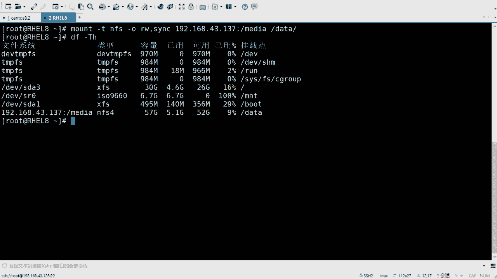

好吧，可以在里边做操作了啊，就这个意思。😊，啊，把过程写一下啊。过程写一下。呃，服务端操作其实挺简单的是吧？主要客户端啊，客户端，然后挂载杠T的话呢是指定文件系统啊，指定文件系统啊。

NA高的话呢就是选项。😊，选项啊嗯。呃，RW是读写SNC的话呢是同步啊，SNC的话是同步啊，就是同步你的这个服务端客户端的信息，好吧，当然这个挂载的话呢是临时挂载的。是不是临时挂载啊？

如果说你想永久挂载的话，对吧？那咱们得给它。😊，干什么呢？给它写到配置文件里边去。是吧配置边那边去啊，就是那个ETCFSTB文件，对吧？因为那个开机的时候会读取里边的文件，然后再去挂载的，好吧。

下ETCFSTAB啊，然后挂载一下。

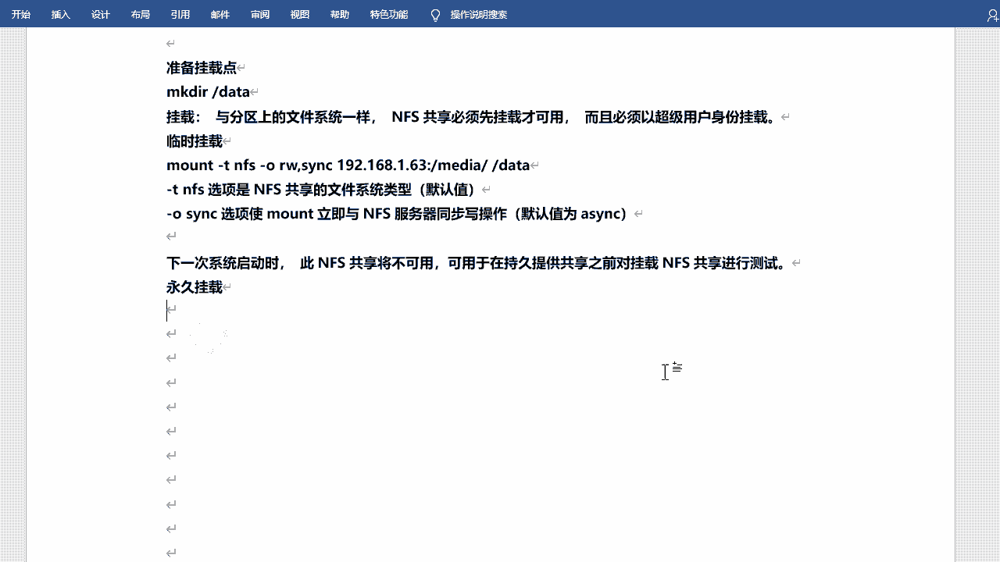

嗯，刚才忘的挂的话是吧，其实可以把它直接拿过来啊，但是格式就不太一样啊，写一下吧。EDCFSTB。😊，啊，里边目前是这样子的啊，然后写上咱们的挂载点服务端啊，服务端是1922。168。呃。

43点137啊。下的是吧，然后me底。这个目录挂哪去呢？挂到data。目录下是吧，然后NFS文件系统啊，NFS。呃，然后是那个RW啊2SNC。sorryorry， S and Z。好吧，然后00。啊。

这样写就可以了啊，写完之后保存退出啊，然后呢你可以不用重启验证啊，你可以直接mount。😊，杠一啊，然后执行一下。好吧，如果说你没挂的话，它会自动帮你挂好。😊，啊，他会帮你挂好啊。如果说你挂了的话。

那当然他没有反应了。😊，是吧没有反应了。然后咱们BF刚大家提示再看一下是吧？它还是在的啊，因为咱们刚才手动挂过，所以还是在的啊。😊，当然你可以Umount卸载是吧？😊，嗯，Mo date。

DF杠1看一下。是吧是不是就没有了？啊，是明白了。这一行就没有了啊，然后你再可以mount。杠A，然后再看一下。又挂上了。是吧就就就这个过程啊嗯。再把它卸了吧。

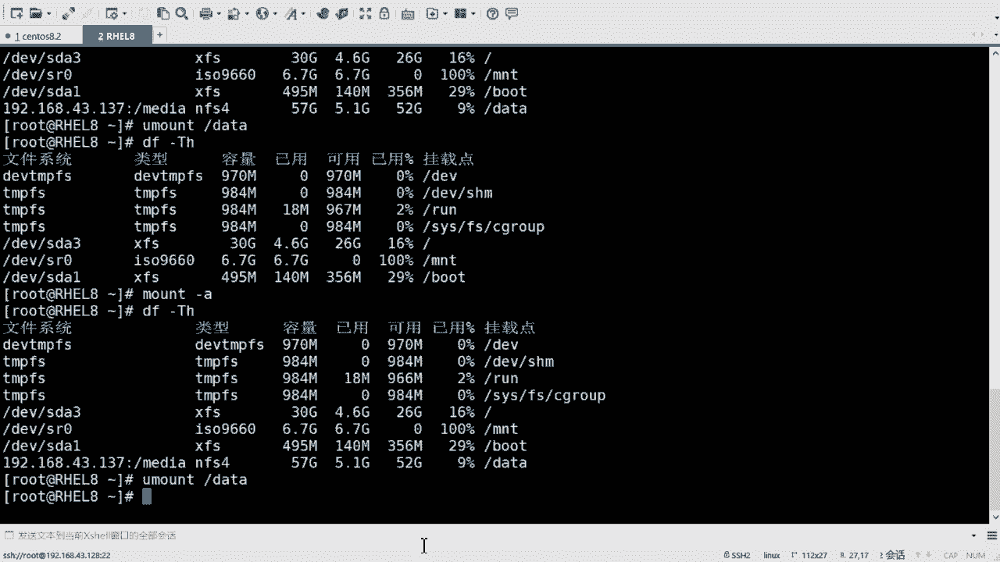

这是。永久挂在啊ETCFSTB。はい。在这写想啊，当然这个2W哪去了？啊这啊RW和RSSNC的话，咱们是最常用的啊最常用的啊。其实它当然还会有一些其他的参数。😊，是吧其他参数啊。然后。呃。

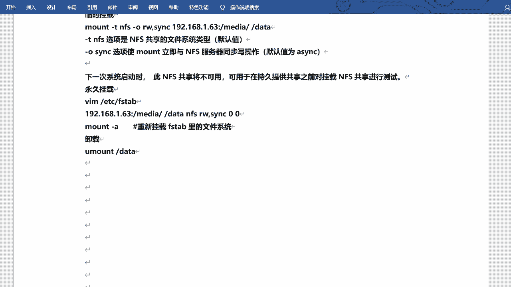

我看一下啊，然后那个。嗯。慢一下NFPS。我看这有没有参数啊？帮助里边应该会有一些啊。options supported by the by all versions是吧？所有所有版本都支持的。呃。

选项是吧，其实有好多的啊。好多的啊这种的。对吧但是除非你要求特别高是吧？你不用去那个啥啊，你不用去都写，好吧，常用的其实记住大家就可以。😊，好吧，常用的话记住它就可以啊。慢FS是吧，就可以看到啊。

就是RW和SNC啊，用的是最多的啊。嗯，OK这是。

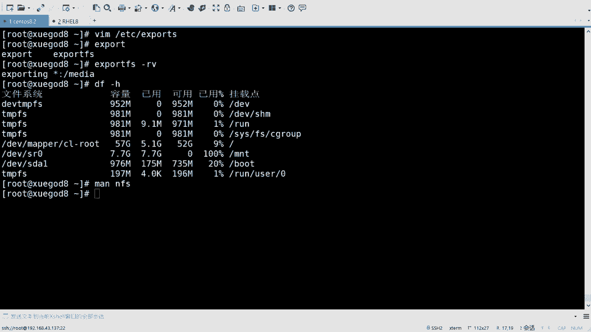

什么呢？这是。呃，挂载是吧，挂载啊。然后啊然后呃在八版本里面呢新增加了一个工具啊，8版本里面新增加了工具，就是去设置咱们的服务端和客户端的啊，叫做NFScomf。N，F F。这工具啊。

引入了这个工具是吧，用于管理NFSV3和呃V4和V3下载NF客户端和服务端配置文件啊，ETCNFS点com啊，这是新的配置文件的一个一个路径和名字。

之前版本早期版本的话呢是在ETC下的sconfi下的NFS啊，但是这个文件的话已经被弃用了啊，就不用记了啊，现在是NFS点com是它啊，然后使用这个工具的话呢。

来获取设置或取消设置NF的配置参数啊配置参数啊这个就。😊，呃，其实他也不难的啊。之前的话改的时候可能会稍微的复杂一点啊，现在其实更简单了啊，通过这个工具就可以直接去设置了，其实就无非就是开关。😊，啊。

开关允许或拒绝yes或 no这样子啊，嗯咱们可以来看这个例子啊。😊，ETC啊。EDCNFS点com啊，配置文件呢由多部分组成啊，主要的是NFSD这个部分啊这个部分。呃。

值的分配由值的名称、等号和值的设置组成。比如说NF啊，不是不是F叫做w是吧？w啊worth。star等于Y啊，就是开启啊就是开启啊，然后以井号或这个分号开头的行呢将被忽略。啊。

就是是注释啊就是注释的意思啊，那么使用的话呢，就是N杠s杠杠 set sectionction K value section的话就是字段啊字段啊，或者说是你的那个那个那个怎么说。😊。

那个那个模块啊模块啊KY6的话就是你的键和值是吧？谁是啥，相当于就是啊键和值来指定啊，这是set是设置get是查看and set是取消。😊。

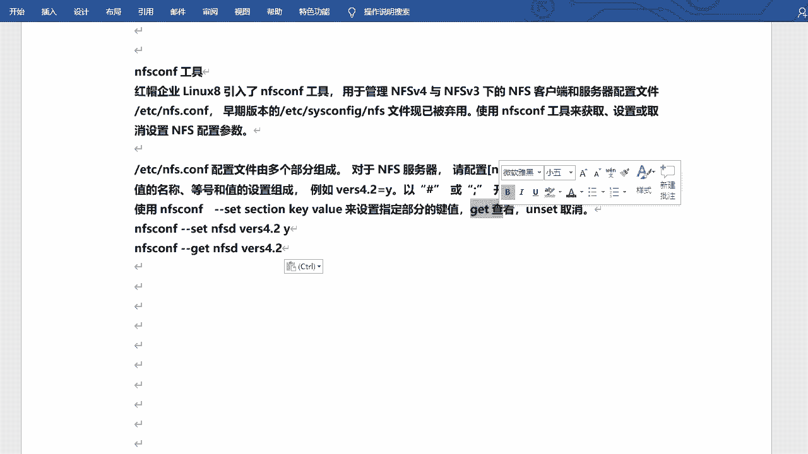

好吧，咱们可以可以来试一试啊，这有这有两个例子是吧，直接可以来试一试啊。😊，NF S co。刚刚sat。NFSD啊，主要是的就是它啊。4。2。喂。啊，这么这么写啊这么写，然后咱们可以去get一下。

好看是吧，那它就是Y，它其实会改这一个配置文件啊，我看这有吗？ETCNFS点com。😊，好有啊。然后在NFSD的那个模块里边。哎，这儿看到没有？呃，w4。2等于Y是吧？这就能看见了。好吧。

这就能看见了啊。😊，嗯这是简单的设置啊，然后咱们可以设置一个标准的客户端。

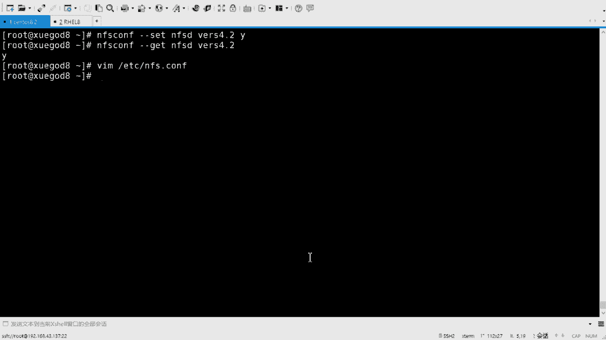

标准的客户端啊用于适应或者叫仅适应NFS4的客户端啊。这一溜都是咱们需要敲的啊，其实也不多啊，因为比因为比较比较重复。

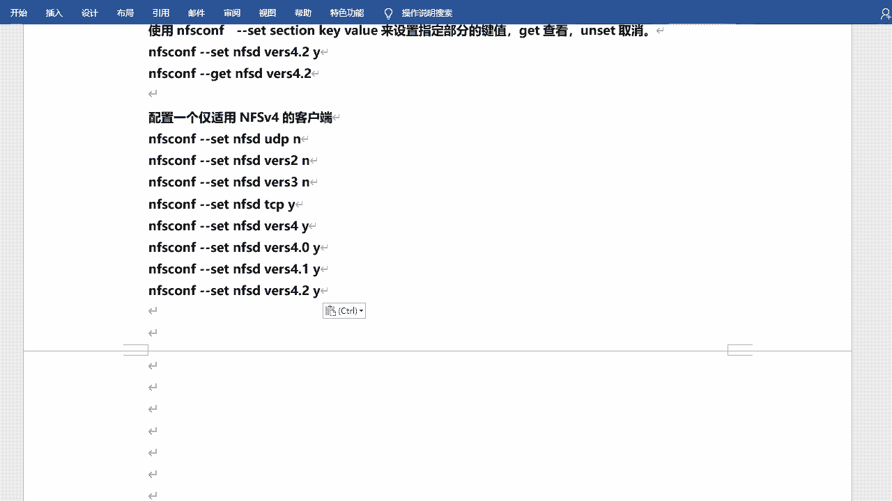

啊，就是NFS。呃，s NFSD首先的话呢把那个UUDP啊UDP的协议取消掉N。啊，因为现在不支持UDP了啊。😊，然后呢，w。二啊就是二版本是吧？N因为被取消掉。好吧，三版本也取消掉。

只允许他挂载四的版本的。然后再设置TCP。TCPY。允许是吧，NFS啊，不是没F啊w。4。是吧，yes。呃，四的话还分4。0啊，什么4。14。2啊。好，这样写就可以了。嗯，好吧，这样写就可以了啊。

你不用是吧，你不用多敲一遍啊，直接往上一那啥是吧？往上一选择，然后去指定就可以了啊，这就可以啊。然后它里边的话呢，EDC。😊，呃，NFS点儿coms是吧？你看就是这些。就这些啊，这这是咱们设置的。啊。

你就直接相当于就直接把配置文件写进去了啊啊一样的好吧，一样的啊。😊。

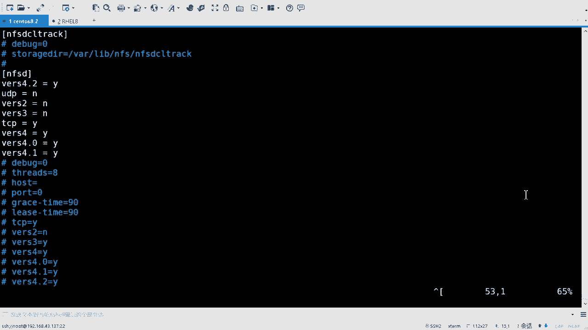

好的啊，这是NFS。

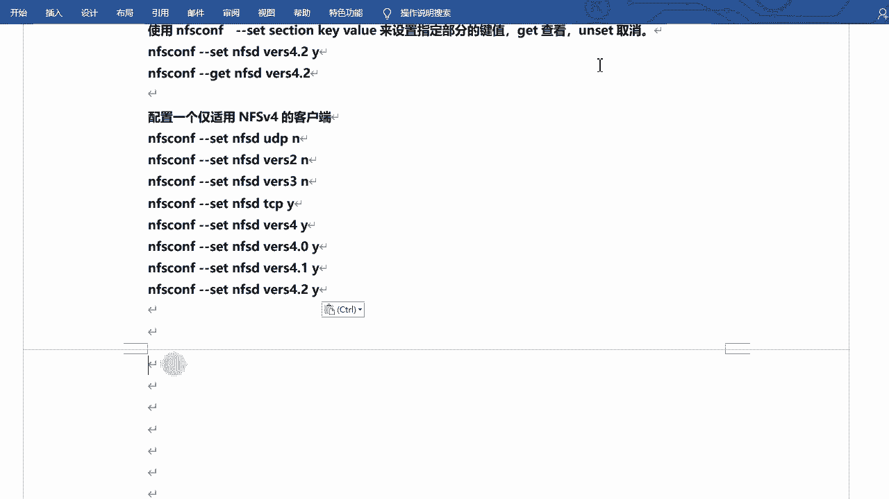

NF啊。下面来看自动挂载啊，自动挂载啊。