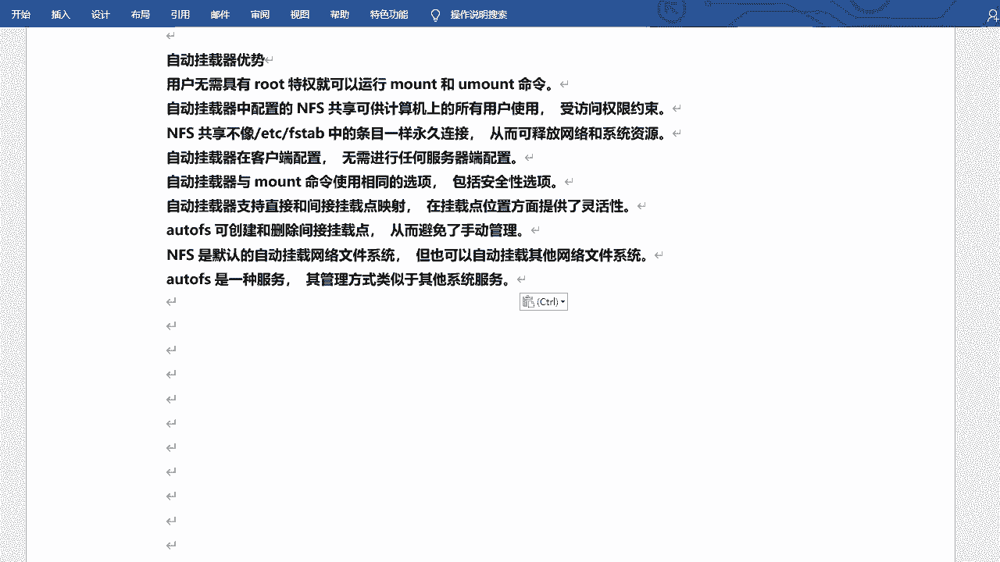
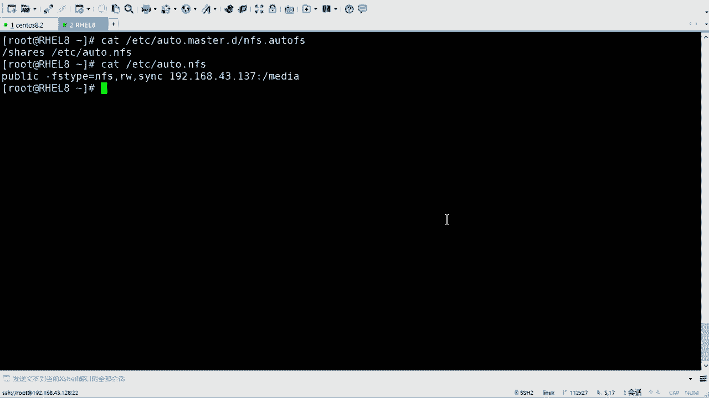
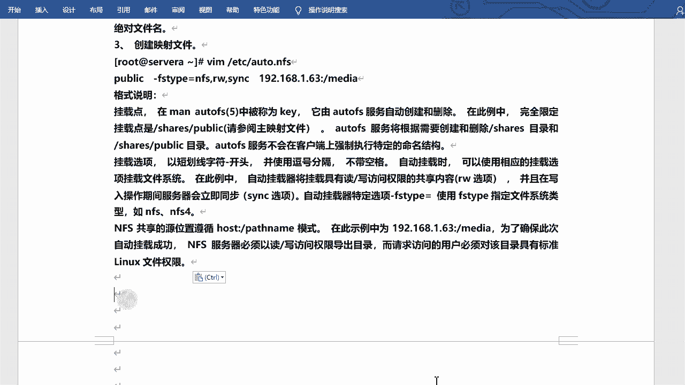
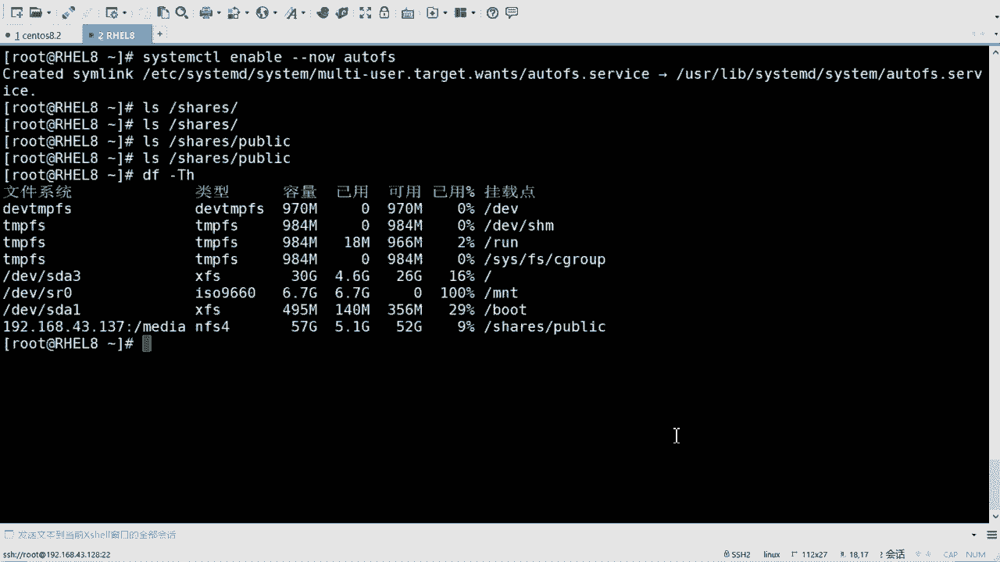
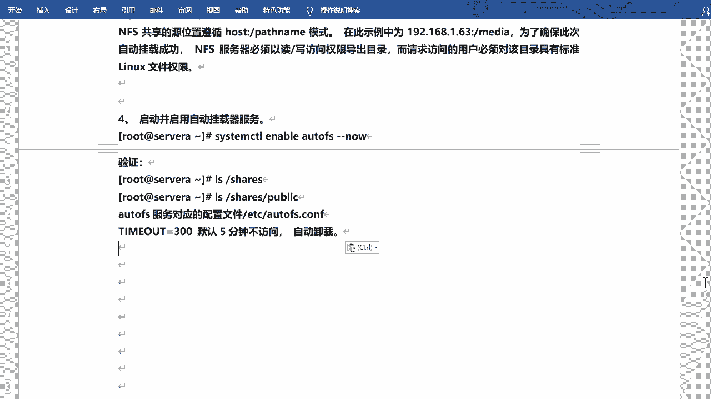
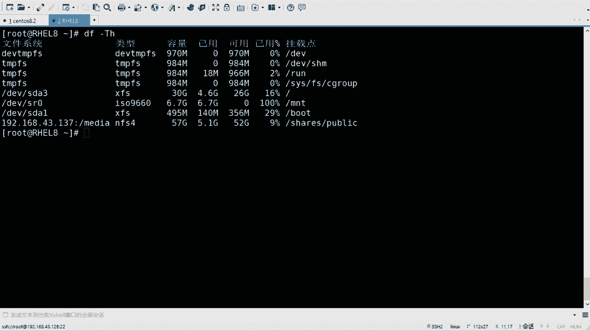
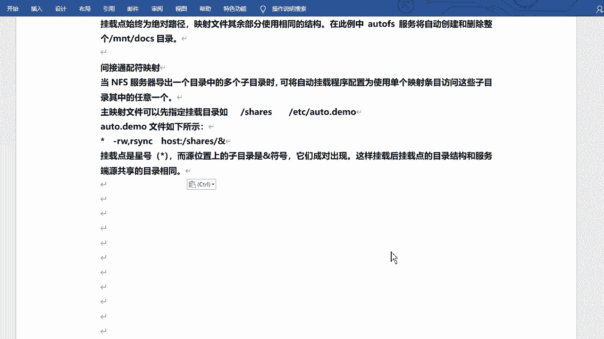

# rhel8-centos8-rhce-linux-stream-stratis-vdo-podman-dnf - P6：rhel8-e-2-2Autofs - Linux最diao - BV16T4y1K7px

自动挂载啊叫做auto mount是吧？它是那么翻译的啊，但是不太准确啊。呃，auto mount也可以是吧？自动挂载挂载NFS的共享。自动挂载的话呢是一种服务啊。

auto FS根据需要自动挂载NS共享，并在不使用NFS共享的时候呢，自动卸载这些共享，也可以成为触发式的挂载。😊，好吧，触发式的挂的啊，接介绍是吧，凹 two FS的优势啊。优势。嗯。

优势其实怎么说呢？就是按虚挂的，主要就是啊而且不需要入册用户是吧？就可以运行mon和youant啊，然后。呃，自动挂载配置F的话，可以可供计算机上所有用户使用啊。

售房权限约束就是还是你的2WS去去去约束的啊。嗯。呃，N不像FFTB1样永久挂载，可以释放网络和系统资源，就是它不会一直一直挂载，一直链接，对吧？呃，自动挂载在客户端配置无需进行任何服务端的配置啊。

只需要在客户端配置就可以了。嗯。嗯，和mountt使用的选项相同，包括安全性选项。那这个选项的话，就是刚才咱们说的那个是吧？什么RWSNC啊，这个选项啊。然后。支持直接和间接点的映射映射啊。

一会儿咱们再说吧，什么叫直接，什么叫间接啊。😊，呃，autops可以创建和删除这节点啊，这也说啊，这一会儿咱们也说啊。呃，默认的自动挂载文件系统哦，NFS是默认的自动挂载网络文件系统。

但它可以也可以自动挂载其他的网络呃网络文件系统啊。auto F是一种服务，其管理方式类似于其他系统服务，就是必须得启动服务啊，比对启动服务啊。那这个。这个说的好像有点废话的感觉是吧？他他就是干这个了啊。

好吧，但是他得把这个那个功能描述出来是吧？描述出来啊嗯。😊，行来咱们来看一下凹凸 F啊，看效果就知道了啊。

嗯。在这儿啊。呃，去干什么呢？咱们先去装一下奥toFS好吧。😊，装一下奥toF啊。直接inst就可以啊。BNF吧，好不好，insstore。哦，这个7八本本本支持啊。哦后突然开始。嗯，直接装就可以了啊。

好吧。😊，然后他有。几个文件啊。非常重要的啊，一个是应该是一个吧，一个非常重要的啊，就是叫做主映射文件啊，EDC。叫做凹吐。😔，点儿 masterster。这是一个啊，其实你可以直接改它也可以啊。

这是叫主映射文件，然后呢也可以是在点D里边创建咱们自己的。那个主映射文件啊都行啊都行啊。如果为了方便的话，咱们可以自己创建一个自己的这个映射文件，就非常干净啊非常干净啊。😊，然后呢，在主映射文件里边啊。

你还得去设置一个。呃，真正的预射文件。好吧，所以说它会它会有两个配置文件啊，两个配置文件这个得搞清楚啊。😊，那我先去写一个主意映射文件啊。啊，比如写一个叫做ATC下的凹凸。点 master点D下啊。

写1个NF点O to F。啊，一般的话呢，它这个后缀。啊，后缀啊是auto FS啊，这是主映射文件的啊，主映射文件的啊，然后打开。对吧当然呢里边是空的是吧？因为咱们是新建的啊，它的写法是这样子的啊。

首先写上你的。😊，呃，那个那个主目录啊主目录啊就是应该叫挂载的主目录啊。或者叫做基础目录啊基础目录啊，比如写一个叫做ss。这是个目录啊，当是它可以有可以没有啊，最好是有的啊最好是有的。😊，然后呢。

写上你的那个真正的挂载目录的配置文件啊，咱们写上，比如说是ETC下的。嗯，凹凸点NFS好吧，这个这个后缀名就无所谓了啊，无所谓了啊，其他就可以。好吧，这是这是主主配置文件啊，主映射文件啊，主映射文件。

然后再写另外一个啊，另外一个刚才写的EDCAUTO。😊，凹凸点NA写这个。这个东西呢？这个就写挂在点，挂在哪儿publish。啊，那么这个呢可以不存在啊，它呢相当于什么呢？

它相当于是挂载到哪儿去的一个目录，挂哪去呢？挂到public。但是它的前面还有啊潜台词是哪去的，应该是跟下的sha二下的。share下的public是这个意思啊，你但是你。你可以这样写。

就直接写帕布里克。它就会挂倒shas。因为咱们上个配置文件写的shas。😊，对不对？然后啊格式啊又是一个格式啊，但是方法又不一样，叫FSt文件类型。NF是吧，2W。对吧SNC还是这么几个配置。哎呀。

这有这么几个选项啊，这么几个选项啊。😊，好，那么后边最后啊写什么呢？最后写你的服务端的地址和共享的文件。啊，地址是1968。一点呃不是一点那个43。137，对吧？下的啊冒号 sorryorry啊。

下的me。O。好吧，我把它拿出来，咱们一起看一下啊，一个是EDC下的auto FS呃，凹凸。😊，点master点D下的是吧，NFS点O toFS一个是呢PECC下的O to。第二。NF。好吧。

整体上现在就两行配置啊，两行配置，但是需要写到不同的配置文件里边。😊，啊，不同的配置文件里边在这儿。好吧，这个这个格式得搞清楚啊，是啥意思？这是什么意思啊，这是什么意思？什么意思什么意思？

行吧嗯，笔记里边咱们肯定会写怎么怎么怎么意思的啊。😊，笔记里边当然会也会写的很全的啊。好吧，虽然说写的不多啊，但是它的含义还是挺多的是吧？含义还是挺多的啊，主映射文件。😊，对，主页是门件啊。

一般是一点auto F autoto FS。扩者名儿。啊，然后呢可以在啊这个这个这个是说多个目录啊，咱目前就一条啊就一条啊。然后shares看到没有？shares是间接自动挂载的基础目录。

就是最开始的那个目录啊。😊，然后ETC autoto F这个文件包含要怪载的详细信息啊，要使用绝对文件名，就是ETC下载auto F当然你也可以不放在这儿放别的地方也行啊，还行的啊。然后这是主映射文件。

然后这个呢是映射文件。啊，allto FS凹 to点NFS它叫映射文件是吧？哎，写上挂到哪儿啊，文件类型什么WISSNC啊，地址写上。啊。呃，然后。啊，挂载点是吧，这个当然也可以去去那个啥慢。

就是查询去看帮助信息的啊。呃，这个关载点的话呢，是由auto X自动创建和删除的，用的时候创建，不用的时候去删除。好吧，在这个里里边呢，在这个例子的话。

就是说拐来点是share下shares下的public是吧？auto F将根据需要创建和删除shares目录和shares public目录。autoip呃服务不会在客户端上强制执行特定的命名结构啊。

什么叫强制执行呢？就是不会去自动给你创建。啊，它不会立马创建啊，也不会一直存在。用的时候它出现，不用的时候它就。😊，那个啥是吧，不用的话它就消失啊。啊。

okK然后下边啊下边是一些选项的一些选项的一些这个解释啊。就是后边这个啊以横杠减号开头啊，并使用逗号分格，就是不同的选项啊，不带空格。那挂载的时候呢，它会去查看你的选项什么功能啊，什么功能啊，是吧？

然后杠FSt啊，这个就是文件类型啊，文件类型N还是叉FS。啊，当然主要是NF啊NF。呃，共享的原位置就是服务端的位置，主机冒号，加上你的共享的目录啊，其实和上面咱们哪怕你去用mod的挂。

手动挂也得这么写啊，是吧？格式这个格式是没有变的，好吧，这格式是没有变的，你看。😊，对不对？这个是没有变的啊嗯。然后NMS服务器必须以读写的访问权限导出目录啊。

而请求访问的用户必须对该目录具有标准的linux文件权限啊，也是跟N权限有关系。如果说你的目录有写权限的话，是吧？或者你的文那个那个什么啊那个那个那个文那个什么来着？用户是吧？有写权限的话，那才能写啊。

这儿只有读写其实也不好使啊，还是需要看那个你的呃目录权限和文和用户权限的，好吧。

启动一下啊，然后来看一看它是什么意思啊。嗯。提供一下啊。System这条。你内是吧，刚刚到。All two F。O然后咱们来看啊，看什么呢？😊，呃，shares这个目录。对不对？那么s下边没有东西。

是吧啊，那么shares下的呢public。对不对？然后咱们看DF刚大铁以上。你看。神奇屋是吧？它里边确实没东西啊，但是他已经挂上了。就在这儿。挂到了sha下的public。啊你看我S去查看。

这就是相当于触发了。好吧，就相当于出发了啊，然后他就有了啊，他就有了啊。

能看到吧是吧，这就挂上了啊，这就挂上了啊。自动挂的呃，当然它会有一个卸载的过程啊，呃卸载的话它会有个时间啊，时间的话是在那个all to fS点com里边，有一个t out啊，有个time out。

嗯。Tmo。一般是300秒啊，就是5分钟啊。嗯EDCau autoto FS。点儿com。哦，没干什么。B or to I S。哦，刚才敲错了是吧，autoF点com。有个temo啊timemo啊。

在这呢。超时时间是吧，300秒，它是以秒为单位的。好吧，咱们可以记个时啊，现在是9点15吧，对吧？1点20，咱们再去看他还在不在啊。😊，我现在先我现在就不动了啊。😊，我现在就不动了啊。うん。还在呢是吧。

一会儿咱们再看啊。😊。

啊啊。O。😔，这就叫自动挂载是吧？凹凸啊。嗯，然后呢在这个地方咱们做做个扩展啊，做个扩展。这个地方它有说什么。这个地方啊它又说什么直接和间接挂载点映射是吧？那么刚才咱们这个挂载方式呢。

是一个典型的方式啊，或者经典的方式啊，它还有一些其他的方式去挂载的啊。😊，扩展一下是吧，直接挂载和间接挂载啊。嗯。呃，直接过载的话呢，呃要就应该直接映射啊，sorry，直接映射啊。😊。

这件事的话呢用于将N共享，映射到现有的绝对路径挂载点。啊，是挂在这儿啊这儿啊什么意思啊？咱们在主映射文件里边去写的话。😊，主页式文件里边去写的话啊，可以写成这样子的一个斜杠，一个一个横杠啊，一个斜向。

一个减号，你跟一个减号相当于啊，然后我写上你的那个映射文件啊，映射文件怎么写呢？那这个地方你就可以写绝对路径了，你要把它挂到哪儿啊，根下的某个目录下的某个目录下的某个目录下是吧？你可以这样写。😊，好吧。

你可以这样想啊，然后是你的选项是吧？然后挂挂哪儿。啊，然后挂着啊，这就是挂载点，始终为绝对路径。就挂这儿啊就挂这儿啊。映射文件其余部分使用相同的结构啊，和其他的没什么区别啊，然么在此在这个例子里边是吧。

autoF服务将自动创建和删除整个MNP下的doocs这个目录。因为它是一个整体。嗯。好吧，它是它是一个整体啊，就这个意思。能看到吧？这是这叫职业映射啊，职业映射就相当于我这个。

把那个前面那个什么shares删了是吧，换成了一个一个一个减号，后边是绝对路径，是这么写的啊，之前写的相当于是一个相对路径是吧？现在是绝对路径啊，这叫直接映射。😊，好吧，这叫直接映射啊。

然后的话来看间接映射啊。建新社。大家可能不太容易理解啊，尽量去理解吧，好吧。我尽量给你们好好讲一讲啊，讲讲通俗一点是吧？在这儿啊。呃，OK。呃，间接要间接通配符映射。好吧。间接通喷符映射啊。

当NNFS服务器导出一个目录中的多个子目录的时候，可将自动挂载程序配置为使用单个映射条目，访问这些子目录其中的任意一个。啊，这个可能读起来都不太懂是啥意思是吧？简单来说啊。

简单来说就是说你比如说我去共享某个目录啊，我的那个服务端，某个目录。然后我这个目录下的话呢，可能还有好多其他的目录。😊，对不对？那我要同时映射出去，而且我不想让这些目录的名字发生改变。啊。

就是我在服务端叫啥，在客户端逛上之后还叫啥？😊，好吧，那这时候呢咱们就可以做一个叫做通配符的映射啊，通配符的映射。啊，怎么写呢？这么写啊这么写。😊，这么写。嗯。呃，OK啊主映射文件和之前的没什么区别啊。

主映射文件啊没什么区别啊，你可以写啊，一般的话就还是写那个叫什么来着？直接映射这种关关系啊，写一个绝对路径。😊，好吧，然后写上你的映射文件。应式文件的话写这么写啊，一个星号。😊，好吧，你个星号。

然后星号呢中间这也没什么区别啊，参数选项没什么区别，主机没什么区别。然后一级目录啊，共享的目录没什么区别。后边这个。😊，斜杠后边是吧，跟一个叫and。好吧，给一个end。

那么这个芯儿的话呢和end是成对出现的。😊，有它必须有他有他必须有他这两个什么意思？就是比如说我share下面有一个A目录。😊，是吧那你挂过来挂到服务端这边来的话，它也是sha下的A目录。对不对？

那如果说你有个B目录是吧？挂过来之后，它也有个B目录，是这样子的。😊，好吧，就是这样子啊，就是它是一一对应的关系。😊，好吧，一对的关系啊，这叫什么？这叫间接通配符的映射。啊，间接通面符的一个式啊。啊。

后期你想用的话，你可以你也可以这样用啊，这个这个也是可以的啊，也是可以的。就是目录结构的话，和你服务端的目录结构是一样的。😊，好吧，一样的啊，再再重复一遍是吧？😊，呃，星号啊原位置上的子目录是暗的号。

它俩是成头出现的。这样挂载后，管带点的目录结构和服务端原共享的目录结构是相同的。好吧，相同啊，这是凹 to FS。

好吧，这是奥toFS啊。