# rhel8-centos8-rhce-linux-stream-stratis-vdo-podman-dnf - P7：rhel8-e-2-3Stratis - Linux最diao - BV16T4y1K7px

来看一下红莫巴星的这个服务是吧？

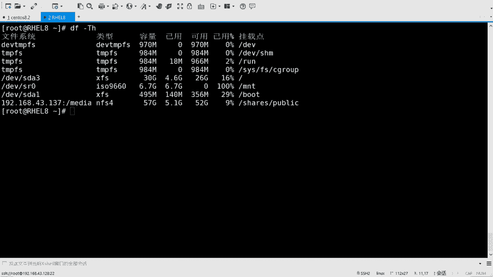

strrates和 video啊，先来看strats。哦，对，咱们刚才那个啥。刚才那个挂载是吧，看还有没有啊。😊。

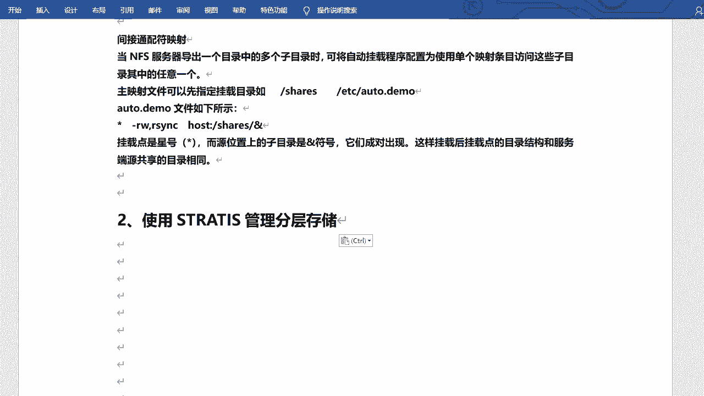

你看就没了。是不是刚才是15吧，现在是2022了啊。没有了吧。是不是刚才还在的啊，现在就没有了。是吧这就叫用的时候它就出现，不用的时候它就消失是吧？

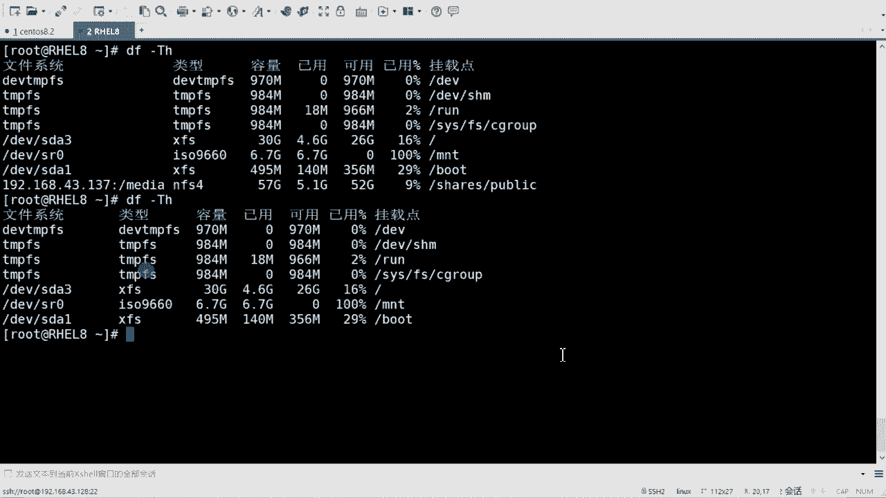

招织起来，挥之继续，是不是？好来。straise啊，这个是新的，就是新的这个叫什么叫券管理啊，券管理。啊，但是呢我再说一下啊，其实咱们那个红帽的解释也说了，它是一个目前还不稳定的啊。

就是还不能上生产的一个。啊，在这啊它仍未达到红帽企业的lininux啊的一个水平啊，主红帽企业的存储所需要的工能支持和稳定性的水平。啊，可以可以说是一个前沿的技术，好吧，是一个前沿的技术啊，它叫什么呢？

它叫strats管理分层存储啊，是新一代的存储管理解决方案，称为券管理文件系统。😊，嗯，如果说有了解过RAAM的话，听这个会非常的。感觉熟悉啊，如果没听过的话呢，其实也也不算太难的啊。

因为它相当于简化了啊，比之前比那个LM还要还更简单了啊还更简单了啊嗯。😊，它可以通呃可以通过它创建文件系统以及其及调整其。大小时以动态透明的形式来管理这个卷层是吧？它可以调整大小的啊。

就是你的稳定系统大小的啊，动态去调整的，而且不需要咱们干预，它会自动去那个啥的啊，自动去那个那个那个调整的，好吧。还是解释啊，解释的话是比较多的啊。嗯。随题的话会以池的形式去运行啊，池就是铺啊。

咱们可以去创建这个铺啊池子。并透明的为所创建的文件系统创建和管理卷啊，然后它也支持LM叉S啊，以及其他的高级存准的功能。呃，sts的话呢没有固定大小，也不会分配未来未使用的空间。啊。

这个大小的话它确实不固定啊，而且它会比你真实大小会大很多。好吧，会大很多的啊嗯。😊，然后。再来看啊。然后就是他会管理池卷和文件系统啊，然后。嗯，他默认会去这么写吗？这没写吗？它默认其实会去格式化的啊。

它会格式化成叉S啊，而且只能格式化成叉S啊，而而且不需咱们手动去格式化，它会自动去格式化，然后咱们拿过来用用用就可以。😊，啊，那我就用就可以啊。可能在后边啊，这没这还没提呢嗯。

然后管理工具就是strs服务和命令行啊，就这么两个。服务号命令哈。然后可以可以用不同的块设备呢去组成一个池子。嗯。不同的块设备来组成一个池子，也可以组成多个池子啊。在每个池子中。

您可以创建一个或多个文件系统，目前最多可以创建二的24次米一个文件系统。啊，当然这就太多了是吧？太多了啊，知道它的一个极限就可以啊。😊，呃，是呃流程的话，或者说它的一个原理就是这样子啊。

最它是从下往上看的啊。最下层的话就是咱们的块设位是吧？比如说你的硬盘，你的分区对不对？然后呢，不同的硬盘可以组成一个铺。😊，一个池子。啊，一个池子，然后池子上面呢再去创建文件系统。

文件系统的话呢没有大小。😊，没有大的限制啊，也不用你去设置，它会自动给一个的啊，自动给一个的。okK然后然后的话就是它的一个运行原理啊，这个尽量去理解吧。因为它它是自己去去操作的啊，和咱们没什么关系啊。

😊，一个运行原理啊，相当于啊。呃，在内部是吧，内部啊。😊，sread this的话呢使用叫backstore子系统来管理块设备啊，就是你的这个这个硬盘之类的啊。并使用spo这一统来管理池啊池子。呃。

bexstore的话呢有一个数据层负责维护块设备磁盘上的原数据。啊，这个还得通过这个例，通过这个这个图去看吧。就是backstore啊，就是快设备。上面的话呢呃啊back black DV啊。

就是那个块设备啊，然后是backstore可以去管理的管理的啊管理的话呢，它会有原数据啊，可以检查和纠正数据的损货呃损坏啊，和这个readd很像啊readd很像啊。

然后缓存层还有一个啊叫catch缓存层。缓存层的话使用高性能块设备作为数据层之上的缓存。好吧，这是这是这相当于就是底层的啊，底层的啊，然后上面是铺啊池子。铺的话呢。

think pull来管理和strats文件系统关联的精简的部署卷。这个系统呢使用什么DMC设备去呃驱动啊，以取代LVM进行虚拟卷大小调整和管理，那就不用LVM啊，就用strats就可以。😊，呃。

s的话可以创建虚拟大小比较大，但物理大小比较小的卷采用叉X节奏呃，格式在这儿啊叉就是在这去格式化的，相当于啊。大家可以创建虚拟大小比较大，但物理还比较小的卷就是看起来很大啊，但是肯定会比。😊。

会比那个你你那个原来的真实的卷要大很多啊。当物理大小快满的时候是吧？快满的时候啊，呃LM啊，不是RM嘛，那个sstrrate会自动降其扩大。😊，啊，就是他会去就是会肯定会有个监听啊，会有个监视啊。

他看你的你的这个空间是不是快满了，满的话，他会自动帮你去扩。当然呢是根据你的池子大小去扩的啊，你的池子不够大，那再扩它也扩不大，是不是就这样子的啊。😊，OK那怎么去管理它呢？

其实直接用strats的命令就可以啊。traice命令啊。叫经典配置的文件系统啊。呃，有两个包，主要是啊一个是strtCRI，一个是strtssesD软件包。呃，CRI的话呢这是命令行是吧？

提供了命令啊，提供了命令。然后呃通过dbuss啊，将用户的命令转换为strts的这个服务。项面的转给服务。那么服务呢是吧服务呢会管理和监控元素啊，比如这个块设备啊、池子啊和文件系统。嗯，好吧。

主要就是两个啊，那咱们来装一下。strts CI和strats D啊2个。

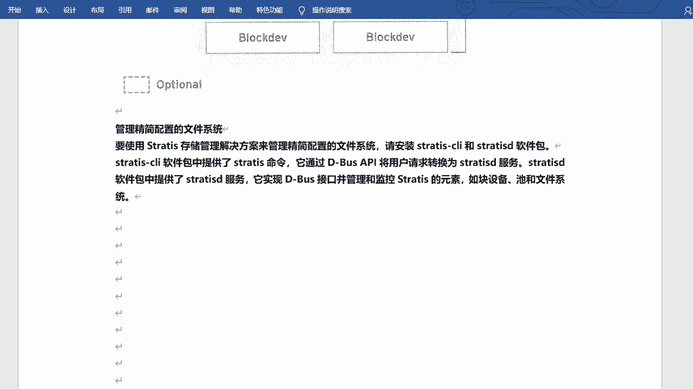

在这做吧是吧，在这边做。😊，呃，应s到。インスト。四川。Ts。CR和川。TD啊。嗯，这两个包啊，当然他会去安装箱的依赖包。是吧反正么相应的一联盟啊，在这儿呢。😊，啊，当然我也把这个服务起一下是吧，这。

😊，C条啊在 enable部刚刚装。呃，四川。TD啊。把这个服务器一下，好吧。服务器下啊。嗯，然后的话呢咱们就可以来做实验了是吧？可以再做实验了啊。😊。

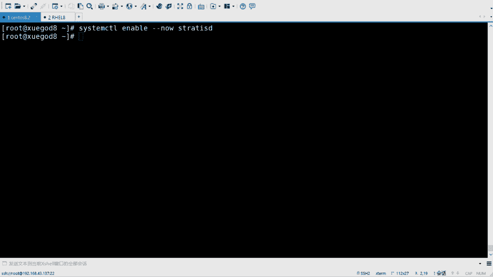

嗯，哎呀我得先去。我得先去那个啥啊，我得先去。添加几块硬盘是吧？请加几块硬盘啊。然后的话来看这个效果。

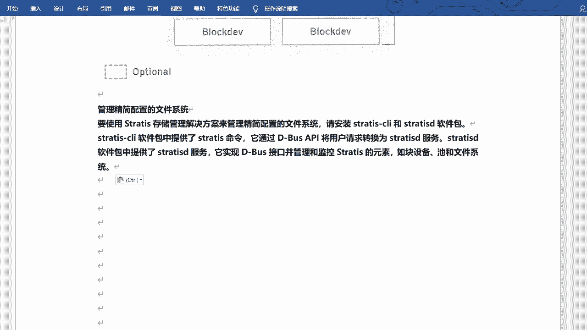

因为我目前那个那个分区域有没有空间了啊，添前这块硬盘。关机加硬盘啊。

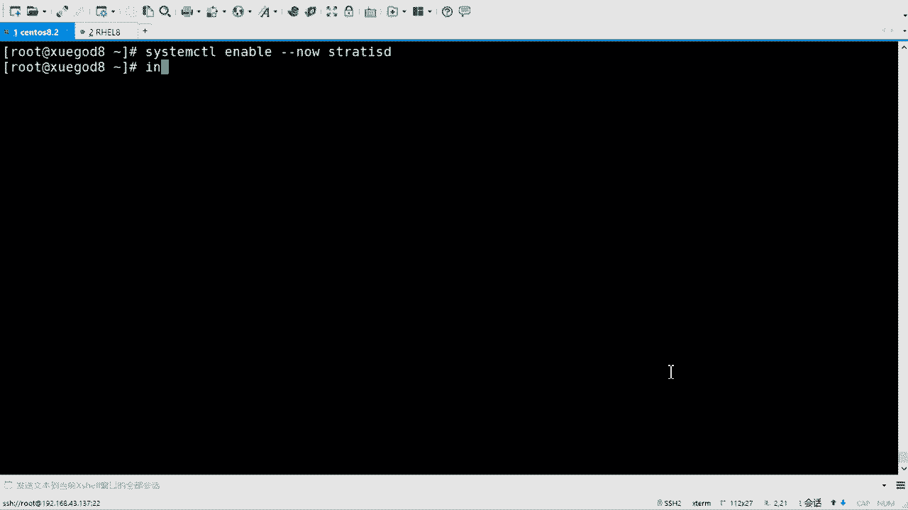

语硬盘是吧。添加了3个啊，我没有加太大是吧？就是加了加了10个G的啊，10个G的。呃，为什么加三个呢？因为咱们一会儿还得做VDO的，我就一块加了。😊，好吧，一会儿就加了啊。😊。

然后嗯它的空间也呃容量也不用太大是吧？10个G或者哪怕一个G啊，也也就够。因为咱们不需要做啥。😊，好吧，咱们不需要做啥。然后再开机啊，然后咱们开始去操作一下啊。

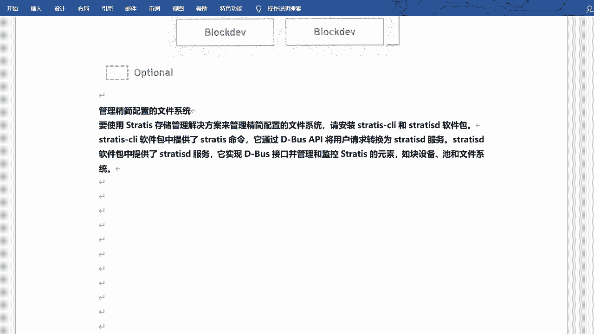

连一下。😔，来看一下这个strats啊。

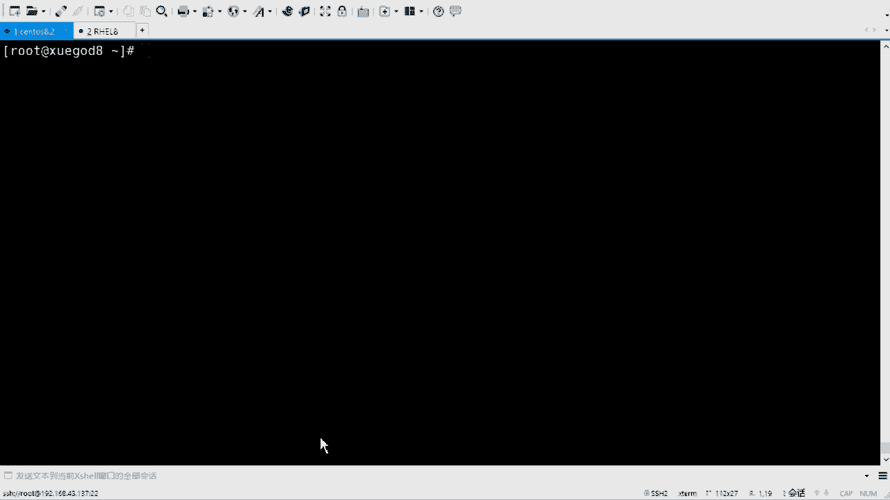

呃，我把那个过程给大家写一下啊，装包是吧，然后加硬盘。啊，然后开始去操作了。嗯嗯嗯。呃，使用什么呢？使用strats这个命令啊，然后去创建出建什么，先创建这个po啊，直接上来就创建池子。

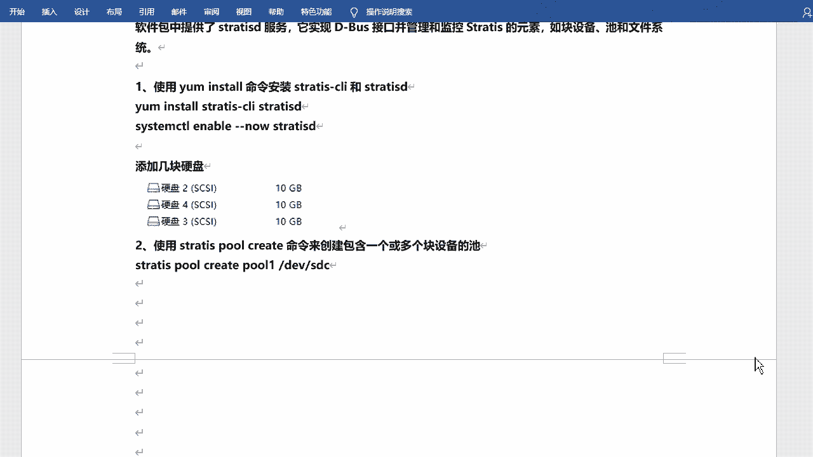

好吧，创你这个池子啊，当然你也可以去是吧，你也可以去呃试一试这个命令啊，叫traise。tip一下，是不是你看啊它其实没有几个参数的啊。block DV咱们一会会用到啊，dmon不用看呃。

文件系统feel system会用到啊，还有p会用到啊，其实就这三个。最常用的。好吧，strs的话呢叫put啊，先创建池子create。创建什么呢？呃，给池子起个名字啊，比示叫铺一啊，这是咱们的池子。

然后呢把你的硬盘加进来。硬盘加进来啊，DV下的这SDB是吧？扶尼过来。好吧，然后你那个呃创建完之后啊，它会给你生成一个目录啊，就是。strs下的根下的strats下的叫做pro。啊。

这个是是咱们刚才创建的。这个池子。好吧，这个池子啊在这儿呢。好吧，就在这儿呢。啊，然后你能看见它的啊，但是它里边是空的啊，现在啥也没有是吧，啥也没有啊，你也可以去看一下trarates。😊。

tryice pull啊叫做list查看。查看的话就是查看你的池子名字啊，有多大是吧？😊，呃，现在用了多少还剩多少啊，这个意思。😊，啊，它会有一些损耗的啊损耗的。呃，然后如果说你想去添加那个啥的话。

在池子里边再加一块硬盘是吧，可以吗？这个当然也是可以的啊。Justrate。tra pool啊。呃，ADD是吧，date啊ADDdta。图一加到图一里边来ADdata就是假假数据嘛，是吧？

把DV下的SDC啊，这块盘的话我也加进来啊。因为咱们当时加的话，这个盘。😊，是吧。SDBCD啊，这三个是咱们新加的，我把B和C都加进来了，是吧？D的话一会咱们用别的用处啊。😊，然后你再看一下list。

这边20个G了是吧，20个G了啊。😊，不用格式化啊，直接用就可以，直接拿过来就可以。好吧，直接拿过来就可以啊。OK啊，然后呢你可以看一下叫strise嗯block DV啊。

然后list显示一里边的真实的。那个硬盘和。啊，应该叫快设备吧啊，快设备和它的容量啊，你可以看到。咱们池里边包含什么东西啊，你可以看到。

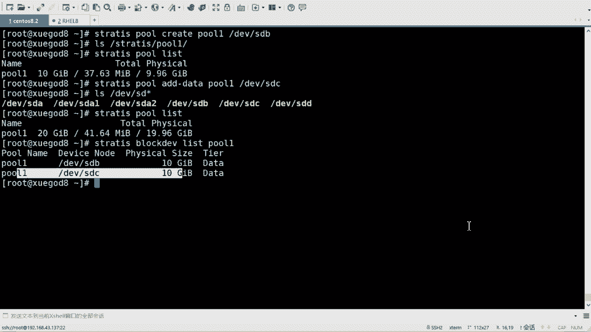

block DV就是就是块设备的意思是吧？😊，创建和查看啊创建和查看啊。好。那有了池子之后，我就可以直接创建文件系统了。好吧，直接创建文件系统啊。😊。

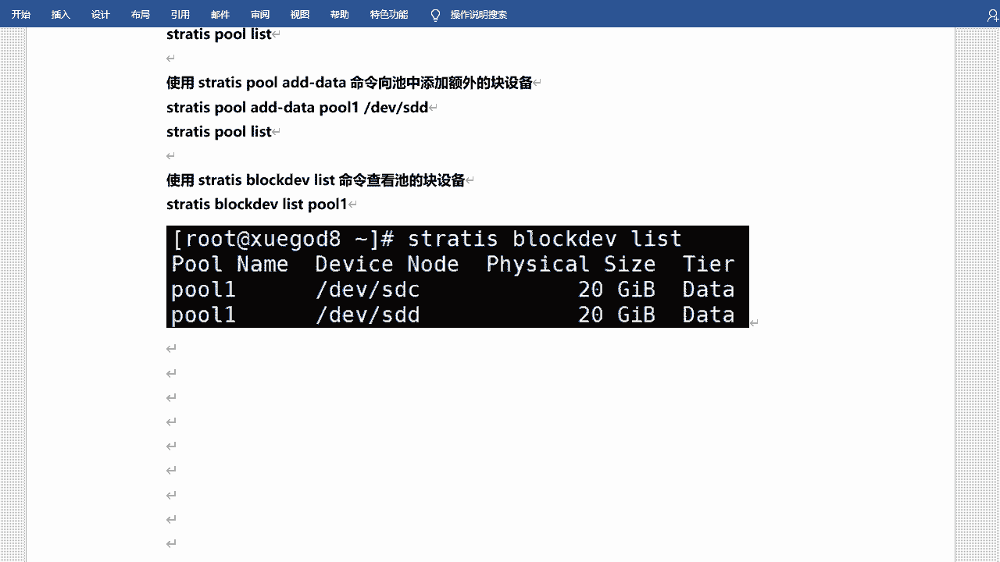

直接在上边实体表上面画稳定系统就可以了。😊，叫tro。t啊叫feel system啊，feel systemFS也可以啊，简写的话其实也可以的啊。feel system是全写的啊。😊，嗯，什么呢？

create。😊，啊，create呃，先写你的池子名字啊，叫铺一。然后再写你的文件系统的名字，比说叫做FSE。啊，这是你的那个那个文件系统啊，FSE。好，那你在。根下的strs下的-一就能看到FS1了。

这就是咱们画出来的。呃，你也不用格式化，它默认就已经格式化了，而且是叉S的啊，叉S的啊这个地方。😊。

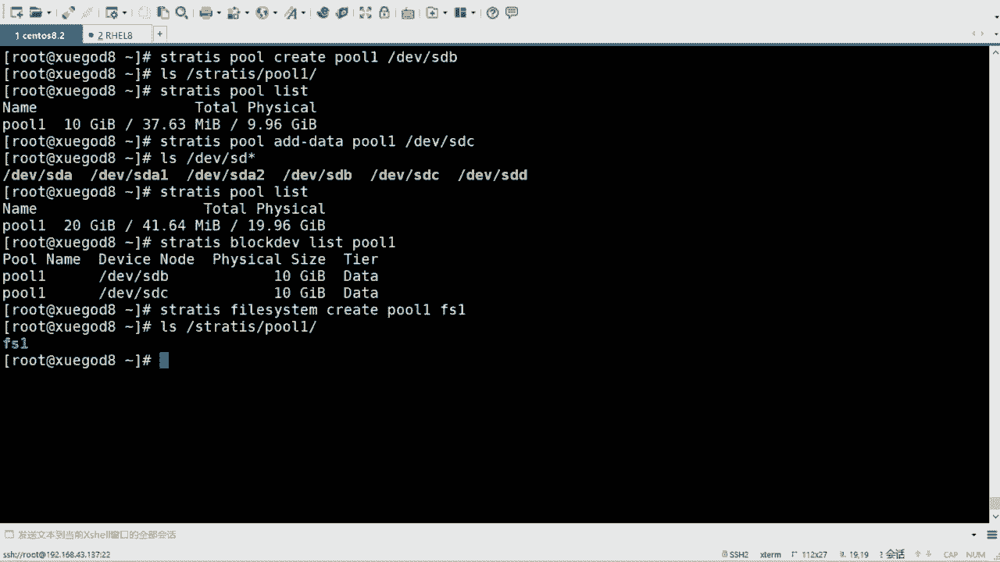

是吧有有提到啊叉这是这是它默认的。好吧，他这是他默认的啊，对你就直接。创建池子，然后创建文件系统啊，然之后直接挂载就可以了。😊，好吧，你看这个背步骤都很简单了是吧？比LVM的话也很简单啊。😊，对不对？

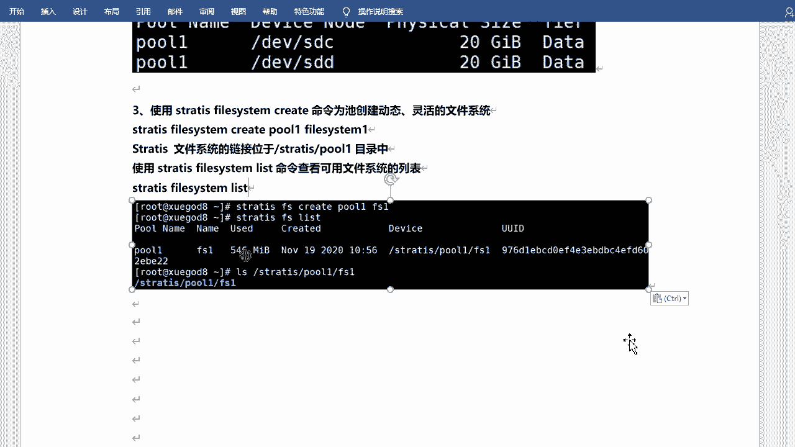

在这啊呃当然你也可以去通过那个strs。feel system啊list去查看一下。文件系统。文件系统叫FS1是吧？他说已经用了546兆。啊，然后什么时候创建的设备是场，1个UID市场一个。对不对？哎。

那咱们就可以挂载。😊，这个就是挂载点啊，直接挂它就可以。mountt呃先创建关载点吧，比如说MKDR创建一个叫做。OPT加吧FSE啊，然后把。啊，sorry， mon。

把tract下的p一下的FSE挂到OPT下的FSE。哎，然后咱们DF是吧，杠大TH看一下啊。就挂这儿了是吧？这个名字很长啊名字很长啊。😊，chinese，他说他有一个T的大小。吹牛的是吧。

没有一个T啊啊，但它显示的就是一个T啊，用了7。2啊，还剩1017G啊，就就这么显示的。😊。

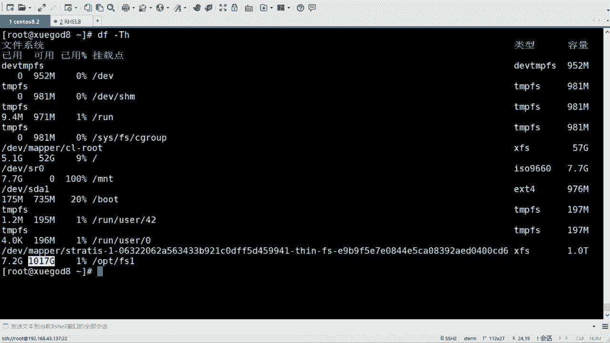

好吧，它是这么显示的啊。😊，嗯，实际来说你是看不见的啊看不见的啊。😊，Okay。那okK这个也是临时挂载是吧？那么下边咱们来进行一个永久挂载啊，永久挂载。😊。

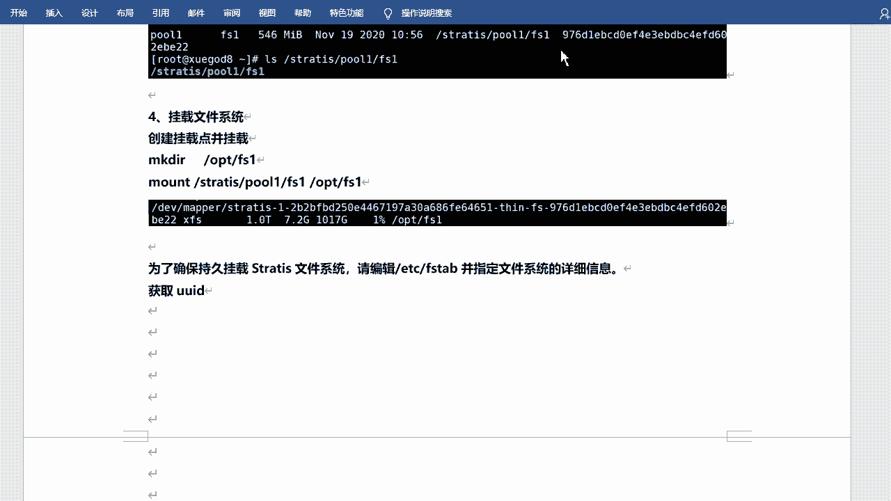

呃，当然这个呢还是去修改咱们的什么呢？修改咱们的FSTB文件。那这个UID的话呢，其实可以通过它去看啊。挂的话，咱们最好通过UID方式去挂啊。你UUID的方式去管啊。就这个方式获取它。然后去挂呃。

你也可以通过这个。这个这个这个这个叫BL哎呀BLKID是吧？BOKID。呃，strrates下的。哇塞，这个不这吗啊，strise下的sose。spo呃，不是spo一下的FSE。是吧看UID啊。

这俩是一样的啊，E9B9CD6。E9B9CD6是吧？这个当然你可以直接把它复制过来啊，复制过来。

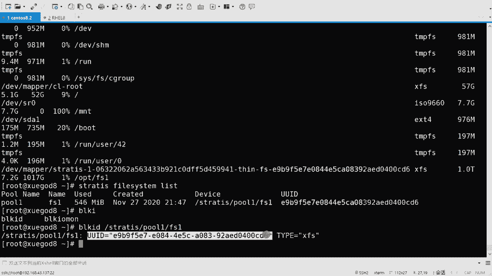

O然后编辑一下ADCFSTB文件。嗯，UID直接拿过来啊，挂到哪呢？挂到OPT下的FSE目录啊，叉FS文件系统好吧，然后dorse。好，后边写需要写东西啊，写一个叫做X。Go。System D。呃。

假 request。等于什么呢？呃，strdes。D点service。00啊这么写啊，主要就是加了个这个。好吧，主要加来这个啊，下班之后保存退出啊。

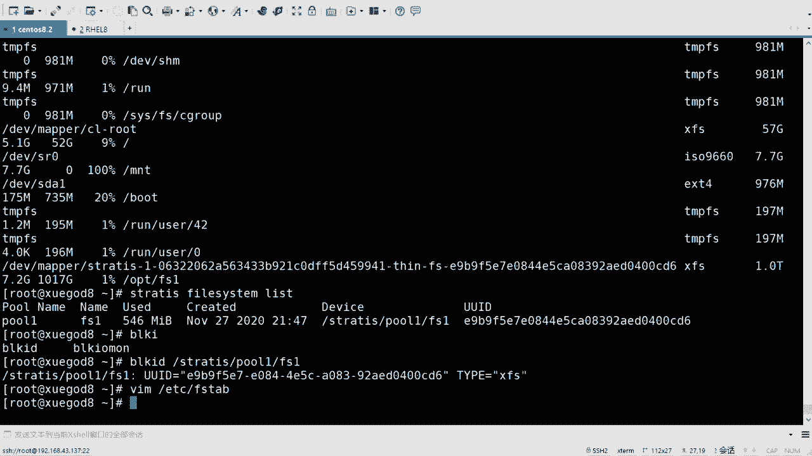

好吧，保存最中啊，然后为什么要加这个是吧？为什么要加这个啊？😊，获取ID啊，然后拿过来。为什么在这个？因为这个的话，它是它是要挂载嘛，是吧？还是要挂载啊，那挂载的话呢，其实嗯正常你开机开机之后。

它会去读取这个文件啊，然后他会去找找什么呢，他会去找这个ID也就是说他会去找这个目录。😊，那你的目标里存在的。是不是必须得存在的啊？那咱们这个呢是一个strats，那strrates的话呢。

必须得是你的服务启动起来，它才会识别到啊，或者它才会去显示这个目录才会去使用这个UID是吧？所以说加了一个这个X system dre这个东西呢是叫做可延迟的挂载文件系统。😊，啊。

直到CMD在启动过程中启动了strt d这个服务为止。他才会去再去挂载。啊，这以关掉啊，如果说你不加这个参数的话，是不是那可能会导致你的计算机在下一次重启的时候，会进入到emergency mode。

就是那个。什么呢？就是那个那个。叫什么来呢？紧急模式啊紧急模式啊就是开W不开呃不能正常的开机。😊，好吧，工能上开机啊。

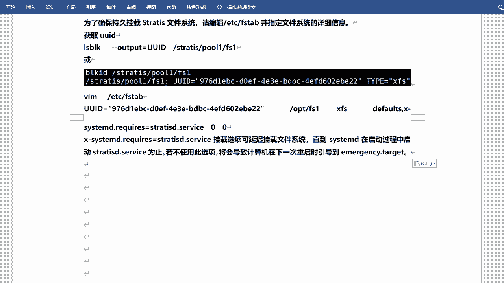

那咱们来试一试啊，我重启咱们验证一下，好吧。看看能不能挂上啊。

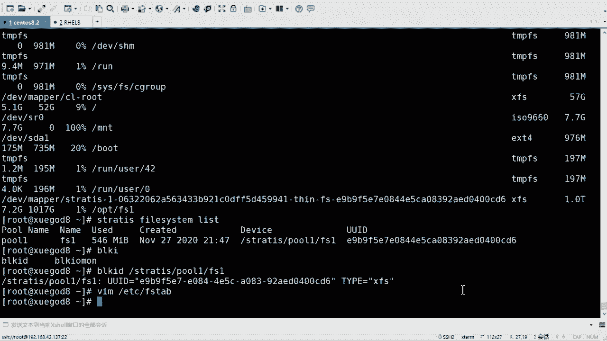

这个很快的啊嗯。重启可以验证一下是吧？稍等它一下啊，重机验证一下啊，开机了，咱们来看一下。

DF杠大TH。是吧在这呢啊，它就挂上了。好吧，它就挂好了，这就说明是没问题的啊，是没问题的啊。😊。

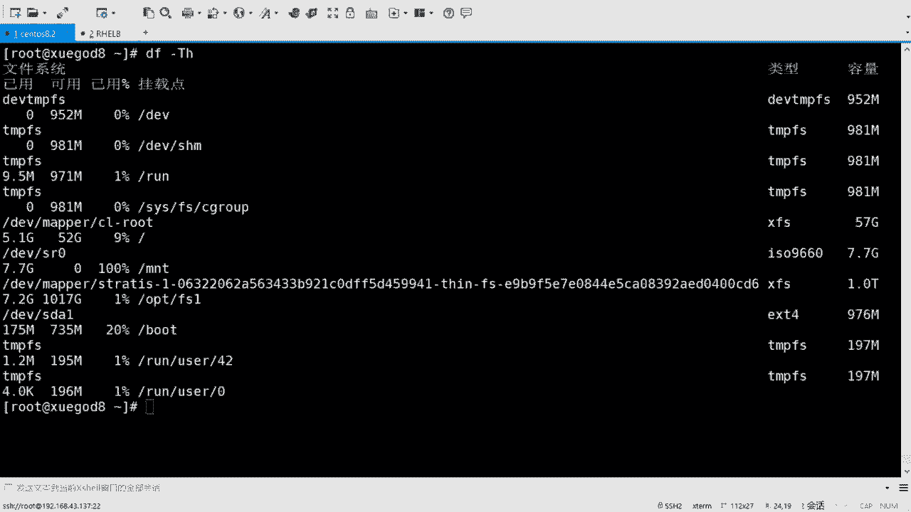

OK重启的话没问题啊。😊，呃，然后呢可以去。干什么呢？可以去。卸载是吧。

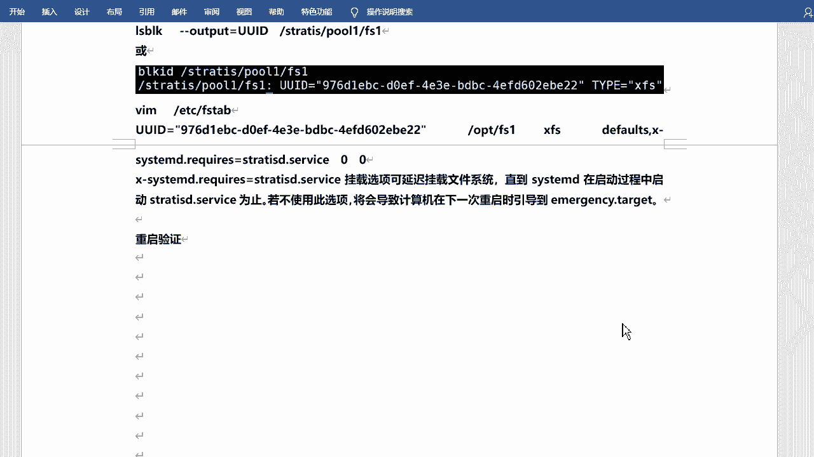

创建完之后可以卸载啊。啊，挂载完之后可以卸载啊，叫做Umount卸载OPT下载FSE。啊，然后咱们再看一下stries。F S list。不联系统啊还是这样子的，好吧，还是这样子啊。然后完了之后呢。

你可以去干什么呢？你可以去删除它。好吧，神屠他啊。叫做。Stra str F S。Detroy。普一FSE。这是删除文件系统。好吧，是置文件系统啊，然后你再去看。List。对吧，然后就没有了。好吧。

这样就没有了啊。然后我们来看一下铺。Chse。Poolest啊。是吧嗯，铺还有的啊铺还有的啊，包括那个。什么blockDV啊。Block。DV是吧，你的硬盘里都还在啊，那你要删的话呢，呃先去删这个铺啊。

blockDV不用删啊，先去把这个铺删了。To destroy。普一啊。删掉，然后你再去看。Police。破就没有了是吧？然后来看一下block DV。是吧这个也就没有了啊，这是删除。😊，啊，删除啊。

其实和那个。

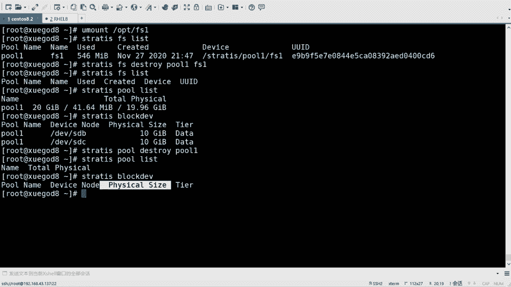

什么呢？和那个LVM的过程也很像是吧？这个还得去。😊，简单说说RVM啊，就是你是怎么加的，你就怎么删。对不对？但是这个过程是相反的啊，你先加了那个啥是吧？先加的铺是最后删铺啊，最后加的FS啊。

是先删的FS。好吧，这个过程可以看一下啊。😊，或者可以看一下啊，嗯和LM那个很像嘛，是吧？把它拿过来。😊，LVM的话，正好可以再复习一下啊复习一下啊。😊，就是删的过程啊。LM是吧？然后也是卸载。😊。

现载完了之后呢，先删除LV。对吧先删成LV啊。okK然后再删除VG，再删除PV，对吧？那咱们这个t就就简单很多，因为它只有两步啊，先删除FS文件系统，然后再删除p就可以了。😊，好吧，整个过程就在这儿啊。

就在这儿是吧？

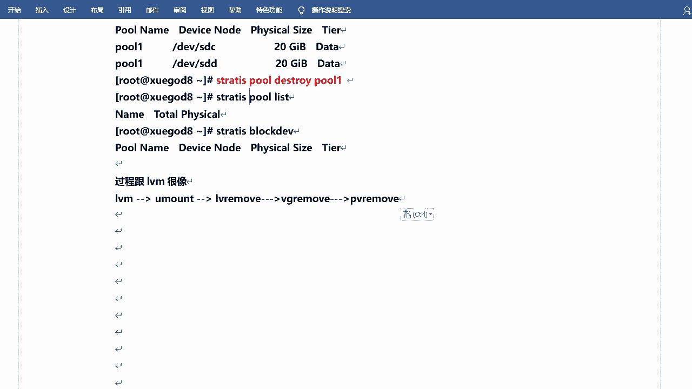

好的啊，这是咱们的strats。