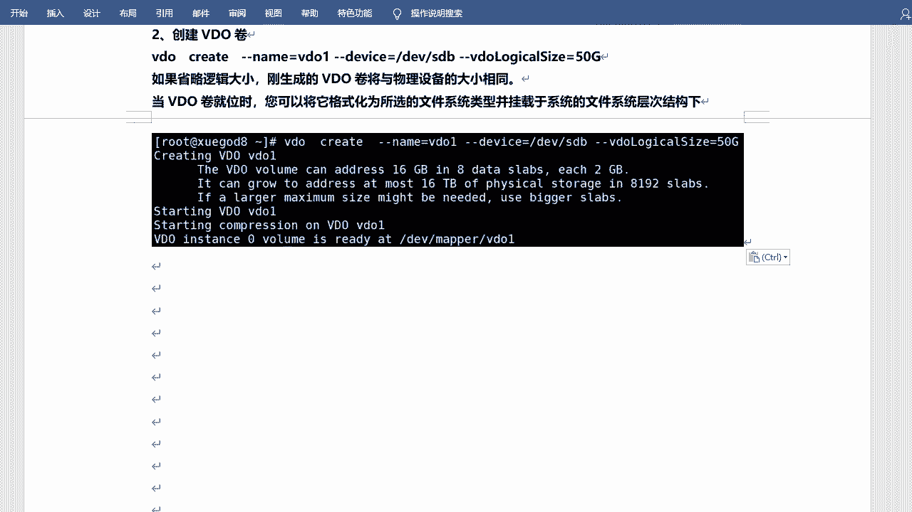
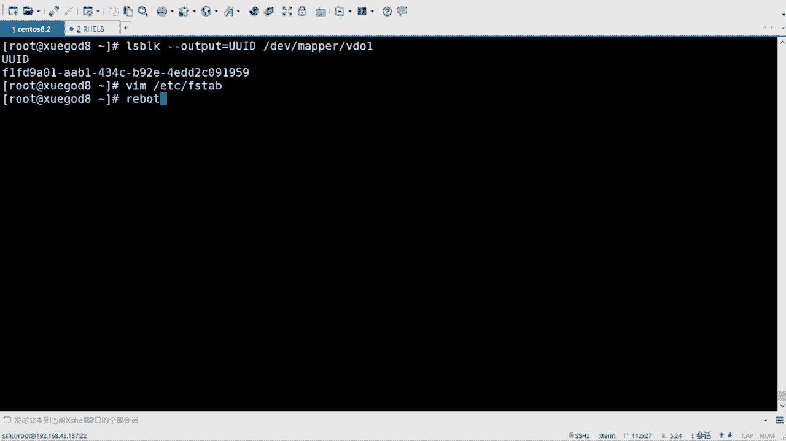

# rhel8-centos8-rhce-linux-stream-stratis-vdo-podman-dnf - P8：rhel8-e-2-4VDO - Linux最diao - BV16T4y1K7px

再看另外一个是吧，另外一个新的新的基术啊，叫VDO。VDO。呃，使用VDO的话呢，进行压缩存储和删除重复数据。好吧，这叫visual data optimism啊，就是一个虚拟数据优化程序啊，叫Vo。

好吧，就vio啊，它可以优化块设备上数据的空间占用啊。video的话呢是一个linux设备映射器的驱动程序，它可以减少块设备上的磁盘空间的使用，同时最大限度的减少重数据的重复啊，从而减少磁盘空间。

甚至提高数据的动作量啊。嗯video的话呢主要两个任何模块，一个叫KVDOKV的话呢是以透明的方式控制数据压缩的。就是comppressse啊压缩的UDS啊UDS话呢是用于删除重复数据的，好吧。

删除重复数据的啊。那V丢的话呢，它是处于什么呢？它是处于这个。这个啊。它是位于现在的块设备，块存储设备的顶部啊，就是在块设备之上的，好吧，块设备之上的啊。呃，比如说read和磁盘上边的啊。

其实和tra strategy也是是吧？也是的啊。😊，这一块设备的话呢可以是加密的啊，然后存储层如LVM模具件和文件系统是位于VDO设备之上。Vdeo的话这个呢需要去格视化的啊，需要可式化的啊。

下面的话有一个呃图啊，就是呃在这儿啊，就是这是一个咱们书上的图啊。教材上面了是吧？什么呢？呃用于优化设备的KBM虚拟机构成的基础架构中的V所说的位置啊，就是最底层下面还是块设备。

块设备上面的话呢是read lawyer啊，就是read啊，做的readread上面是VDVde呢再去划分文件系统，然后再去装什么虚拟机啥的啊，是这个意思。好吧，是这个意思啊，那它是怎么去实现的是吧？

怎么去什么删除啊，什么这个压缩的啊，它会有几个步骤啊，它会有几个步骤啊。😊，叫三个步骤啊三个步骤啊。一个叫零区块的排除。在初始化阶段啊，整块为零的会被原数据记录下来。啊，他会记住这个叫零块啊，零块啊。

零区块的是吧？就好像这打了个比方是吧，就好像水杯里边的水和沙子一样啊，然后使用滤值是吧？肯就是可以把这个沙子过滤出来啊，但是这个是是是有用的啊，这是有用的啊。好吧。

然后下阶段的话就是用来启用VDO的精简配置的功能啊，就是什么压缩和删除重复数据了。😊，好吧，就是把你的零块整整理起来，然后再去存储啊再去存储啊。呃，重复数一删除。重复双一删呃重复数一删除的话呢。

是在创创建相同数据的多个副本的时候，输入的数据会判断是不是冗余数据，是不是重复的。它呢会在写入之前就会去判断。啊，然后这个部分的数据的话会通过叫UDS的内核模块来判断UDS啊叫做universal。

diplication service啊就叫做。呃，什么来着叫。就是删除重复数据啊删除重复数据啊。呃，被判断为重复数据的部分不会被写入。一样的话它就不会再写了。然后呢，对于元素进行更新。

直接指向原始已经存储的数据块即可。看到没有？直接指向原始的数据块，相当于做了个链接一样。😊，是吧联系一样，但是咱们看起来的话，它确实是有几个，比如说相同的文件啊，这是可以的。

但是它存储的方式不是常规的存储方式。好吧嗯。呃，最后是压缩啊，一旦消零啊和重删完成。那么KV内核又一个内核模块啊，KV那么会使用LZ4的工具啊，对单独的数据块进行处理压缩，然后压缩好的数据块。

会固定大小4K的数据存储在介质上，加速读取的性能。好吧，这就是这几个过程。啊，一步一步的去节省你的空间啊节省你的空间啊。然后。这有一个描述啊，这有一个描述啊。嗯。嗯，利用VDO创建的逻辑卷呃。

不是逻辑啊，叫逻辑设备啊，称为VDO的券，它会生成啊，你可以让它生成一个逻辑设备啊。那么VDO的券呢和磁盘分区类似，可以将这些卷格式化，怎没样？格式化为所需的文件系统啊，像常规文件系统那样去挂载。

那么要创建video卷，请指定块设备以及VDO向用户显示逻辑设备的名称，可以指定Vdeo卷的逻辑大小啊，就是和刚才一样，你可以设置成很大，然后一个T两个T都可以啊。

然后逻呃Vdeo卷的逻辑大小呢可以大于实际块设备的物理大小。对吧。嗯，可以大的啊，当然你也可以不用设置。😊，不用设置逻辑大小，那它就和你真实大小是一样的啊。嗯。啊，在这啊，由于VDO创建了精简的配置。

因此用户只能看到正在使用的逻辑空间而无法了解实际的可用的物理空间。对不对？那如果是在创建卷的时候，没有指径大小，那VDO会将实际大小设为逻辑呃视为逻辑大小，就是1比1的比例映射的啊。好吧。

那有利于提高性能，但同时也降低存储空间的使用效率。对吧如果有人发现哎要满了，他肯定不存了，其实还有空间的啊。当逻辑段大小超过实际物理量的时候。

可以使用V video states啊verbers命令主动监监控卷统计信息以及查看实际使用情况。啊，其实可以使用另外一个命令也可以查看啊，叫humanreadable啊，一会儿咱们用那个命令啊。

那个参数是吧，也可以查看的，就是实际大小和最后还剩多少是吧？咱们是可以去看的啊。嗯，来装一下VDO啊VDO。

准备定的话呢，需要两个两个包啊两个包。DNF吧，装一下啊。呃，inst是吧？install叫做VDO和K mode。可以V啊。不遗留。这两包啊应该是都装过了啊，哎，你看是吧？它已经装过了啊。

默认的话已经装过了啊。😊，呃，然后呢这个不用起服啊，因为它装过了，包括它其实也做了一个自动启动的过呃，自动启服务的过程。好吧，那当然你也可以看一下啊。所以他。seatem CLsters是吧？

然后这个video。对吧他已经是起着的啊。啊，然后咱们来创建一下VDO的券啊，叫VDO。sorry， VDO create。出现什么呢？卷子名字叫做刚刚 name啊，叫Vo一吧。这个卷啊。

然后呢dice。是吧你把那个设备加进来呢，呃那DV下的。SDD好吧，这个硬盘加进来，然后指定刚刚VDO。Loical。VDO啊，我当是把这俩字母敲敲倒了。VDo logical。Size。

就是逻辑大小是吧？这个可以很大啊。呃，默认咱们呃不是默认啊，是咱们这个硬盘滴D的话呢是10个G。😊，对吧10个G啊，然后我给他写成50个G吧。你要写100也行啊，50个G。来重建一下啊。

他为cating video的设备是吧？然后创建，然后开始什么压缩啊，然后。呃，实力是吧，居然已经创业成功了，然后在DV现的mper下的Vdeo啊，它在这儿呢。它在DV下mpper video啊。

在这儿。之前咱们那个是在什么strs下边是吧？😊，但是现在已经没有了啊。在这没丢啊，然后咱们就用它。啊，就用它就可以了啊，这是安装和创建VDO的券啊。

OK呃，创写完之后呢，还可以去查看它的状态啊，也叫分析卷。

分印件的话叫VDO。stateatus状态啊。呃，查看内查看谁呢？查看这个这个VDOB啊。因为咱们目前只有一个啊名字叫他。呃，当是它会显示很多的啊，这个没有必要说都看。啊，这儿你看是吧？这么多东西啊。

它会显示很多的。😊，好吧，很多的啊，然后。没有必要多看啊，一会儿咱们会检检检查几个参数，可以去看啊。嗯，这是长按状态啊长按状态啊，然后什么属性啥的可以去看啊，VDO的券。

OK然后可以通过什么呢？可以通过list啊，list呢去查看。

有几个卷啊，video list。当然只有一个是吧？而且你还可以去给它呃什么启动啊，停止啊，什么状态啊，都可以看的啊，比如说Vdeo。😊，呃，stop吧，停掉那个啥。停掉那个那个那个。还是刚刚那幕。

VDE。停掉啊，这就停掉了。停完之后，你可以再看。😊，list你看就没有了是吧，没有了啊，然后你去看那个状态。状态最后它会显示叫做not valuable不可用的。啊，不平状态啊，然后你再把它起起来。

😊，是吧，然后你再看啊。嗯，状态呢。状态。嗯，是吧我刚才又一样了啊，什么policySNC开始同步了是吧，开始同步了啊。😊。

就是可以起停的是吧？可以停可以起的啊。😊，可以听，可以起啊。

然后呢，在这个状态里边咱们有两个是吧，非常重要的参数。

好吧，也是它的核心啊，就是一个是删除重复数据，一个是压缩是吧，有没有开启？

好吧，有没有开启啊？😊，咱们来看一下啊。S。gra一下是吧？gra一下叫做。😊，嗯，叫。The。都。poliation啊，这是删除重复数据的啊，看有没有是不是enable是吧，是不是启动的啊。

还有一个是comppression，就是压缩的啊。comppression压缩的是不是压缩的？对吧就是默认它都是支持的。好吧，它都是知识的啊。OK那这个VDO的话就已经生成了。😊。

是吧生成了生成之后生成肉干什么呢？生成之后我就可以去。😊，格式化并挂载了是吧？那这个Vo的话呢，需要需要格式化啊，咱们刚才讲的那个str是不需要的啊。😊，VDO可视化叫MKFS啊，叉FS啊。

一般都是叉face的啊，可实话呃，DV下的是吧，叫mpper video一啊，这是它的一个它的它设备的名字。对吧是这名字啊，然后在这儿呢最好可以加杠大K啊，最好要加一下啊，刚大K。😊。

刚才可以的话呢是可叫做可防止立即丢弃文件系统中未使用的块啊，可以使这个命令更快。格置化的命令更快，好吗？😊。

啊，一下就一下就可以了。好吧，等一下就可以了啊。😊，港大K啊。格式化。然后是挂载是吧？挂载的话就是。

嗯，挂载的话就是直接也是创建挂载点是吧？然后去这个。这个这个mountt就可以啊，创建挂载点啊。

没K第二就是一个目录是吧？嗯，还是OPD下吧，OP地下叫做VDOE。😊，起码很容挂在 amount。挂谁呢？挂咱们DV下的叫做mpper下的Vo1。呃，把OPT下的VDOE是吧，发过来。啊。

挂完来之后呢，DF杠打TH看一下是吧？哎，那他在这儿。啊，50个G看到没有？50个G啊。嗯，用了390兆，然后可用的是50个G。对不对？能看到吧？啊，这是这是它的一个。当然这是逻辑大小是吧？😊。

咱们都知道它是一共才10个G是吧？一共才10个G的啊嗯。OK那。那我我怎么去看十一大小呢，是不是我不能说才50个G，我往往里边存50个G的文件嘛？如果都不一样，他也存不下。😡，是吧它也存不像啊。

咱们可以通过这个命令去看十一大小啊，叫做VDO。state，med states啊。刚刚human。radable啊readdable就是。这个这个可读的啊正常可读的啊。大小是吧？

那大小的话呢是10个G。嗯嗯，好吧。大小的话是10个G啊。okK然后用了4个G是吧？这个消耗还是很大的。😊，对不对？肖艾生呢已经用了4个G了啊，我已经用了已经用了这个这个4个G了啊。

那然后呢可用的话是16个G。😊，啊，可用的话是6个G啊，但是6个G的话其实就很经用。啊，什么很急用的，就是一时半会间用不完。😊，啊，用不完的。你比如说咱们来。干什么呢？来拷几个文件试一试，好吧。

来拷几个文件去试一试啊。

创建观察点，然后查看，然后咱们可以拷文件去试一下啊。

呃，我拷贝一个比较大的文件，好吧，比较大的文件啊。

你可以找一下是吧，你比如说我找一下。😊，会会用fin的去查找吗？分的跟查大小怎么去查是吧？查大小怎么去查？我想查看多少多少大小的文件。size是不是？然后呢。比如加一个G以上的啊，有没有？

一个记以上的问题啊。我估计是没有的啊。目前查的是prolock这个目录啊，这个这个可以忽略啊。没有是吧。那500兆的。啊，500兆的有一个啊，咱们来看一看啊。呃，是这个install点IMG啊。

ee子下边啊，那我给它拷一下，好吧。嗯，拷贝。MNT下的。一没这椅子下的。inst点MG啊，然后拷到OPD下video。一下是吧。拷过来就可以啊。你看他确实是在拷贝啊，然后你看还哎呀挺快也挺快的啊。

大概没几秒的时间啊，也挺快的。😊，对，考完之后的话，咱们来去看DF看看大TH。是吧那他现在的话。也就用了922兆，刚才是多少兆，刚才是390加500是吧，890差不多900多兆啊，900多兆啊，然后呢。

啊，还没一个G啊还没一个G，然后咱们再去看一下那个正常那个那个真实的啊。真实的。Human readable。是吧确实他用了4。5啊，刚才是4。0吧。现在是4。5。对不对？这是这都这个都是真实的啊。

真是，那么我再去拷贝一下啊。给他重新起个名字是吧，点BK吧。再拷贝一下啊，你看他也是在拷贝，他也会这么停顿一会儿。是吧停顿一会，停顿完之后呢，咱们来看。😊，先来看DF啊嗯。那他现在用的是1。

5个G了是吧？刚才是900多兆。加500多啊，1。5没没啥问题啊，没啥问题啊。然后可用是49个G啊，然后咱们再看。Human readable。你看他还是4。5。对不对？刚才是4。5吧。现在还是4。5。

还剩5。5是吧，为什么？因为它俩是一样的。😡，好吧，咱俩是一样的，那我再考一下。😊，是吧。啊，这是三个是一样的，相当于啊。三个是一样的啊。DF杠1现在变成2。0了。啊，用了2。0了，对吧？

你看它这个逻辑大小就是逻辑的空间啊一直在增大是吧？逻辑的空间啊一直在增大，好吧。😊，OK那真实的呢。对，真实的话，它一直停在4。5。他不会再往上涨了。是不是他不会再往上找了啊。

对不对？这就是VDO好吧。这就是Vdeo啊。相因为它是相同的内容是吧？相同内种啊，它不会去占用。多余的空间。啊，其他的文件都是连接的形式啊，连接形式去去保存的，相当于啊当然这个5500兆可能有点小是吧？

那么你如果说你有大的文件，或者你可以上传一个镜像是吧？可以试一试。😊，看看它会不会去变大是吧，4个G5个G的镜像，甚至七八个G的是吧？你可以试一试啊嗯。好啊，那这是挂载，然后去测试是吧？

那最后的话咱们来看一下。还是开机自动挂载啊，开机自动挂载。开机自动挂载啊，这个和strts就很像了啊。嗯，然后也是先获取UID啊UID。

嗯，UID的话可以试这个NBOK啊。刚刚凹的 foot。嗯，显示UID啊。然后是那个DV下的是吧，mper下的VDOE。咱们要的就是他啊。Now过来。复制一下。修改一下ADCFSTB。哎，再写个UI啊。

啊，等于什么呢？新的啊新的这是VDO的啊。😊，挂到OPT下的VDOE这个目录是吧？然后叉开。然后是dossse。啊，这个也需要写这个什么XC怎么D啊。requires。等于什么？这个是等于。

With the older service。00。😔，嗯。是吧你看它这个这个格式是一样的啊，好吧，格式是一样的啊。你写的时候不用着急啊，你慢点写也也写对了。写对了啊，这什么D。

reres啊vio点serv，上面是strtchesD点service啊。okK然后呢也是重启验证啊。

嗯，然后。这边啊。来看好吧，呃，最后这个参数的话呢，和刚才那个参数一样啊，和str点什么。😊，str点呃呃点service是一样的啊，就是也是为了叫做延迟挂载延迟延迟挂载文件系统啊。

直到你的stMD启动过程中已经启动了VdeO为止。啊，如果不使用次选项，那么将会导致下一次重启可能会引得到emerence mode是吧？一个这个进行模式啊进行模式啊。重启验证是吧？等待一下啊。看效果。

过之后咱们还是来看一下挂载情况啊。呃。在这儿。是吧在这儿啊。呃，VDOE啊VDOE在这了是吧，50个G用了两个G，还剩49个G是吧？这是怎么显示的？啊，行，那当然那个strs没有了是吧？

因为我已经把它删掉了。😊。

对吧我已经把它删掉了。重启验证的话也是没问题的啊。Okay。嗯，行啊，然后来。总结一下啊。总结一下啊，今天讲的相当于是有4个4个服啊，然后我这写的是三个。😊，对吧因为。😊，有这个NFS是吧？NFS的话。

它还有那个凹凸FS呢，是吧？还有autoF啊，autoF的话也需要去配置的。对不对？啊，然后是tats啊，tats像逻辑卷一样是吧，可以扩展的啊，然后是VDO啊，Vdeo可以呃压缩是吧？

然后可以删除这个重复数据的。好吧。这个就是咱们今天的内容啊。

