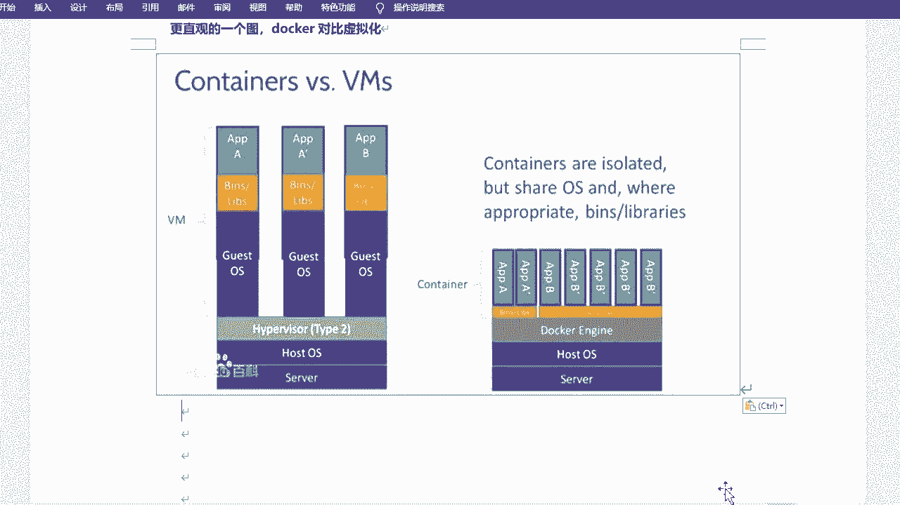
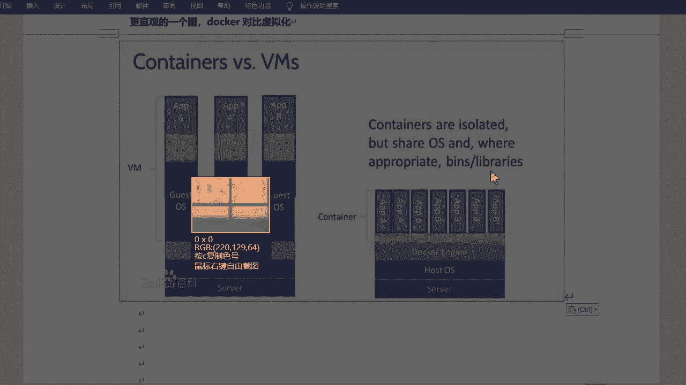
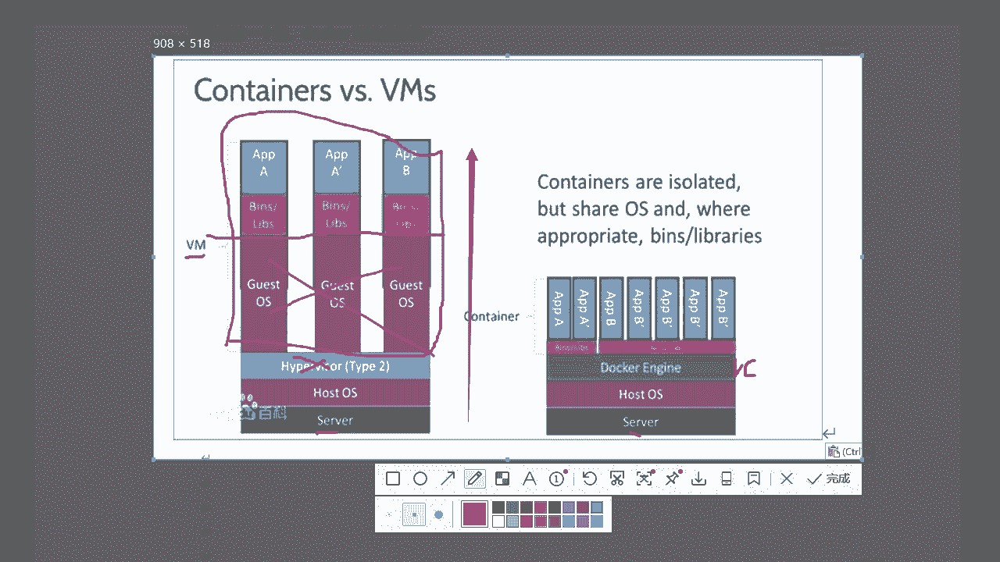
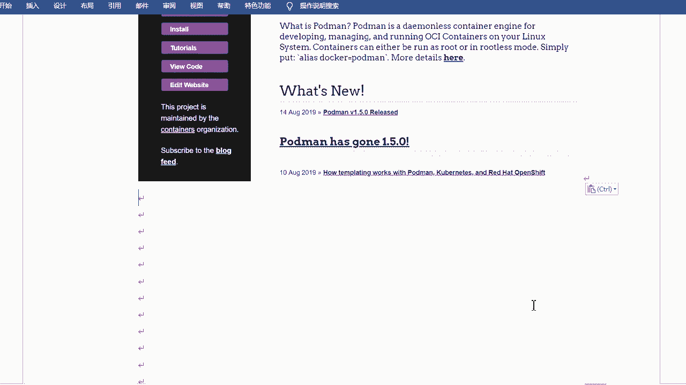

# rhel8-centos8-rhce-linux-stream-stratis-vdo-podman-dnf - P9：rhel8-e-3-1容器和podman介绍 - Linux最diao - BV16T4y1K7px

hello啊，我是CD啊。然后今天的话呢，咱们来看一下这个portman好吧，portman啊。😊，portman容器管理和copy的web界面的管理工具啊，其实是也是管理potman啊。

可以通copy呢去管理这个potman容器的。是吧呃这个portment的话呢会在2021年的1月1号以后是吧？加入到咱们CSA的这个考题里边，好吧，可能会有那么一两道题吧，是吧？呃。

但是的话不会说特别难。好吧，因为毕竟是属于CSA的部分是吧？但是我想跟大家去多多讲一些。对不对？尽可能的话给大家多讲一些啊。😊，行，那咱们就来看啊，首先先认识一下容器啊。

portman的话呢是一个容器的管理工具啊，以及portman的容器管理，怎么去管理容器是吧？啊，最后是portman啊，不是，最后是copipyed的啊linux web管理portman好吧。

通过copyed的去管理portman啊。😊，来，那咱们就一起来看一看啊。Pment。嗯。啊，应该是容器是吧，先看容器啊。先看什么是容器。把字号调一下。先看什么是容器是吧？

包括为什么咱们要去使用这个容器是吧？什么容器啊。呃，平常咱们所见到的一些软件或服务啊。那么对于不同的系统。部署程序所需要的依赖包啊，版本不同或不兼容，是不是？那么解决这个冲突的方式啊。

就是将应用打包部署成容器。啊，这这也是他为什么出现是吧？它出现的一个初衷啊。这个其实很好理解，就是比如说咱们的一个软件啊，就比如QQ来说吧，是吧？那QQ如果说你的QQ是吧，在win10上面。

比如说可以安装好，那么在Wwin7上面就不一定能装上，是不是？这是windows啊，然后呢，你比如说呃还分什么32位、64位的啊，在导之前系统也分32位、64位的，对不对？那这个也不一样，是吧？

那就会去开发不同的版本。😊，对吧？那另ux方呢就是咱们的服务。😊，啊，有如这个服务是吧？比如七上面的服务，你用到六上面吗？😊，不一定。对不对？不一定啊，发上面的话能装到7上面吗？也不一定是吧？

它会有这个不同或者说兼容的问题。好吧，那么容器的话呢，就解决了个这个问题。解决这个问题啊，就是将应用打包部署为容器。好吧，无是谓容器，你就不用去考虑它是什么版本呢是吧？它是什么系统呃，系统需要那啥的啊。

系统都是咱们呃呃一会儿说再说系统啊，呃什么版本是吧，什么几多少位的是吧，这个不用考虑啊，有的容器的话，这个就不用考虑了。😊，好吧，那容器的话是怎么实现的呢？对不对？为什么他不用考虑呢？😊。

是吧容器是这样的啊。容器技术呢是起源于linux开源平台啊，完全使用砂箱机制啊，就是互相之间没有接口互不影响啊，主要呢是由linux内核所提供的两个功能实现的啊，一个叫特定格离功能啊。

叫namespace，还有叫Cgroup叫资源配额管理两大机制来保证实现的。那么这两大机制的话呢，都是基于内核的啊，内核就直接提供了。好吧，其实还有一个啊还有一个是关于安全的啊。

哎就是关于Slinux的啊，叫那个那个呃s comping mode啊，叫编加强编辑安全。啊，或者要加强安全边界啊呃，但是目前的话咱们一般都是比如说都是关着的Slinux是吧？那个不可以不用考虑呃。

但是可能在后期的考试的时候是吧？呃，会开SElinux好吧啊，但是平常的话呢，其实对于容器来说也也不用，它也没有什么特别的设置啊，除非后期比如说挂存储是吧？挂永久存储的话啊。

需要设置那个那个那个Slinux啊，但是很简单啊，到时候咱们讲的时候再说，好吧。😊，主要这两大机制啊，一个是一个是隔离，一个是资源配合，对吧？那么这那么这个容器的话呢，你比方说我去打包好应用之后。

对不对？那它可以干什么呢？它可以去移植。对吧移植怎么移植呢？它可以在不同的平台甚至啊不同的平台是吧？不同的系统啊，不同的版本，不同的呃环境是吧？然后去移植。好吧，可以在可以实现一致性是吧？

可以在容器镜象中与其依赖项一起发布，并可在几乎任何有容器行时环境的linux系统上去运行。要有容器冰石。好吧，就是这是它的一个依赖一个一个基础，相当于是吧？我得有这个东西，然后才能跑起来容器。好吧。

他说的是linux系统是吧？其实windows和m也可以的啊。😊，最主要的是他们不依赖于任何语言框架或包装系统。你看没有，和这个就没有关系了。是吧什么语呃框架包装系统啊，还有什么兼容问题，版本问题是吧？

这个就没有了，你直接可以移植。那而这个移植的话，比如说我有我有三套环境，我的公司对吧？有什么测试环境啊，有鱼头产环境，有生生产环境，甚至还有什么你自己的环境，对不对？那你打包之后的一个容器。

只要你有容器运行时。😊，好吧，那么我就可以去把我的。容器是吧，应个叫容器镜象啊，然后一放到我不同的环境里边，它都是可以跑起来的。好吧，它都是可以抛起来的啊。😊，H。呃。

现在容器运石的话是那个叫run C的一个容器陨石啊，嗯，这个大家可以不用去去记是吧？就是你知道比比如说我可以用port呃portman是吧？然后我可以用docker是吧？

那我都可以去跑起来这个容器就可以了。😊，好吧，都是可以抛下来这容器的。是吧这就是容器是吧？就是容器啊，非常的方便。对不对？非常的方便啊。那它和说的容器是吧，那它和虚拟化有什么区别？咱们也来看一看啊。

其实呢容器呢它也是虚拟化。好吧，它也是虚拟化，只不过虚拟化的方式不一样啊，对吧？和传统虚拟化的方式不一样啊，如果说你不太好理解，哎，我可能目前的话之前没有听过容器，没有听过doer。

没有听过pot one是吧？我不太容易去理解这个东西。那么你可以把那个容器呢看成一个虚拟机，其实也没啥问题。😊，好吧，也没啥问题啊，只不过这个虚拟机就是容器这个这个这个这个容器啊，它没有那个操作系统。

啊，它相当于没有操作系统啊，只有比如说我是一个web的容器，它只有web，我是一个数据库的，它只有数据库，好吧，是这样的。😊，对吧就更更轻万级嘛，是吧？更轻亮级啊。哎，咱们可以看看对比啊。

首先的话是虚拟化，传统虚拟化是吧？😊，可以在单一硬件平台上运行多操作系统，这是虚拟化啊，就是多个虚拟机，相当于啊呃但是呢需要使用hpowe接硬件拆分成多个虚拟硬件，允许多个操作系统并行运行。

hpowe的话呢就是咱们的这个呃。虚拟化的产品是吧，或者虚拟化的软件啊，你比如说什么wemre啊啊这个这个KVM呀，对吧？这个东西好吧，这个东西啊。😊，然后需要完整的操作系统来支持应用运行。

也就是说你的虚拟机啊，你或者虚拟化吧，是吧？必须得有一个虚拟机的操作系统。才能去运行你的这个什么才能运行你的应用。对吧就和咱们正常的物理机或者叫宿主机是吧，你自己机器一样的，你得先有windows。

然后才能跑QQ。😊，对吧就这样说啊这样说，对不对？你不能说只有QQ，那它跑不起来，但是容器恰恰是这样的啊，它可以解决这个问题。😊，好吧，那容器的话呢是可以在操作系统上直接运行。

容器之间分享硬件和操作系统资源。容器中应用轻量化和快速并行运行，轻量化啊，就没有这么多的没有这么多的一个一个呃什么软件的支持啊，是吧，什么操作系统生长啊都没有。呃，然后容器的话呢是共享操作系统内核。

将容器化的应用程序进程与系统的其余部分隔离啊，看才会有隔离功能。当然这个它是自动隔离的啊，你们CS是可以去隔离的。呃，比虚拟化要求更少的硬件资源，可以快速启动和停止，减少存储的要求是吧？

这就是它的一个区别。嗯，好吧，就是传统虚拟化和容器的一个区别啊。如果说还不理解的话，咱们可以来看看几个图啊。嗯有有几个图啊，一个是就是像那于红帽提供的啊一个图。就是这个是吧，呃。

左右两边左边的话是虚拟化，右边的话呢是容器。对不对？呃，它分的这个层的话，首先是有一个host operating system，就是主机操作系统。这是虚拟化啊，然后上边的话呢会有haviser。

就是会有wim，会有KBM，然后呢再去装虚拟机操作系统，然后再去装你的应用。对吧，那么这边的话呢，就只有什么只有这个这个主机操作系统。然后上边这一块。这一块啊都是什么呢？都是容器。啊，都是容器。

它自动支持了叫supporting few runtime，它会有自己的容器运行时。然后上面呢去跑这个什么呢？跑这个应用就可以了，并没有操作系统，看到没有？没有操作用，然后也没有hper这一层。对吧呃。

当然这个可能不太。不太细致啊，然后我找了一个什么呢？找了一个之前的图，就是和docker的一个对比。啊。刀口里边，因为刀口的话也属于容器嘛，是吧？这个可能会更加的清楚一些啊。

是吧我简单画一画是吧？换一画，咱们做个对比啊。

呃，这都是从下往上的啊从下往上的。好吧，你看最。最下边是吧都是ser，这是咱们的硬件，相当于是吧？然后上面的话呢是你的硬件主机，就是你的速主机啊。你的传统主机的这个这个系统。好吧。

然后在上边啊这边还是虚拟机啊，在上边的话呢就是 weather。😊，对不对？然后你的微面KPM。然后在上边，其实这个它也是分的啊，不要从这分开吧。它会首先会有虚拟机操作系统，这个是必须要有的。对不对？

我不管你去装windows还是mac还是什么linuxno redhead什么无纹图之类的，对不对？你必须得有它。那么有了它之后，你再去装一个应用。比如说我要装阿帕奇，然阿装帕奇的话呢。

可能也会用需要一些其他的依赖包啊，其他的依赖库，让你自动再去解决这个关系，对吧？这个这个是虚拟机啊，其实这也写了是吧？这是虚拟机啊，这一块都是虚拟机这一块。😊，我画的可能不太好看啊。

对吧这一块可能这一块都是虚拟机。对不对？那么容器的话呢，相当于把这边这块给它擦掉了，就没有这个东西了啊，这个东西也擦掉了。有没有这个东西了？咱们来看啊呃物理的硬件要有呃物理操作系统可能也有的是吧？

然后上边的话是一个dooccker engine，当然这个是是基于docker的啊，叫docker enginedocker engine是吧？然后这个咱们portman的话就不是docker了。

它有一个run C。啊，R C就是一个容器运行时。好吧，容器运行式啊，然后再上面的话呢，是你的容器。跑的跑的是你的容器啊，跑的是容器啊。那么容器的话呢，它里边就很简单了。好吧，它没有操作系统。

它只有比如说我要有阿帕奇这样的一个呃web服务器吧，是吧？这样的外b服务器，那它呢只会有关于阿帕奇相关的一些依赖包的一些依赖库啊。然后如果呃除了这个之外的其他东西啥都没有。所以说它非常的精简。

非常的小巧，非常的轻量化。😊，啊，移植起来的话也很也很简单嘛，对吧？就这样说，比如说我有一个什么呢？我有一个。😊。

呃，训金。对吧虚拟镜啊呃就说虚拟镜像吧，咱们ISO镜像是吧？1SO镜像的话呢，可能就得4个G。😊，啊，甚至现在八系统的话得有7个G以上，甚至8个G这么大。对不对？这么大的一个镜像，然后你再去装系统啥的。

就会很慢，对不对？嗯包括它占的空间也很大。那容器的话呢就没有容器的话，也就是几百兆。😊，啊，200兆300兆啊，甚至还有更小的这非常小的一个一个空间，一些包是吧？组合在一块儿，哎。

我可以帮你去实现这个功能就可以了。对不对？就可以了啊，这就是容器。😊，好吧，这就是容器啊。对吧这个对比应该能看出来吧，是不是？因为它需要的东西也更少，对吧？这也有这也有提示。

其实啊这说containers啊 isolate啊SAT的就是容器的话是被隔离的。因为它是一个一个一个一个去那个分成一个一个的啊。呃，我不知道你们有没有看过那个docker的一个logo啊。

这个其实用那个讲也挺好的，docker一个logo是吧？嗯，我给你们简单看一下啊，就是它是一个鲸鱼。完了之后呢，上面驮着一些集装箱是吧？因为docker因为docker算是属于。不是说的鼻祖啊。

属于是里程碑式的一个。是吧里程碑式的一个一个一个。一个工具啊。他爸荣其发扬光大的是吧？在待会之前，这个容器其实不太好去实现的啊。哎，我这还打不开了，刀片。😊，百度一下吧。看看图得了啊。就这个小东西是吧？

这小东西啊。也不好看。这怎么这么多金鱼？没有一个定语的吧。嗯。官网有点慢，打开啊。就看这个小图标吧，看这个啊。呃，它有一个鲸鱼上面的话会有一些集装箱。是吧会有集装箱啊，那么这个一个一个的集装箱。

其实就是一个一个的容器。对不对？他会说containers是被隔离的嘛，是吧？被隔离的啊，就是它是一个一个一个一个的单独的。好吧，也就跟虚拟机一样，虚拟机之间它也没有。😊，接口是吧。

它也没有什么混合之类的。对不对？他就是一个一个的。好吧，就是一个一个的，但是呢它会share它会共享什么呢？OS其实就是内核啊，它会共享内核啊，然后之后还有一些什么额外的呃binslibaries啊。

就是一些什么命令啊，一些库文件，这个是会共享的。所以说它很很小。😊，好吧，所以他很小啊嗯。这是容器是吧？呃，那咱们来看看容器的特性吧，是吧，和容器的一些。😊，呃，特点啊，包括它的优点相当于是吧？

包括它的优点啊。容器啊容器的可一植性可一制性号啊，刚才其实也讲了啊，可一制性号啊，可以容易的从一个环境转移到另外一个环境。因为它本身就是一个独立的。啊，你直接把它拿过来，然后扔到别的地方去就可以了。

就是这么简单啊。😊，好吧，这是一个啊。然后呢呃可以保存容器多个版本啊，根据需求啊，快速访问某个版本是吧？啊，这个某个版本啊。对吧某个版本啊，这个是说它可以去快速的相于打快照一样啊，不能说打快照吧。

相当于。😊，什么呢？就是它会有版本啊，就叫版本啊，你可以更新版本，你可以保存版本。😊，对不对？然后可以快速的去去访问和恢复啊。呃，然后容器的话通常是临时的，就是你运行就是临时去运行，然后你退出是吧？

然后就然后在那个那个删除是吧，然后就没有了。啊，就没有，然后它里边的数据默认是不会动的啊啊吧，默认不会动的。但是呢你可以将运行中的是吧？运行中的容器啊，生成的数据永久保存，这个也可以。好吧。

就是可以挂存储啊。嗯，还有容容器通常是在需要运行时候运行，不需要时候停止并删除，下一次需要时候启动一个新的容器进程，对吧？因为它是临时的嘛，是吧？它是临时的啊，一般都是临时的，对不对？你用的时候就用啊。

不用的时候把它关了就可以了，是吧？也非常节省这个资源的，对不对？去是吧？然后咱们来看一下跑的慢。😊，好吧，跑得曼是是咱们今天主要讲的啊。嗯。好子们。什么是portman是吧？😡，呃。

port曼的话呢是一个用于处理容器的开源的linux工具。跑的慢是吧？行，是一个无守护进程的柔进引擎啊，呃无守护进程的话就是他没有服务啊，不需要什么启动啊，什么dment上啊，不需要。

装好之后立即用立即用就设一个工具是吧？你像那个enssible是吧？enssible的话也是一个工具，相当于是吧？它也没有服务，对不对？用于在linux系统上开发管理和运行，叫做O，这就是OCI是吧？

open container interactive啊一个容器。呃，这个是一个就是开放叫开放容器协议啊，或开放容器倡议之类的啊，就是CNCF它它发布的一个标准，相当于啊。

它可以用于管理任何由兼容开放容器倡意的容器引擎创建的Lux容器。啊嗯。就是它可以管理。这个port慢啊就是啊管理任何兼容OCI的这个容器进行创建的Lux容器，比如说door创建的对吧？它都可以跑起来。

好吧，它都可以管理的。好吧，然后portman的话提供了一个和docker兼容的命令行的前端，好吧，就是它的命令行啊或命令的一个使用，对不对？其实和docker很像的啊很像的啊。

大部分命令其实也也也差不多。😊，好吧，也差不多啊。呃，但是为什么它叫portman是吧？为什么叫跑的慢，对不对？好像听起来不太那个啥一样，不太不太好一样，对不对？其实为什么叫potman？

因为它和K8S是有关系的啊，就是kuubernets是吧？😊，因为port one的话呢，它本身是它是一个从一个项目里边剥离出来的，叫lebel port。好吧。

lel号的话呢就属于kuernetes里边一个组件或者库吧，是吧？一个这东西啊一个这东西有同学如果说理解了解过K8S的话，应该知道叫pod。😊，是吧叫炮的一个一个概念啊，po炮的话呢是一组一组容器。

好吧，叫做一组容器啊，一组具有共享明明空间和共享文件系统的这个这个容器叫做pod好吧，因为Q百呃K8S里边它它最小的那个那个怎么说呢？最小的管理管理那个。界限吧是吧，就是就是就是po对吧？就是po啊。

那么portman的话就是从这里边抽理出来的一个一个概念，好吧，叫做pod manager啊，叫pod manager。😊，没一点是吧？然后。那个那个把它前面连起来了，叫做port的曼。好吧。

那它连起来的话就po的慢啊，是吧？好，当然这个这个知道就可以啊。😊，知道就可以啊，因为它是你如果不理解的话，你也你也可以先不用去理解，好吧。后边嗯后边如果说你们去学CA的话，是吧？😊。

那会有一门课程叫O280。啊，D280就是open shift是吧？open shift的话呢相当于就是kunet的一个。收费版啊可以这样说啊，是是红帽的是吧？如果说你们后期去考的话。

肯定会去再去讲这个这个这个KPS啊什么之类的啊。是吧。okK啊，这是这是poman是吧，portman啊，然后它的命令行啊，它提供了一个和doer兼容的命令行前端，好吧，这个知道就可以啊。😊，呃。

包括什么呢？包括除了啊。portman实现除了docker s相关指令外，几乎所有的docker命令啊，你可以用它实现除了dockers相关之外的所有的docker操作，并且它还是一个无守户进程如进行。

这就意味着你可以脱离docker啊，不需要执行s cLstar docker这个服务了，无需了，而且什么呢？而且portman可以是普通用户去执行是吧？普通用户去去管理啊，不一定非得是root用户了。

好吧嗯。看始首朋友们啊。然后在这的话给大家说一下poman的一个网站啊。网站啊。这个也不算是官网吧是吧？它叫做poman点IO啊，是一个公告和新闻站。公告和新闻站啊，它会发布一些新闻之类的啊。

当然它也会有一些你像blocks，会有博客，会有相应文章是吧？release。啊，然后什么install啊，trus就是一个向导之类的啊等等的吧，是吧？想看的话可以看一看啊，叫panda pan点IO。

啊，泡他们点油啊。Manage ports， containers and container images啊管理 reportss。呃，容器和容器镜像都可以管理。对吧这就是跑的慢啊。

OK行，那咱们来装一装port曼好吧，装一装port曼啊。