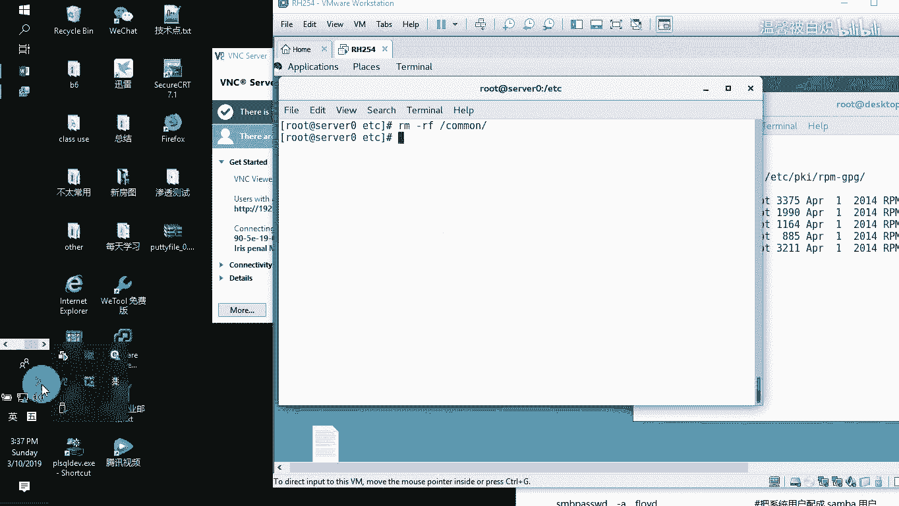
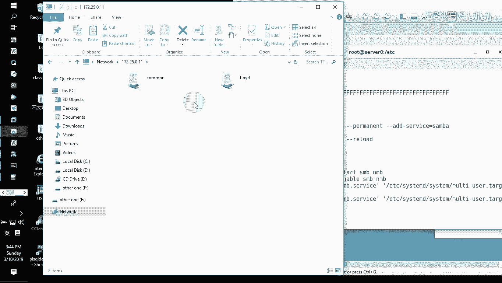
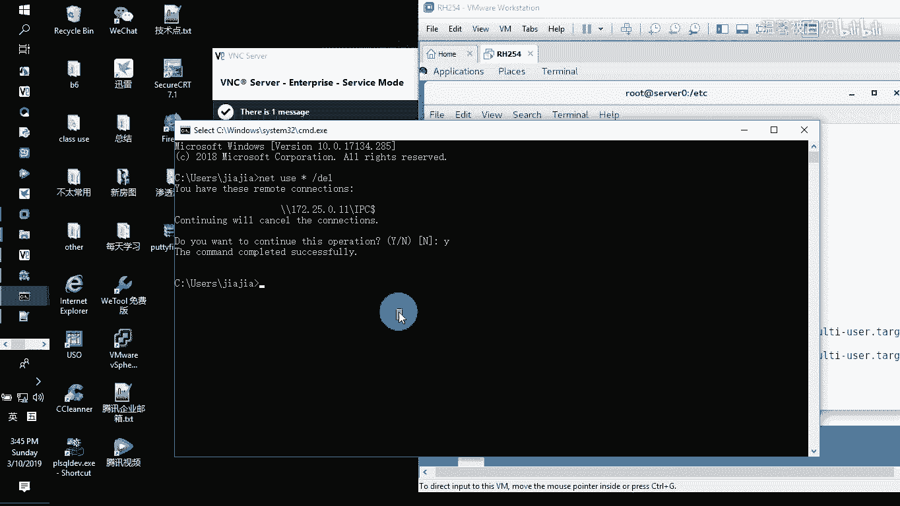
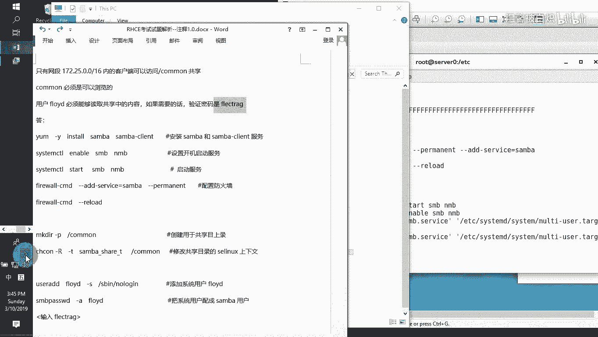

# samba share - P1 - 打羽毛球的橘猫 - BV1Tb411e7pK

开始了吗？

好，录像已经开始了哈。接下来呢要给大家去做的就是我们所看到的这边专门做共享的议题。在服务器上面，ser服务器上面做我们的这个三把服务。安装三把，并且把它的服务器工作组置为STAFF。

然后只有这个网段可以访问这个common。然后common的话呢，必须是可浏览的。这个用户的话呢能够读这个共享的内容。但如果有需要的话呢，把它的验证密码改成这个。也就是说这个用户本身只是做共享的查看。

并没有做系统，所以一定要清楚这个哈。好了，那我们把这个内容给它完成一遍。第一件事情。Y in。安装三把。3吧。干c。啊，就两个哈减Y自动回答个yes。装完了之后呢。

直接去配置它的配置文件EDC3下面的SMB点com这它的配置文件。在它的配置文件里面把它的这个work，把它改成。STAFF然后呢，一定要确认这个机器它的身份验证为unuser。

就seecreity等于user。好，接下来的话呢直接就跑到我们的最后面。一个大G跑到这个文档的最后面。那跑到文档最后面的话呢，我们直接在后面写我们自己内容。这个共享的共享名。

共享的共享名是common。COMMON啊，然后呢这个共享的路径，因为现在的话呢我们还没有这个路径，那我们直接写一个，比如说这样呢写在这个根目录下面的这个common。然后呢，对于这个com们来讲。

对于他们来讲。所有人必须是可浏览的那可浏览的话呢，在这边就有了，那你直接写过来就好了。等于yes。然后呢，他又告诉我们说了，只有这个网段才可以访问这个common。能明白意思呗？

那也就意味着说这个网段的话呢，我们就直接书写过来。Post。好了。等于。只有这个网段172。25点啊，就这个网段。好了，那如果还有别的话呢，就呃再写，但是这边已经没有了。

他也没有写那个rightiteable，也没有写public，看到吗？也没有写这些东西，也没有写公共，也没有写，允许写入。好了，那做好这个了之后保存退出。接下来的话呢，这个common这个文件夹有吗？

刚刚。在根目录下面。没有这个文件夹，那没有这个文件夹，我们有这个文件夹还不要紧。我们还要对这个文件夹的话呢，LS杠大Z小D然后去看这个common，它允不允许人家三把共享访问。

不保质期是不允许CHCN杠大澳递归的给啊。项目的话呢是三把下牙线sure下压线T给这个common。当然这个命令如果忘记了怎么办？我不记得哦，我不记得呀。那这个命令如果我真不记得，不记得怎么办？

你看之前我们在看配置文件的时候，在三把的这个SMB点com这个配置文件在最前面的位置，它有讲到S1linux，看到吧？那么它里面针对文件夹设什么？😡，在这里有。就是这行。然后后面路径我们自己写吧。

对不对？好来来退出来。然后呢，就把这一行给它粘贴过来，然后路径是谁呢？就是那个叫。他们。看到吗？直接写好，然后他又有一个要求了，他说这个用户啊要能够读这个东西。那我们看看ID有这个人吗？😊，哎，有对吧？

那如果你们那个地地方那个机器里面是这样的，比如说如果它是没有啊，那像我这边哈user滴滴，我把这个用户给它删了。如果没有啊，我认为认为他没有好吧，那我们用这个ID来查看的时候，没有 searchus啊。

就没有这个人没有这个人怎么办呢？那就见这个人呗，对不对啊，来我们user。添加一个用户。添加它，并且添加的时候大家注意题目里面虽然没有讲，但是他说了，只要他能够做共享就好了。

没有要求你做别的那够共享呢也要密码的那共享收密码就行。那我们不允许他登录到系统SP下面的no loging。啊，已经有这个人了啊。来，然后呢呃因为我刚刚做过哈，我刚刚应该在删这个人的时候。

就user delete减R，然后把他这个加目录也给它删了。然后删完了之后，我再重新的去建这个人，看了就没问题了，对不对？啊，建它建完了之后呢，再选择。PD boyEDIT减A去添加这个人过来。

FLOYD那他的密码他的密码的话呢，就是他这边的这个要求了。那我写上啊。啊，写过来了之后，你可以看到它的这个共享目录已经出来了。那接下来的话呢，我们需要大在防火墙里面fire。

or干 commander干干 permitted，然后呢，杠杠艾添加一个服务，服务的话呢是一个叫三吧。把这个三保服务加过来，加完了之后，我们再把这个呃加的这个服务重新的去。加载一遍我们的防火墙。

加载完了之后呢，这好我们就可以在外面去访问我们的这个服务。也就是说只要你知道有有的话呢，我们的客户端就可以去访问了。那也就类似于说像我们这边如果客户端的话呢，呃去访问的时候，那就直接在这边我看看啊。

客户端直接用我们的那个。创建啊，这个共享不是啊。啊，在客户端上面。安装这个CIF，然后建一个文件夹，然后呢就可以直接选择把我们的那个文件夹给它拉过来就好了。那一样的没问题啊。好了。

那现在的话呢先不看这个我们直接在外面给大家去做个简单的演示就好了。看这里，那直接在这边选择172。25。0。11啊，访问一下这个共享。Yeah。17250。11哦，不好意思，好像我做完了这么久。

我的服务有开过吗？没有啊，systemCTL然后选择starSMB和NMB把这两个服务给它开起来。如果你希望它开机依然生效，选择enable它。这样的话呢，它永远都会在我们开机列表里面啊。

那你就直接可以用了。那我回头我们在这边再去访问一下172。250。11，就这个啊打开的看到吗？那呃因为我之前有验证过。那这边的话呢，他直接就把我验证过的那个用户名密码给它记住了。所以这个很不友好。

那windows里面的话呢那我们直接用命令行用命令行的话，能们直接net user啊，然后呃us然后新杠deele删掉所有的那个你看他之前是不是有过这个这个历史记录。

那我们再重新来看的时候，他应该没有了。那没有的话，那正好我们重新打开一个我的电脑再来访问一遍哈。

应该就要用用名了。来看到这个吧，这就是有用户名有密码的这么一种连接。那你可以用我刚刚那个用户名密码就可以登录过来了。这是我们刚刚在呃看到的时候用的这边的这么一个用户的一种做法。是这个用户吧。

就是他啊密码也是他，那就可以直接登过来了，这是非常方便的一个做法了。好了。

