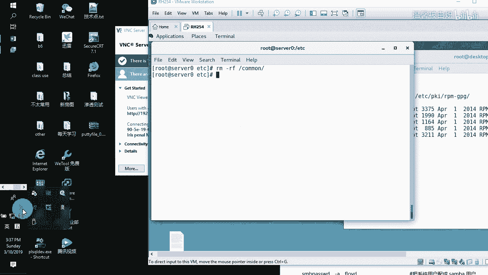
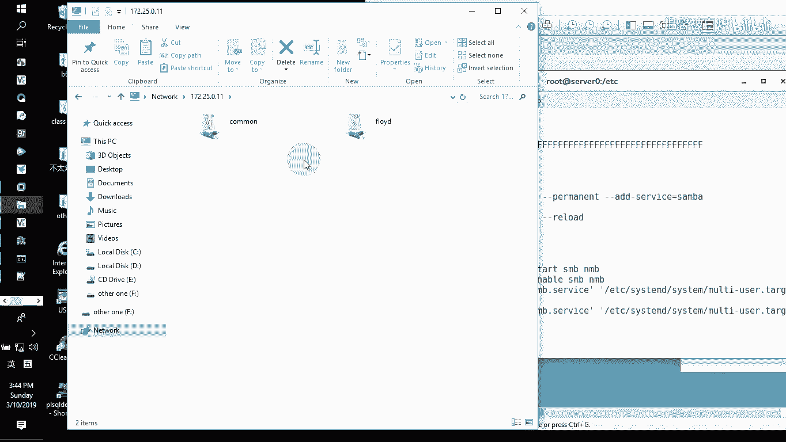
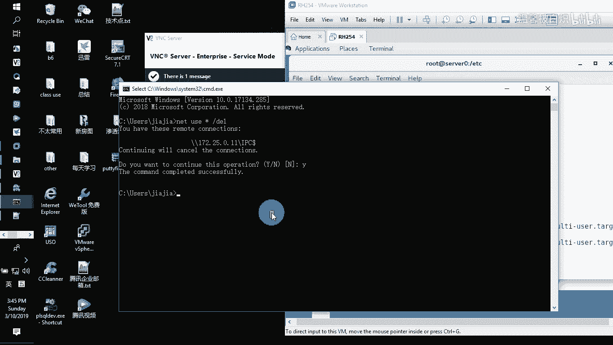
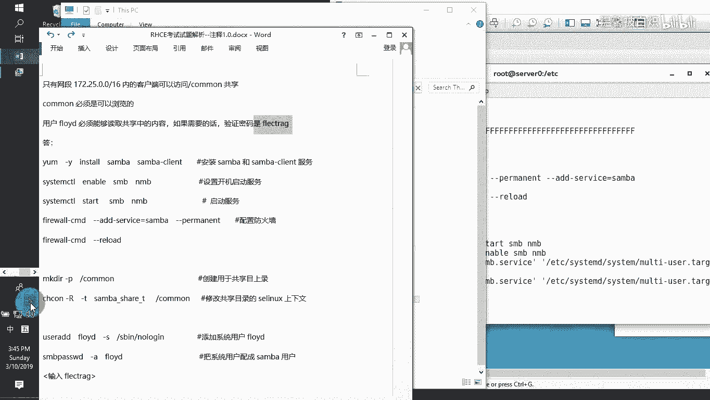

# Linux服务器管理：P1：配置Samba共享服务 🖥️



在本节课中，我们将学习如何在Linux服务器上安装和配置Samba服务，以实现文件共享。我们将创建一个名为`common`的共享目录，并设置访问控制，确保只有特定网段的用户能够访问，并且指定用户只能读取内容。

---

## 安装Samba服务

首先，我们需要在服务器上安装Samba软件包。使用以下命令可以自动完成安装。

```bash
yum install samba -y
```

安装完成后，Samba服务的主要配置文件位于`/etc/samba/smb.conf`。

---

## 配置Samba服务

上一节我们安装了Samba，本节中我们来看看如何配置其核心参数。

使用文本编辑器打开配置文件：
```bash
vim /etc/samba/smb.conf
```

在配置文件中，我们需要修改两个全局参数：
1.  将工作组设置为 `STAFF`。
2.  将安全验证模式设置为 `user`。

找到并修改以下行：
```
workgroup = STAFF
security = user
```

---

## 创建共享目录

配置好全局参数后，接下来我们需要定义具体的共享目录。

滚动到配置文件的末尾，添加以下内容来定义我们的共享目录 `common`：

```
[common]
        path = /common
        browseable = yes
        hosts allow = 172.25.0.0/24
```

这段配置的含义是：
*   `[common]`：共享目录的名称。
*   `path = /common`：共享目录在服务器上的实际路径。
*   `browseable = yes`：允许网络上的其他用户浏览此共享。
*   `hosts allow = 172.25.0.0/24`：仅允许IP地址在 `172.25.0.0/24` 网段内的客户端访问此共享。

保存并退出配置文件。

---

## 准备共享目录与用户

定义了共享配置后，我们需要在服务器上创建实际的目录并设置权限。

以下是需要执行的步骤：
1.  **创建目录**：使用 `mkdir` 命令创建 `/common` 目录。
2.  **设置SELinux上下文**：为了让Samba能够访问此目录，需要为其设置正确的SELinux安全上下文。
3.  **创建共享用户**：创建一个专门用于访问共享的用户，并为其设置Samba密码。

具体命令如下：
```bash
# 1. 创建共享目录
mkdir /common

# 2. 设置SELinux上下文，允许samba共享访问
semanage fcontext -a -t samba_share_t '/common(/.*)?'
restorecon -Rv /common

# 3. 创建系统用户（禁止登录系统）
useradd -s /sbin/nologin harry

# 4. 将用户添加到Samba数据库并设置密码
smbpasswd -a harry
# 执行此命令后，会提示输入并确认密码
```

---

## 配置防火墙与启动服务

为了让网络上的其他计算机能够访问Samba共享，我们需要在防火墙中开放相关服务，并启动Samba服务。

以下是需要完成的步骤：
1.  **开放防火墙**：在防火墙规则中添加`samba`服务。
2.  **重载防火墙**：使新的防火墙规则生效。
3.  **启动服务**：启动Samba服务，并设置为开机自启。

具体命令如下：
```bash
# 1. 在防火墙中永久开放samba服务
firewall-cmd --permanent --add-service=samba

# 2. 重新加载防火墙配置
firewall-cmd --reload

# 3. 启动Samba服务并设置开机自启
systemctl start smb nmb
systemctl enable smb nmb
```

---

## 客户端访问测试



服务配置完成后，我们可以在网络上的另一台计算机（客户端）上进行访问测试。

在Windows客户端上，可以按 `Win + R` 打开运行窗口，输入以下格式的地址进行访问：
```
\\服务器IP地址
```
例如：`\\172.25.0.11`



系统会弹出登录窗口，输入之前创建的Samba用户名（如 `harry`）和密码，即可成功访问 `common` 共享目录。

---

## 总结



本节课中我们一起学习了在Linux服务器上配置Samba共享服务的完整流程。我们从安装Samba软件包开始，逐步完成了修改全局配置、定义共享目录、创建目录与用户、设置SELinux与防火墙规则，最后启动服务并通过客户端进行验证。关键点在于正确配置`smb.conf`文件、管理SELinux上下文以及使用`smbpasswd`命令管理Samba用户。掌握这些步骤，你就能成功搭建一个受控的文件共享环境。