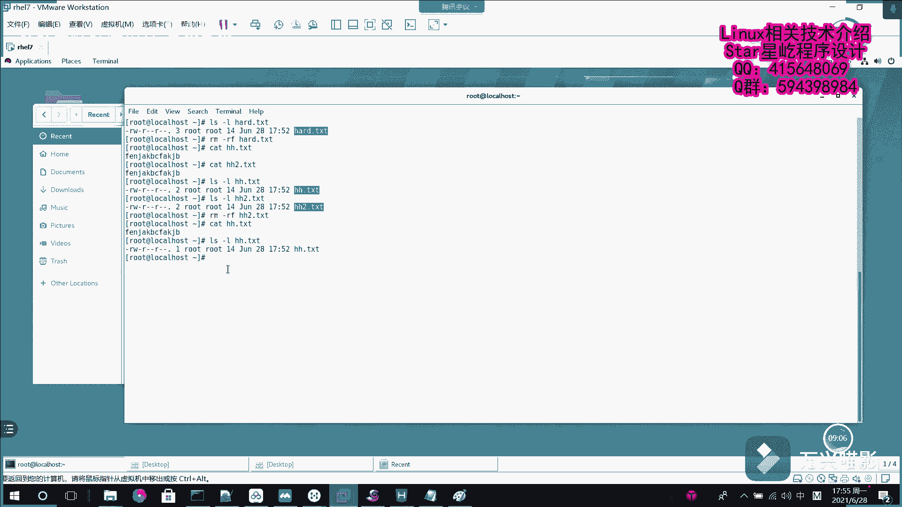

# 【Linux】021-软硬链接 - P1：021-软硬链接 - Yo_Holly - BV14X4y1P7bh

呃在这个视频当中啊，我要介绍LINUX当中的两种链接方式，软链接和硬链接嗯，在windows系统当中，快捷方式，其实就是只需要原始文件的一个链接文件，可以让用户从不同的位置来访问原始文件。

原文件一旦被删除或者剪切到其他地方，就会导致这个链接文件失效，但是这个看似简单的东西啊，在LINUX系统当中的话，它又不太一样，在LINUX当中啊，它分分为两种链接方式，一种是软链接，一种是硬链接。

软链接的话在这块也叫符号链接，它就是说仅仅包含所链接文件的名称或路径，它其实就像记录地址的一个标签一样，当原始文件被删除或移动后，新的链接也会随之失效，不能访问，可以对文件目录做链接。

跨文件系统也也不是问题，但是就是说这一点来看的话，和windows系统的快捷方式有一样的性质，用户访问起来的话其实也是一样的，这一块的话就是说我先画一幅图，然后去分析一下，这个就是说它是怎样一种机制呃。

他的话就是这样的，就是说这个的话是假如说这块的话，这个是硬盘设备，这个是硬盘设备，这里面存储的是数据，所有的数据，然后我在这一块的话是有一个原始文件，原始文件对应的话我有一个软链接。

然后这样的话这块对应有一个操作者呃，他是这么一回事啊，他说我这个操作者直接找到这个原始文件，然后也可以访问到这个数据，然后操作者找到软链接，然后它软链接的话，它里面存储的不是原始文件的一些链接信息嘛。

所以我再找到原始文件，也能找到这个对应的数据，它是这样的，所以的话，如果之后我把这个原始文件给它删掉之后，也就是说我操作者点击这个软链接，他已经找不到原始文件了，也就是说它里面存的这个地址的话无效了。

所以这个数据的话它就获取不了了，这就是软链接，一旦把原始文件删删除之后，它就失效了，然后紧接着咱们假如说创建一个文件，创建一个文件透视AA2TST，然后依靠嗯一堆乱七八糟的东西，然后输到这个TXT里面。

然后我先看了一下，这就是刚才输进去的东西，现在我对它创建一个软链接，软链接的话就是加了这个选项，就是杠S杠S的话就是说你想soft是软链接，然后假如说我把这个AA点TXT链接到，嗯链接到哪个哪个文件。

比如说我们叫比如说叫ABCDTST呃，这个这这样的话一个链接就建好了，然后我看这个AABC点TXT里面，他都放了哪些内容，它里面的话哎我现在去查看他的话，我也可以看到刚才文件的数据，他的访问方式的话。

也就是说他从软链接找到原始文件，然后再去访问数据，这就是一个软链接，假如说咱们现在呃做一件事情，就是说强势把这个AA点TXT给删除了，现在查看已经没有AA点TXT了，删除了。

然后我们再次查看这个ABC点TST，他现在就是说他已经是没有这个，文件或者目录了，也就是说这个软链接失效了，这就是软链接，然后紧接着接受这个在呃，LINUX下面的这个另一种链接方式叫硬连接。

然后它是可以将理解为，就是说指向原始文件的一个指针，他就是说系统会创建一个，与原来的文件一模一样的INNO的信息块，这个INNO的信息块的话，它们都是指向呃这个硬盘上的这块数据，所以的话呃。

这个时候就是说我要是把原始文件删掉的话，我访问这个硬链接的话，我还是可以取到数据的，也就是说其实就相当于是呃这个硬链接的话，就是说我我指向原来的数据，不断给他加一个指针，加指针。

假如说它有多个指针去指向这个文件，我只要这个windows数不为不为零的情况下，我都可以去访问它，然后他访问的方式的话，我这块再画个图给介绍一下，呃，这个的话就是他就是这样的，比如说这个是硬盘。

然后它里面对应存放的是数据，然后硬链接的话他是这么一回事，它就是是他是这样的原始文件，然后这一块的话是硬链接一，然后下面是硬链接二，然后这块有一个操作者，这操作者他如果他可以有三种方式去访问数据。

通过原始文件，然后直接去访问数据，这是一种方式，然后它不同于嗯软链接的一点是，它是建立了一个INNOTE指针，然后这个INNOTE指针的话是直接指向数据，也就是说。

这三者他同时都可以代表这个数据的一个溯源，就看我用哪种方式去访问，然后我也可以用这个硬硬链接二，去访问这块数据呃，接下来我就开始演示一下这个硬链接啊，硬链接的话它是它是这样的硬链接。

首先啊呃看到这看到这一块呃，我再创建一个文件，比如说是叫假如说叫hard点TST，然后我往里面放点东西，也是随便敲点东西吧，然后放进去这个我看一下这个对应的文件hard txt。

然后我现在用这个LN去创建一个硬链接，刚才那个杠S的话是soft嘛，是代表创建的是软链接，我这块如果我不加选项的情况下，我去创建链接的话，比如说hard，然后给他创建一个链接，比如说叫HH点TST。

不加不加选项，它默认创建的就是硬链接，然后现在看HH点TXT就在这一块，这个就是HH点TS，首先我看一下HH点TXT里面它有什么东西，哎他有这个东西了，然后我现在再创建一个硬链接。

比如说是hard h h2减TST，然后我查看一下这个CJ谁是二点TST，它里面同样也是这些信息，然后我现在LS杠，我查看一下这个hard这一块的话有一个三。

也就是说这块代表说是他INNODEINNO的指针，有三个，也就是说我要把这个INNO的指针，这个数目削成零的情况下，他才说是这个数据失效了，首先我假如说我先做一件事情，我先把这个CD删掉。

就是这个原文件给删掉，然后删掉之后，然后在这个这种情况下，我先访问这个它的HH点TST我可以访问到，然后再访问到给谁吃二点TXT，它依然可以访问到，这这个的话就代表硬链接的话，它每次创建的链接的话。

彼此不影响原文件，删除之后不影响链接文件，首先验证这一点了是吧，然后我紧接着我再删除杠，然后我把这个HHI点TT给删除了，唉首先先看一下这个L杠L，然后我再看一下HH点TST，看它的硬连接数是二。

然后我再看一下二的，它的话它也是音连接数，一度的数的话是二，然后我再删除一个，紧接着删除一个，比如说我把HH2它给删掉，然后这个时候我再看这个HHA点TST，这个时候这就是所有的内容它依然在。

所以现在的话我再看一下这个HH点TST，信息的话，它就剩一个windows指针了，也就是说我现在就剩一个文件了，你想说一个文件了，我把它删掉，也就代表把所有就都给删掉了。

这个的话就是软硬链接之间的一个呃区别。

