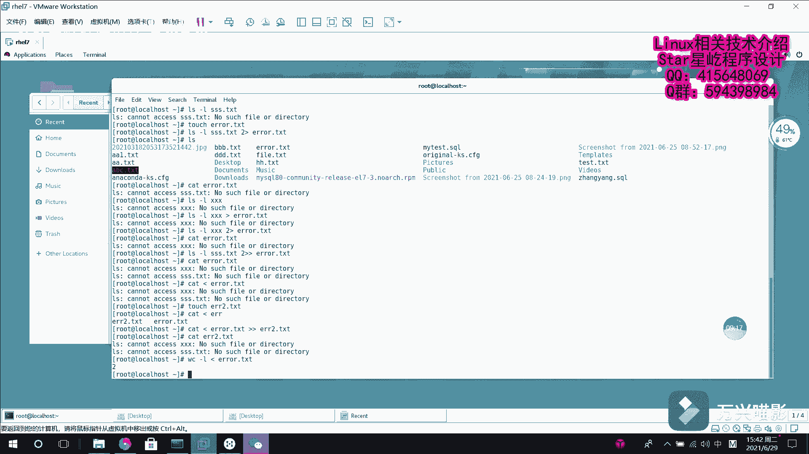

# Linux重定向技术：022：重定向技术基础

在本节课中，我们将要学习Linux系统中的重定向技术。重定向是Shell中一项非常强大的功能，它允许我们改变命令输入和输出的默认来源与去向。理解重定向是掌握Linux命令行操作的关键一步。

## 概述

Linux重定向技术主要分为**输入重定向**和**输出重定向**。简单来说，输入重定向是将文件内容导入到命令中，作为命令的输入。输出重定向则是将原本要输出到屏幕上的数据信息，写入到指定的文件中。在日常学习和工作中，相较于输入重定向，我们更多地会使用到输出重定向。

## 重定向的三种标准流

在深入具体操作前，我们需要了解三个核心的输入输出流，它们都有对应的文件描述符。在Linux中，“一切皆文件”，输入输出操作也被视为文件操作，文件描述符用于唯一标识这些流。

以下是三个标准流：
*   **标准输入 (stdin)**：文件描述符为 `0`。默认从键盘获取输入，但也可以通过其他文件或命令输入。
*   **标准输出 (stdout)**：文件描述符为 `1`。默认将命令的正常输出结果显示在屏幕上。
*   **标准错误输出 (stderr)**：文件描述符为 `2`。默认将命令的错误信息显示在屏幕上。

## 输出重定向的四种模式

输出重定向可以根据输出内容（标准输出或错误输出）和写入方式（覆盖或追加）分为四种模式。

以下是四种输出重定向模式：
1.  **标准覆盖输出重定向**：使用一个右箭头 `>`。将命令的标准输出写入文件，**如果文件已存在，则会清空原有内容**。
    *   命令格式：`命令 > 文件`
2.  **标准追加输出重定向**：使用两个右箭头 `>>`。将命令的标准输出**追加**到文件的末尾，不会清空原有内容。
    *   命令格式：`命令 >> 文件`
3.  **错误覆盖输出重定向**：使用 `2>`。将命令的错误输出写入文件，**如果文件已存在，则会清空原有内容**。
    *   命令格式：`命令 2> 文件`
4.  **错误追加输出重定向**：使用 `2>>`。将命令的错误输出**追加**到文件的末尾。
    *   命令格式：`命令 2>> 文件`

## 输入重定向

上一节我们介绍了输出重定向，本节中我们来看看输入重定向。输入重定向使用一个左箭头 `<` 表示，其作用是将文件的内容作为命令的输入。

命令格式为：`命令 < 文件`

## 实践案例

现在，我们通过一些实际的命令操作来感受Linux重定向技术。

### 1. 标准覆盖与追加输出

首先，我们演示标准覆盖输出。执行 `echo “First line” > file.txt` 会将字符串写入文件。查看文件内容，确认已写入。

如果再次执行 `echo “Second line” > file.txt` 并查看文件，你会发现第一次写入的 “First line” 被覆盖了，文件里只有 “Second line”。这是因为 `>` 会清空原文件。

如果希望记录不同时间执行命令的结果而不覆盖，就需要使用追加输出。例如，先执行 `echo “First record” >> log.txt`，再执行 `echo “Second record” >> log.txt`。查看 `log.txt` 文件，你会发现两条记录都按顺序保存了下来。

### 2. 错误输出重定向

接下来，我们看看如何处理错误信息。执行 `ls -l nonexistent_file` 会产生一条“文件不存在”的错误信息，默认显示在屏幕上。

我们可以创建一个文件来收集这些错误信息。执行 `ls -l nonexistent_file 2> errors.txt`，错误信息就会被写入 `errors.txt` 文件。查看该文件可以确认。

同样，错误输出也支持追加模式。执行 `ls -l another_nonexistent_file 2>> errors.txt`，新的错误信息会被追加到 `errors.txt` 文件的末尾。

### 3. 输入重定向的应用

最后，我们来使用输入重定向。`cat` 命令通常用于查看文件内容，如 `cat file.txt`。

使用输入重定向可以达到同样的效果：`cat < file.txt`。这里，`< file.txt` 将文件内容作为输入提供给 `cat` 命令。

输入重定向还可以与其他命令结合。例如，统计一个文件的行数，通常用 `wc -l file.txt`。使用输入重定向的写法是：`wc -l < file.txt`，它会输出文件的行数。

## 总结

本节课中我们一起学习了Linux重定向技术的基础知识。我们了解了标准输入、输出和错误流及其文件描述符（0, 1, 2）。重点掌握了四种输出重定向模式：`>`、`>>`、`2>`、`2>>`，分别用于覆盖或追加标准输出和错误输出。最后，我们学习了输入重定向 `<` 的用法，它可以将文件内容作为命令的输入。通过实际案例，我们看到了如何利用这些技术来管理命令的输入和输出，这对于脚本编写和日常系统管理至关重要。