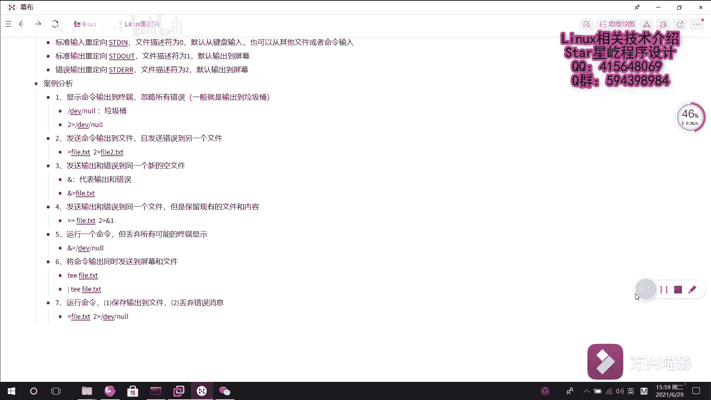

# Linux重定向技术：023：案例分析篇 🧪

在本节课中，我们将通过分析几个具体的案例，来回顾和巩固上一节学习的Linux重定向技术。我们将学习如何将命令的输出和错误信息重定向到不同的位置，包括文件、屏幕以及特殊的“垃圾桶”设备。

---

## 案例一：显示输出并忽略所有错误

上一节我们介绍了标准输出和标准错误的基本概念。本节中我们来看看如何只显示命令的正常输出，而忽略所有错误信息。

要实现“忽略所有错误”，需要将标准错误重定向到一个特殊的设备文件 `/dev/null`。在Linux中，这个文件就像一个垃圾桶，任何写入它的数据都会被系统丢弃。

以下是实现此需求的重定向语法：
```bash
command 2> /dev/null
```
在这个命令中，`2>` 表示将标准错误（文件描述符2）重定向，而 `/dev/null` 就是丢弃这些错误信息的目的地。

---

## 案例二：输出与错误发送到不同文件

有时我们需要将命令的正常输出和错误输出分别保存到两个不同的文件中。这需要使用两个独立的重定向操作。

以下是实现此需求的重定向写法：
```bash
command > output.txt 2> error.txt
```
这个命令将标准输出覆盖写入到 `output.txt` 文件，同时将标准错误覆盖写入到 `error.txt` 文件。

---

## 案例三：输出与错误发送到同一个新文件

如果我们需要将标准输出和标准错误都重定向到同一个全新的文件，并且该文件原先不存在或内容可以被覆盖，可以使用特殊的 `&>` 语法。

以下是实现此需求的重定向写法：
```bash
command &> file.txt
```
这个操作符 `&>` 会将标准输出和标准错误合并，然后覆盖写入到指定的 `file.txt` 文件中。

---

## 案例四：输出与错误追加到同一现有文件

上一个案例是覆盖写入新文件。但有时我们需要将输出和错误追加到一个已经存在且包含内容的文件中，同时保留文件的原有内容。这需要结合使用追加重定向和文件描述符复制。

实现此需求分为两步：
1.  首先将标准输出追加到目标文件。
2.  然后将标准错误重定向到标准输出（此时标准输出已经指向了目标文件）。

以下是实现此需求的重定向写法：
```bash
command >> file.txt 2>&1
```
在这个命令中：
*   `>> file.txt` 将标准输出追加到 `file.txt`。
*   `2>&1` 将文件描述符2（标准错误）重定向到文件描述符1（标准输出）的当前位置，即 `file.txt`。

---

## 案例五：丢弃所有终端显示

有些命令运行时，我们既不关心它的正常输出，也不关心它的错误信息，希望完全静默执行。这需要将标准输出和标准错误都丢弃。

以下是实现此需求的重定向写法：
```bash
command &> /dev/null
```
这个命令将命令的所有输出（包括正确和错误的）都重定向到 `/dev/null` 垃圾桶，因此在终端上不会显示任何信息。

---

## 案例六：输出同时显示在屏幕并保存到文件

我们之前学习的重定向都会使输出从终端“消失”。如果希望既在屏幕上看到输出，又能将其保存到文件，就需要用到 `tee` 命令。`tee` 命令像一个三通管，能将数据同时送到屏幕（标准输出）和文件。

以下是 `tee` 命令的使用方法：
```bash
command | tee file.txt
```
在这个命令中：
*   管道符 `|` 将前一个命令的标准输出传递给 `tee` 命令。
*   `tee file.txt` 将接收到的数据一方面写入 `file.txt` 文件，另一方面继续输出到屏幕。

---

## 案例七：保存输出到文件并丢弃错误

这是一个综合需求，包含两个部分：保存正常输出和丢弃错误信息。这实际上是案例一和基础输出重定向的结合。

以下是实现此需求的重定向写法：
```bash
command > output.txt 2> /dev/null
```
这个命令将标准输出覆盖保存到 `output.txt` 文件，同时将标准错误重定向到 `/dev/null` 进行丢弃。



---


本节课中我们一起学习了七个经典的重定向案例。通过这些分析，我们巩固了如何单独或组合控制标准输出与标准错误，掌握了输出到文件、追加、丢弃以及使用 `tee` 命令进行双向输出等核心技巧。熟练掌握这些案例，将能灵活应对各种命令行输出处理的需求。