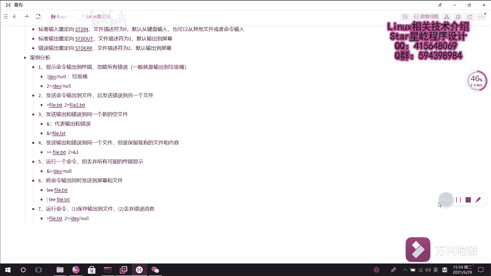

# 【Linux】023-重定向技术2（案例分析篇） - P1：023-重定向技术2(案例分析篇) - Yo_Holly - BV1Do4y1Q7yV

接下来啊我们分析几个关于重镜像的案例，然后让再回顾一下上一个视频学习的一些内容。首先啊第一个案例的话，它是说显示命令输出到终端，然后还要忽略所有的错误。首先啊显示命令输出到终端的话。

代表就是说我标准输出的话，我是让它输出到终端的。但就是说我这个错误，我我不允许它存在。那，这个时候我需要介绍一个是DEV下的。那。这个是一个设备文件，然后闹的话，其实在这一块的话。

它在另子上就代表垃圾桶。也就是说呃我把这个标准错误的话，放进它里面的东西默认就给丢掉了，它就不会保存丢掉了。垃圾桶嘛。然后也就是说这个写法的话，也就是是这样写的。呃，不追加到这个。呃。

覆盖到这个那里面垃圾桶里面。也就是说我写的话，重镜像语法就是这么写的。这块的话需要关注的是这个忽略所有错误。呃，忽略的话怎么做？忽略的话一般就是输出到垃圾桶。输出到垃圾桶里面。然后第二个案例的话。

它是说发送命令到输发送命令输出到文件，且发送错误到另一个文件。这个重进上技术的话，也就是它其实就这么的。我首向命令一个文件，我首先比如说我创建一个文件叫f尔。啊，TST我把这个输出这不是代表输出吗？

覆盖输出，然后把它放到这个fTST发送错误到另一个文件。错误的话是怎么放的？是2，然后加一个输出。然后比如说把它放到菲I点PSST，这样的话就实现了这个二的这个需求了。从定向写的话就这么写。

然后第三个的话是它的提议是。发送输出和错误到同一个新的空文件。这个的话这一块需要介绍的一个是输出和错误，要同时进行的话，他怎么做？这一块有一个与。他的话就是。如果要是用它的话，就代表。表输出和错误。

然后我现在需要把它呃输出到同一个文件里面，它就需要这样做。还一个覆盖覆盖输出。然后fi点TST这样的话，这样写就代表把输出和错误放到同一个文件里面啊。呃，第四个的话提议是这样的。

他是说发送输出和错误到同一个文件，它是保留现有的文件和内容。这是怎么意思？就是说我把输出和错误都保留到同一个文件了。但是啊这个保留的这保存到的这个文件当中，它原有的内容。不能。不能是被删除，不能被覆盖。

首先需要先做的一件事情就是说啊。它追加嘛追加比如说这个文件叫fi点TST，我先追加到这个文件里面。然后其次我满足他前面的说是把输出和错误呃输发送到同一个文件里面。这一块的话有一个这个。这样。嗯。

一个箭头。然后是雨衣。呃，这个呃与和一它结合到一块的话，就代表标准输出。标准输出的话，也就是说刚才刚刚才的话，我把这个标准输出放到这个文件里面了。然后现在二的话，我是把这个错误，然后再给它放进去。对。

就是说之前我处理的这个标准输出的话，已经把标准输出处理了。然后现在的话就剩一个错误，它没有处理了。然后把错误的话也放到这个标准输出文件里面，这就可以满足呃案例四的一个需求了。紧接着是这个安利5。

他的提议是啊运行一个命令，丢弃所有可能的终端显示，所有可能的终端显示，也就是说是正确的和不正确的都得丢弃。这该怎么做？首先就用到刚才说的这个语有标准输出和错误输出。然后它。放到这个DEV下面的n里面。

刚才说了，忽略的话，也就是说把它要丢进垃圾桶嘛，是吧？这不就是刚才上面介绍的知识点的一个运用吗？然后第六个的话，它说的是将命令输出同时发送到屏幕和文件。这块的话是需要用到一个命令是这个EE命令。

它的话就是说是首先啊把这个命令输出到你指定的文件当中，同时也把它发就是说输出到屏幕，也就做一个双向的一个重定项。这块的话，这个命令用的话是首先我需要后面跟一个文件。对你跟着一个文件。

然后在这块用的话是怎样？我需要用到这个管道。管道的话，不是说我把之前呃之前命令是执行的一个输出，然后通过这个管道符输出后面供后面文件去用嘛。然后我现在的话再用这个命令啊fi点TST。

也就是说我把之前的这个输出，然后给到t，然后让它输出到屏幕的同时再放到这个f点TST文件里面，咱们现在啊演示一下这个演示一下这个tri。的重进下。首先啊我先把这个屏幕给清掉。然后我们看啊。

我们里面现在有1个AA点TST，它里面写的是。countAA点TST它里面写的内容是这样的。然后我现在的话，我是需要执行这个命令，然后。我把它重进向。到这个菲尔点TST。我回车。看它现在已经输出了。

已经输出到这个屏幕了。其次我们再看一下这个文件里面，它现在有内容吗？文件里面的话也有这个内容，这个的话就是trare的它的一个作用，它就是一个双向的一个重进项。呃，紧接着分析最后一个案例。

就是第七个案例，它的话是行命令，然后保存输出到文件，丢弃错误消息。这个的话首先它其实就相当于是两个问题，两个需求。首先第一个需求的话是保存输出到文件。然后第二个需求的话是丢弃错误消息。

然后首先咱们满足第一个，一个的话，它是说保存输出到文件，这不就是一个呃覆盖追加重定项吗。然后我把它比如说呃放保存到这个文件里面，然后悉错误消息，然后我把错误消息2可加到这个DV下面的那。

这样的话就把他回消息就给丢弃了，就嗯之后就显示不了了。呃，这个的话就是说结合上个视频介绍的一个重定像技术，然后找几个案例去分析一下这个技术的综合使用。

