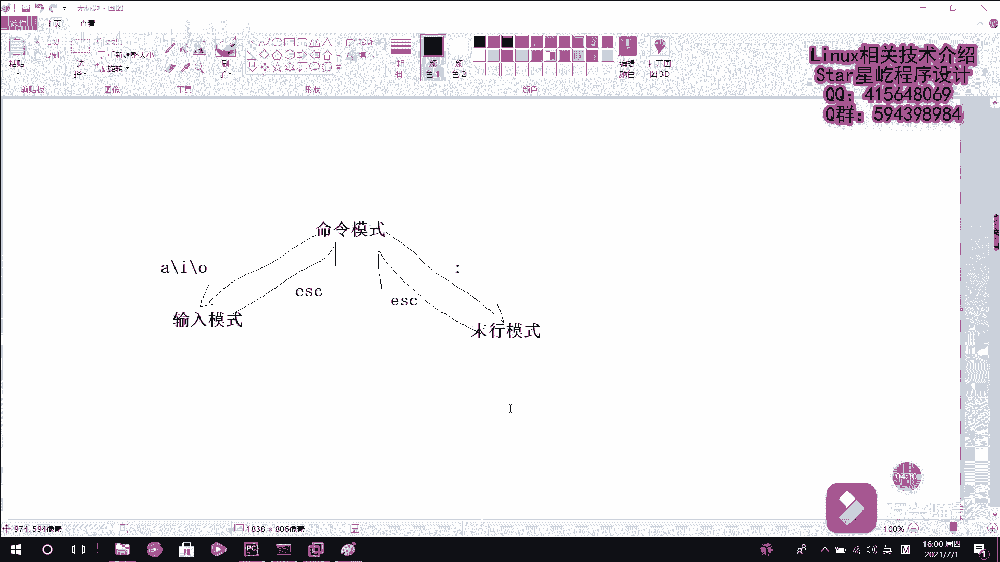

# 【Linux】024-vim编辑器介绍 - P1：024-vim编辑器介绍 - Yo_Holly - BV1Hg411u7BS

在本视频中，我将给大家介绍LINUX系统当中的文本编辑器嗯，几乎所有的LINUX系统当中，都会内建一个文本编辑器，叫vi文本编辑器，它的话已经做的相当棒了，但是仍存在很多优可以优化的地方。

后来啊推出这个增强版本的vi编辑器，叫vim文本编辑器，他的话比较实用的一个改进，就是说它可以字体的颜色去辨别语法的正确，就是说方便了程序设计，然后被很多程序员实用，很多程序员都很都很喜欢去实用。

这个vi文本编辑器，说起这个vim文本编辑器啊，不得不提的一点是在LINUX系统当中，一切都是一切皆文件嘛，而配置一个服务啊，或者是修改一些什么选项参数的话，其实都是修改嗯服务的一些配置文件。

修改文件参数，这个时候避免不了的，需要有一个文本编辑器去对文件进行编辑，然后这个这个时候VM就起到一个很好的一个，文本编辑功能，VM它也被很多这个厂商和用户认可，得到了很多厂商的认可。

他之所以能够得到大家的认可，原因在于这个vim编辑器中设置了三种模式，能够在三种模式当中方便的切换，然后简化简化工作，然后接下来我介绍这三种模式，三种模式的话分别是命令模式，然后命令模式。

输入模式以及末行模式，但是这三个模式分别都做哪些工作，首先啊这个命令模式的话，它是控制光标移动，可以可以对文本进行复制粘贴，删除和查找等工作，然后这个输出模式的话，就是正常的文本文本的录入工作嘛。

然后末行模式的话就是保存和退出文档，以及设置编译环境呃，这几种模式之间的一个切换的话，是这么一个关系，命令模式和输出模式之间的话可以相互切换，然后命令模式和末行模式之间也可以相互切换。

然后从这个命令模式进入到输入模式的话，是通过可以通过这几个键，AIO几个这几个键让它进入输入模式，然后从这个输出模式退，退换到这个命令模式的话，是实用的，是ESC键呃，在这块你像这个末行模式。

末行模式推退出到这退入到这个命令模式的话，也是用ESC键，就是说是这个命令模式进入到末行模式的话，它是有一个重要的一个实用这个冒号，然后他就进去了，然后你进入你相应的一些操作。

就是他们呃他们之间的一个切换，了解了这个多个模式之间的一个呃切换，也就是说我操作这个文本编辑器的时候，我知道该它具体有哪几种模式，我具体具体进到哪种模式下的话，就可以满足我目前嗯哪些需求，了解这个之后。

肯定就需要对它进行一些操作，像以往我们在windows上使用的那个文本编辑器的话，你比如那个notepad，加加它上面给你提供了很多的那个功能，按功能按钮，然后你就说是能在JUI界面中很方便的。

通过点点点就进完成了很多的操作，但是在LINUX当中，这个文本编辑器的话，他就是一个纯字符的界面，它也没有也没有那些很多的那个快捷图标，所以的话这个时候很多那个快捷命令，就起到一个很重要的一个角色了。

然后所以就是说在这个嗯LINUX下，学习文本编辑器的一个去编辑文件，学习这个命。

