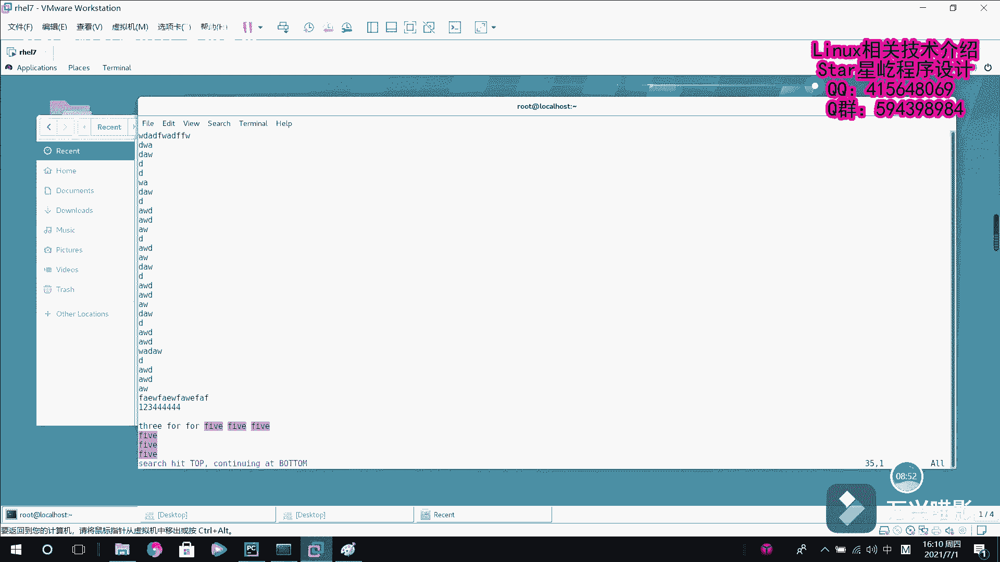

# Linux 基础：025：Vim 编辑器常用命令教程 🖋️

在本节课中，我们将学习 Vim 文本编辑器的常用命令。我们将从三种模式中的**命令模式**和**末行模式**入手，介绍如何执行删除、复制、粘贴、撤销、保存、搜索与替换等核心操作。课程内容力求简单直白，适合初学者理解。

---

## 命令模式常用操作

上一节我们了解了 Vim 的基本模式。本节中，我们来看看在**命令模式**下可以执行哪些操作。进入 Vim 后，默认就是命令模式。

以下是命令模式下的一些基础操作：

*   **删除/剪切一行**：按两次 `d` 键，即 `dd`。这个操作更准确地说是“剪切”，因为被删除的内容会被保留在缓冲区。
*   **粘贴内容**：将光标移动到目标位置，按 `p` 键，即可将缓冲区的内容粘贴出来。
*   **删除多行**：在 `dd` 前加上数字。例如，输入 `3dd` 会删除光标所在行及向下的三行。
*   **复制一行**：按两次 `y` 键，即 `yy`。
*   **复制多行**：在 `yy` 前加上数字。例如，输入 `5yy` 会复制光标所在行及向下的五行。
*   **撤销操作**：按 `u` 键。连续按 `u` 会按照操作顺序依次撤销之前的更改。

---

## 末行模式常用操作

介绍完命令模式，接下来我们进入**末行模式**。在命令模式下按 `Esc` 键确保返回命令模式，然后输入冒号 `:` 即可进入末行模式。

以下是末行模式下的一些实用命令：

*   **保存文件**：输入 `w` 然后回车。
*   **退出编辑器**：输入 `q` 然后回车。
*   **强制退出（不保存）**：如果文件已被修改，直接 `q` 无法退出。此时输入 `q!` 可以强制退出并丢弃所有更改。
*   **保存并退出**：输入 `wq` 然后回车。
*   **强制保存并退出**：在某些情况下（如文件只读），`wq` 会报错。此时输入 `wq!` 可以强制保存并退出。
*   **显示行号**：输入 `set number` 或简写 `set nu`。
*   **隐藏行号**：输入 `set nonumber` 或简写 `set nonu`。
*   **执行外部命令**：输入 `!` 后接命令。例如，输入 `!date` 会显示系统时间，按回车后返回编辑器。
*   **搜索字符串**：
    *   **向下搜索**：输入 `/` 后接要查找的字符串，例如 `/five`。
    *   **向上搜索**：输入 `?` 后接要查找的字符串，例如 `?five`。
*   **替换字符串**：
    *   **替换当前行第一个匹配项**：`:s/旧文本/新文本`。例如，`:s/one/three` 将当前行第一个 “one” 替换为 “three”。
    *   **替换当前行所有匹配项**：`:s/旧文本/新文本/g`。例如，`:s/one/three/g` 将当前行所有的 “one” 替换为 “three”。
    *   **替换全文所有匹配项**：`:%s/旧文本/新文本/g`。例如，`:%s/two/five/g` 将全文所有的 “two” 替换为 “five”。这里的 `%` 代表全文范围。

---

本节课中，我们一起学习了 Vim 编辑器在命令模式和末行模式下的核心操作，包括文本的编辑（删除、复制、粘贴、撤销）、文件的保存与退出，以及强大的搜索与替换功能。掌握这些命令是高效使用 Vim 进行文本处理的基础。