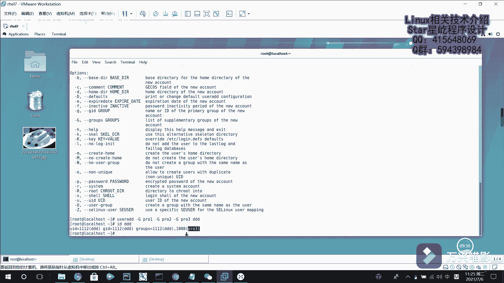

# 【Linux】026-Linux用户管理1（用户身份介绍、useradd、groupadd、passwd） - P1：026-Linux用户管理1（用户身份介绍、useradd、groupadd、passwd） - Yo_Holly - BV1Zb4y1r7aG

呃，相信大家都知道啊，lininux系统是一个多用户多任务的操作系统，具有很好的稳定性与安全性。如果要是在幕后想要保证lininux系统的安全，则是一项很复杂的工作。

然后这个时候啊系统中的话又分为很多的用户，然后怎样去管理这些用户呢，紧接着我们就介绍这个lininux系统当中，用户的一个管理。然后在用户管理这一块的话，用户啊分为这么几这么几种。用户的身份的话。

首先是就是说大家就是说很多很多教材上都提到说是linux系统当中，管理员是root用户。其实这个的话是不是那么严谨的。确切的说的话，linux系统当中的管理员的话是UID为零的用户。

只不过是恰好很多系统当中的话，把root用户的UID设置成了0。所以root用户他是系统管理员。然后啊紧接着第二个身份的话就是系统用户。这个的话，系统用户的话，它是从UID1到999。呃。

系统用户是这个的话是怎么理解呢？这个的话是linux系统啊，为了避免因某个服务程序出现漏洞而被黑客提提全是整个服务服务器，然后默认的话就是为每个服务程序，然后提供一个独立的系统用户来负责运行它。

然后进行有效的控制，被破坏范围。然后紧接着就是到达了就是说具体操作的一些普通用户了。这个普通用户普通用户的话，默认是从UID为1000开始。如果即使就是说1000之前啊。

他有对应的空余的UID他也是不可以用的。因为这个的话是系统保留的，供系统用户来用的。然后这个普通用户的话，它是由管理。来创建用来完成具体的一些工作。比如我们日常生活中啊，就是有有很多的工作。

然后为了就是说是大家。现在的话就是肯定不是单打独斗的时代了。大家做什么东西的话，都需要合作嘛。然后这个时候啊为了就是说是方便组之间的管理。然后在这个lining系统当中的话，他就提供了一个叫GID。

也就是用户组这个概念。然后他的话就是方便管理属于同一组的用户。然后把多个用户啊加入到同一个组中，从而方便为组中的长员统一规划权限或者是指定任务。这个的话就设计的就会在一些比如什么部门去用。

比如说的话我通过对技术部门设置权限，使得只有技术部门的员工可以访问公司的数据库信息。这的话就是做一个权限的一个设置。紧接着我们介绍一些就是说在用户管理当中常用的一些命令。

然后我们首先就是说是进入到这个re7系统。然后第一个命令的话是ID命令。ID命令的话就是用于显示用户的一些详细信息。它的格式的话就是ID。然后你后面输入一个用户名。比如说root用户。

他就会告诉你哎root用户的话，UID是0GID也是零这块的话就是呃你如果要是创建就是说你呃只创建一个用户没有指定其他选项的话，这个时候创建的这个用户的话，默认会创建一个和用户同名的用户组。

也就是说这个用户归这个组所有。呃，这个的话是就是说查看用户信息。紧接着就是我在root用户下面我需要创建一些呃，就是用户的时候，我该怎么做。比如说我现在创建一个用户叫AAA创建好之后。

我IDAA然后此时我就会发现呃这个ID的之前的话就是我因为我在上面我不是创建了1个11用户。他占的是1001，然后我没有给他指定这个UID他默认的话就是顺次往后就是呃1002。

然后他的UID是这个名字是AAA。然后对应的话，就刚才我说的他会创建一个同名组。然后他就现在有了一个组，如果就是说是我简单这样做的话，就是说这个用户的话，我没有给他指定任何的一些信息。

比如说我现在啊假如说我想给这个用户设置密码，我就需要使用这个passWD这个命令去给AAA设置密码。比如说我输入哎输入新密码。比如我输入一下，然后它提示。呃，呃，密码太短。

然后你再次进入这它就更新成功了，就是说是一个一个密码。这个密码的话，一般就是说你尽量设置复杂一点，就是8位以上吧。对，刚才我设置可能就是说为了演示这个的话是比较短一点，它会提示一些信息其他信息。

然后这个UerADD去创建用户的同时，他可以指定哪些信息，首先就是这个杠一选项。如果这个用户是公司新来的一个实习生。可能他实习期的话，只有3个月或者是一个月，然后我会从现在开始啊，给他设置一个期限。

比如现在是7月6号，然后我之后给他设置成20212021年的呃。8月6号。8月6号让他到期，8月6号也就是0806，然后让他到期，比如说叫BBB。这个时候我就创建了一个用户。

他的到期时间就是2021年的呃，8月6号。然后他占的这个UID是1001003。紧接着就是说这个的话就是说我是系统自动生成的。比如说啊我之后有一些特殊部门，可能我需要使用特殊的代号。

比如说我现在比如说我现在有一个核心研发部门，然后他的那个UID的话，可能使用888是吧？这个时候我使用这个杠U小写U，然后指定888，比如说是他这个用户的话是比如说叫test。呃，比如假如说叫嘛。

那就是研发部门，然后这个用户的话是这ID呃，PRO看一下他他的话现在创建了一个这个组，然后就是PRO。然后这个用户的话是888指定了这个特用户的这个呃UID。紧接着就是说用户的话，刚开始的话。

这个基本组的话，它已经有了，就是说我会默认生成。如果我现在想让它统一放到一个组里面的话，就是说就是这个基本组的话，是group aDD比如说我现在建一个叫PRO呃PROADV这个这个组我创建好之后。

然后我现在啊就是比如说我创建一个用户。然后我指定这个比如说指定这个用户的。呃，UID是111，然后它对应的这个基本组是PROAADV。然后这个用户的名字的话。

比如说叫CCCC然后现在IDCCCC这个CCCC的话就是我们刚才定制的这个呃名字了。就是说它的这个基本组的话就是PROADV这块的话，就是说谈到一个这个基本组。然后说到这个基本组啊。

就介绍一下基本组和扩展组，在这个呃这个下面的话就是说在另下面的话，它有两种组，一一种是基础组础组，一种是扩展他俩有什么区别？就是说啊这个基本组的话，它就相当于是你的原生家庭一样。你出生的时候。

你家庭呃是怎样的，就是怎样的那你出生的时候，假如说你是一个姓张，然后你在真相张张相家族出生了是吧？就是你的基本组，大家周围的所有的人的话都姓张。呃，但是啊这个扩展组的话，就是说你之后啊通过学习啊。

你有了一定的能力，到达了公司以后，人家给你分到了不同的部门。然后不同的部门的话，成立一个小组。然后你在这个组里面，每一个人的话可以在多个组里面担任不同的角色。这个时候就是说也就是说一对于一个用户的话。

他只能在一个基本组里面。但是他可以在多个扩展组里面。就比如说现在的话，这个CCCC在PROADV上面，比如说我现在在在创建。呃，葛如回DD我在创建创建PROVE。PROV2PROV3。

然后我现在的话有一个user userer ADD。然后比如说我现在再创建一个用户，然后就默认让它生成1个那个UID就可以了。然后比如说他的名字，首先我先指定他的这个。刚大进。

也就是说他他在哪几个这个扩展组里面，比如说PRO1PRO2。B2O3对一个。PO2。杠等GPRO3。AD然后是DDD这个时候就创建了。然后我们IDADDD查看它的信息。

这个时候你会发现他有他的是他的话就是说是呃有一个组，就是说是基本组是这个DDD，然后有一个扩展组是PROV3。

