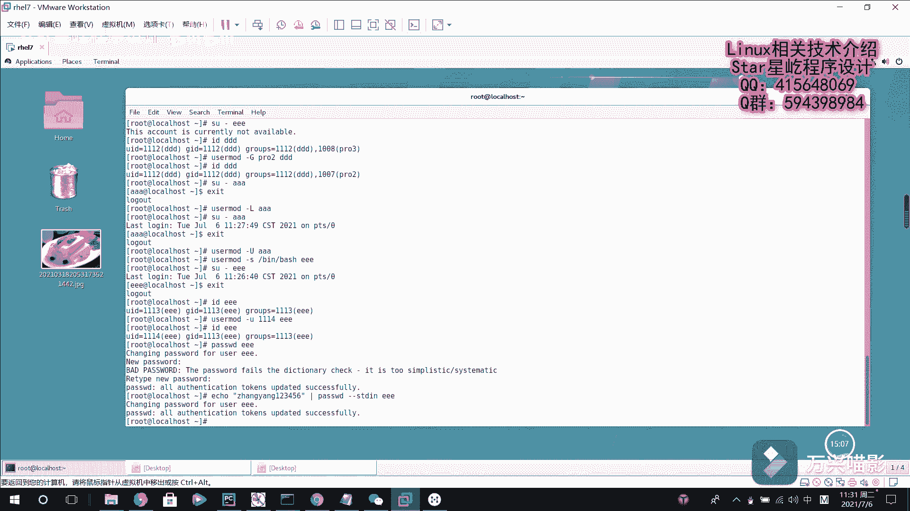

# 【Linux】027-Linux用户管理2（echo、SHELL、usermod） - P1：027-Linux用户管理2（echo、SHELL、usermod） - Yo_Holly - BV1F44y1B7Qi

然后其实啊紧接着就是介绍一个命令的话，就是现在啊就是说我现在假如说我ECO一下刀了，默认的shell的话是使用的，这个是BBS这个sh，如果说是嗯系统默认就使用这个share。

但如果我要是创建用户的时候，我需要人工给他指定一个share的话，比如说我指指定这个事啊，下面的LOLO，这个的话他和那个bin下面的大师他是不同的，就是说是那个的话是指定了一个默认的shell。

虽然就是说这个NO longer NO log，它也是一个默认视野中的一个成员，但是他和这个BS解释器有着天壤之别，就是说如果我一旦给用户指定了这个，spinal loving的话。

他就就是说是我就把这个用户给锁定了，也就是说这个用户他就登录不了系统了，就是说叫E1EEEE，然后现在来111111，这个用户是没问题的，比如说我输出输出杠，然后EEE。

这个时候也就是说这个账户是不可用的，它就会提示你说这个账户不可用，对这一块的话，这个就是说是我已经给用户啊，就是关于创建用户的一些信息，我已经进行了创建用户了，如果我之后需要修改一些用户信息的话。

该怎么做，也就是说有一个uu the mood这个命令，这个命令的话，我可以改更改用户的这个变更用户的扩展组，比如说刚才有一个这个IDDDD，它的扩展组的话是PRO3pro三。

然后现在我ua ua mood嗯，杠大G，然后我现在的话就是，比如说把它指定成PRO2，然后是DDD，然后现在IDDDD，他的话，现在的话他这个扩展组就变成这个输出爱了，如果就是说是我这个用户的话。

呃现在啊就是很多用户都是可以登录系统的，你比如说现在我速度呃到了这个AA用户，我我马上就切到他这个对应的，这个执行环境下面了，现在啊比如说我现在想锁定这个AA用户怎么做，User user mod。

指定杠杠l lock，然后我锁定AA，他就会把AA用户给锁定了，然后我现在再去登录AA的时候，然后就会这个时候这个用户就是锁定的，会禁会禁止它登录登录系统，这个的话是在这个所就是说这个root用户的话。

它可以切换切换过去，如果你要是拿这个，就是说普通的这个AA去去登录本系统的话，他应该是登录就可以就登录不进去了，然后我现在退出它这个环境，然后我现在需要对它进行解锁，允许它登录到系统，也就是杠大U。

然后指定AA，这个时候就把他的这个刚才那个锁定给解除了，嗯刚才啊说是说在这个你刚才做了这么一件事，就是说这个E的话，就是说我把他这个锁定了，也就是说我就进入，就是说这个用户是无效的。

现在的话我现在我如果想给他改变一下，他这个执行线，比如说这块的话也是杠S，然后比如说把它指定上B下面的bus，然后是名字叫111，然后修改了刚才的话一是登录不过去的，说是用户不需要，现在我在登录呃。

现在就可以登录了，也就是说这个用户现在就是一个有效的用户了，然后比如说现在我id e e e e e的话，现在他的这个UID是113，比如说我现在想更改它的UID也是U的mod，然后指定这个杠U小写U。

比如说我指定成为1114，然后是EE用户，然后我现在在查IDEEE用户，然后现在的话他这个UID就变成了114了，就是刚才啊就是说我设置这些用户的时候，都没有给他们指定密码，然后现在我要介绍一个。

就是说是刚才已经用过了一个，就是pass w d，他的话是现在啊，他是就是说一个修改密码，比如说我现在要给一一修改下密码，然后说我现在是给他输给AIM码，修改了密码，然后你这个的话他这个密码就更新。

更新更新成功了呃，它提示的话，其实就是说也就是说这个密码太简单了，对嗯这一块的话，如果要是说我想把一个输入，就是说我通过一个输入流，然后去更新这个密码的话，它其实就是这样的，也就是说EQ命令。

然后比如说我现在把它设置一个很复杂的密码，照样123456，然后我现在通过这个管道符给他传过来，也就是说我现在拿到这个张扬，123456这个字符串了，然后我使用pass w pass wwt。

也就是一个刚刚STDSTDLN，然后让它对应的给哪个用户修改密码，比如说我现在给他11亿用户哎，这个时候的话它就会提示你1亿用户的话，这个密码更新成功，这个的话是嗯允许。

就是说通过这个标准输入去修改密码。

pass wd的话。

