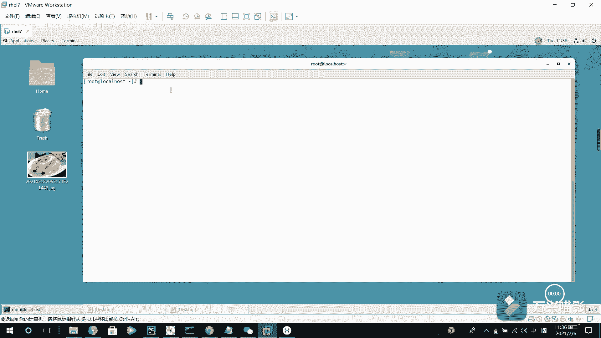

# Linux用户管理：3：用户组管理与删除 🧑‍💻

## 概述
在本节课中，我们将学习Linux用户管理的进阶操作，主要包括如何为用户添加或修改扩展组，以及如何安全地删除用户及其相关文件。我们将使用 `usermod` 和 `userdel` 命令来完成这些任务。



---

## 为用户添加扩展组

在上一个视频中，我们介绍了用户管理的一些基本命令。我们提到，一个用户可以属于多个扩展组。如果需要将一个用户分配到不同的扩展组中，该如何操作呢？

首先，我们查看之前创建的用户 `BBB` 的信息。目前，它只属于一个基本组 `BBB`。

```bash
id BBB
```

现在，我们使用 `usermod` 命令的 `-G` 选项为用户 `BBB` 指定一个扩展组，例如 `PROE`。

```bash
usermod -G PROE BBB
```

再次查看 `BBB` 的基本信息，会发现它多了一个组ID `1006`，对应的扩展组就是 `PROE`。

```bash
id BBB
```

此时，用户只有一个扩展组。如果想让它拥有多个扩展组，该怎么做呢？我们可以使用 `usermod` 命令的 `-a`（append，追加）选项来添加扩展组，例如添加 `PRO2`。

```bash
usermod -aG PRO2 BBB
id BBB
```

现在，用户 `BBB` 就有了两个扩展组。你可以继续使用此命令为用户添加更多扩展组，例如添加 `PRO3`。

```bash
usermod -aG PRO3 BBB
id BBB
```

通过以上命令，我们可以持续为用户添加扩展组。

---

## 删除用户及其文件

接下来，我们看看如何删除用户。如果确定某个用户后续不再登录系统，我们可以使用 `userdel` 命令删除该用户的所有信息。

在执行删除操作时，默认情况下，该用户的**家目录会被保留**。因此，我们需要进行特殊处理来彻底删除。

首先，我们尝试删除用户 `BBB`。

```bash
userdel BBB
```

现在检查用户 `BBB`，系统会提示该用户不存在。

```bash
id BBB
```

然而，如果我们查看 `/home` 目录，会发现 `BBB` 的家目录仍然存在。

```bash
ls /home
cd /home/BBB
ls
```

既然用户已被删除，其家目录通常也不再需要。我们可以手动删除它。

```bash
rm -rf /home/BBB
```

在默认操作下，`userdel` 命令不会连带删除用户的家目录，需要我们手动定位并删除。

---

## 同时删除用户及其家目录

如果希望在删除用户的同时，一并删除其家目录，可以使用 `userdel` 命令的 `-r`（recursive，递归）选项。

例如，我们有一个用户 `CCCC`，其UID是 `1111`。我们现在要删除它。

```bash
userdel -r CCCC
```

现在，我们再次查看 `/home` 目录，会发现 `CCCC` 对应的家目录已经不存在了。

```bash
ls /home
```

---


## 总结
本节课中，我们一起学习了Linux用户管理的两个重要操作：
1.  **管理用户扩展组**：使用 `usermod -aG <组名> <用户名>` 命令为用户添加扩展组。
2.  **删除用户**：
    *   使用 `userdel <用户名>` 命令仅删除用户账户。
    *   使用 `userdel -r <用户名>` 命令可以同时删除用户账户及其家目录。

掌握这些命令，能够帮助你更有效地管理系统中的用户账户和权限。