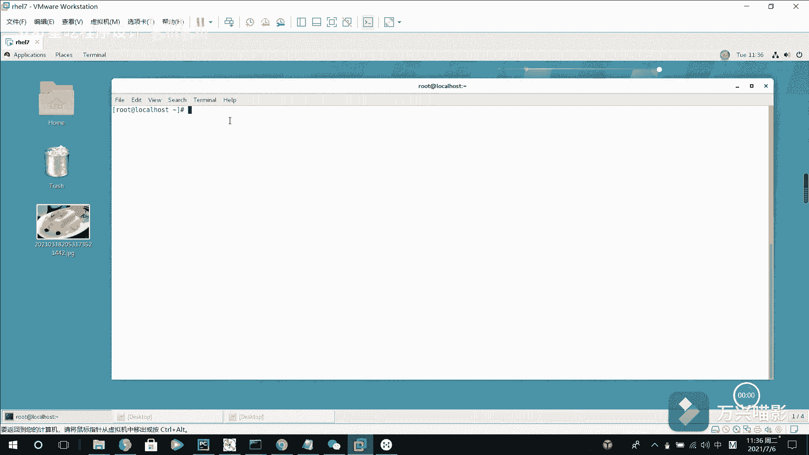
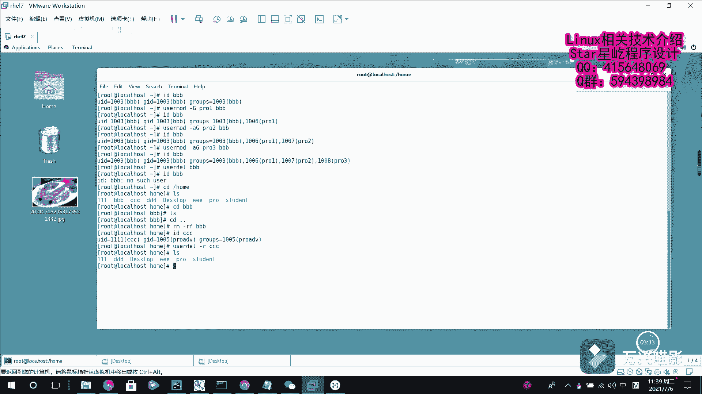

# 【Linux】028-Linux用户管理3（id、userdel） - P1：028-Linux用户管理3（id、userdel） - Yo_Holly - BV1Cb4y1r7us

呃，在上一个视频当中啊，我们介绍了一些关于用户呃基本管理的一些命令。然后就刚才在上视频中提到，就是说一个用户的话，他可以有多个这个扩展组。如果我需要把一个用户分开到不同的组里面扩展组里面的话。

该怎样去做。首先啊我现在先看刚才创建的这个用户BBB他的话现在是光有一个组是这个呃BBB这个组，它属于这个基本组。我现在使用这个user mode，然后杠G的话，给他指定一个，比如说是PROE。

然后BBB。给他指定给他指定一个这个扩展组。然后我现在再去查看BBB的基本信息的时候，我就会发现他现在这块多了一个这个1006。然后这个的话PRO1这个的话后面就是它是这个对应的扩展组。

现在只有一个扩展组。如果我想有让他有多个扩展组的话，该怎么做，也就是说也就是乐使用的 mode杠AA的话是ADD加一个扩展组。比如说加一个PRO2到BBB。IDBBB它的话现在就有两个扩展组了。

你还可以依次再加。如果说是PRO3。ID哔BB这样的话就是说我使用这个命令就可以一直给这个用户去添加这个扩展组。如果就是说现在有这么一个情况，如果我确定某个用户啊，后续我就不再会登录到系统了。

所以我就可以通过一个命令叫user userer DEL userer delay。然后去删除该用户的所有信息。在执行删除操作时，该用户的加目录默认会保留下来。此时啊我们就需要一些特殊的处理。

然后将其删除。对，紧接着啊，我首先比如说我现在。我现在有刚才这个用户BBB，我现在想删除它，也就是说我使用这个U的DEL。BBB。我就直接把这个用户就删除了。然后你现在检查BBB，它就会提示你啊。

没有这个用户。此时，然后我们再去查看一下home目录。这个的话是root去创建一些用基普通用户的时候，他默认的加目录，然后LS查看对于这个BBB它的这个。呃，就是用户文件的话，它还在下面。

你比如说我CD到BBB它是存在的LOS只是说没有内没有内容，现在该怎么做？然后如果我删除了用户，他的加目录肯定就不需要了。我啊ra杠RF然后我把这个BBB给删除了。这个是如果我在默认操作下的话。

它不会连同的去删除他的这个用户的加目录，然后我就需要手动的去找到他的加目录，对呀，对它进行删除。如果我想在删除用户的同时，就一并把这个用户的加目录给删除了。也就是说比如说我现在有这个CCCC用户。

它是1001111的UID我们现在把它删除了。然后这个的话就是我使用一个杠R选项。杠R的话递归它就是同时删除用户及用户的加目录。然后比如说我要删除的是CCCC。现在删除了。

然后我L查看一下CCCC对应的这个加目录的话就没有了。以上的话就是所有关于这个文件，就是这个用户管理操作这个基础的内容。

