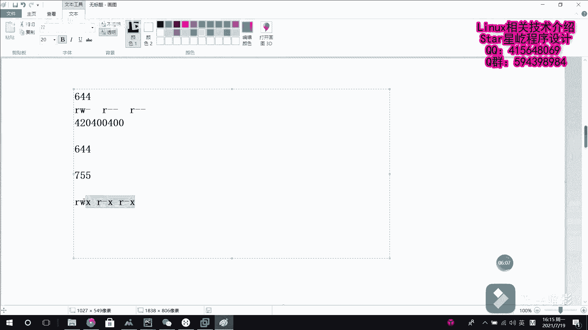

# Linux文件权限管理：1：文件权限基础概念与解读

在本节课中，我们将要学习Linux系统中文件权限管理的基础知识。理解文件权限是安全使用Linux系统的关键第一步。我们将从文件的所有者、所有组和权限的基本概念开始，并详细解读`ls -l`命令的输出信息。

## 文件归属与权限基础

在Linux系统中，每个文件都有其归属的所有者和所有组。系统规定，文件的所有者、所有组以及其他用户（即“其他人”）对文件都拥有读、写、执行等不同的权限。

需要明确的是，所有者、所有组和其他人这三者之间的权限是相互独立、互不影响的。

## 解读 `ls -l` 命令输出

我们可以使用 `ls -l` 命令来查看文件的详细信息。以下是解读其输出的关键步骤。

执行命令 `ls -l a.txt` 后，通常会看到类似如下的输出：
```
-rw-r--r-- 1 root root 174 Dec 10 14:30 a.txt
```
这一长串信息初看可能难以理解，下面我们将其分解开来逐一解释。

### 1. 文件类型与权限字符串

输出信息的第一个字符代表**文件类型**。常见的类型符号有：
*   **`-`**：普通文件
*   **`d`**：目录文件
*   **`l`**：链接文件
*   **`b`** 或 **`c`**：块设备或字符设备文件

紧接着的九个字符（如 `rw-r--r--`）代表**文件权限**。这九个字符以每三个为一组，共三组，分别对应：
*   **前三位**：文件**所有者**的权限。
*   **中间三位**：文件**所有组**的权限。
*   **后三位**：**其他用户**的权限。

在每一组权限中，三个字符的位置是固定的，分别代表：
*   **`r`**：读权限
*   **`w`**：写权限
*   **`x`**：执行权限
如果某位置没有相应权限，则用 **`-`** 符号占位。

### 2. 所有者、所有组与文件信息

权限字符串之后的信息依次是：
*   **第一个 `root`**：文件的所有者。
*   **第二个 `root`**：文件的所有组。
*   **`174`**：文件的大小（以字节为单位）。
*   **`Dec 10 14:30`**：文件最近一次被修改的时间。
*   **`a.txt`**：文件的名称。

## 权限的数字表示法

为了更方便地表示和设置权限，Linux系统使用数字来代表权限组合。每个权限对应一个固定的数字：
*   **读 `r`** = **4**
*   **写 `w`** = **2**
*   **执行 `x`** = **1**
*   **无权限 `-`** = **0**

权限数字的计算方法是将一组权限中所有有权限的值相加。例如：
*   `rw-` = 4 (读) + 2 (写) + 0 (无执行) = **6**
*   `r-x` = 4 (读) + 0 (无写) + 1 (执行) = **5**
*   `r--` = 4 (读) + 0 (无写) + 0 (无执行) = **4**

最终，一个文件的完整权限用三个数字表示，分别对应所有者、所有组和其他人的权限。这种表示法称为**八进制表示法**。

## 权限表示法转换示例

让我们通过一个例子来巩固数字表示法与字符表示法的转换。

假设一个文件的权限数字是 **755**。我们来计算它对应的字符表示：
1.  第一个数字 **7** 对应所有者权限：7 = 4+2+1，即 `rwx`。
2.  第二个数字 **5** 对应所有组权限：5 = 4+0+1，即 `r-x`。
3.  第三个数字 **5** 对应其他用户权限：5 = 4+0+1，即 `r-x`。

因此，权限 **755** 对应的字符表示就是 **`rwxr-xr-x`**。用 `ls -l` 查看时，如果文件是普通文件，则会显示为 `-rwxr-xr-x`。



---


本节课中我们一起学习了Linux文件权限的基础概念。我们了解了文件的所有者与所有组，详细解读了`ls -l`命令输出的每一部分含义，并掌握了权限的字符表示法与数字（八进制）表示法及其相互转换。理解这些内容是后续学习如何修改文件权限、管理用户和组的基础。