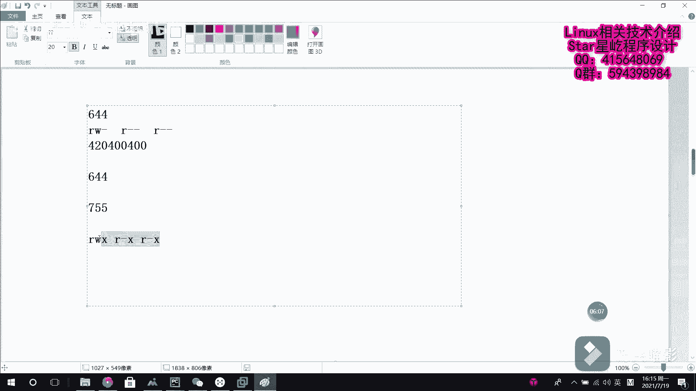

# 【Linux】029-Linux文件权限管理1 - P1：029-Linux文件权限管理1 - Yo_Holly - BV1jv411E7Rf

本视频中我今要给大家介绍的是linux文件权限管理的相关内容。首先啊在linux系统当中啊，每个文件它都有归属的所有者和所有组。呃，并且啊我规定文件的所有者所有组以及其他人它都对文件拥有读写执行等权限。

但是啊就是说是这个所有者所有组以及其他人之间权限之间关于读写执行啊是互不影响的。呃，这个的话看到这一块啊，刚开始这个列的这块是LS杠L查看A点TST。首先啊出来一出来一条信息。

这就是说我根据这个查看A点TST这个文件它的一些详细信息。呃，它输出的话就是说这一块的话一常串比较难理解。所以现在首先去解读一下这个在刚开始啊这块有一个这个斜线就是说减号。

它的话是这块是代表文件文件类型。这块的话减号的话就代表是普通文件。然后这个的后面的话就是RW杠斜线RR杠杠R杠杠。这个的话其实就是说是每三个为E，每三个为一组，每三个为一组，也就是说前三个是所有者。

然后中间中间三个是所有组，最后三个是其他人对它的一个权限。然后这块的话就是说是关于这个文件权限的话是在呃这块的话，它都具有这个它具有这个无。解执行读是R，解是W，直径是X呃。

紧接着啊这后面这个root rootot它俩分别代表是第一个root是所有人，后面这个root的话是代表所有组。呃，后面这个174的话，他是说啊介绍我这个文件的文件的大小，文件有多大。

紧接着这个后面的时间的话，就是说我是代表这个最最近一次我修改这个文件的一个时间，也就是最后一次我修改的那个时间。最后就是文件的名称。这个的话就是我使用杠L选项，然后详详细列出文件的一些信息的时候。

它给展示报出来的一些信息。呃，紧接着说一下这个文件类型，一般啊这个文件类型常常用的啊，这个就是有这个普通文件，还有这个目录文件呃，链接文件和快设备文件。呃，这个的话也就是说在第一位的话，他有他占一位。

然后是对应的是哪种类型。然后他使用这一块的这个占位字母符给他去填充。呃，其次啊就是后面这个的话是你像这个针对这些权限的话，就是RWX它去分别去占位。如果没有该商权限的话，是一个减号去进行占位。呃。

紧接着就是介绍一下这个文件权限对应的一个呃计算方法。然后这个文件权限的话是读的话是4，然后写的话是2执行的话是一。如果就是说我在这一项的话，就是说我没有可执行权限，它就用用数字代替的话。

也就是说是没有权限的话，用零就用零代替。然后这块的话就很清楚啊，这块说是字符表示的话是你看RWXRWXRWX他们的话就是说是所有者所有组，还有其他用户，他们分别对应三位的一个三三个。

就是说这个权限读写执行。然后他们一般就是说我在写的时候是写的时候，他是这样的。一一般的话，比如说我现在有一个权限，他是。是这样的，他是写的话，假如说比如说644644的话，它是。呃，怎么一回事？

6的话它是RRW。不是6嘛？然后紧接着是R，是代表所有所有者。这个的话就是644的一个权限。如果我要是用数字去写的话，那么就是42420呃。400。400，如果是用这个就是说是他的代号去写。

你看如果我现在把它全部写到一块的话，每三位每三位这样去看的话很不方便。所以为了方便表示的话，它是使用这个八进制去表示。所以在这一块的话，组合好之后，就是1个644的权限。对。其余的话。

你看这一块的话没有权限的话，就按在这个字母代号这一块的话，就用减号去占位。然后如果要是在这个数字计算这一块的话，该位没有权限的话，就用零去代替。呃，这一块的话就是说是其实就是说是只要掌握这个对应的权限。

它它对应的这个数字代号是几，然后去计算相应的权限就可以了。这个的话比如说咱们现在举一个例子，755。它对应的每个用户的权限是怎样。首先是这个所有者，咱们计算一下，所有者的话。

你看RWX421算出来的话就是7RWX。然后紧接着是55的话，你看读写执行。读的话是4，执行是一，也就是说这块的话是R杠X其他者的话也是R杠X这个的话就是755对应在文件那个详细信息展展示里面的一个状况。

7755。

