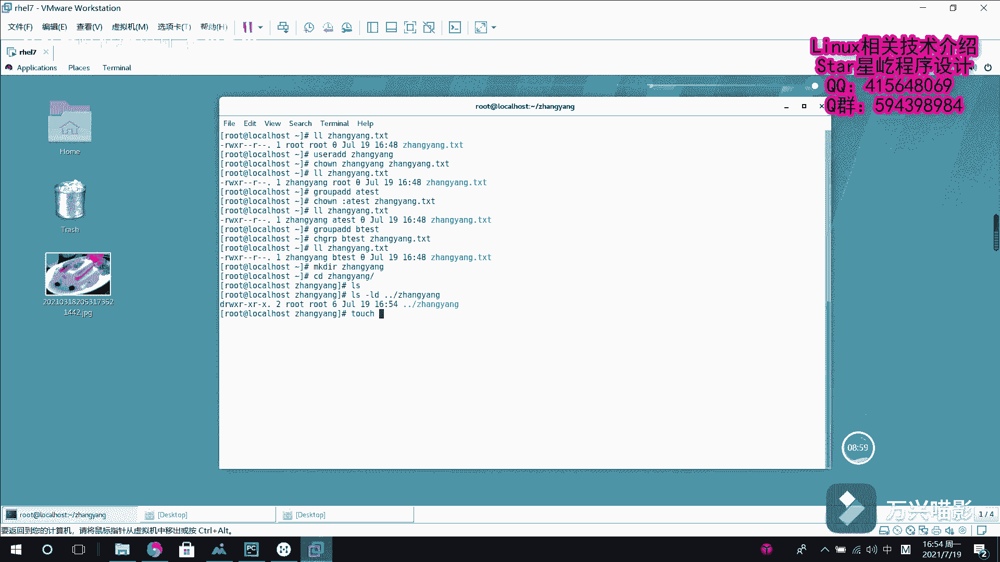

# Linux文件权限管理：030：文件权限管理2

在本节课中，我们将学习Linux文件权限管理的核心操作，主要包括两部分：如何更改文件或目录的访问权限，以及如何更改文件或目录的所有者和所属组。掌握这些命令是管理多用户系统安全的基础。

## 更改文件或目录的权限

上一节我们介绍了文件权限的基本概念，本节中我们来看看如何实际修改这些权限。这需要使用 `chmod` 命令。

`chmod` 命令的基本格式是：`chmod [who][what][which] file_name`。
*   **who**：指定对谁进行操作。
    *   `u` 代表文件所有者 (user)。
    *   `g` 代表文件所属组 (group)。
    *   `o` 代表其他用户 (others)。
    *   `a` 代表以上所有 (all)，即 `ugo` 的集合。
*   **what**：指定进行何种操作。
    *   `+` 表示增加权限。
    *   `-` 表示移除权限。
    *   `=` 表示设置精确的权限（覆盖原有权限）。
*   **which**：指定具体的权限。
    *   `r` 代表读权限 (read)。
    *   `w` 代表写权限 (write)。
    *   `x` 代表执行权限 (execute)。

权限也可以用数字表示：`r=4`, `w=2`, `x=1`。例如，权限 `rwxr-xr--` 对应的数字是 **754**。

以下是具体的操作示例：

首先，我们创建一个测试文件并查看其默认权限。

```bash
touch zhangyang.txt
ls -l zhangyang.txt
```
输出可能类似：`-rw-r--r-- 1 root root 0 ...`，表示权限为 **644**（所有者可读可写，组和其他人只可读）。

现在，我们为文件所有者 (`u`) 增加执行 (`x`) 权限。

```bash
chmod u+x zhangyang.txt
ls -l zhangyang.txt
```
此时，文件权限变为 `-rwxr--r--`。

如果需要同时为所属组 (`g`) 和其他人 (`o`) 增加执行权限，可以使用组合操作。

```bash
chmod go+x zhangyang.txt
ls -l zhangyang.txt
```
此时，文件权限变为 `-rwxr-xr-x`。

如果想一次性移除所有用户 (`a`) 的执行权限，可以这样做：

```bash
chmod a-x zhangyang.txt
ls -l zhangyang.txt
```
此时，文件权限恢复为最初的 `-rw-r--r--`。

最后，我们演示精确匹配 (`=`) 的用法，直接将所有者的权限设置为可读、可写、可执行。

```bash
chmod u=rwx zhangyang.txt
ls -l zhangyang.txt
```
此时，文件权限变为 `-rwxr--r--`。

## 更改文件或目录的所有者和所属组

了解了如何修改权限后，我们来看看如何变更文件或目录的“归属”，即所有者和所属组。这主要使用 `chown` 命令，专门修改组则可以使用 `chgrp` 命令。

`chown` 命令的基本格式是：`chown [owner][:group] file_name`。
*   仅修改所有者：`chown new_owner file_name`
*   仅修改所属组：`chown :new_group file_name` 或 `chgrp new_group file_name`
*   同时修改所有者和所属组：`chown new_owner:new_group file_name`

以下是具体的操作示例：

首先，查看我们之前创建的文件的当前归属。

```bash
ls -l zhangyang.txt
```
输出显示所有者和组都是 `root`。

假设我们已创建一个名为 `zhangyang` 的用户，现在将文件所有者改为该用户。

```bash
chown zhangyang zhangyang.txt
ls -l zhangyang.txt
```
现在，所有者已变为 `zhangyang`。

接着，我们创建一个新组 `atest`，并将文件的所属组修改为该组。

```bash
groupadd atest
chown :atest zhangyang.txt
ls -l zhangyang.txt
```
现在，文件的所属组已变为 `atest`。

我们也可以使用 `chgrp` 命令专门修改组。再创建一个组 `btest` 并修改。

```bash
groupadd btest
chgrp btest zhangyang.txt
ls -l zhangyang.txt
```
现在，文件的所属组已变为 `btest`。

### 递归修改目录的归属

当操作对象是目录时，如果希望修改能应用到目录内的所有子文件和子目录，需要使用 `-R`（递归）选项。

首先，创建一个目录并在其中创建一个文件。

```bash
mkdir zhangyang_dir
touch zhangyang_dir/inside_file.txt
ls -ld zhangyang_dir/
ls -l zhangyang_dir/inside_file.txt
```
可以看到，目录和文件的所有者/组都是 `root`。



如果只修改目录本身的所有者，其内部文件不会改变。

```bash
chown zhangyang zhangyang_dir
ls -ld zhangyang_dir/
ls -l zhangyang_dir/inside_file.txt
```
目录所有者变为 `zhangyang`，但内部文件的所有者仍是 `root`。

使用 `-R` 选项进行递归修改，可以一次性更改目录及其所有内容。

```bash
chown -R zhangyang:zhangyang zhangyang_dir
ls -ld zhangyang_dir/
ls -l zhangyang_dir/inside_file.txt
```
现在，目录和内部文件的所有者和组都同步修改为 `zhangyang`。

## 总结

本节课中我们一起学习了Linux文件权限管理的两个核心操作。
1.  使用 **`chmod`** 命令修改文件或目录的访问权限，可以通过 `u/g/o/a`、`+/-/=`、`r/w/x` 的字母组合方式，也可以使用 **数字表示法（如755）** 进行快捷设置。
2.  使用 **`chown`** 命令修改文件或目录的所有者和所属组，格式为 `chown 所有者:所属组 文件名`。修改目录时，常配合 **`-R`** 选项以实现递归操作。专门修改组还可以使用 **`chgrp`** 命令。


熟练掌握这些命令，你就能有效地控制系统中文件的访问和归属，保障系统安全与秩序。