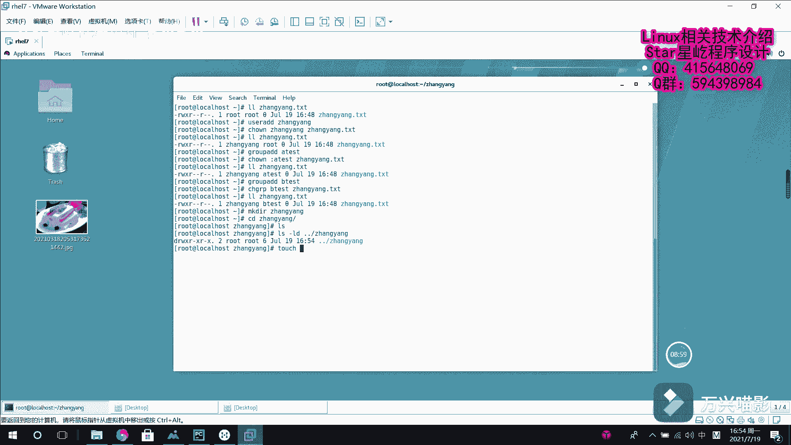

# 【Linux】030-Linux文件权限管理2 - P1：030-Linux文件权限管理2 - Yo_Holly - BV1Dy4y1L7F6

紧接着啊我们就开始正式介绍文件权限管理的相关相关内容。这一块的话分为呃两大类。第一类的话是更改文件目录的权限。也就是说我对呃这个文件的话，针对所有者所有组和其他人分别给他怎样的权限。

这一块的话需要使用的一个命令是叫chan mode，也就是更改它的模式，使用这个命令去修改对应的权限。呃，他这个命令解读的话，也就是说一个命令后面给一个文件，也就是说我对哪个文件只实行这样的操作。

中间的话是who what和which他们分别是做了哪些事？who的话是我给谁做这些操作。这一块的话，U表示U的所有者。E代表的话是所有组。多的话是代表其他人阿，然后还有一个是A有or。

也就是UGO3三者的一个。符合就是说我指定一个权限以后，对它三者就都进行复权了。word是嗯我做哪些操作，也就是说加减。加减等于它的加减的话，就是说我针对啊所有者啊所有组或者其他人用某一个啊。

我对它增加或者是删除某一个权限。等于的话也就是说这块等于是一个精确匹配。也就是说比如说我对文件所有者指定的权限的话是呃RWX，也就是说我使用这个等于号的话，就可以使它一步到位，把它的权限给指定好。

然后这紧接着下面这个位置的话，也就是说是是给他哪些权限，这块的话，也就是RWX。呃，那的数字的话就是421。一个是这个字母代号，一个是数字代号。接着就是说是演示一下这一块。

我现在就是说先创建一个先创建一个文件。先创建一个文件，比如说叫呃。张扬的的TST。然后现在LL张扬点TST。张扬点TST默认的话，它这个的话是权限给的是644。然后现在啊就是说前面的话，它有一个斜线。

有一个减号。这块的话也就是说代表它是一个普通普通文件。呃，紧接着就是说我如果要是现在想对这个所有者增加一个执所有者增加一个执行权限，也就是说这个就是说U加X，然后是针对这个张张扬点TST这个文件。

紧接着然后我再看一下这个张扬点TST这个文件的一个对应的权限。现在的话，所有者这一块就已经加加上这个呃执行权限。现在现在的话如果就是说我需要对他这个其他人就是所有所有组和其他人都加上这个执行权限。

这个的话也就是一个符合操作，这个的话也就是GO，然后分别加上X分别加上X针对的是张扬点TST这个。然后现在再去查看，同样再去查看。就实现在的话，你看所有的这个就是说是都刚才这个所有组和所有其他人。

他就都具有了执行权限。现在我使用这个组合操作A到A，然后去把这个去进行修改，把它的权限全部都减掉，就是说执行权限全部都给删掉，这个时候就需要这样做陈字目的A减去X，然后是针对这个张扬点TST。

然后我紧接着再查看。此时的话，就是刚才明明明明已经设置好的这个执行权限就都给取消了。这就是说是在这个用户授用户授权这一块这个。呃，还有一个的话就是刚才说到的那个精确匹配。

比如说我现在啊就是刚才我这块就是。嗯，对他这个所有者对他的操作。比如说我现现在是可读可写可执行，也就是说是U。U等于。呃，RWXRWX针对针对的是张扬点TST。然后我现在再去同样再去查看的话。

现在的话所有者就同时就是同时具有读写和执行权限了。这是就是说是在这一块去根据这个给用户去指定一个这个权限。这一块的话，这个就是权限。紧接着就是第二部分，也就是说是我更改文件目录的用户和组的所有权。

就是说这个文件或者目录它属于哪个用户，或者是它属于哪个组。如果我现在属于这个用户，属于这个组之后，我需要对它进行变更的时候，该怎样去做。这块的话是使用到一个呃呃称之owner。

改变所有者他的话是同时可以对所有者和所有组进行修改，或者是其中所有者或者所有组分分别按需求进行修改。还有一个命令的话是change group，也就这个的话是专门用来修修改这个所有组。

紧接着我们在这个虚机里面去对它进行一个使用。首下就是说是我LL。查看一下张扬点KST这个文件，它目前的这个所有者，它是ro所有者是root用户。然后我现在啊比如说我现在创建一个用户。叫张洋。

然后现在需要把这个用户啊，就是说他这个所有者现在由root切换为张扬。我看到这个chan着O呢，它的一个命令的格式。首先就是说它是以冒号风格分别写着所有者和所有组。对，如果要是说就是说他这块的话。

如果要是说你只修改一个所有者的话，也就是说他现在命令就变成这样了。就是说ownowner，然后f name。如果要是仅修改这个所有所有组的话，也以加上冒号，冒号之前没有代表说我不修改所有者。

然后后面的话我加1个GROUP。就是所属的组，然后指定文件名。就可以了，这就是说是这在这个chan着owner这块的使用。我像现在就是说我现在第一步我先把它就是说刚按照刚才的需求。

我把它的所有所有者更更换为张扬。然后我现在这一块的话，直接写一个张扬就可以了。对应的文件是张扬点TST。然后紧接着我查看查看这个。他现在的话，这个所有者就变成张扬了。如果现在我需要更改这个所有组的话。

我该怎样去做？比如说我现在创建一个组group ADD比如说我叫一个A test a test。然后现在。去对它进行切换。首先是冒号，冒号之前代表冒号之前没写内容，就是说我不修改所有者。

后面只修改所有组。我就是说把它修改成这个at testest。然后针对的文件是这个。呃，张阳点TST。然后我紧接着查看。现在的话就是说我所有者和所有组都进行了修改。呃。

这个这一块的话就是这个呃它是使用这个chan职owner去对它进行修改。如果现在我比如说我再创建一个组group aD呃，叫Bt。这个时候我我仅修改所有组。

我其实也可以使用刚才介绍的这个group命令group命令称之group命令。然后我把它的这个所有组换成呃Bt，然后针对的文件是这个张阳点TST。张扬点TST。

然后紧接着我去查看它的话就把这个所有组也换成这个BTST了。这是就是说仅对文件进行操作。如果现在啊我是对一个目录进行操作的话，我该怎么去做。就是说我首先我创建一个目录。比如说我的这个目录就叫张扬吧。

然后我切换到张扬这个目录下面，IOS里面什么也没有我哎。LS杠LD。假如说我看一下张扬。张扬这个目录，他的话现在的话就是说前面已经写了D，代表他是一个目录，然后他的所有者，所有组都是都是root。

现在的话就是说我我希望就是说我把呃我。我这个。目录的这个所有者修改成这个呃，比如说是test一或者是test2，或者是刚才那个用户张扬。然后现在的话，首先我为了就是说印证后面的效果，首先在他下面的话。

先创建再创建一个张扬点PSP。这个的话就是说在这个下面，它有一个这个呃文件。

首先我现在再看一下这个这块这个张家点TS它的所有者和所有组也是root。现在我进行修，就是用户这个这个所有者的一个修改。称之称之O呢称之O呢，比如说我现在把它修改成张扬。

所有者修改成这个针对的是这个下面的张扬。张扬这个目录，然后我现在LL。LS杠LD，然后我看这个上级目录上的这个张扬，看现在他这个所有者就切换成张扬了。

但是呃就是说不同步的一点是我现在查看我这个张扬点TST的话，他的这个root还是同样是还是这个原来的root用户没有切换成张扬。如果我现在就是说是想在我切换目录的所有者的情况下，然后让整个目录去同步。

然后去修改。这个时候需要使用到的一个呃选项是杠大R选项表示递归。然后比如说我现在把它换成张扬，然后当前目录上的张张扬，然后我再次进行查看LLS杠LD。然后张。上节目录下的张扬。然后此时的话。

我现在这个所有目录的所有者是张扬了，紧接着看这个文件的所有者，他目录里面文件的所有者现在也切换了张扬了，这就是这一块一个就是说针对目录同步这一块需要加一个杠R选项这一块。

