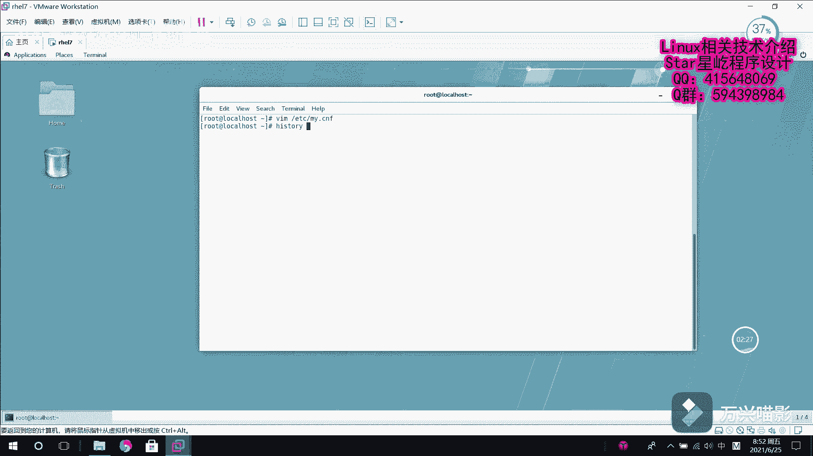

# 【Linux】从入门到精通 ｜ 零基础自学 ｜ 全套教程 ｜ RHCSA ｜ RHCE ｜ Linux爱好者 - P10：010-MariaDB修改用户密码(忘记密码) - Yo_Holly - BV1Df4y187g7

上一个视频当中啊，我们介绍了就是说我如果要是知道这个root密码的情况下，我进入数据库对系统当中一些用户的密码进行修改。但如果要是我就是说可能进性不太好，我把这个root用户的密码给忘记了。

然后之后我就进入不了这个数据库了。在这个时候如我们如何去找回我们的root密码，然后接下来我们就做这么一件事。首先啊我们需要就是说呃因为需要破解它的密码嘛。首先先进入到它的配置文件里面。

然后我们对它的配置文件进行一个改写，然后在配置文件里面加入这么一行。sk great tables，然后把它的权限设置成一，也就代表开启它。刚才已经对这个配置文件进行了改呃，配置文件进行了改写。

所以现在需要重启这个服务。马马瑞DB服务。重启服务。服务重启服务重启之后，这这一次我们就可以。不使用密码直接就可以进入到数据库。因为刚才啊就是加的那个scape刚grade tables。

它就是就是说去掉了舍弃了权限认证，我直接可以登录到数据库里面，你看直接回车，我就进入到数据库里面了。现在我们需要做的一件事情，就是使用这个更新语句，然后更新myq表里面的user userer表。

然后设置它的密码。对他的密码设置。之前啊我们假如说我们设置一个比较简单，咱们容易好记的密码。然如说123456，然后这个密码是给谁设置，这块用一个条件语句，哎，是给这个root用户去设置这个密码。

然后这样的话就是说我已经把这个root用户的密码进行了改写，然后我刷新一下权限。然后紧接着退出退出数据库，这不是退出退已经退出数据库了。然后现在的话就是说我们需要就是说加上认证去登录。

然后同样的就是说我们现在去呃再次改写配置文件，然后把刚才的这个去掉权限给它删掉，然后重新保存。然后就是说是鉴于就是说我们已经修改了，然后按照刚才刚才的思路的话，咱们还得重启数据库。

然后就是重启这个数据库服务。然后咱们看啊刚才是第35条命令，然后咱们重重新执行一下这个重启服务的命令。

啊，现在的话服务就已经重启了。然后现在我们用刚才改的密码杠P，刚才改的密码是123456，然后我们现在进行登录，你看就登录进去了。这就是说是如果要是我在没有密码的，就是忘记密码的情况下，如何去找回密码。

就是这么一个做法。

