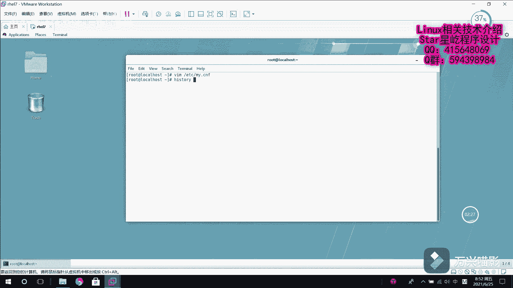

# Linux数据库管理：P10：MariaDB忘记root密码的解决方法 🔑

在本节课程中，我们将学习当忘记MariaDB数据库的root用户密码时，如何通过修改配置文件和安全模式来重置密码。这是一个重要的系统管理技能。

上一节我们介绍了在已知密码的情况下如何修改用户密码。本节中我们来看看如果忘记了root密码，导致无法登录数据库，应如何处理。

## 进入配置文件并修改

首先，因为需要绕过密码验证，我们必须修改MariaDB的配置文件。

1.  使用文本编辑器（如`vi`或`nano`）打开MariaDB的主配置文件。
    ```bash
    vi /etc/my.cnf.d/server.cnf
    ```
    （注：配置文件路径可能因系统而异，常见路径还有`/etc/my.cnf`或`/etc/mysql/my.cnf`）

2.  在`[mysqld]`配置段下，添加一行配置以跳过权限表验证。
    ```ini
    skip-grant-tables
    ```

## 重启MariaDB服务

由于已经修改了配置文件，现在需要重启MariaDB服务以使更改生效。

以下是重启服务的命令：
```bash
systemctl restart mariadb
```

服务重启后，得益于`skip-grant-tables`参数，系统将跳过权限认证。此时，我们可以不使用密码直接登录到MariaDB数据库。
```bash
mysql -u root
```
直接按回车即可进入数据库命令行界面。

## 在数据库中更新root密码

成功进入数据库后，我们需要执行SQL语句来更新`root`用户的密码。

1.  首先，切换到`mysql`系统数据库。
    ```sql
    USE mysql;
    ```

2.  使用`UPDATE`语句更新`user`表中`root`用户的密码。为了演示，我们将其设置为一个简单的密码`123456`。在实际环境中，请务必设置强密码。
    ```sql
    UPDATE user SET password = PASSWORD('123456') WHERE User = 'root';
    ```
    （注意：在MariaDB 10.4及以上版本中，`password`字段可能已更名为`authentication_string`，请使用`SELECT * FROM user\\G;`查看表结构后调整语句。）

3.  更新完成后，必须执行`FLUSH PRIVILEGES;`命令来刷新权限，使密码修改立即生效。
    ```sql
    FLUSH PRIVILEGES;
    ```

4.  操作完成后，退出数据库。
    ```sql
    EXIT;
    ```

## 恢复配置并验证新密码



现在密码已经重置，我们需要恢复之前的配置，重新启用密码验证。

1.  再次编辑MariaDB的配置文件，将之前添加的`skip-grant-tables`这一行删除或注释掉（在行首加`#`）。
    ```bash
    vi /etc/my.cnf.d/server.cnf
    ```

2.  保存文件后，再次重启MariaDB服务以应用更改。
    ```bash
    systemctl restart mariadb
    ```

3.  服务重启后，使用新设置的密码`123456`尝试登录，验证密码是否修改成功。
    ```bash
    mysql -u root -p
    ```
    在提示符下输入密码`123456`，即可成功登录数据库。


本节课中我们一起学习了在忘记MariaDB的root密码时，如何通过`skip-grant-tables`参数进入数据库，并使用SQL命令重置密码的完整流程。请记住，此方法仅在本地服务器上安全，操作完成后务必移除`skip-grant-tables`选项以保障数据库安全。