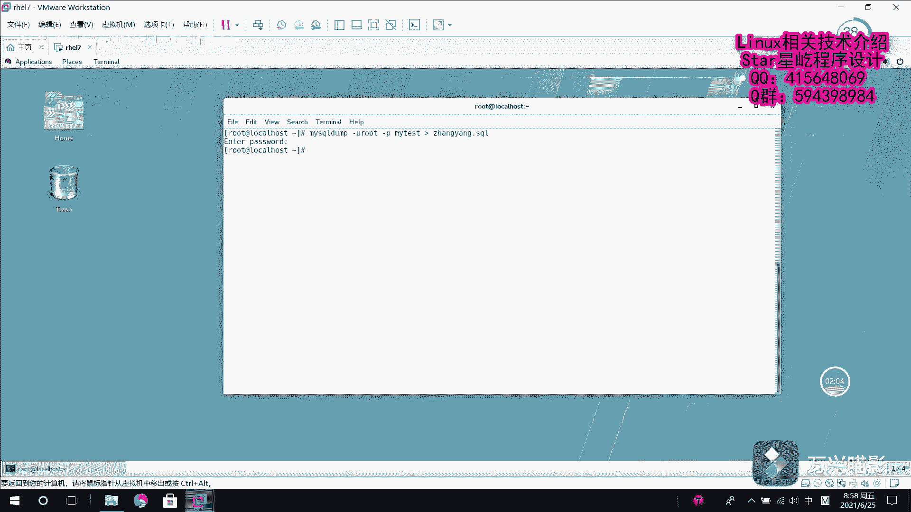

# 【Linux】从入门到精通 ｜ 零基础自学 ｜ 全套教程 ｜ RHCSA ｜ RHCE ｜ Linux爱好者 - P11：011-MariaDB数据库备份 - Yo_Holly - BV1Df4y187g7

接下来啊我们了解一下这个在linux下如何做数据库的一个备份。呃，谈到就是说linux下的数据库备份啊。首先我们先了解一下这个window下之前咱们一般就是说去做数据库备份的时候怎么做。

当时啊咱们是用了一个数据库管理工具，叫，然后就是说我这块的话有一个数据库。现在我要备份它，然后直接使用这个字就是说GI界面，然后这块的话它有一个转属ciq文件结构和数据，然后这块的话啊你选择一个位置。

然后它就会进行对应的备份。但是啊我们现在啊就是说我在linux下面它已经进入到字符界面了，我们怎样去备份一个数据库。首先啊咱们先登录到咱们的数据库，看一看咱们数据库里面都有哪些已建好的数据库。

咱们现在收 data basis，然后查看一下有一个my test，咱们现在啊就是说我的目目标就是把my test这个数据库给它。备份给备份出来。首先咱们进去看一下这个数据库my test。

m test，然后show table show tables，看他有哪些表。哎，它有1个AAA有一个test。好，我们现在知道了，我们去备份。说起这个数据库备份啊。

大家需要知道的一个命令是meical dump。这个命令它的话和那个数据库登录的话有很像很类似。你看也是杠U指定用户，然后杠P这块的话是可以直接写密码，但也可以之后输。

然后现在啊就是杠P后面紧跟着是跟刚才我们需要备份数据库的名字，我们需要备份的是my test的数据库。然后假如说咱们需要把这个数据库啊，备份到。嗯，比后说我叫张扬。

点circle里面备份到张扬点circle这个文件里面，然后我们直接回车。它这块的话，因为你杠P那块没有指定密码，所以这块它会提示你说进入为啥密码，我把密码一输入一回车，他就把这个给备份好了。

然后咱们现在看一下。

这一块的话有一个张扬点circle，就是刚才咱们备份的那个搜数据库的备份文件。咱们现在看一下这个备份文件。张扬看这个的话就是一些备份信息my dump10。14什么什么什么一些f一个介绍信息。

然后下面的话就是说这块的话，d table存在的表AAA然后我创建了这个AAA，然后下面的话就是。drop testest，因为刚才有AA和test嘛，然后他把这个表给先删去，然后我再创建。

然后之后的话就是。做一些就是说基础的一些数据库的一些信息。这就是刚才的一份数据库备份文件。

