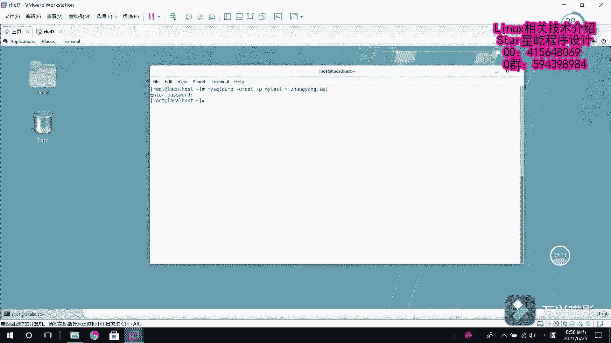

# Linux数据库管理：P11：MariaDB数据库备份 📂

在本节课中，我们将学习如何在Linux字符界面下，使用命令行工具对MariaDB数据库进行备份。这是数据库管理中的一项基础且重要的技能。

上一节我们介绍了MariaDB的基本操作，本节中我们来看看如何进行数据备份。

## 数据库备份的基本概念

在Windows环境下，我们通常使用图形化工具（如phpMyAdmin）进行数据库备份。但在Linux的字符界面下，我们需要使用命令行工具来完成这项工作。

## 使用 `mysqldump` 命令备份数据库

核心的备份命令是 `mysqldump`。它的语法结构与登录数据库的 `mysql` 命令类似。

以下是 `mysqldump` 命令的基本语法格式：

```bash
mysqldump -u [用户名] -p [数据库名] > [备份文件名].sql
```

**参数解释：**
*   `-u`：指定用于连接数据库的用户名。
*   `-p`：提示输入该用户的密码。出于安全考虑，通常不在命令中直接写明密码。
*   `[数据库名]`：指定需要备份的数据库名称。
*   `>`：输出重定向符，将命令的输出内容保存到文件中。
*   `[备份文件名].sql`：指定生成的备份文件名称，通常使用 `.sql` 作为扩展名。

## 实战演练：备份 `my_test` 数据库

接下来，我们通过一个实例来演示完整的备份流程。



1.  **登录数据库并查看现有数据库**

    首先，我们登录MariaDB，并查看当前有哪些数据库，确认我们要备份的目标。

    ```bash
    mysql -u root -p
    ```
    输入密码后，进入MySQL命令行。
    ```sql
    SHOW DATABASES;
    ```
    假设我们看到了一个名为 `my_test` 的数据库。

2.  **查看目标数据库中的表**

    进入 `my_test` 数据库，并查看其中的数据表结构。

    ```sql
    USE my_test;
    SHOW TABLES;
    ```
    假设查询结果显示存在 `AAA` 和 `test` 两张表。

3.  **执行备份命令**

    退出MySQL命令行（输入 `exit;`），然后在系统Shell中执行备份命令。我们的目标是将 `my_test` 数据库备份到名为 `zhangyang_backup.sql` 的文件中。

    ```bash
    mysqldump -u root -p my_test > zhangyang_backup.sql
    ```
    执行命令后，系统会提示输入 `root` 用户的密码。输入正确的密码后，备份过程将开始。

4.  **验证备份文件**

    备份完成后，我们可以使用 `cat` 或 `less` 命令查看生成的备份文件内容。

    ```bash
    cat zhangyang_backup.sql
    ```
    文件内容通常包括：
    *   备份工具的版本信息。
    *   创建数据库的SQL语句（如果备份时使用了 `--databases` 参数）。
    *   删除已存在表的语句（`DROP TABLE IF EXISTS`）。
    *   创建表结构的语句（`CREATE TABLE`）。
    *   插入数据的语句（`INSERT INTO`）。
    这确保了备份文件可以用于完整地恢复数据库的结构和数据。

## 总结


本节课中我们一起学习了Linux下MariaDB数据库的备份方法。我们了解到，在字符界面下，核心工具是 `mysqldump` 命令。通过指定用户名、密码、数据库名和输出文件，我们可以轻松生成一个包含数据库结构和数据的 `.sql` 备份文件。掌握命令行备份是进行自动化运维和服务器管理的基础。