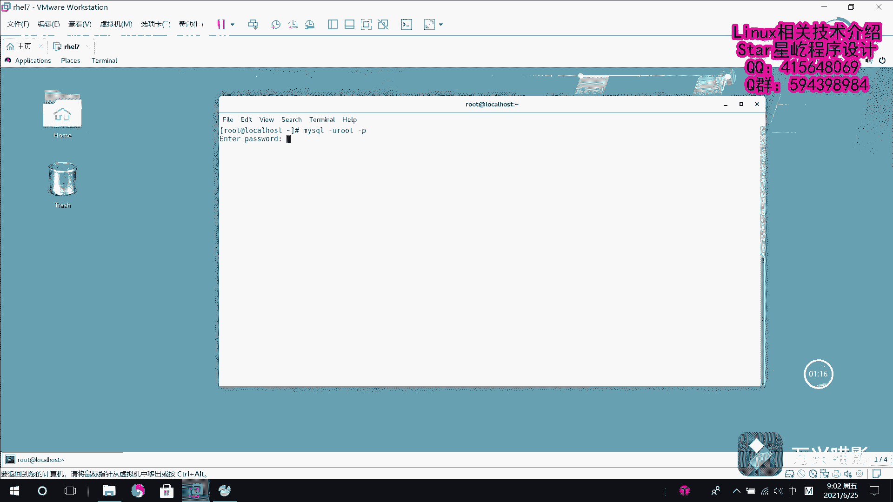

# 【Linux】从入门到精通 ｜ 零基础自学 ｜ 全套教程 ｜ RHCSA ｜ RHCE ｜ Linux爱好者 - P12：012-MariaDB数据库恢复 - Yo_Holly - BV1Df4y187g7

呃，在上一个视频当中啊，我们谈到了这个数据库的一个备份。我们把一个就是说已经建立好的数据库对它进行备份。以供日后啊，假如说我数据库某些文件丢失啊，然后我去把数据库给恢复好。

然后就是说有了数据库的备份以后，我拿到备份文件以后，假如说我之后想要用这个ciqQ文件去搭建一个数据库，我们该怎么去做。然后今天我就介绍一下这个数据库呃恢复这一件事。首先啊就是说谈到这个数据库恢复啊。

我们同样是了解一下这个之前我们在window下是怎么做的。之前在window下的话，还是同样使用这个n数据库管理工具。假如说我们是这个my test，我进来以后这块有一个运行sq文件。

然后我选择一个对应的sqQ文件点击开始，它就把ciq文件里面对应的一些信息，就是说执行一遍，最后就把一个数据库给恢复了。但是现在啊我们到达了就是说linuxlinux里面。

在这个系统里面都是一些纯字符界面，我们想要去恢复这个呃数据库该怎么去做这一块的话，同样就是说需要做的一件事情是首先我们先登录到这个数据库当中。

登进来以后，就是说我们首先啊先创建创建一个数据库。创建一个数据库。为了就是说之后我把那个搜Q文件往进恢复的时候，恢复到哪个数据库。比如说我这一块的话就叫test一。然后我我创建好之后，我退出。

然后现在我使同样使用这个命令，数据库恢复恢复的话是使用这个mysq杠1root杠P，然后恢复到哪个数据库里面，test一里面，比方说恢复我是哪个数据文件是这个张扬点ciircle。

然后输入密码123456，他就把刚才那个数据库就给恢复进来了。现在咱们把它登录进去以后，查看一下它的恢复情况。呃，首先咱们使用这个test一这个数据库进来之后。

我们看刚才的表show table AAtest已经恢复进来了。然后现在啊咱们再尝试另一种方式。现在的话首先就是说我再创建一个数据库，比如说叫test I。创建一个数据库。

然后我们把数据库切换到这个刚新建的数据库下面test。然后现在的话就是说我需要做的是在数据库内对它进行恢复，也就是使用这个source命令。sourcece的话就是说我首先是source命令。

它后面跟一个操作对象，这个操作对象的话，比就说我是哪个circle文件。我们这一块的话是张扬点circle，就是也就是当前文件下载的张扬点circle。你看直接它就恢复好了。

然后我们现在再看一下收tables。同样在这个新数据库里面，他也是把这个数据库就恢复好了。AAA和t的两张表也就恢给恢复进来了。

