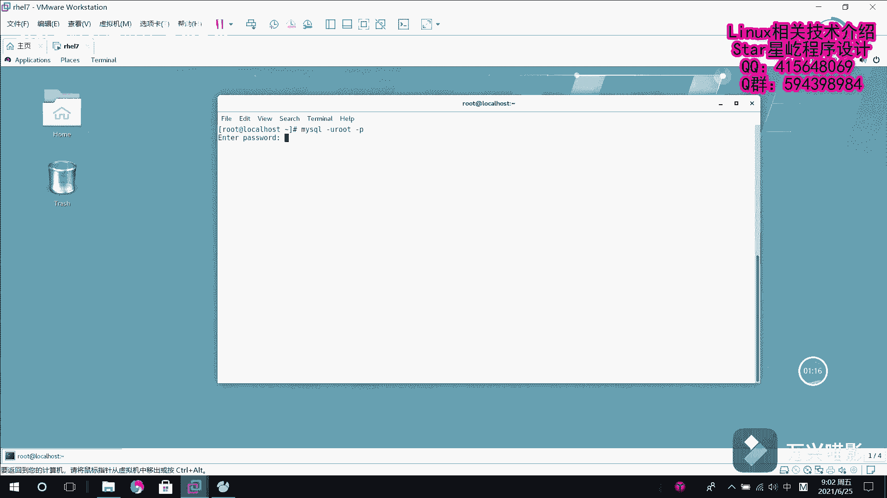

# Linux数据库管理：012：MariaDB数据库恢复 📂

在本节课中，我们将学习如何在Linux环境下恢复MariaDB数据库。上一节我们介绍了数据库的备份，本节中我们来看看如何利用备份文件来恢复数据库。

## 概述
数据库恢复是将备份的SQL文件重新导入到数据库系统中，以重建数据库结构和数据的过程。在Linux的字符界面下，我们可以通过命令行工具来完成这一操作。


## 恢复前的准备
在开始恢复之前，需要确保已经登录到MariaDB数据库系统，并且有一个目标数据库用于接收恢复的数据。



以下是登录数据库并创建目标数据库的步骤：
1.  使用 `mysql -u root -p` 命令登录数据库。
2.  输入密码后，执行 `CREATE DATABASE test1;` 命令创建一个名为 `test1` 的新数据库。
3.  使用 `exit` 命令退出数据库。

## 方法一：使用mysql命令恢复
这种方法是在操作系统命令行中直接执行恢复命令，将SQL文件导入到指定的数据库中。

具体命令格式如下：
```bash
mysql -u root -p 目标数据库名 < 备份文件.sql
```
例如，将名为 `zhangyang.sql` 的备份文件恢复到 `test1` 数据库：
```bash
mysql -u root -p test1 < zhangyang.sql
```
执行后输入密码，即可完成恢复。之后可以登录数据库，使用 `USE test1;` 和 `SHOW TABLES;` 命令来验证表是否已成功恢复。

## 方法二：在数据库内使用source命令恢复
这种方法是在已经登录到MariaDB数据库后，在MySQL命令行内部执行恢复操作。

以下是操作步骤：
1.  首先登录数据库：`mysql -u root -p`。
2.  创建一个新的目标数据库，例如 `test2`：`CREATE DATABASE test2;`。
3.  切换到新数据库：`USE test2;`。
4.  使用 `source` 命令执行恢复，后面跟上备份文件的路径：`source /path/to/zhangyang.sql;`。
命令执行完毕后，同样可以使用 `SHOW TABLES;` 来检查 `aaa` 和 `ttt` 等表是否已成功恢复。


## 总结
本节课中我们一起学习了在Linux系统下恢复MariaDB数据库的两种主要方法。第一种是在系统命令行中使用 `mysql` 命令进行恢复，第二种是在数据库命令行内部使用 `source` 命令。掌握这两种方法，能够确保在需要时有效地从备份文件中重建数据库。