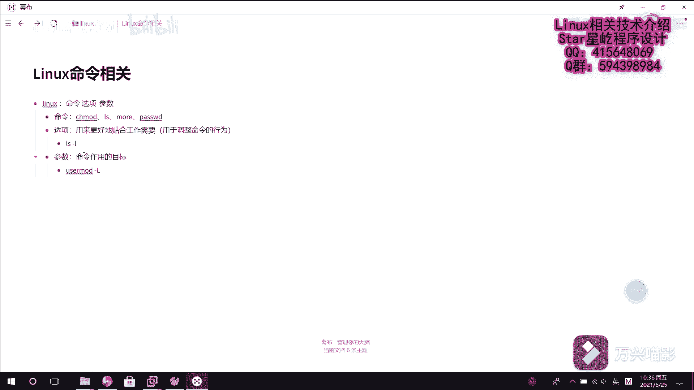

# 【Linux】从入门到精通 ｜ 零基础自学 ｜ 全套教程 ｜ RHCSA ｜ RHCE ｜ Linux爱好者 - P13：013-系统基础命令1（带来的好处、命令的组成） - Yo_Holly - BV1Df4y187g7

从这个视频开始啊，我们将进入linux基础命令的学习。linux基础命令到底有多重要，有它到底有带能带来哪些好处呢？首先啊我先从四点去给这个问题做一个阐述。首先啊就是说在真正的呃工作当中啊。

就是说呃其实啊是首先是很多环境下是没有图形化的，都是字符界面。再者就是说linux这个命令的话，它可以做任何操作。但是啊图形化的话可能有些操作功能的话，它就很受限，你不能去实现。呃。

再者的话就是说我使用这个linux命令去操作，整体去操作的话，它的效率会很高。然后现在还有一种方式，就是说如果我们我们能把呃很多基础的命令，然后把它巧妙的组合到一起，形成一个脚本的话。

这样它的效率会更高。然后在这个linux当中啊，它的命令的话是以怎样的方式去组成的？这块我给大家先给介绍一下。然后在linux当中啊。他的命令一般是由这几部分组成的，首先是命令本身。

然后其次就是说是选项。然后再者是这个参数。然后命令的话就像包括比如。偏之mod修改呃用户权限，然后L查看咱列文件列表，某mo查看文件内容， passwordsword用户密码相关。

然后这个参这个选项的话，选项是用来用来更好的贴合工作需要。呃，它主要的话就是。用于调整。命令的命令的行为。前假如说呃什么啊，前有LS，比如说杠L就是用长列表的方式去显示。然后再者的话就是这个参数呃。

这个参数啊就是命令的目标命令作用的目标。呃，这一块的话，就比如假如说用这个user mode呃命令，然后设置一个参数设置一个选项是杠L，然后锁定。假如说有一个用户叫test。

就说把这个test的用户给锁定。

