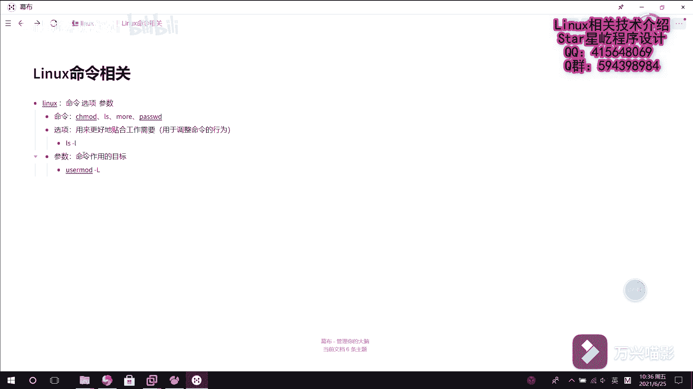

# Linux从入门到精通：P13：系统基础命令1（带来的好处、命令的组成） 🐧

## 概述
在本节课中，我们将要学习Linux系统基础命令的重要性以及Linux命令的基本组成结构。理解这些内容是后续高效使用Linux系统的基石。

---

## Linux基础命令的重要性
上一节我们介绍了Linux系统的概貌，本节中我们来看看为什么掌握基础命令如此关键。在真正的企业工作环境中，很多服务器并没有安装图形化界面，只能通过字符界面进行操作。此外，Linux命令能够完成所有系统操作，而图形化界面在某些高级功能上可能受限或无法实现。

使用Linux命令进行操作，整体效率远高于图形化界面。更高效的方式是，将多个基础命令巧妙地组合在一起，形成自动化脚本，从而极大地提升工作效率。

## Linux命令的组成
了解了命令的重要性后，我们来看看一个典型的Linux命令是如何构成的。在Linux系统中，命令通常由以下三个部分组成：**命令本身**、**选项**和**参数**。

以下是每个部分的详细解释：

*   **命令本身**：这是要执行的核心操作。例如：
    *   `chmod`：修改文件或目录的权限。
    *   `ls`：列出目录中的文件和子目录。
    *   `cat`：查看文件内容。
    *   `passwd`：修改用户密码。

*   **选项**：选项用于调整命令的默认行为，使其更贴合具体的工作需求。选项通常以一个或两个连字符（`-` 或 `--`）开头。例如，`ls -l` 中的 `-l` 就是一个选项，它告诉 `ls` 命令以“长列表”的详细格式显示信息。

*   **参数**：参数是命令作用的具体目标对象。例如，在命令 `usermod -L test` 中：
    *   `usermod` 是命令本身（修改用户账户）。
    *   `-L` 是选项（锁定用户）。
    *   `test` 是参数（命令作用的目标用户）。

通过组合命令、选项和参数，我们可以精确地控制Linux系统，完成从简单到复杂的各种任务。

---

## 总结
本节课中我们一起学习了Linux基础命令的核心价值及其基本结构。我们了解到，掌握命令行是高效管理Linux系统的关键，因为它在无图形界面环境、功能全面性和操作效率上具有显著优势。同时，我们剖析了Linux命令的标准组成：**命令**、**选项**和**参数**。理解这个结构是后续学习具体命令和编写脚本的基础。下一节，我们将开始学习一些最常用和基础的系统命令。