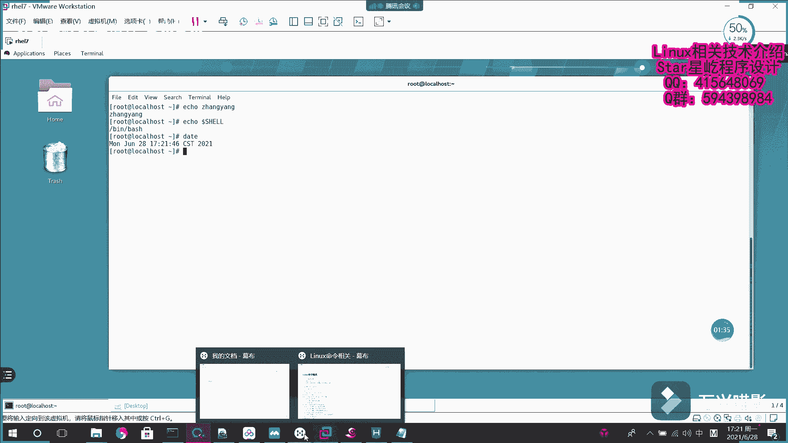
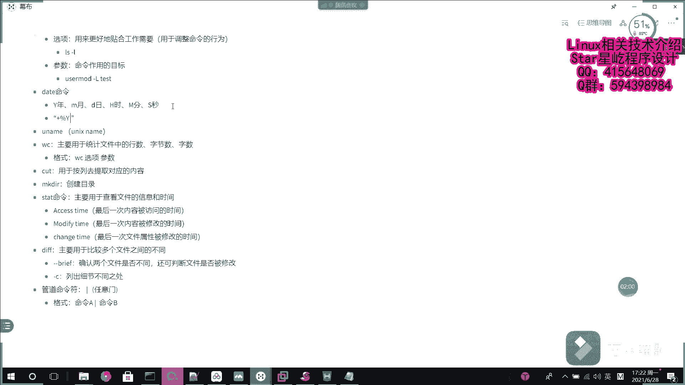
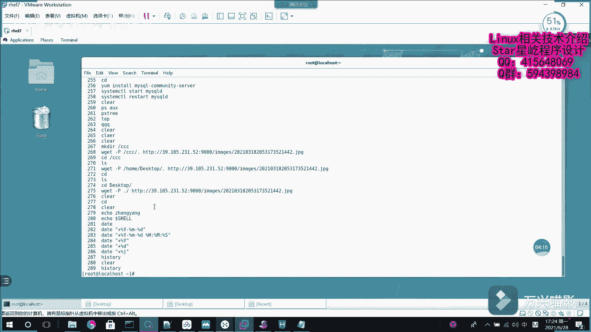
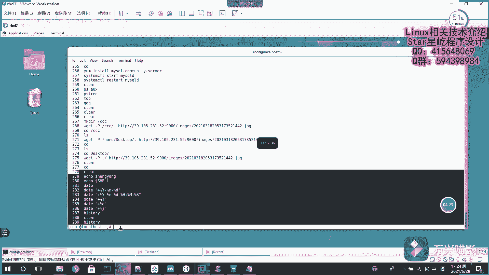

# 【Linux】从入门到精通 ｜ 零基础自学 ｜ 全套教程 ｜ RHCSA ｜ RHCE ｜ Linux爱好者 - P14：014-系统基础命令2（echo、data、history) - Yo_Holly - BV1Df4y187g7

在这个视频当中啊，我们就开始介绍一些linux常用的命令。首先啊是一个很基础的命令eco命令。它的话就是说我用于把我需要输入的一些字符串，把它输出输出到终端上大致的效果的话。

就是这的你后面给跟一个字符串，然后它就会输出出来，把你需要输出的就输出出来了。这个的话其实就和那个C语源里面那个那个print for一样，它主要是作输出用的。它其实啊也也可以综合着用。

比就是说是在之后啊有一个命令是给用户改密码，就是那paW它是给用户改密码，它可以是作为前之就是前一个命令它作为输出，然后传给后面的命令，它其实综合来用的话是这么来用。

还有一还有一个是就是说它可以输出某个变量的值。因为就是说在linux当中啊，它有一个默认的变量叫share这话这块就是说加一个do就是说我取出share的值让命。输出这块的话。

它就输出了系统默认的share用的是winb。呃，这个的话就是eco命令。有了eco命知道eco命令之后啊，假如说我们想要之后啊想要就是说查系统时间，或者是就是说按照我们自己的一个设定去输出一些时间。

这个时候我们就需要使用到一个data命令。data命令直接输出的话，它是按照系统默认的格式去输出系统系统当前的时间。这样的话可能就是说不太方便。然后在这一块的话。

我们可能就会涉及到一个命令的一个定制定制化。这一块的话就是说。

大写字母Y代表的是年小写M代表的是月，D代表日，大写H时代表的是1大写M代表分，大写S代表的是秒。然后啊之后如果要是说主要是做这一块的话，主要是有需要注意的一点是首先需要加一个加号。

然后之后是百分号Y啦什么什么的，然后再去做这一块，对，这个加号的话很重要。这是呃一个开头。比如说啊现现在咱们说要输出年月日呃，做法的话，就是说首先啊加一个加号，然后百分号Y，比如说咱们是这样输出。

呃，年月日。他就输出了2021年6月2828日。呃，如果是精确到十分秒的话，我们就是说也可以在这块继续组装格式值H。哎呃实际呃十分秒的话，一般是冒号分隔。

这个的话就把系统的呃就是说是年月日10分秒都给显示出来了。如果现在我单单单要是要看现在啊就是说完整的年份的话，我就是data。加上百分号Y。他就看到当前的年份了。呃。

还有一个就是说如果我现在想看今天啊是本月当中第多少天，这个时候我就用到这个百分号D，它就可以看到这个月今天啊是本月的第多少天。呃，如果想知道今天是在今这一年当中是哪一天的话，是使用data这块的话。

是有一个特殊的是加呃百分号D。这样的话就是说今天啊是2021年的第179天。呃，这个的话就是data这个命令。它的话主要就是假如说之后你要在一些脚本当当中啊，存一些时间的话。

想获取系统当前就是说是实时获取时间的话，可以使用这个命令，然后使用重定向，然后把它放到一个文件里面。紧接着啊之前啊我们呃在这个终端上输入过很多的命令。如果在未来某一天啊，我想查看我之前做过哪些工作。

输过哪些命令，该怎么查有一个命令叫historyhistory的话，它就是主要是用于查呃，之前我都做过哪些工作。啊，这块清屏啊呃假如说我现在输入hi historyistory。把它输入出来了。

这就是刚才我们刚才咱们做过的一一点，就是输入的一些命令。

