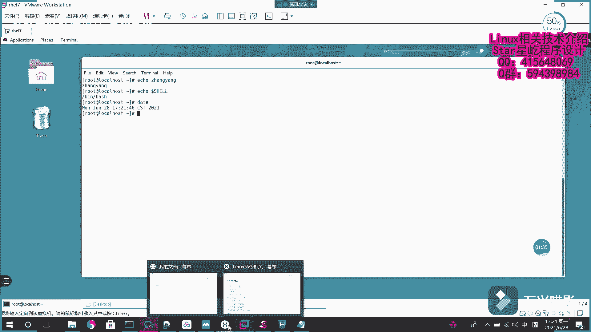
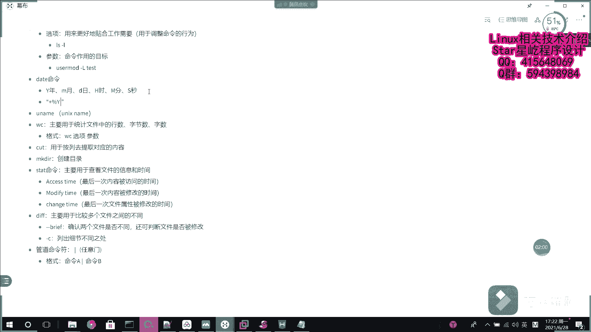
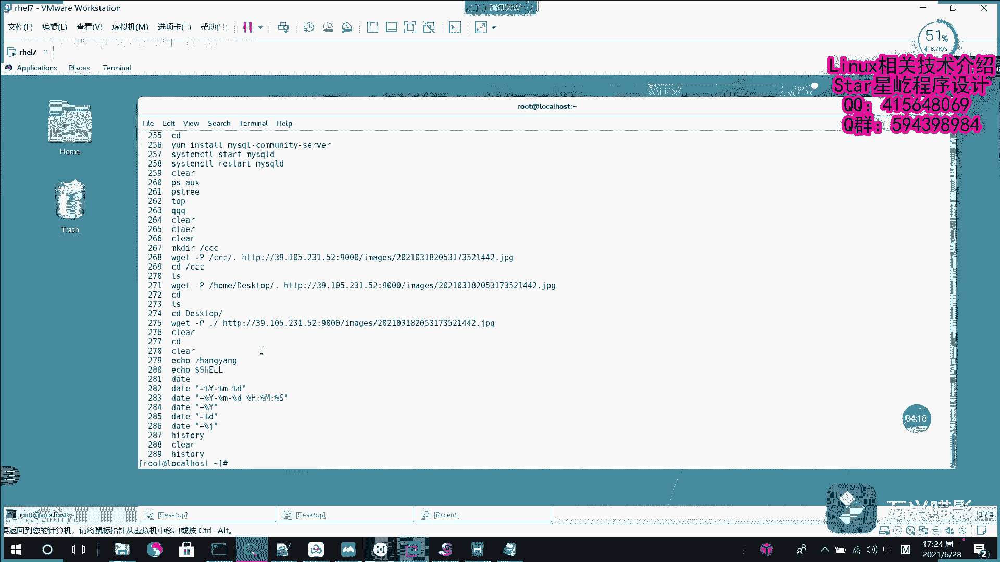
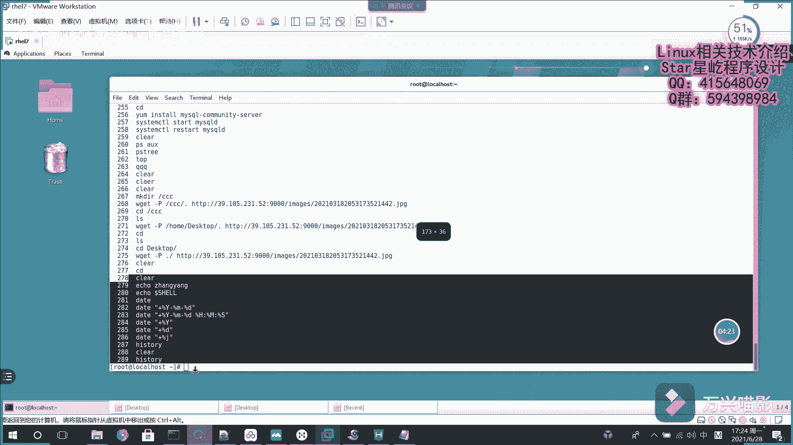

# Linux系统管理：P14：系统基础命令2 (echo, date, history) 📝

在本节课中，我们将学习三个非常实用的Linux基础命令：`echo`、`date`和`history`。这些命令分别用于输出信息、显示与格式化时间以及查看命令历史记录，是日常系统操作和脚本编写中不可或缺的工具。

## echo命令：输出文本与变量

上一节我们介绍了一些基础命令，本节中我们首先来看看`echo`命令。`echo`命令的主要功能是将指定的字符串输出到终端上。它的基本用法非常简单。

**基本语法**：
```bash
echo "要输出的字符串"
```
执行这个命令后，终端会显示引号内的字符串。这类似于C语言中的`printf`函数，主要用于输出信息。

除了输出静态文本，`echo`命令还可以与其他命令结合使用。例如，在后续课程中会学到的`passwd`命令（用于修改用户密码），`echo`可以将其输出的内容作为输入传递给后面的命令。

此外，`echo`命令的一个重要用途是输出系统或用户定义的变量值。在Linux中，环境变量存储着系统的配置信息。

以下是使用`echo`查看系统默认Shell的一个例子：
```bash
echo $SHELL
```
这条命令会输出`$SHELL`变量的值，通常显示系统默认的Shell程序路径，例如`/bin/bash`。

## date命令：显示与格式化时间

了解了`echo`命令后，我们来看看如何查看和定制系统时间。`date`命令用于显示或设置系统的日期和时间。



直接输入`date`命令，它会按照系统默认的格式输出当前的日期和时间。

**基本语法**：
```bash
date
```
然而，默认格式可能不符合我们的需求。`date`命令的强大之处在于其灵活的格式化功能。

要自定义输出格式，需要使用`+`号开头，后面跟上格式控制符。每个控制符以百分号`%`开头，代表时间的不同部分。

以下是常用的格式控制符：
*   `%Y`：四位数的年份（例如：2021）
*   `%m`：两位数的月份（01-12）
*   `%d`：两位数的日期（01-31）
*   `%H`：24小时制的小时（00-23）
*   `%M`：分钟（00-59）
*   `%S`：秒（00-59）



例如，要输出“年月日”格式的日期，可以这样操作：
```bash
date +%Y年%m月%d日
```
这条命令会输出类似“2021年06月28日”的结果。

如果要输出更完整的“年月日 时分秒”格式，可以组合更多控制符，并用标点分隔：
```bash
date +"%Y-%m-%d %H:%M:%S"
```
这条命令会输出类似“2021-06-28 15:30:22”的结果。

`date`命令还支持一些特殊的格式符用于特定查询：
*   查看今天是本月的第几天：`date +%d`
*   查看今天是今年的第几天：`date +%j`

这个命令在编写脚本时非常有用，例如，可以通过重定向将当前时间记录到日志文件中。

## history命令：查看命令历史记录

在日常使用终端时，我们输入过很多命令。`history`命令可以帮助我们查看之前执行过的命令历史记录，方便回顾或重新执行。

直接输入`history`命令，它会列出当前用户近期执行过的命令列表，每条命令前有一个编号。

**基本语法**：
```bash
history
```
执行后，终端会显示一个命令列表。你可以通过编号快速重新执行某条历史命令，只需输入`!编号`即可。例如，`!101`会重新执行历史记录中编号为101的命令。

此外，你可以通过管道`|`配合`grep`命令来搜索包含特定关键词的历史命令，这在忘记完整命令时非常有用。



---



本节课中我们一起学习了三个基础但强大的Linux命令：用于输出文本和变量值的`echo`命令，用于显示和格式化系统时间的`date`命令，以及用于查看操作历史的`history`命令。掌握这些命令将为后续更复杂的系统管理和脚本编写打下坚实的基础。