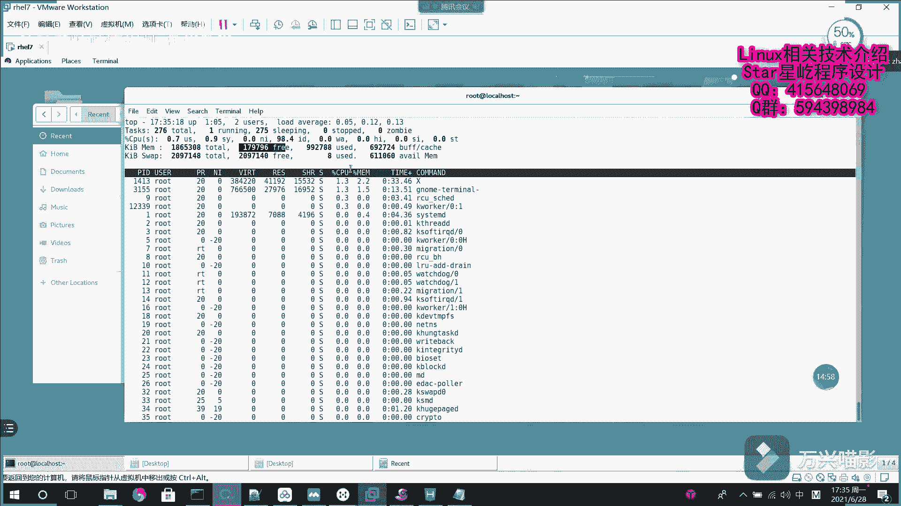

# 【Linux】从入门到精通 ｜ 零基础自学 ｜ 全套教程 ｜ RHCSA ｜ RHCE ｜ Linux爱好者 - P15：015-系统基础命令3（wget、ps、pstree) - Yo_Holly - BV1Df4y187g7

这个的话就是history呃，感叹号的话，它就是是用于扩展之前的命令，主要是做一个扩展的工作。然后紧接着啊咱们介绍一个。终端上下载在这个终端界面去下载网络上的资源。之前啊假如说咱们要下载的话。

在windows上的话，就是呃输在网页中查找对应的资源的话，我们直接点击下载，它就下载过来了。但是在终端上下载的话，它就没有那么方便了。它就需要使用命令。命令的话，这块用到的是这个呃就是Wge命令。

这个命令主要是在令ux上终端界终端界面下，用于从网络中下载一些资源。他的话就是说我在这块下载的话，我是无需打开这个浏览器的，直接就在这一块，它就去获取网络那另一边的一个资源了。在这块的话。

首先啊如果要是我直接下载的话，我就是呃假如说这是一个刚才我提前准备好的一个网络地址。get它直接回车，它就去下载这个呃资源了，它会保存到就是说系统的默认路径，呃，但是啊一般情况下我们是有一些需求。

比如说我需要把这个呃东西啊下载到一个指定的目录，这个时候是需要加一个杠大P选项，然后指定一个目录，比如说我是当前目录下的desktop下面呃下载到这个目录下面，然后我把这个东西下载过来。

然后我回车它就把网络中的一张图片就下载过来了。这就是 get命令，从那边去下载一些资源。呃，其次啊就是说呃在linux系统当中啊，它是linux啊，就是默认的，它是都是谈的是进程，它进程做的特别的好。

然后如果要是在这个时候，我需要查看系统当中的一些进程信息的话，该怎么去查看。因为这块的话也没有那个。字符字就是那个图形化。你像在wind度上的话，它有那个任务管理器，我能在。

图形画上面很清楚的看到每个进程的一个状况。但是在这个lin上的话，它就没那么方便了。同样的，我们也是用这个命令去操作。然后这块的话，用PS命令的话。

一般是有一个组合选项是用这个AUX3个选项组合到一块去使用。然后这三个选项的话，呃分别是啊就是A的话奥嘛代表所有的进程就包括其他用户的进程。当前用户以及其他用户的进程。U的话是用户以及其他详细信息。

X的话就是显示没有控制终端的进程，把这些这块的话其实AUX组合起来，就是把所有的进程信息都给列出来。各类信息都列出来。这样的话，他就把进程的呃所有的信息啊就给列出来了。

这块的话就是说我们首先啊就是说分析一下它到底就是说这些都代表啥。首先这个优er的话是进程的所有者。你比如说下面的是root用户的PID的话是进程的ID号。百分号CPU这个的话是代表运算器的占用率。

这块的0。1啊什么什么的，这就代表它的占用率，百分号MEM这个其实是代表这个内存的一个占用率。然后VS在的话是虚拟内存的使用率。这块需要注意的是它的单位的话是KB。然后RSS的话是占用的固定内存量。呃。

TTY的话就是说所在的终端，它在哪个终端下面。然后这个。呃，start它其实这块是star，就是呃它这个的话其实start边上这个STAT它的话是告诉你进程的一个状态。我进程当前是怎样的状态。

start的话就是说我进程从当时被启动的时间。呃，其次啊就是后面的话是这个timetime的话是实际使用CPU的时间。我使用CPU使用了多长时间。然后最后的话是命令名称与参数。

我是通过一个怎样的命令或者是怎样的一个参数，然后嗯实现就是说开启了这样一个进程。它在这一块的话都会给详细的介绍。谈到这个进程这个状态啊，进程在lin子下面的话，它是进程是有5种状态。

然后分别的话代表的话是代表是这样的。然后就是啊。饿死了。嗯。在。D，然后这个R的话就是代表运行状态，就是说进程正在运行，或者是它已经处在这个运行队列当中了，已经在运行队列当中等等待了。然后S的话是中断。

就是也就是说我进程啊当前处于休眠状态。然后当某个条件。行成的时候啊，他就可能会接收到信号，然后脱离该状态。然后不可中断D的话是不可中断，也就是说代表。解释就是说进程不响应系统异常异异步的信息。

然后也就是说我使用Q命令的话，不能将其中断。这个Z的话是代表将死，也就是说进程已经终止了，但是进程描述符依然存在，直到负进程调用wat函数才能将它给释放了。然后T的话是停止。

也就是说进程收到停止信号当中后哦，它停止运行了，这就是在linux下的话，它的5种状态。进程的5种状态。在这一块啊，就是说刚才啊咱们用这个PS加上AUX1个组合选项，看到了所有的进程的信息。

但其实这样去看的话就会比较符，就会比较烦。你因为一堆的东西，我它很它没有条理性。其实如果这个时候你想让呃整体进程以条理性的方式去展示出来。也就是说树形结构，大家嗯能看的很清晰，我有一个命令叫PSt。

它的话就是说是以树形图的方式展示进程之间的一个关系。看回车他的话，你看这个的话，这块罗列的很详细，每各个进程之间的关系的话，他都以输讼图的方式给呃罗列清楚了。这个的话就是PStrain命令。

紧接着就是说刚才的话用PS命令，我查看这个晋程信息的话，它是一个静态的信息。也就是说我当前这个各个晋升它是怎样的一个状态。我显示就是怎样的。这个PS命令的话。

一般是啊如果我要去获取系统某个时间的一个信息的话，我是获取之后把它追加到日志文件当中，日后供我去分析。但是如果要是我作为一个系统管理员，我想去实时的看一些系统的一个运行情况。

然后好对系统目前的一个状况做一个实时的把控。这个时候有一个实时的去获取监控系统进程系情况的一个命令，叫top命令。这个进去以后，他就看它是实时变化的。它是过一段时间他就更新一次，过一段时间就更新一次。

也就能让你实时的看到系统的一个情况。呃，用到这个top命令的话，就是说在这一块我需要给大家解释，就是说是呃解释一下这一块，它都是该怎样。去解读这个输出来的，因为它是一个字符界面嘛，很烦杂。

所以需要去带着去解析一下。首先要看第一行，第一行的话这一块呃这个的话是系统当前的时间。然后这块有个up一冒号03，这个就是说系统已经运行一个多小时了，然后后面有个2unus，这个的话是系统登录的终端数。

紧接着啊这后面有一个load average，这个的话是系统的负载均衡，它是观测系统状况一个很关键的一个指标。它的话三个数字啊怎么去看这个是这个是过去一分钟，这个是过去5分钟，这个是过去15分钟。

也就是说如果我要看系统当前1个CPU负载情况的话，我是需要从右往左看的。因为这个是过去一分钟啊，它是过去15分钟，它是过去的，这是现在的，我这样看数字一直一直在变小的话，证明现在CPU的运用力啊。

运用量在减小，如果变大的话，肯定是现在任务比较多嘛，是从从右往左看。紧接着啊这下面的话是第二行的话，这个呃tasks。呃，这个解读的话就是说。第一个toto就是说我代表进程总数。

然后后面的话他会对这个进行分析。然后有一项在运行，275项在睡眠，0零项是停止的，零项是僵死的。也就是说刚才那个状态嘛。然后紧接着第三行的话是这个呃。一些占用资源的一个情况。

首先啊第一个的话是用户占用资源的百分比。然后第二个的话是系统占系统内核占用资源的百分比。然后你像后面的话，这个的话就是说呃是改变过优先级的进程资源百分比。然后后面这个99。

1ID这个的话是空闲的资源百分比。它就是意味着就是说我现在比如现在的话它是有94。0的CPU呃，处理器资源处于空闲当中。然后紧接着后面的话就是说是一些其他的数据，这些数据的话就不太重要了。呃。

第四行和第五行的话，这块主要就是说呃介绍下是。怎样的资源？这块的话，它主要是这个物理内存的一个呃总量。然后下面的话是虚拟内存，一个是物理内存，一个是虚拟内存。他就介绍一个情况，有多少个总量。

多少是空闲的，多少正在使用，就是大致就是这么一个情况。

