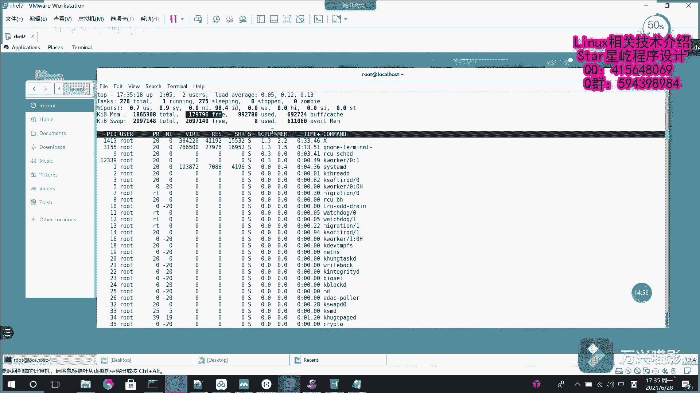

# Linux系统管理：015：系统基础命令3（wget、ps、pstree、top）

## 概述
在本节课中，我们将学习几个关键的Linux系统基础命令。我们将了解如何使用 `wget` 命令从网络下载文件，如何使用 `ps` 和 `pstree` 命令查看系统进程信息，以及如何使用 `top` 命令实时监控系统状态。这些命令是系统管理和日常运维的核心工具。

---

## 使用 wget 下载网络资源

上一节我们介绍了历史命令的扩展功能。本节中，我们来看看如何在终端中下载网络资源。

在图形界面中，我们通常通过浏览器点击下载。但在终端界面，我们需要使用命令来完成下载。`wget` 命令用于在Linux终端界面下，从网络中下载资源，无需打开浏览器。

以下是 `wget` 命令的基本用法：

*   **直接下载**：`wget [URL]`。此命令会将资源下载到系统的默认路径（通常是当前目录）。
*   **下载到指定目录**：使用 `-P` 选项可以指定下载目录。命令格式为 `wget -P [目录路径] [URL]`。

例如，要将一张图片下载到当前目录下的 `Desktop` 文件夹中，可以执行：
```bash
wget -P ./Desktop https://example.com/image.jpg
```
执行后，网络上的图片就会被下载到指定位置。

---

## 使用 ps 查看进程信息

在Linux系统中，进程管理是其核心特性之一。与Windows系统的图形化任务管理器不同，在Linux终端中，我们使用命令来查看进程信息。

`ps` 命令用于查看当前系统的进程快照。一个常用的组合选项是 `aux`，它能列出详尽的进程信息。

以下是 `ps aux` 命令输出中各列的含义：

*   **USER**：进程的所有者（例如 `root`）。
*   **PID**：进程的ID号。
*   **%CPU**：CPU占用率。
*   **%MEM**：内存占用率。
*   **VSZ**：虚拟内存使用量（单位：KB）。
*   **RSS**：占用的固定内存量。
*   **TTY**：进程所在的终端。
*   **STAT**：进程的当前状态（见下文详解）。
*   **START**：进程启动的时间。
*   **TIME**：进程实际使用CPU的时间。
*   **COMMAND**：启动该进程的命令名称与参数。

在Linux中，进程主要有5种状态，由 `STAT` 列中的字母表示：

*   **R (Running)**：运行状态。进程正在运行或在运行队列中等待。
*   **S (Sleeping)**：中断（休眠）状态。进程在等待某个条件形成，收到信号后可被唤醒。
*   **D (Uninterruptible Sleep)**：不可中断状态。进程不响应异步信号，无法用 `kill` 命令中断。
*   **Z (Zombie)**：僵死状态。进程已终止，但其描述符仍存在，需父进程调用 `wait` 函数后才能释放。
*   **T (Stopped)**：停止状态。进程收到停止信号后暂停运行。

---

## 使用 pstree 以树形结构查看进程

刚才我们使用 `ps aux` 查看了所有进程的信息，但输出内容较多，缺乏条理。如果想以更清晰的方式查看进程间的层级关系，可以使用 `pstree` 命令。

`pstree` 命令以树形图的方式展示进程之间的关系，使父子进程的隶属关系一目了然。执行 `pstree` 命令后，系统会以清晰的树状结构列出所有进程。

---

## 使用 top 实时监控系统进程

`ps` 命令提供的是静态的进程信息快照，适合记录到日志中供日后分析。但作为系统管理员，我们常常需要实时掌握系统的运行状况。这时就需要使用 `top` 命令。

`top` 命令提供了一个动态、实时的系统进程监控界面。进入 `top` 后，信息会定期自动更新，方便你实时把控系统状态。

由于 `top` 的输出信息较为复杂，以下是对其界面关键部分的解读：

**第1行：系统概况**
*   `当前时间`：系统当前时间。
*   `up 时间`：系统已运行的时间（例如 `up 1:03` 表示运行了1小时3分钟）。
*   `load average`：系统负载均衡，是关键的系统负载指标。三个数字分别代表过去1分钟、5分钟和15分钟的平均负载。观察CPU负载趋势时，应从右向左看（过去15分钟 -> 过去5分钟 -> 过去1分钟）。数字变小表示负载减轻，变大则表示负载增加。

**第2行：进程概况 (Tasks)**
*   `total`：进程总数。
*   `running`：正在运行的进程数。
*   `sleeping`：睡眠中的进程数。
*   `stopped`：已停止的进程数。
*   `zombie`：僵死进程数。

**第3行：CPU资源占用 (Cpu(s))**
*   `us`：用户空间进程占用CPU百分比。
*   `sy`：内核空间进程占用CPU百分比。
*   `ni`：改变过优先级的进程占用CPU百分比。
*   `id`：空闲CPU百分比（例如 `99.1 id` 表示99.1%的CPU资源处于空闲）。

**第4、5行：内存使用情况**
*   **第4行 (Mem)**：物理内存的使用情况，包括总量、已用量、空闲量等。
*   **第5行 (Swap)**：虚拟内存（交换分区）的使用情况。

---




## 总结
本节课我们一起学习了四个重要的Linux系统基础命令。我们掌握了使用 `wget` 从网络下载文件，使用 `ps` 和 `pstree` 以不同形式查看系统进程信息，以及使用 `top` 命令实时监控系统运行状态。理解进程的状态（R/S/D/Z/T）和 `top` 界面中的关键指标（特别是 `load average`），对于系统管理和故障排查至关重要。