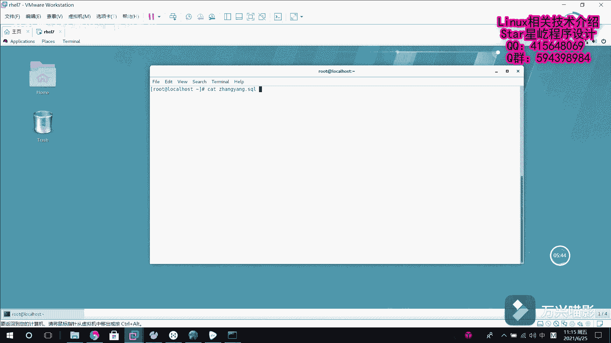

# 【Linux】从入门到精通 ｜ 零基础自学 ｜ 全套教程 ｜ RHCSA ｜ RHCE ｜ Linux爱好者 - P16：016-系统基础命令4（uptime、ifconfig、uname、pidof、free、cat、more、head） - Yo_Holly - BV1Df4y187g7

紧接着我们了解一下这个up time。up time这个命令，它的话就是说是主要是用于查看系统时间和负载信息，负载信息。这个的话它其实啊就相当于是刚才那个top命令输出的第一行。

然后这一块的话有一个负载均衡，主要是告诉用户系统CPU的一个使用情况。然后这这个第一行就是说输出的这一行，刚才这个怎么解读啊，刚才在top命令的时候已经解释了。呃，大家就是遵从刚才那个嗯来看就可以了。

然后需要然后介绍的这个命令是呃iffi，这个命令是系统状态检测的一个命令，它主要是用来检测网卡信息。然后这个的话是系统中所有的网卡信息。如果要是说我要看单个。具体的网卡它有哪些信息的话。

直接就是说是if卡fi后面加设备名称，是我现在的话要看这个ENS33它的一些信息。呃，首先啊解读这块的话，你看NNET后面是这个网卡的1个IP言码广播地址啊，然后INNET的话是V4IPV4版本。

下面也有IPV6的这个er的话，这块是呃这块网卡的麦克地址。然后下面的话是RX的话，RX是这个接收数据包呃的个数。然后TS的话是发送数据包的个数。然后后面的话对应也有一个流量的一个统计。

累计流量的一个统计。接下来介绍再介绍一个命令，是这个up name这个命令。这个命令的话是用于查看系统内核版本与系统架构等信息。他的他的就是说这个英文全称的话，它是这样的you name这个命令的话。

它全称是unic name。然后主要是呃获取系统的这个内核信息。呃，使用这个命令的时候，一般需要加一个选项是杠A选项。它的话就把所有的一些信息都给完整的展示出来。然后在这一块的话。

刚开始这个是系系统内核的名称。然后第二就这一块的话，local house localal domain这个是呃系统的主机名。然后3。10这一大长串。这个是系统的内内核发行版本，然后井号一的话。

这个是节点名。然后这个后面这一串时间的话，这个是呃压制时间。然后后面的话这就是硬件硬件名称，硬件平台，然后最后的话还有一个这个操作系统名称等信息，就是JNUlin。呃。

如果要是想查看当前系统版本的详细信息，然后是需要查看这个可以查看这个名，这个文件，也就是cast下面的ETC下面的red hunt release，它的话里面就告诉了这个系统版本的一个详细信息。呃。

紧接着介绍的这个命令是。呃，PID off这个命令就是大家都知道一个进程它有一个进程号。如果要是我是针对不同的进程，想看它的进程号的话，假如说我想看SSHD它的进程号的话。

就用这个PID off加上进程名，然后直接回车，然后就拿到了这个SSHD它的这个服务名服务的版本，就是进程号。接下来这个是free命令。这个free命令的话，它主要是用于显示系统中内存的使用量。

然后这个的话它是有呃三个参数，呃，要是以杠A时显示的话，它是会根据这个数值的大小，然后灵活灵活的去变更单位。然后现在的话它这块的有是有时记，也有是兆的去显示这个内存和交换空间的一个使用情况。

然后还有的话就是说如果我要是自己去指定的话，也可以是呃杠M是以兆为以兆为单位，然后fr瑞。杠G它是以G为单位。这个的话是以G为单位去显示。然后呃接下来介绍这个命令是last命令。这个last的命令的话。

它是主要是显示所有系统的登录记录。就是说是哪个用户，哪个用户什么时间登了，什么时间登了，就是看一下这些登录的信息，没看这些登录信息。呃，紧接着介绍的这个是语一文件呃操作有关的一些信息。

首先这个然后先L查看一下啊。这个下面的话，刚才以前的话咱们备份了一个这个张扬点circle。然后咱们现在就操作这个文件吧，然后是看的话是查看可以查看张扬点circle。这个的话查看的话。

它就是说是因为查看一些小的文件，它查看小文件，就是说是纯文本文件，内容较少的。如果要内内容很多的话，超过一屏的话，一般是用这个冒命令。然后它的话就是。

一次显示一屏，然后回车回车回车回车。往下查依次查看这些。具体信息。啊，这就是所有的这个信息。然后如果要是我我有一个需求是把一个文件当中前前几行前五行或者是后五行去拿到的话，是使用这个head这个命令。

然后head的话，然呃head它直接加一个文件名的话，它是默认是显示前五行，它就会把前前五行的一个信息给展示出来。这块纠正一下是一般的话是默认的话是显示前十行或者是最后十行。

这块的话也可以使用一个杠N选项，然后去指定显示几行。比如说我显示三行。然后他就把前三行给显示出来。然后tre的话也是依次的，比方说我显示前前前两行啊呃最后两行。然后他就会把最后两行给显示出来。

