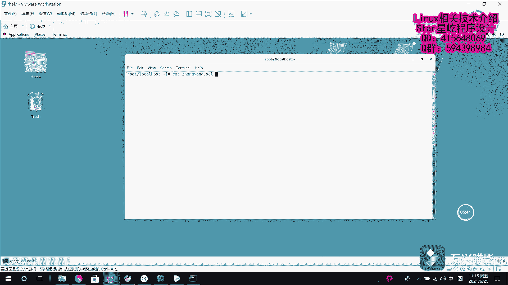

# Linux系统管理：P16：系统基础命令4（uptime、ifconfig、uname、pidof、free、last、cat、more、head、tail）📚

## 概述
在本节课中，我们将继续学习Linux系统的基础命令。我们将重点了解用于查看系统状态、网络信息、内核版本、进程ID、内存使用、登录记录以及文件内容查看的一系列实用命令。这些命令是日常系统管理和故障排查的必备工具。

---

## uptime命令：查看系统运行时间与负载

上一节我们学习了`top`命令，本节中我们来看看`uptime`命令。`uptime`命令主要用于查看系统的运行时间和负载信息。实际上，它输出的信息等同于`top`命令输出结果的第一行。

该命令输出的负载均衡信息，主要告诉用户系统CPU的使用情况。第一行的解读方式与在`top`命令中解释的完全一致，请参照之前的说明来理解。

**命令格式**：
```bash
uptime
```

---

## ifconfig命令：查看网络配置信息

接下来介绍`ifconfig`命令。这是一个系统状态检测命令，主要用于查看网卡的网络配置信息。

直接输入`ifconfig`会显示系统中所有网卡的信息。如果想查看单个具体网卡的详细信息，可以在命令后加上设备名称。

例如，要查看网卡`ens33`的信息，可以执行：
```bash
ifconfig ens33
```

以下是输出信息的解读：
*   `inet`后面显示的是该网卡的IPv4地址、子网掩码和广播地址。
*   下方可能还有`inet6`，显示的是IPv6版本地址。
*   `ether`后面显示的是该网卡的MAC地址。
*   `RX`部分统计接收数据包的数量。
*   `TX`部分统计发送数据包的数量。
*   后面还有对应的累计流量统计信息。

---

## uname命令：查看系统内核信息

再介绍一个命令：`uname`。这个命令用于查看系统内核版本与系统架构等信息。它的英文全称是“Unix name”，主要用来获取系统的内核信息。

使用这个命令时，一般加上`-a`选项，以完整展示所有相关信息。
```bash
uname -a
```

以下是输出信息的解读：
1.  开头部分是系统内核的名称（如`Linux`）。
2.  `localhost.localdomain`是系统的主机名。
3.  类似`3.10.0-...`的一长串是系统的内核发行版本。
4.  `#1`是节点名。
5.  后面的一串时间是内核编译时间。
6.  接着是硬件名称、硬件平台。
7.  最后是操作系统名称等信息（如`GNU/Linux`）。

如果想查看当前系统版本的详细信息，可以查看`/etc/redhat-release`这个文件，里面包含了系统版本的详细数据。

---

## pidof命令：查询进程ID号

大家都知道，每个进程都有一个唯一的进程号（PID）。`pidof`命令可以根据进程名称来查询其对应的进程号。

例如，想查看`sshd`服务的进程号，可以执行：
```bash
pidof sshd
```
命令执行后，就会返回`sshd`服务对应的进程号。

---

## free命令：显示内存使用量

`free`命令主要用于显示系统中内存的使用量信息。

该命令有几个常用参数：
*   直接使用`free -h`，会根据数值大小自动选择最合适的单位（如B、K、M、G）来显示内存和交换空间的使用情况，使结果更易读。
*   使用`free -m`，会以兆字节（MB）为单位显示。
*   使用`free -g`，则会以吉字节（GB）为单位显示。

**命令示例**：
```bash
free -h
```

---

## last命令：查看系统登录记录

`last`命令主要用于显示所有系统的登录记录。通过它，可以查看是哪个用户、在什么时间登录或登出了系统，便于审计和排查问题。

**命令格式**：
```bash
last
```

---

## 文件内容查看命令

接下来，我们介绍几个与文件操作相关的命令，它们用于查看文件内容。

首先，我们使用`ls`命令查看当前目录，假设这里有一个之前备份的名为`zhangyang.sql`的文件，我们将以它为例进行操作。

### cat命令：查看小文件

`cat`命令用于查看纯文本文件，特别是内容较少的文件。

**命令示例**：
```bash
cat zhangyang.sql
```

### more命令：分屏查看大文件

如果文件内容很多，超过一屏时，通常使用`more`命令。它可以一次显示一屏内容，按回车键可以逐行向下查看，按空格键可以翻页。



**命令示例**：
```bash
more zhangyang.sql
```

### head命令：查看文件头部内容

如果有一个需求是查看一个文件的前几行（例如前五行），可以使用`head`命令。

直接使用`head`加文件名，默认会显示文件的前十行。也可以使用`-n`选项来指定显示的行数。

**命令示例**：
1.  默认显示前十行：
    ```bash
    head zhangyang.sql
    ```
2.  指定显示前三行：
    ```bash
    head -n 3 zhangyang.sql
    ```

### tail命令：查看文件尾部内容

与`head`命令相对应，`tail`命令用于查看文件的最后几行。同样，默认显示最后十行，也可以用`-n`选项指定行数。

**命令示例**：
1.  默认显示最后十行：
    ```bash
    tail zhangyang.sql
    ```
2.  指定显示最后两行：
    ```bash
    tail -n 2 zhangyang.sql
    ```


---

## 总结
本节课我们一起学习了多个Linux系统基础命令。我们了解了如何用`uptime`查看系统负载，用`ifconfig`查看网络配置，用`uname`查看内核信息，用`pidof`查询进程ID，用`free`监控内存使用，用`last`审计登录记录，以及使用`cat`、`more`、`head`、`tail`等命令来灵活查看文件内容。掌握这些命令，将为你进行有效的Linux系统管理打下坚实的基础。