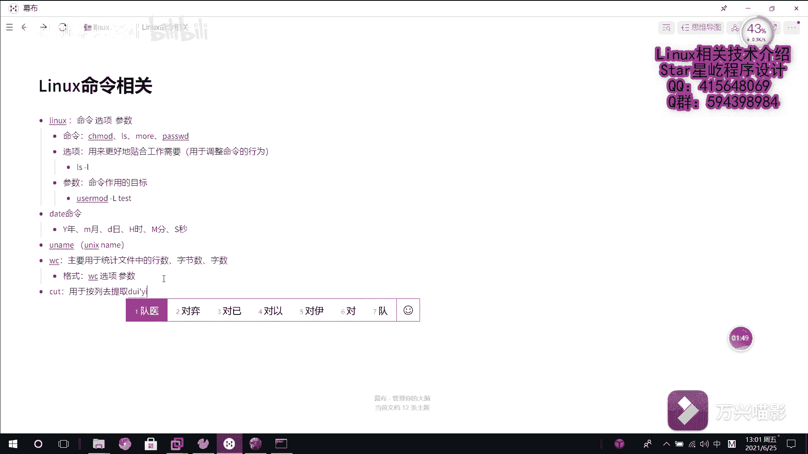

# 【Linux】从入门到精通 ｜ 零基础自学 ｜ 全套教程 ｜ RHCSA ｜ RHCE ｜ Linux爱好者 - P17：017-系统基础命令5（wc、cut、mkdir、mv） - Yo_Holly - BV1Df4y187g7

呃，本视频啊接着讲解呃linux常用命令。首先啊需要讲解的是这个WC命令。WC命令啊，它是主要用于统计文件中的行数字节数或者字数。它的话就是说我对文件的情况做一个大致的一个评估。

然后咱们首先先看啊这里面有一个B点TST。咱们先看它里面到底是哪些内容，它的话内容就是这些。然后咱们开始介绍这个WCWC的话呃杠L选项的话，它是用于显示文件的行数。然后后面的话是跟上文件名。

然后呃总共是B点TST里面它有8行。

WC，然后这个选项是杠C的话，它是显示字节数，英文字母的话是一个是占一字节汉字的话是一个占两字节。然后我们显示这个B点B点填ST里面占多少个字节，它是占87个字节，呃，还有的话是就是说是这个杠W选项。

W的话word嘛，它是用于显示单词数，它的话只统计英文单词数，然后我们就现在接着看一下啊，它里面的话总共有13个英文单词，数下12345678910111213，它是把每一个按空格分格。

然后去找就把它定位成一个单词，这块的话有13个，这个的话就是这个呃WC命令，紧接着啊就是说是介绍一下这个cut命令。呃，首先先完善下这个cut的话它主要是做什么cut主要是用于是按列，然后。

去提取对应的内容。

哦，cut的话，它是我现cut有一个杠D选项，这个杠D选项的话会是去指定它是以怎样分割的。咱们先看一下啊，就是咱们一会需要用的是这个A点TSTA点TST这个。文件它里面的内容的话就是这些内容。

然后看到啊就是说每一个数据的话，它都是以这个冒号去进行分隔。然后这块的话，咱们对它进行一个提取，提取第三行和第四提取第三列和第四列。然后杠D是指定分隔符，这块的话是以冒号分割，咱们在后面紧接着几个冒号。

然后杠F的话，这块是杠F是指定你提取哪几列。咱们说假如说提取第三列和第四列。然后提取哪个文件是A点TST哎，他就把这个提取出来了。具体的第第三列和第四列的内容就给提取出来了。这个的话就是cut命令。

是对文件进行一个截取，取出一取出一部分。然后紧接着是这个创建文件，这个创建文件的话，它是用的是这个。makeDIR就是make。Directorory。这个命令区主要是用于创建目录，然后直接创建。

假如说我创建1个AAA目录，哎，它是这个是单级目录嘛，我就可以直接创建。然后我fi尔杠AA它就会告诉你这个AA是一个目录。

假如说啊我现在再用这个那DIR这个命令去创建1个BBB下面的CCCC会发现它不能创建。因为就是说是如果你创建的话，BBB不存在的话，它是不可以嵌套去存直接就是说是按照这种嵌套关系。

把一连串的这个关系都就是目录结构都给创建好。然后这个时候如果还要创建的话，需要使用一个参数是杠P选项，就是使用这个杠P选项，然后再去指定这个参数BBB下面的CC然后就可以创建了。

这个时候然后我们再查看一下。呃，BBB下面的CCCC哎，然后它就会显示这是这是一个目录。呃，之前啊我们在windows下面的话，就是说我们假如说需要拷贝一份。

就是说是我把一个文件从当前位置移到另一个位置的话，这个操作叫剪切，在呃lin子下的话，它也有一个就是说是是这个。假如说我现在看一下啊。

LS像杠，我刚才创建的AAA下面，它是没有任何一个的。假如说咱们统计一下LS杠L杠AA杠AA，然后统计一下WC杠L。统计一下它的行数的话就是就是就是一行。然后咱们看一下它到底是是什么，是哪一行。

它就是一个显示说是它里面没有任何东西。对，这这个的话，首先啊它现在没有东西了。然后我们把当前路当前路径下这个AAA给它拷贝到AA目呃A点TST拷到AA目录下面。然后这个时候就使用到这个MV这个命令。

它的话主要是用于剪切文件，或者是将文件重命名。这个的话它是不同于复制的。因为复制的复制的话呃，复制的话，只是说我把当前文件它还在原位置存在。我把它在复制好之后，在另一个位置去存一份。

剪切的话是它会把默认会把原文件给删删掉，然后把它所有的内容移到另一个位置。比如说咱们现在把这个A点TST啊移到AAAAA下面。那么咱们CD到AAA下面LS就移过来了。

咱们在CD然后你看这块的话已经就没有AAA就A点TST这个文件了。然后MV的话，它还有一个功能，就是说是修改重命名嘛。假如说咱们现在把B点TST这个文件呃换成BBB。BBB点TST。

这个的话它就对它进行重命名了。然后这就是BBB点TST。然后它里面的话，咱们查看一下。他的话也就是刚才B点TST里面的内容，其实就是对它进行了一个文件重命名嘛。

