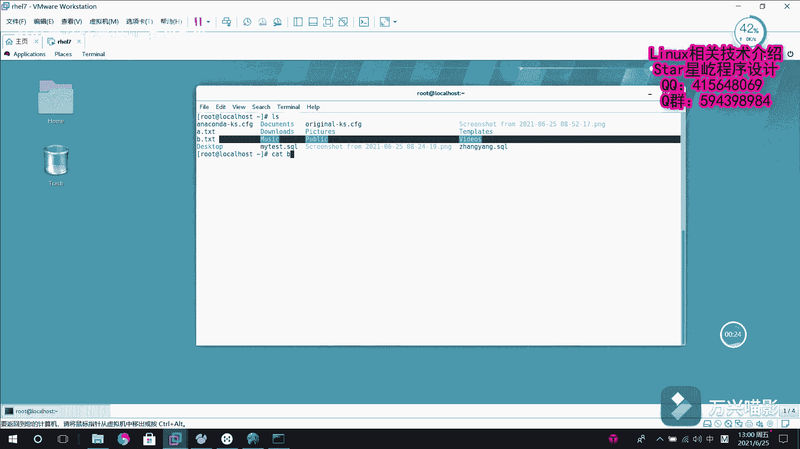
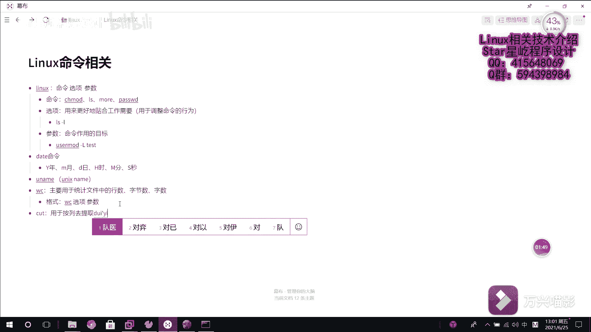
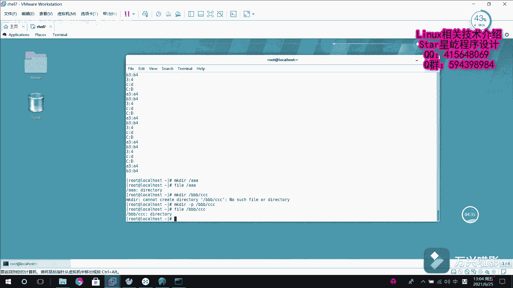

# Linux系统管理：P17：系统基础命令5（wc、cut、mkdir、mv） 📚

在本节课中，我们将继续学习Linux系统中几个非常实用的基础命令。我们将重点掌握`wc`命令用于统计文件信息，`cut`命令用于按列提取文本，`mkdir`命令用于创建目录，以及`mv`命令用于移动或重命名文件。这些命令是日常文件操作和文本处理的核心工具。

---

## 1. 统计文件信息：`wc`命令 📊



上一节我们学习了查看文件内容的命令，本节中我们来看看如何统计文件的基本信息。`wc`命令主要用于统计文件中的行数、字节数或单词数，帮助我们快速评估文件概况。

以下是`wc`命令的常用选项：

*   **`wc -l <文件名>`**：显示文件的行数。
    *   例如：`wc -l b.txt` 会输出文件`b.txt`的总行数。
*   **`wc -c <文件名>`**：显示文件的字节数。
    *   在编码中，一个英文字母通常占1字节，一个汉字通常占2字节。例如：`wc -c b.txt` 会输出文件的总字节数。
*   **`wc -w <文件名>`**：显示文件的单词数。
    *   此选项默认按空格分隔来统计英文单词。例如：`wc -w b.txt` 会输出文件中的英文单词总数。

---



## 2. 按列提取文本：`cut`命令 ✂️

了解了如何整体统计文件后，我们常常需要从文件中提取特定的部分。`cut`命令就是用于按列提取文本内容的强大工具，特别适合处理结构化的数据（如以特定符号分隔的表格数据）。

`cut`命令的核心在于指定分隔符和需要提取的列。

*   **`cut -d ‘分隔符’ -f <列号> <文件名>`**：这是最常用的格式。
    *   `-d` 选项用于指定字段的分隔符，例如冒号 `:`、逗号 `,` 或制表符。
    *   `-f` 选项用于指定要提取的列编号，可以指定单列（如`3`）、多列（如`3,4`）或一个范围（如`2-5`）。

例如，假设文件 `a.txt` 的内容是以冒号分隔的，我们想提取第3列和第4列：
```bash
cut -d ‘:’ -f 3,4 a.txt
```
执行此命令后，屏幕上将只显示 `a.txt` 文件中每一行的第3列和第4列内容。

---

## 3. 创建目录：`mkdir`命令 📁

处理完文件内容，我们来看看如何管理文件的容器——目录。`mkdir`命令用于创建新的目录，其名称来源于“make directory”。

以下是`mkdir`命令的基本用法：

*   **`mkdir <目录名>`**：在当前路径下创建一个单级目录。
    *   例如：`mkdir AAA` 会创建一个名为 `AAA` 的目录。
*   **`mkdir -p <路径/目录名>`**：递归创建目录。当需要创建的目录的上级目录不存在时，使用 `-p` 选项可以一次性创建所有不存在的父目录。
    *   例如：直接执行 `mkdir BBB/CCC` 会失败，因为 `BBB` 目录不存在。而执行 `mkdir -p BBB/CCC` 则会成功创建 `BBB` 目录及其子目录 `CCC`。

---



## 4. 移动与重命名：`mv`命令 🚚

最后，我们来学习如何改变文件或目录的位置与名称。`mv`命令的核心功能是“移动”，它可以将文件从一个位置剪切到另一个位置，也可以用来重命名文件或目录。请注意，移动操作会删除源位置的文件。

`mv`命令主要有两种用途：

1.  **移动文件或目录**
    *   命令格式：`mv <源文件或目录> <目标路径>`
    *   例如：`mv a.txt AAA/` 会将当前目录下的 `a.txt` 文件移动到 `AAA` 目录下。移动后，原位置的 `a.txt` 将消失。

2.  **重命名文件或目录**
    *   命令格式：`mv <旧名称> <新名称>`
    *   例如：`mv b.txt bbb.txt` 会将文件 `b.txt` 重命名为 `bbb.txt`，文件内容保持不变。

---

## 总结 🎯

本节课中我们一起学习了四个关键的Linux基础命令：
*   **`wc`** 命令用于统计文件的行数、字节数和单词数。
*   **`cut`** 命令能够按指定的分隔符和列号，精准地提取文本内容。
*   **`mkdir`** 命令负责创建目录，配合 `-p` 选项可以创建嵌套的目录结构。
*   **`mv`** 命令兼具移动和重命名两大功能，是管理文件位置与名称的必备工具。


熟练掌握这些命令，将极大地提升你在Linux环境下进行文件管理和文本处理的效率。