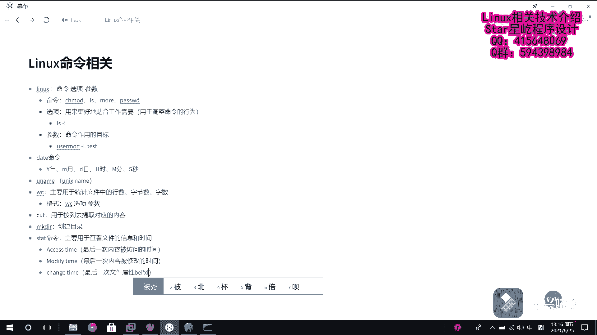
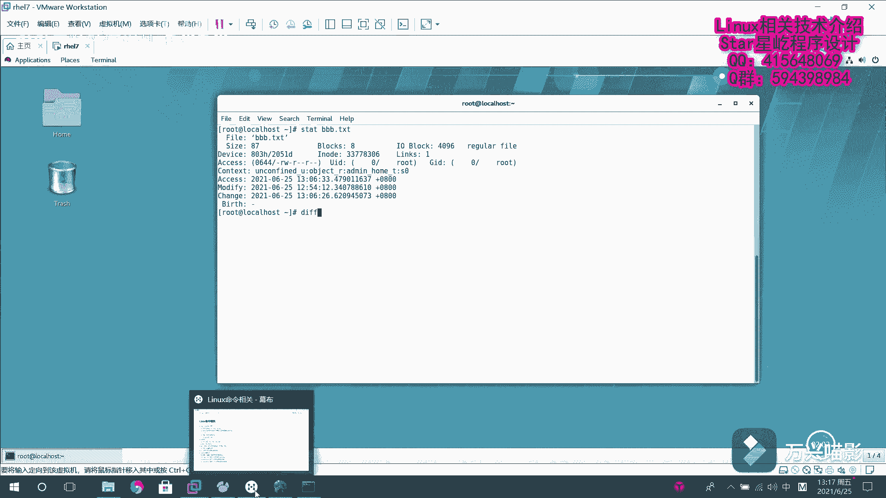
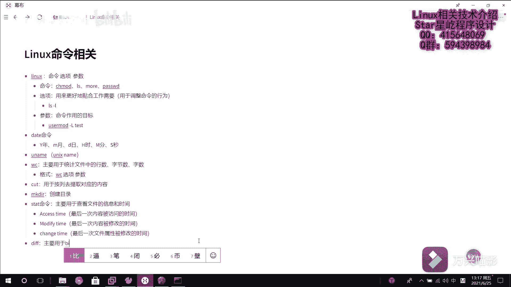
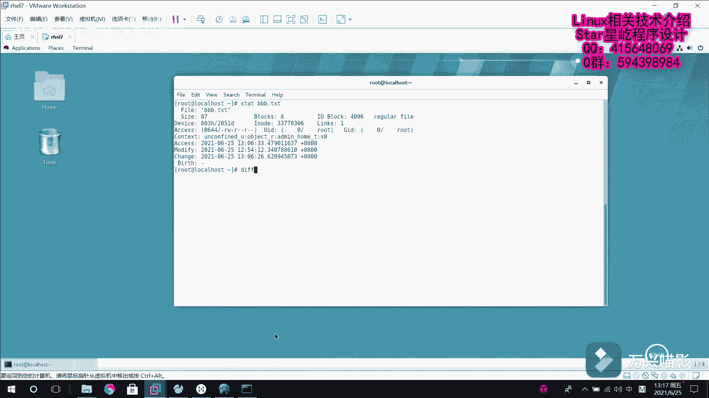
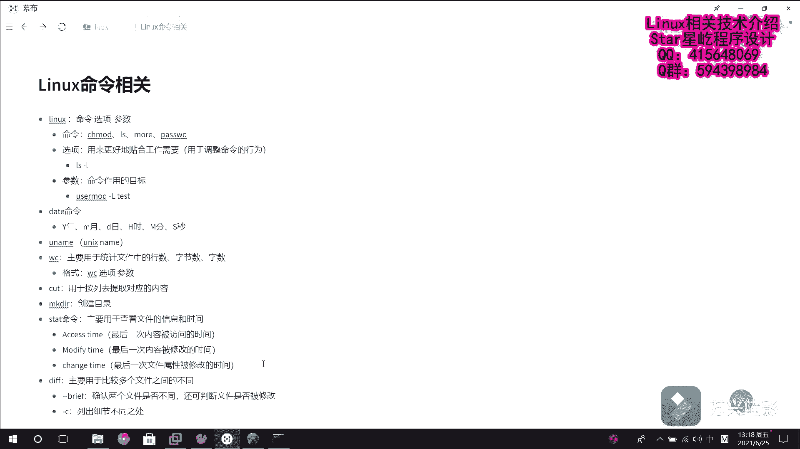
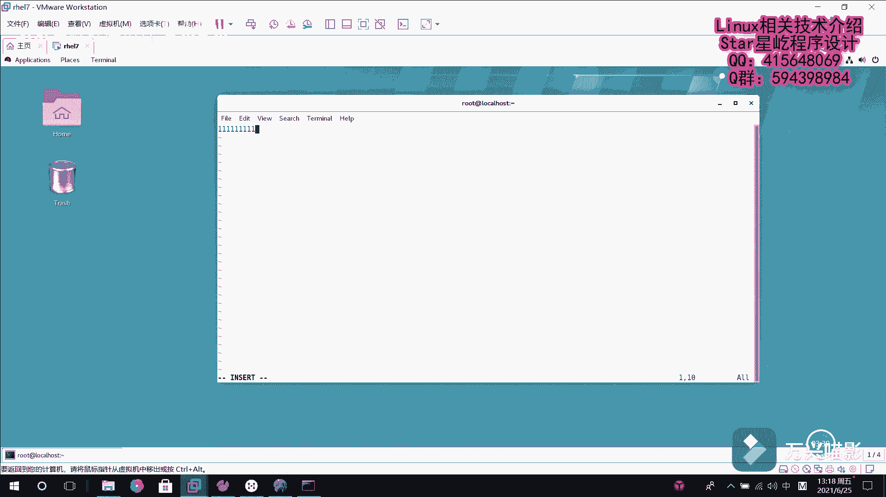
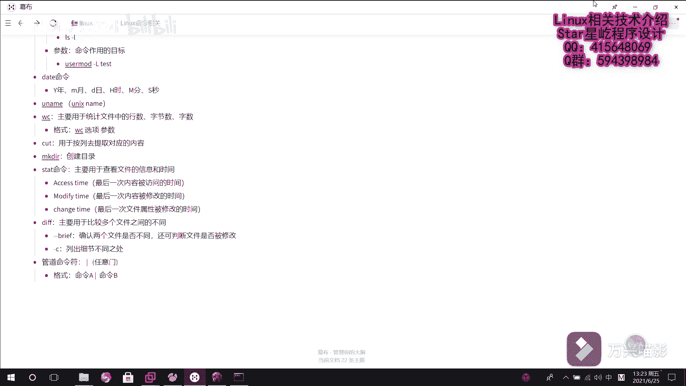
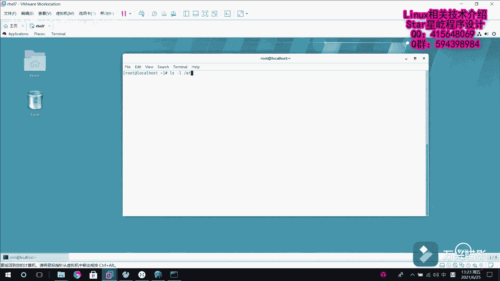

# 【Linux】从入门到精通 ｜ 零基础自学 ｜ 全套教程 ｜ RHCSA ｜ RHCE ｜ Linux爱好者 - P18：018-系统基础命令6（stat、diff、rm、管道命令符） - Yo_Holly - BV1Df4y187g7

紧接着需要介绍的是这个呃state命令。他的话是主要用于查看。查看文件的信息和时间。呃，说起这个呃文件的时间啊，很多人可能只知道文件它有一个修改时间，但是这样是非常不严谨的一件事情。

在lininux系统中啊，其实文件是包含三个时间状态的，分别是。Acess access time。ces time的话，它是主要是介绍的是。最后一次内容被访问的事间。然后还有一个是mod fan。

Moip by time。他的话是。呃，最后一次内容被修改的时间。然后紧接着是最后一个是这个change time。啊，它的称着time的话，它是最后一一次文件属性被修改的。

由这三个时间组成，然后咱们分别看一下，假如说我看一下这个VB开头的这个文件，它的一个信息。这块的话，你看有访问权限，然后有文件大小文件名。然后下面的话对应的是有这三个时间。然后对应的时间各是什么时候。

紧接着介绍一个命令是这个df命令。

呃，他的话是。主要用于呃比较多个文件之间的不同。

然后他的话是主要的话是有两个参数。

啊，两个参数的话分别是杠杠瑞。B not brief。他的话是就这块是用于。嗯确确认两个文件是否不同，还可判断文件是否被修改。呃，还有一个是杠C选项，这个杠C选项的话是列出列出细节嗯，不同之处。

然后完了咱们用一下这个命令。现在啊首先是。呃，创建一个创建两个文件，然后分别在里面填一下内容。假如说一点TST创建一下这个。然后我在里面的话，我写111。2啊。对。然后我拷贝一份拷贝一份这个文件。

比如说叫2点TST，然后它的话。呃，和原来的这个1点TST就是完全一样的。现在的话，我对2点TST对它进行修改。比如说我把它修改成第二行是333。

对，这样修改之后，然后首先使用呃d这个长命令杠bri杠bri先看一下它俩之间是它俩文件是否相同，这块的话会列出，就是说是它俩是不同的。然后我们看一看他俩具体哪块不同杠C选项。

然后一点TST和2点TST他俩具然后这块的话就会列出这个信息，然后会告诉他俩的话就是说上面是1点TST，下面是2点TST，他俩的不同会出现出现在这个感叹号之处，也就是第二行。

然后一个是2221个是333。这个的话就列出了呃两个文件之间有什么不同。然后现在的话比如说我再介绍一下，我有了这个文件之后，我不想要这个文件，我想把文件删掉，使用这个RMre removemo这个命令。

它的话就是说假如说我现在直接删除这个1点TST它会询问你是否删除，你输入一个Y，嗯，它就删除了。一点TST就没有了。但是如果要是说你很确定这个文件，就是说我直接肯定是直接要删除的。

就是说我不需要再确认了。然后这块的话也可以就是说指定这个杠LF，然后去删除一个文件，然后我不需要确认。比如我把2点TST去删除，它直接就删除了，也省去了这个询问询问的环节。呃。

最后需要介绍的一个是管道命令服务。管道的话它是这么回事。他是管道操作n命令服。他的话其实就是一个这个住线。然后他就叫管道服，或者叫任意门。也就是说我我之前那个操作前前一个操作，然后通过这个斜线。

也就相当于是一个传输通道，一个门一样，我就可以把我的输出内容传送给后面，让它继续来进行处理。然后呃这个的话，它的格式就是格式是这样的，是命令命令A。然后任意门。00B。他的意思就是说。

我将命令A原来要输出到屏幕上的信息，然后交给命令B进一步去处理。然后这一块的话，咱们举一个例子就可以看到了。比方说我现在LS杠L，我需要查看ETC下面所有的信息，以长列表方式展示。

这就是ETC下面所有的信息。但是啊我我展示了这些信息以后，我我可能之后啊，我想统计就是说ETC下面它到底有多少内容，我需要统计一下，就是然后我把它刚才输出的这个内容就传送到传送给后面。

刚才咱们不是学习了WC命令，WC杠L我就可以对它进行处理，去统计它到底有多少行。然后这一块的话就会告诉你啊，在ETC下面，它总共有278行，这个的话就是管道符的一个使用。

