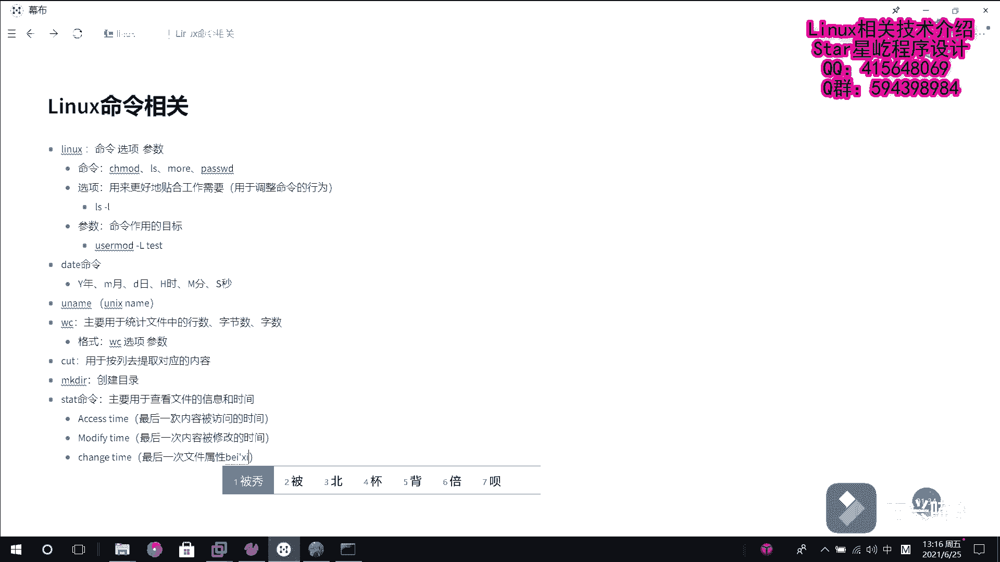
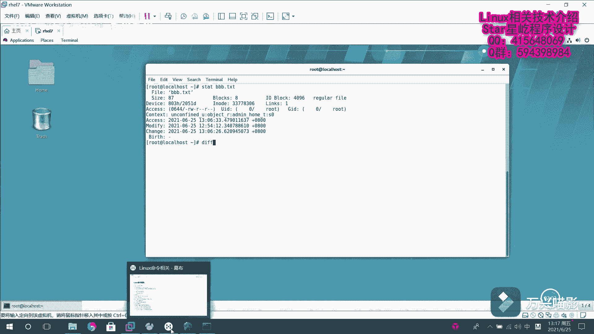
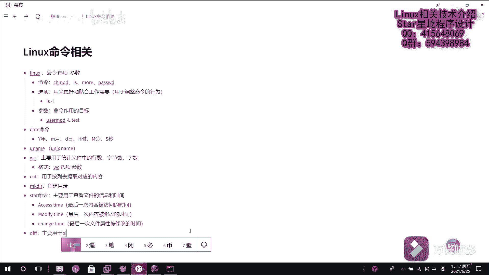
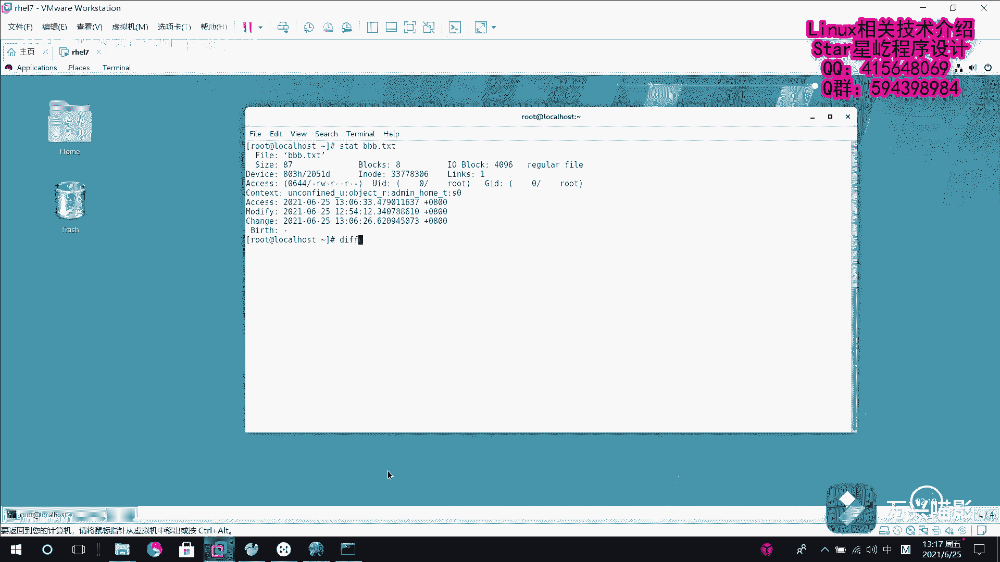
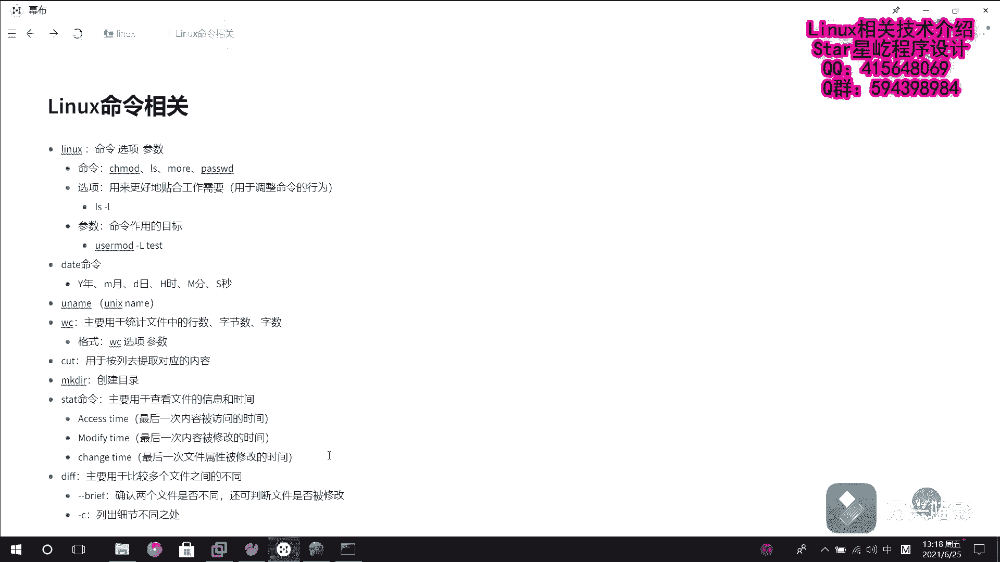
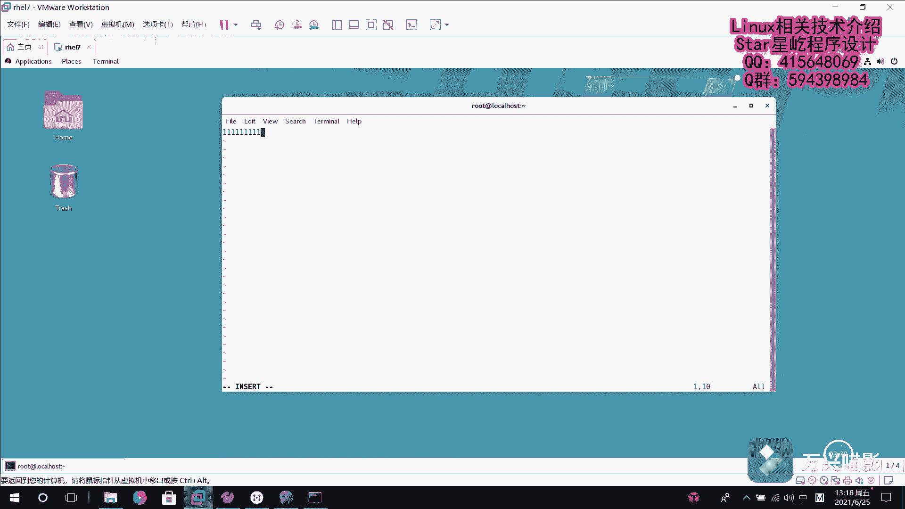
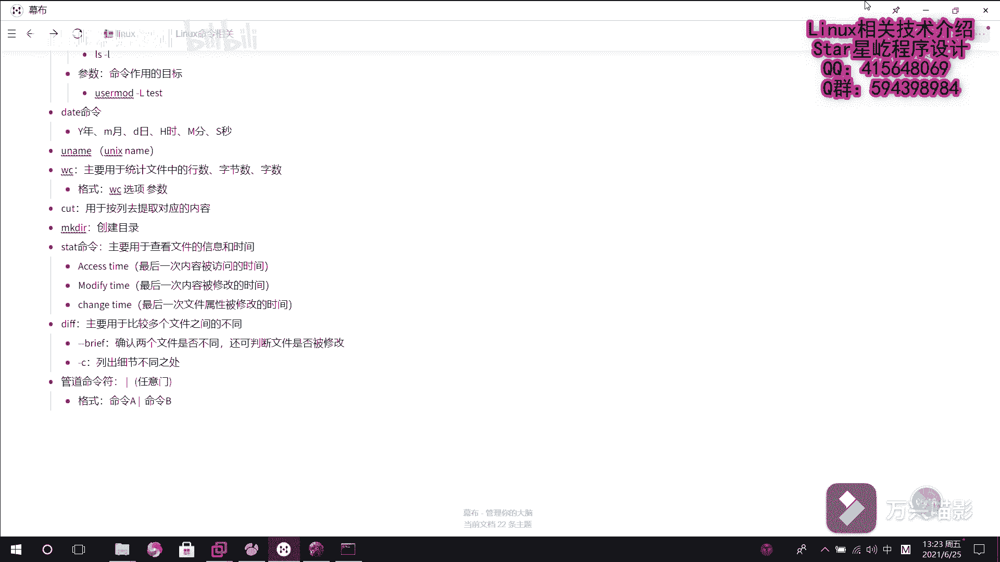
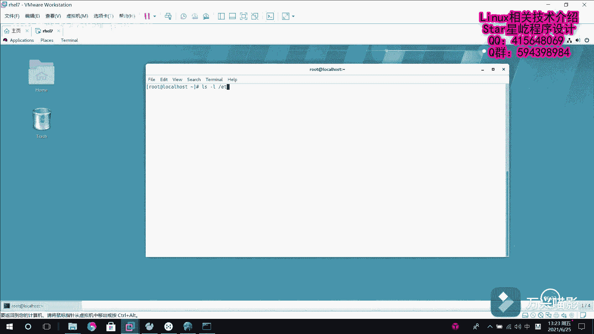

# Linux系统管理：P18：系统基础命令6（stat、diff、rm、管道命令符）📖

在本节课中，我们将学习四个重要的Linux基础命令：`stat`、`diff`、`rm`以及管道命令符 `|`。这些命令将帮助我们查看文件详细信息、比较文件差异、删除文件，以及将多个命令串联起来进行更高效的操作。

---

## 使用 `stat` 命令查看文件信息与时间 🕐

上一节我们学习了文件的基本操作，本节中我们来看看如何查看文件的详细信息。`stat` 命令主要用于查看文件的元数据信息，特别是文件的时间属性。



很多人可能只知道文件有一个“修改时间”，但这并不严谨。在Linux系统中，每个文件都包含三个独立的时间状态：

以下是这三个时间状态的详细说明：
*   **Access Time (atime)**：表示文件内容最后一次被访问的时间。
*   **Modify Time (mtime)**：表示文件内容最后一次被修改的时间。
*   **Change Time (ctime)**：表示文件属性（如权限、所有者）最后一次被修改的时间。



我们可以使用 `stat` 命令来查看这些信息。例如，查看一个名为 `vb.txt` 的文件：
```bash
stat vb.txt
```
命令输出会显示文件的访问权限、大小、文件名以及上述三个时间戳，清晰地展示了文件的完整状态。



---



## 使用 `diff` 命令比较文件差异 🔍

了解了如何查看单个文件的信息后，我们来看看如何比较多个文件之间的不同。`diff` 命令主要用于比较两个或多个文件内容的差异。



`diff` 命令有两个常用的参数，可以帮助我们以不同方式查看差异。

以下是这两个核心参数的功能：
*   **`--brief` 或 `-q`**：此选项仅确认两个文件是否不同，常用于快速判断文件是否被修改过。
*   **`-c` 选项**：此选项会列出文件之间具体的不同之处，并以详细的上下文格式显示。

让我们通过一个例子来实践。首先，创建两个内容相似但有区别的文件：
```bash
echo -e "111\n222" > 1.txt
cp 1.txt 2.txt
echo -e "111\n333" > 2.txt
```
现在，我们使用 `diff` 命令进行比较。先使用 `-q` 选项快速判断：
```bash
diff -q 1.txt 2.txt
```
输出会告诉我们这两个文件是不同的。接着，使用 `-c` 选项查看具体差异：
```bash
diff -c 1.txt 2.txt
```
输出会清晰地指出，两个文件的差异在第二行，`1.txt` 是 `222`，而 `2.txt` 是 `333`。



---

## 使用 `rm` 命令删除文件 🗑️

当我们比较或处理完文件后，有时需要删除不再需要的文件。`rm` (remove) 命令用于删除文件或目录。

默认情况下，使用 `rm` 删除文件时，系统会进行确认提示，以防止误操作。

以下是 `rm` 命令的一个关键选项：
*   **`-f` 选项**：此选项表示强制删除。使用它时，系统将不会进行任何确认提示，直接执行删除操作，适用于你非常确定要删除文件的情况。

例如，删除文件 `1.txt`（系统会询问）：
```bash
rm 1.txt
```
输入 `y` 确认后，文件被删除。如果我们确定要删除 `2.txt`，可以使用 `-f` 选项跳过确认：
```bash
rm -f 2.txt
```
文件会被立即删除，没有提示。

---

## 使用管道命令符 `|` 连接命令 ⛓️

最后，我们来学习一个能极大提升命令效率的工具——管道命令符 `|`。它就像一个“任意门”或传输通道，能将一个命令的输出，直接作为另一个命令的输入进行处理。

管道符的基本格式如下：
```
命令A | 命令B
```
它的含义是：将 **命令A** 原本要输出到屏幕上的标准输出信息，传递给 **命令B** 做进一步的加工处理。

让我们通过一个例子来理解。假设我们想查看 `/etc` 目录下有多少个条目。我们可以分两步走：先列出所有内容，再统计行数。使用管道符，这两步可以合并为一步：
```bash
ls -l /etc | wc -l
```
在这个命令中：
1.  `ls -l /etc` 负责列出 `/etc` 目录的详细内容。
2.  `|` 将上一步的输出结果“传送”给下一个命令。
3.  `wc -l` 接收这些输出，并统计其行数。

最终，终端会直接显示一个数字，例如 `278`，这就是 `/etc` 目录下的总条目数。通过管道符，我们无需生成中间结果，就能流畅地完成复杂的任务。

---





## 总结 📝


本节课中我们一起学习了四个核心的Linux命令和操作符。我们使用 `stat` 命令查看了文件的详细信息和三种时间状态；通过 `diff` 命令比较了文件之间的差异；掌握了使用 `rm` 命令安全或强制删除文件的方法；最后，我们认识了功能强大的管道符 `|`，它能够将多个命令串联起来，实现数据流的无缝处理和更高效的任务完成方式。熟练掌握这些工具，是进行高效系统管理和自动化操作的基础。