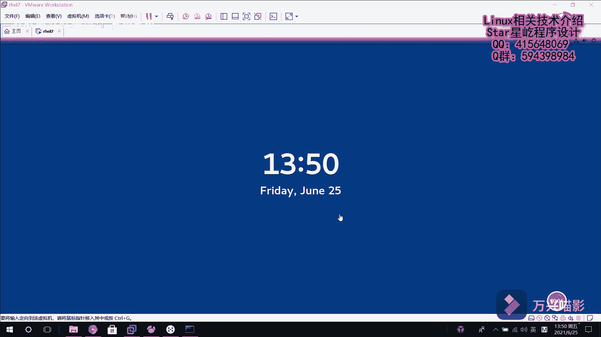
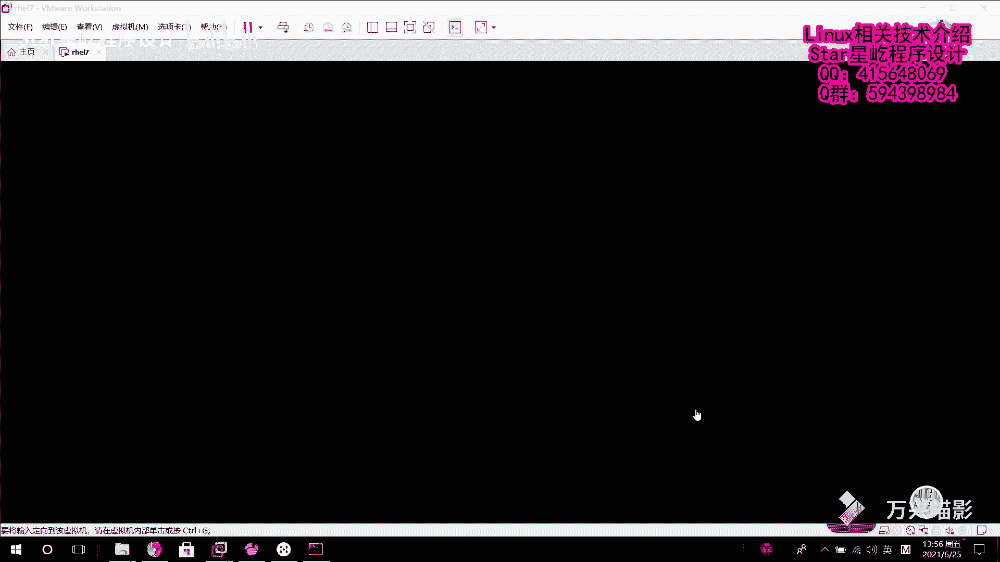

# 【Linux】从入门到精通 ｜ 零基础自学 ｜ 全套教程 ｜ RHCSA ｜ RHCE ｜ Linux爱好者 - P19：019-rhel7破解系统密码 - Yo_Holly - BV1Df4y187g7

紧接着我们介绍一种情况，就是说如果我在呃之前设置的那个roroot用户的密码，我在登录的时候，我哎我把密码给忘记了。我现在进入不了系统了，我该怎样去破解root密码，然后让我重新能够登录到系统当中。

首先假如说咱们现在看。

我回车。哎，我的密码已经忘掉了，我现在已经进不了系统了。然后我现在需要做的说是首先啊我先点击重启这个客户机，重启客户机。他就进客户机入重启了。然后啊在这块出现这个以后，赶紧按D按任意键。

按意键就进入到就是说是我就阻断了那个系统的加载器到时呃，倒计加载器倒计时。然后进入到这块以后，我找到lininux16行，然后按E，它就可以开始对本行进行编辑。然后我在这个末尾加上2D点break。

然后ctrol X保存刚才的更改。然后在这一块它就会出现一个root share。然后在本在到到达这个阶段的时候，那个呃系统的那个root文件系统已经以只读的方式挂载到那个S根目录下的SYroot下面。

首先啊咱们先看一下挂载情况mount子。看。这款啊。它这个SYSroot这个的话是那个呃root的文件系统，它是以只读方式挂载的，所以它肯定是不能进行写操作的。所以咱们现在需要重新去挂载。

remote重新去以指读方式去挂在。以读写方式去挂载这个跟文件系统。然后挂载好之后。我们进行文件系统的切换，把它切换到这个呃SOSroot文件系统下面。然后紧接着我们去更改用户密码。

比如说我这块的密码设置成readd hand。然后。我已传送门。也就是管道符的方式。然后这边的话有一个这个定向输入去接收，把它传给root当密码。然后回车这块的话就会提示刚才所有的修改操作已经成功执行。

然后本现在的话，这个root的密码就进就修改了。然后紧接着我们做一件事情是au to auto to relieve。它的话是主要做了这么一件事，确保所有未标记的文件在启动过程中都会被重新标记。

也就是说，让SElinux生效，然后回车ESIT。首先啊第一次我退出呃change root的文件存放位置，然后第二次。第二次我退出这个调试调试线。然后紧接着它就会进行重启。

他就会把刚才所有的操作都给嗯配置一遍，然后完了重启。在这一块可能会等待很长的一个时间，这块需要耐心去等待。然后系统进呃重新启动啊，它就会执行完整的SElinux重新进行标记。现在的话。

系统就开始重启操作了。

然后这个闪烁之后，紧接着这块就是用户的登录界面。然后咱们以root用户进行登录，登录的时候是密码是red hat。然后这块的话就提示登录成功了。最后一次登录是什么时候？

这样就在我呃已经忘记系统密码的情况下，成功的将root密码进行破解，让我能够再次回到我的界面去进行接下来的工作。

