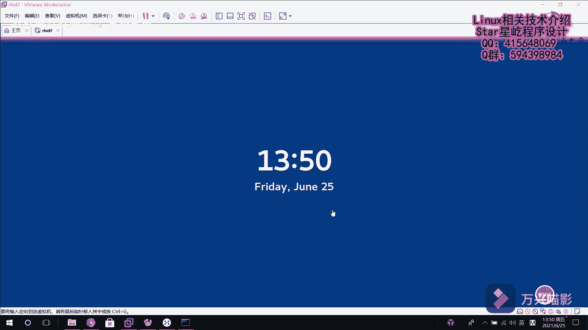
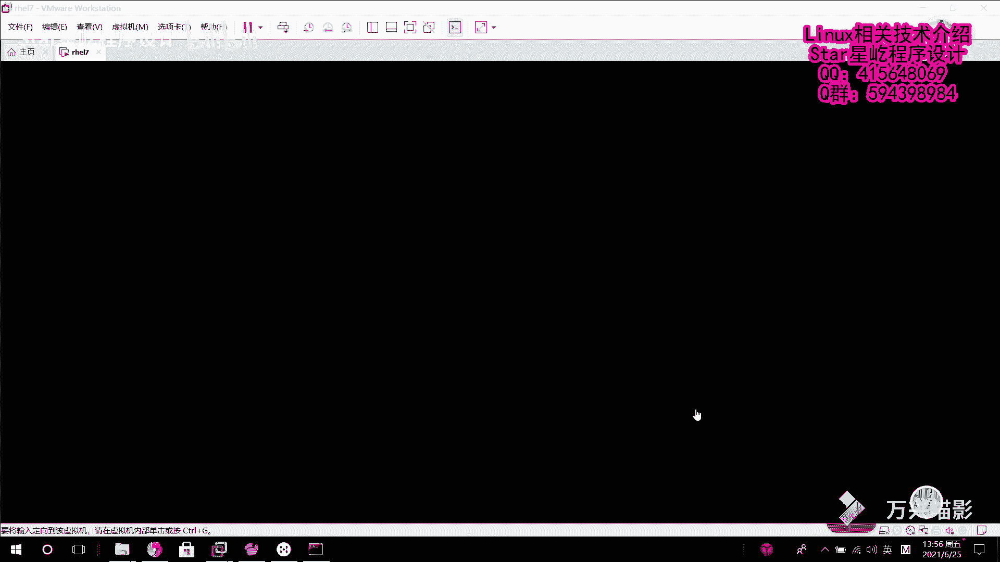

Linux系统管理：P19：破解RHEL7系统root密码 🔑

## 概述
在本节课中，我们将学习当忘记RHEL7系统的root用户密码时，如何通过单用户模式进入系统并重置密码。这是一种重要的系统恢复技能。

## 问题场景
上一节我们介绍了用户和密码管理。本节中我们来看看一种特殊情况：如果忘记了之前设置的root用户密码，导致无法登录系统，该如何破解root密码以重新获得系统访问权限。

假设在登录界面输入密码时提示错误，确认密码已遗忘，无法进入系统。

## 破解密码步骤详解
以下是破解RHEL7系统root密码的完整操作流程。

1.  **重启并中断引导过程**
    首先，重启客户机。当屏幕出现引导界面时，迅速按下任意键（通常是`E`键），以中断引导加载器的倒计时。

2.  **编辑内核启动参数**
    进入引导菜单后，找到以`linux16`开头的行，按`E`键进入编辑模式。在该行的末尾，添加参数 `rd.break`。
    编辑完成后，按 `Ctrl + X` 保存更改并继续启动。

3.  **进入紧急模式Shell**
    系统启动后会进入一个紧急模式的Shell环境，提示符为 `switch_root:/#`。此时，系统的根文件系统已以**只读**方式挂载到 `/sysroot` 目录下。

4.  **重新挂载根文件系统**
    由于需要对系统进行写操作（修改密码文件），必须将根文件系统重新挂载为**读写**模式。
    执行命令：`mount -o remount,rw /sysroot`

5.  **切换根目录环境**
    接下来，将操作环境切换到实际的根文件系统下。
    执行命令：`chroot /sysroot`

6.  **修改root用户密码**
    现在可以修改root用户的密码了。例如，将新密码设置为 `redhat`。
    执行命令：`echo "redhat" | passwd --stdin root`
    此命令使用管道符`|`将字符串“redhat”传递给`passwd`命令，作为root用户的新密码。

7.  **确保SELinux上下文生效**
    在RHEL/CentOS 7系统中，必须确保SELinux安全上下文正确，否则可能导致系统无法正常启动。
    执行命令：`touch /.autorelabel`
    此命令创建一个标记文件，系统在下次启动时会自动重新标记所有文件的SELinux上下文。

8.  **退出并重启系统**
    首先，退出`chroot`环境：`exit`
    然后，退出当前的Shell并重启系统：`exit`
    系统将执行重启操作，并可能花费较长时间进行完整的SELinux重新标记，请耐心等待。

## 验证结果
系统重启完成后，将再次进入登录界面。此时，使用root用户和新设置的密码（例如 `redhat`）即可成功登录系统。

## 总结
本节课中我们一起学习了在RHEL7系统上破解root密码的完整流程。关键步骤包括：中断引导、编辑内核参数进入单用户模式、重新挂载文件系统、使用`chroot`切换环境、修改密码，以及最后确保SELinux上下文正确。掌握此方法可以在忘记密码时恢复对系统的访问权限。