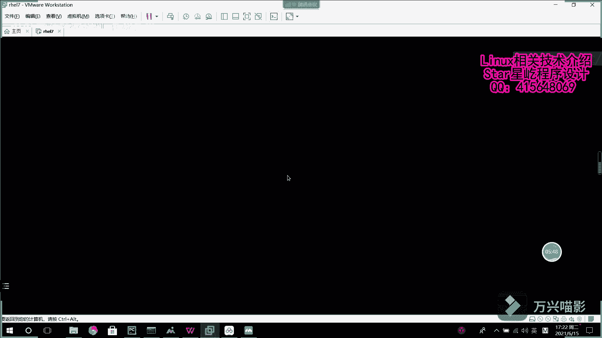

# 【Linux】从入门到精通 ｜ 零基础自学 ｜ 全套教程 ｜ RHCSA ｜ RHCE ｜ Linux爱好者 - P1：001-虚拟机安装 - Yo_Holly - BV1Df4y187g7

虚拟机管理工具去装一个虚拟机。然后本次啊咱们这个虚拟机的那个镜像文件，选用的是红帽七版本的一个镜像文件，然后对它进行一个虚拟机的安装。首先啊点击这个viware呃，它这块有个虚新建虚拟机。

然后下一步这块的话就是说它是需要找一个这个音像文件。然后啊就在这一块就找到需要使用的这个镜像文件，咱们这一块使用的是呃红帽的7。5版本的一个镜像，然后选择下一步这块的话是在红装这个红帽系统的时候。

它会在这块有一个个性化的这个linux。然后在stoS的那些，它是没有这个的用户名的话是自己取啊。然后密码的话，记住就可以了，自己也是起下两遍。呃，这块的话是给那个虚拟机啊，一会创建的虚拟机起一个名字。

也就是说他能描你这个虚拟机。然后这块的话是你分配给这个虚拟机，它的磁盘的一个大小。然后20G咱们就可以够用了。然后这块的话是自定一个硬件啊，你像这个什么处理器啊，这些如果要你想更快一点的话。

就可以给它调大一点啊。假如候你调个两个处理器是吧？然后这块的话是CD这个的话其实就是一个那个挂载文件。然后之后的话，假如说你需要下载一些呃软软件，就是说你从样么仓库配这个样么仓库的时候。

你就可以使用这个IOS镜像文件去做一个仓库去使用。然后供你去下载一些软件。然后紧接着就是完成。

然后这样的话就是一个虚拟机基础的一个配置，它就已经好了。现在的话它就开始加载这个虚拟机这这一块的话可能等待时间会比较长一点。这个的话它就是进行一些呃初始化的一个加载，然后它有一些加载信息。

这些OK的话就是说我加载某个某个信息的时候，它是没有问题的。然后紧接着啊就是说这个呃整体啊这个加载项过去之后，它会出现一个那个图形化的一个可选界面。在这个界面当中啊，咱们需要选择咱们的安装方式。

然后首先看到这个这个这块的话，它是这个软件选择。在这块的话，它首先啊对环境的安装的话，首先有一个最小化安装。这个的话是那个字符界面，一般在就是说实际使用当中啊，很多是没有图形化的，也就是这个最小化安装。

然后因为就是说建议初学啊，所以咱们这一次装这个serv server with jY。然后就是说以JUI的方式我去操作这个linux的界面。然后在这块你选择这个server withGUI以后。

它的这块对应的就会给你提供很多的一个软件包。然后你可以去在不环境的时候，就对哪些这个软件软件就给它进行安装进去。

然后这一块的话，咱们就是说提前这一块咱们就不做这些了。比如说咱们点一个这个文件文件服务器，假如说点一个这个它默认里面的话就会有这个文件服务器。然后其余的咱们就不点了。这个之后咱们配置一个yM源。

然后自己通过就个那个yM去安装吧。然后选择了这个安装安装环境以后，然后其次的话就是选择一个对应的时区。因为不是咱们是在中国嘛，然后中国这块的话是选择这个上海市区点这一块，它就选择选择成了亚洲的上海时区。

然后选择档这个的话就把时区选择好了。然后其次的话就是网络连接这一块，然后网络连接的话，默认让网络连接开启就可以了。然后这些的话就没没有问题了，这个就是点进去都选择一下就可以了，这个就没问题了。

然后是呃开始安装。在这一块的话，咱们去配置一个用户。然后配置的这个用户的话，就是密码输入一下自己的密码。然后到。就可以了。然后紧接着他就是开始这个软件的安，就是说对这个系统进行整体的安装。

这块的话时间等待的话也会比较久一点，因为安装的包也挺多的。话他就已经开始安装了。这个你看啊他总共需要装1000多个包，把所有的包装好之后，这个虚拟机其实也就是相当于是一个系统，它就安装好了。

然后你就可以开始你的linux之旅了。

这的话就是1000多个软件包，它都给安装好之后，系统就开始呃系统就开始好，就装好了。然后它又会基础运行以后，你看它这一块就会到时候就会提示开始开启一个提示项。然后你看这就是系统已就已经安装好了。

然后是刚才咱们创建的那个临时创建的一个用户。然后他的密码是什么？刚才你写的是什么，然后你直接输入就可以了。然后回车他就进入这个系统了。

