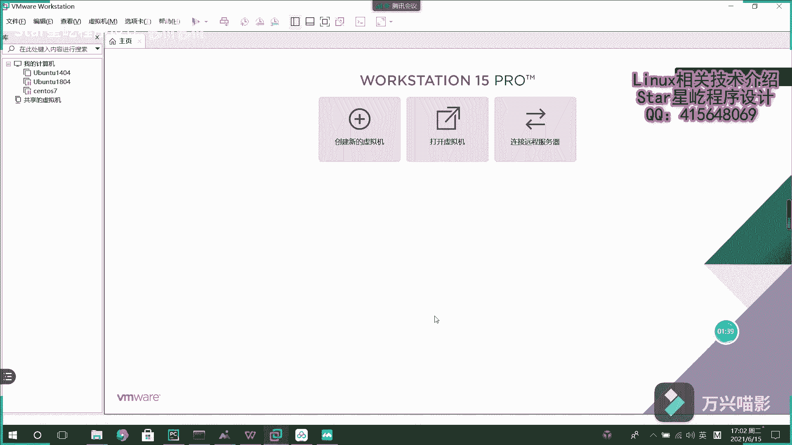
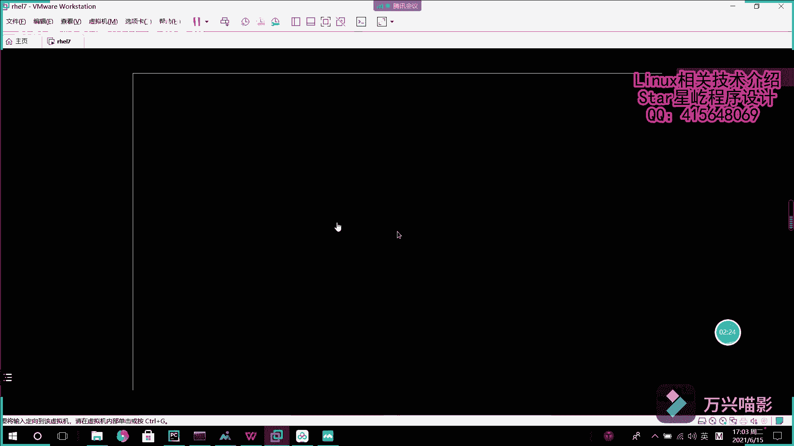
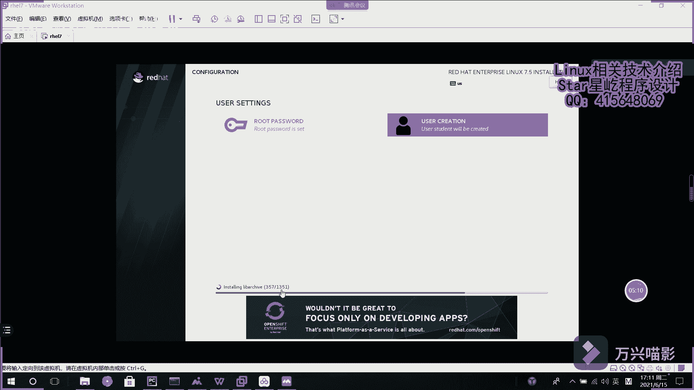
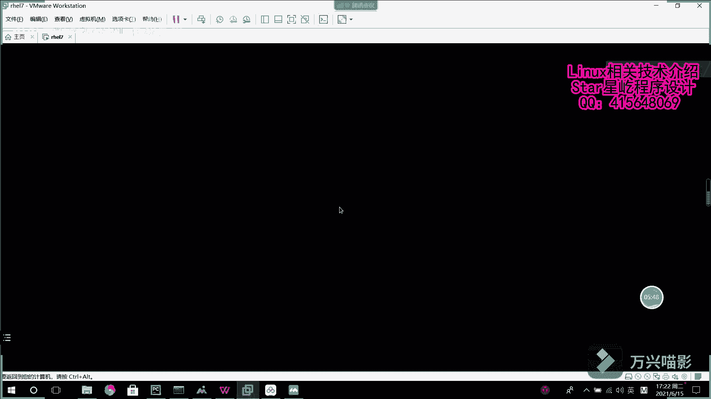

# Linux入门到精通：001：虚拟机安装 🖥️

在本节课中，我们将学习如何在VMware虚拟机管理工具中安装一个Linux系统。我们将使用红帽7.5版本的镜像文件，完成从创建虚拟机到系统初始化的全过程。

## 概述

我们将使用VMware Workstation创建一个新的虚拟机，并为其安装红帽企业版Linux 7.5操作系统。整个过程包括选择镜像、配置虚拟机硬件、进行系统安装设置以及完成初始配置。

## 创建虚拟机

首先，打开VMware Workstation，点击“新建虚拟机”开始创建过程。

在新建虚拟机向导中，选择“自定义（高级）”配置，以便更细致地调整硬件设置。

下一步是指定安装来源。我们需要在此处选择准备好的红帽7.5 ISO镜像文件。操作如下：
*   浏览并选择你下载好的红帽7.5 ISO文件。

选择镜像后，系统会识别出这是红帽企业版Linux 7。接下来，需要设置一个初始用户。这个用户名可以自定义，密码需要输入两次以确保一致，请务必记住此密码。

之后，为虚拟机命名。这个名字用于在VMware中标识这台虚拟机。

接着，需要指定虚拟磁盘的大小。对于初学者学习环境，分配**20GB**的磁盘空间通常足够使用。

最后一步是自定义硬件配置。你可以根据宿主机的性能调整虚拟机的资源，例如：
*   **内存**：建议分配至少2GB。
*   **处理器**：可以分配2个CPU核心以提升运行速度。
*   **CD/DVD**：确保已连接到之前选择的ISO镜像文件。这个镜像文件在后续配置系统软件源（YUM仓库）时也可能用到。

完成所有配置后，点击“完成”，VMware便会开始创建虚拟机。

## 安装操作系统

虚拟机创建完成后，会自动从ISO镜像启动，进入系统安装界面。首先会经历一个较长的初始化加载过程，屏幕上会滚动显示“OK”信息，表示各项检查通过。

加载完成后，会进入图形化的安装配置界面。

### 选择安装环境

首先需要选择软件安装环境。在“软件选择”界面中，提供了多个选项：
*   **最小安装**：仅安装命令行界面，没有图形桌面。这是生产环境中常见的部署方式。
*   **带GUI的服务器**：安装包含图形桌面环境的服务器系统。为了方便初学者直观操作，**本次我们选择此选项**。

选择“带GUI的服务器”后，右侧会列出可选的附加软件组。例如，勾选“文件服务器”会预先安装相关的服务软件包。为了保持系统简洁，我们暂时不勾选任何附加项，后续可以通过配置YUM源来按需安装软件。

### 配置系统设置

选择好安装环境后，需要进行几项基本配置。

首先是设置时区。因为我们在中国，所以在地图上点击**上海**区域，时区会自动设置为“亚洲/上海”。

接着配置网络。点击“网络和主机名”，将右上角的网络连接开关**打开**，以确保安装完成后系统可以联网。

### 开始安装并设置密码

所有配置确认无误后，点击界面右下角的“开始安装”按钮。

在安装过程进行的同时，我们需要设置**root管理员账户的密码**。点击“ROOT密码”进行设置，输入并确认密码。请务必牢记此密码。

系统安装过程需要安装1000多个软件包，因此需要等待一段时间。

## 完成安装与首次启动

当所有软件包安装完毕，安装程序会提示“安装完成”。点击“重启”按钮，虚拟机将重新启动。

重启后，系统会进入登录界面。你可以使用安装时创建的普通用户账户，或者使用**root**账户进行登录。输入对应的密码后按回车，即可成功进入红帽Linux 7.5的图形化桌面环境，开启你的Linux学习之旅。

## 总结

本节课我们一起学习了如何在VMware中创建虚拟机并安装红帽企业版Linux 7.5操作系统。关键步骤包括：创建虚拟机、挂载ISO镜像、选择“带GUI的服务器”安装环境、配置时区与网络、设置root密码以及完成系统安装。现在，你已经拥有了一个可以随时练习和探索的Linux实验环境。