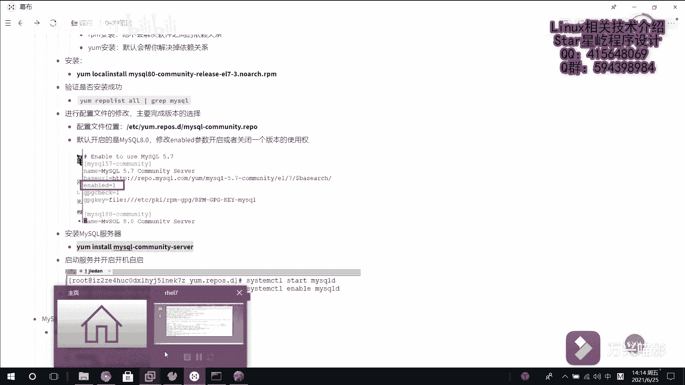

# 【Linux】从入门到精通 ｜ 零基础自学 ｜ 全套教程 ｜ RHCSA ｜ RHCE ｜ Linux爱好者 - P20：020-MySQL数据库部署 - Yo_Holly - BV1Df4y187g7

接下来的视频中啊，我们介绍这个在lin子下去安装mysq数据库。安装meq数据库啊，首先我们需要获取到mysq数据库。然后我们现在这次获取的话是从网络中去下载mysl的一个安装包。

我们把它拷到这个虚机这一块。然后现在啊它就从网上去下载这个mysq的RPM安装包，然后下载网L看现在已经有了这个安装包了。然后现在啊我们使用这个本地。安装方式去安装这个。

insstore去安装这个mycyclq。这块的话，它就mycyclcle是刚才我们已经安装过mycyclcle，就是说我我这个虚拟机上，它之前已经安装过安装过一遍mycyclcle。

然后现在的话咱们就是说是首先需要进入到这个ETC。首先啊咱们先进到这个ETC。点IPOS点D这个下面进入到这个下面目的是什么？就是说mycle的话，它还有它有很多的版本，比如5。

5系列的啊mycyclq8。0啊，什么对应的有很多的版本，可能我们使用的它不是8。0版本。因为它默认的话是开启了8。0版本。现在的话我们需要进入到它这个配置文件当中啊去开启我们需要使用的这个版本。

它默认啊默认这个是这个配置文件是我已经修改的。它默认的话，这个配置文件是这个样子。也就是说我默认开启的是80。本次的话，比如说咱们就需要使用这个myscle5。6啊。

然后咱们把这个80这个enableable的去改成0，然后把这个5。6able的改成一。现在的话默认我们开启的就是5。6版本的mys。然后对这对它进行保存。然后至此的话。

我们就已经把这个myaccle切换成了5。6版本的mys，然后紧。接着我们去安装mysq的服务器。安装mysql服务器的话，也就是说使用这个命令。

Ymistore Mexico culator Sir。去下载mysq的服务器。呃，这块也是提示是否OO然后y么安装的一个好处，就是说呃它本身上这个软件它安装的时候可能它自己会依赖很多软件。

y么的话它会直接帮你去解决这些依赖项，然后让你就不去考虑其他的依赖问题，直接安装就可以了。这块的话安装可能会稍微有点慢。这块的话安装就是需要耐心等待一会儿，它会比较慢。它这个会提示两次，让你输入是否O。

你直接输入Y就可以了。然后至此啊就它就已经安装完成了。这个的话就服务器已经安装完毕。然后紧接着我们就去启动mycyclq服务。This term CTLstar。他的服务名称叫MsQD。

这块启动的话需要等等待一段时间。

