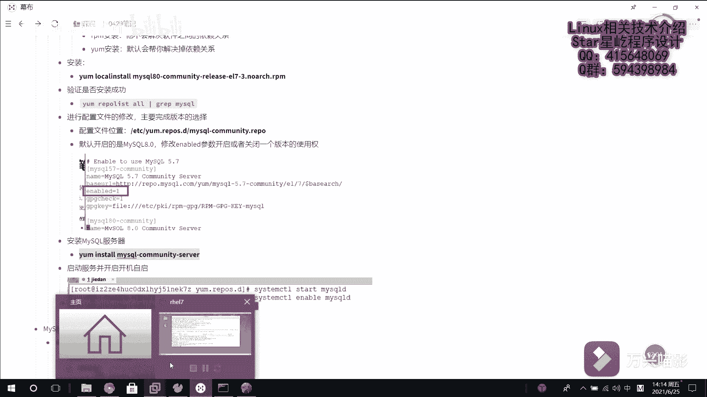

Linux数据库管理：第20章：MySQL数据库部署 🗄️

在本节课中，我们将学习如何在Linux系统上部署MySQL数据库。主要内容包括获取MySQL安装包、安装MySQL服务器、配置版本选择以及启动服务。

---

### 获取MySQL安装包

首先，我们需要获取MySQL数据库的安装文件。本次操作将从网络下载MySQL的RPM安装包。

下载完成后，我们将安装包复制到虚拟机中。此时，我们已经拥有了MySQL的安装包。

---

### 安装MySQL

接下来，我们使用本地安装方式安装MySQL。具体命令是使用 `yum install` 进行安装。

需要注意的是，如果系统之前已经安装过MySQL，可能需要处理版本冲突。本次演示的虚拟机之前已安装过MySQL。

---

### 配置MySQL版本

MySQL有多个版本，例如5.5、5.6、8.0等。系统默认可能启用了某个版本（如8.0），我们需要手动配置以启用我们想要的版本。

以下是配置步骤：

1.  首先，进入目录 `/etc/yum.repos.d/`。此目录下的配置文件用于管理软件仓库和版本。
2.  编辑MySQL相关的配置文件。默认配置可能只启用了8.0版本。
3.  在配置文件中，找到版本启用选项。例如，将 `mysql80-community` 的 `enabled` 值改为 `0`（禁用），将 `mysql56-community` 的 `enabled` 值改为 `1`（启用）。
4.  保存配置文件。至此，系统将默认使用MySQL 5.6版本。

---

### 安装MySQL服务器

配置好版本后，我们开始安装MySQL服务器。使用以下命令：



```bash
yum install mysql-community-server
```

使用 `yum` 安装的好处是它能自动解决软件依赖关系，无需手动处理。安装过程可能需要一些时间，请耐心等待。安装过程中可能会提示确认，输入 `y` 即可。

安装完成后，MySQL服务器就部署完毕了。

---

### 启动MySQL服务

最后一步是启动MySQL服务。使用 `systemctl` 命令来启动服务：

```bash
systemctl start mysqld
```

这里的服务名称为 `mysqld`。启动服务可能需要等待一小段时间。


---

本节课中我们一起学习了在Linux系统上部署MySQL数据库的完整流程：从获取安装包、安装软件、配置所需版本，到最终启动MySQL服务。掌握这些步骤是进行数据库管理和后续操作的基础。