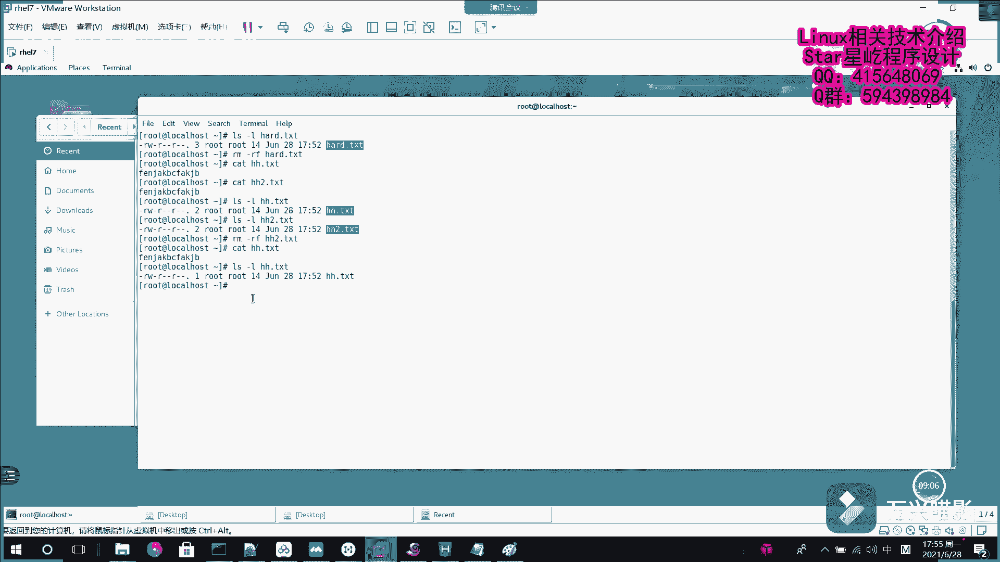

# 【Linux】从入门到精通 ｜ 零基础自学 ｜ 全套教程 ｜ RHCSA ｜ RHCE ｜ Linux爱好者 - P21：021-软硬链接 - Yo_Holly - BV1Df4y187g7

呃，在这个视频当中啊，我要介绍linux当中的两种链接方式，软链接和硬链接。呃，在windows系统当中啊，快捷方式其实就是指向原始文件的一个链接文件，可以让用户从不同的位置来访问原始文件。

原文件一旦被删除或者剪切到其他地方，就会导致这个链接文件失效。但是这个看似简单的东西啊，在linux系统当中的话，它又不太一样。在lininux当中啊，它分分为两种链接方式，一种是软链接，一种是硬链接。

软链接的话在这块也叫符号链接，它就是说仅仅包含所链接文件的名称或路径。它其实就像个记录地址的一个标签一样。当原始文件被删除或移动后，新的链接也会随时失效，不能访问。可以对文件目录做链接。

跨文件系统也也不是问题。但是就是说这一点来看的话，和windows系统的快捷方式有一样的性质。用户访问起来的话，其实也是一样的。这块的话就是说我先画一幅图，然后去分析一下这个就是说它是怎样一种机制。呃。

它的话就是这样的，就是说这个的话是假如说这块的话，这个是硬盘设备。这个是硬盘设备。这里面存储的是数据，所有的数据。然后我在这块的话是有一个原始文件。原始文件对应的话，我有一个呃软链接。

然后这样的话这块对应有一个操作值。呃，他是这么一回事啊，他说我这个操作者直接找到这个原始文件，然后也可以访问到这个数据。然后操作者找到软链接，然后它软链接的话，它里面存储的不是原始文件的一些链接信息嘛。

所以我再找到原始文件也能找到这个对应的数据。它是这样的。所以的话如果之后我把这个原始文件给它删掉之后，也就是说我操作者点击这个软链接，它已经找不到原始文件了。也就是说它里面存的这个地址的话，无效了。

所以这个数据的话，它就获取不了了。这就是软链接，一旦把原始文件删删除之后，它就失效了。然后紧接着咱们假如说创建一个文件，创建一个文件toAA点PST。然后eco呃一堆乱七八糟的东西。

然后输到这个TST里面。然后我先看一下。这就是刚才输进去的东西。现在我对它创建一个软链接，软链接的话就是加的这个选项就是杠S杠S的话，就是说你想sofft是吧？软链接。

然后假如说我把这个AA点TST链接到。呃，链接到哪个哪个文件，比如说我们叫假如说叫ABC点TST呃，这个这这样的话，一个链接就建好了。然后我看这个ABC点TST里面，它都放了哪些内容。它里面的话。

哎我现在去查看它的话，我也可以看到刚才文件的数据。它的访问方式的话，也就是说它从软链接找到原始文件，然后再去访问数据，这就是一个软链接，假如说咱们现在呃做一件事情。就是说强势把这个AA点TST给删除了。

现在查看已经没有AA点TST了，删除了。然后我们再次查看这个ABC点TST。他现在就是说他已经是没有这个文件或者目录了。也就是说这个软链接失效了，这就是软链接。然后紧接着介绍这个在呃。

lininux下面的这个另一种链接方式叫硬链接，然后它是可以将理解为就是说指向原始文件的一个指针。它就是说系统会创建一个与原来文件一模一样的inow的信息块。这个inow信息块的话。

它们都是指向呃这个硬盘上的这块数据。所以的话呃这个时候啊就是说我要是把原始文件删掉的话。我访问这个硬链接的话，我还是可以取到数据的。也就是说其实就相当于是呃这个硬链接的话。

就是说我我指向原来的数据不断给它加一个指针，加指针。假如说它有多个指针去指向这个文件，我只只要这个inow数不为不为零的情况下，我都可以去访问它。然后他访问的方式的话，我这块再画个图给介绍一下。呃。

这个的话就是是他就是这样的。比如说这个是硬盘。然后它里面对应存放的是数据。然后硬链接的话，它是这么一回事，它就是。是它是这样的呃，原始文件。然后这块的话是。并链接一。然后下面是。应链接2。

然后这块有一个操作者。操作者他如果啊他可以有三种方式去访问数据。呃，通过原始文件，然后直接去访问数据，这是一种方式。然后它不同于呃软链接的一点是它是建立了一个inow的指针。

然后这个inow的指针的话是直接指向数据。也就是说这三者它同时都可以代表这个数据的一个溯源。就看我用哪种方式去访问，然后我也可以用这个应硬链接二去访问这块数据。呃，接下来我就开始演示一下这个硬链接啊。

硬链接的话它是这它是这样的。硬链接首先啊。呃，看到这看到这一块，呃，我再创建一个文件，比如说是叫假如说叫hud点TST。然后我往里面放点东西，也是随便挑点东西吧。然后放进去这个我看一下这个对应的文件。

TST然后我现在用这个LN去创建一个硬链接。刚才那个杠S的话是soft嘛，是代表创建的是软链接。我这块如果我不加选项的情况下，我去创建链接的话，我就方说hard。然后给他创建一个链接。

比如说叫HH点TST。不加不加选项，它默认创建的就是硬链接。然后我现在看HH点TST就在这一块，这个就是HH点TS。首先我看一下HH点TST里面它有什么东西，哎，它有这个东西了。

然后我现在啊再创建一个硬链接，比如说是hatHH2点TST，然后我看查看一下这个canHH。2点TST它里面同样也是这些信息。然后我现在LS杠L，我查看一下这个hud。这块的话有一个3。

也就是说这块代表说是它in node的e node的指针有3个。也就是说我要把这个inode的指针这个数目削成零的情况下，它才说是这个数据失效了。首先啊我假如说我先做一件事情。我先把这个。card删掉。

就是这个原文件给删掉。然后删掉之后，然后在这个这种情况下，我先访问这个headdHH点TST，我可以访问到，然后再访问到HH2点TST它依然可以访问到这这个的话就代表硬链接的话，它每次创建的链接的话。

彼此不影响原文件删除之后，不影响链接文件。首先验证这一点了，是吧？然后我紧接着我再删除杠然后我把这个HH2点TST给删除了。哎，首先先看一下这个吧，LS杠L。

然后我再看一下HH点TST看它的硬链接数呃是2。然后我再看一下二的。它的话它也是音连接数，应度的数的话是2，然后我再删除一个，紧接着删除一个。比如说我把HH2。🎼那给删掉。

然后这个时候我再看这个HH点TST。这个时候这就是所有的内容，它依然在。所以现在的话我再看一下这个HH点TST信息的话，它就剩一个因度的指针了。也就是说我现在就剩一个文件了，你想剩一个文件了。

我把它删掉，也就代表把所有就都给删掉了。这个的话就是软硬链接之间的一个呃区别讲解一下。

