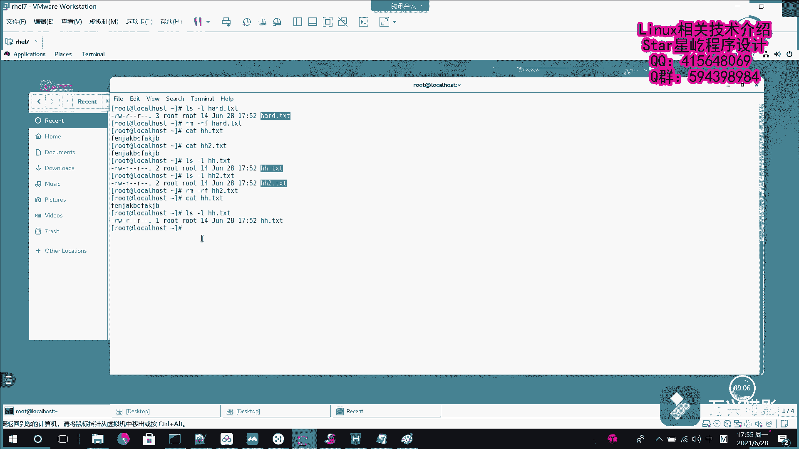

# Linux入门到精通：P21：软硬链接详解 🔗

在本节课中，我们将要学习Linux系统中两种重要的文件链接方式：软链接和硬链接。理解它们的区别和工作原理，对于管理文件系统和数据至关重要。

## 概述

在Windows系统中，快捷方式是指向原始文件的一个链接。原始文件被删除或移动后，快捷方式就会失效。Linux系统则提供了两种不同的链接机制：软链接和硬链接。它们的行为和原理与Windows快捷方式有所不同。

## 软链接（符号链接）

上一节我们介绍了链接的基本概念，本节中我们来看看第一种链接方式——软链接。

软链接，也称为符号链接，其本质是一个包含所链接文件路径名的特殊文件。它就像一个记录了目标地址的标签。当原始文件被删除或移动后，软链接将因找不到目标而失效。软链接可以指向文件或目录，并且可以跨文件系统创建。

为了更直观地理解，我们可以通过一个示意图来分析其工作机制：

```
[操作者] --> [软链接文件] --> [原始文件] --> [硬盘数据]
```

操作者可以通过直接访问原始文件来获取数据，也可以通过访问软链接文件，由软链接指引到原始文件，最终访问数据。如果原始文件被删除，软链接中的路径信息便失效，导致无法访问数据。

以下是创建和验证软链接的步骤：

1.  首先，我们创建一个原始文件并写入内容。
    ```bash
    echo "一些示例内容" > AA.TST
    cat AA.TST
    ```

2.  接着，使用 `ln -s` 命令为该文件创建一个软链接。
    ```bash
    ln -s AA.TST ABC.TST
    ```

3.  此时，通过软链接文件可以正常访问原始文件的内容。
    ```bash
    cat ABC.TST
    ```

4.  最后，我们删除原始文件，再次通过软链接访问，会发现链接已失效。
    ```bash
    rm AA.TST
    cat ABC.TST  # 此时会提示“没有那个文件或目录”
    ```

## 硬链接

了解了指向路径的软链接后，本节我们来学习另一种更底层的链接方式——硬链接。

硬链接可以理解为指向原始文件数据块的一个直接指针。系统会创建一个与原始文件完全相同的索引节点（inode）信息块。这个inode直接指向硬盘上的物理数据。因此，即使原始文件被删除，只要还有硬链接指向该数据块，数据就依然可以通过硬链接访问。可以将inode的链接数视为指向同一块数据的指针数量，只有当链接数降为0时，数据块才会被系统真正释放。

其工作机制示意图如下：

```
[操作者]
    |
    |---> [原始文件 inode] ---\
    |---> [硬链接1 inode] ------> [硬盘数据]
    \---> [硬链接2 inode] ---/
```

操作者可以通过原始文件、硬链接1或硬链接2中的任意一个inode访问到同一份数据。它们地位平等，都是数据的有效入口。

以下是创建和验证硬链接的步骤：

1.  首先，创建一个新的原始文件。
    ```bash
    echo "硬链接测试内容" > hard.TST
    ```

2.  使用 `ln` 命令（不加 `-s` 选项）创建硬链接。默认创建的就是硬链接。
    ```bash
    ln hard.TST HH.TST
    ln hard.TST HH2.TST
    ```

3.  通过 `ls -li` 命令查看文件详情，可以观察到这些文件的inode编号相同，且链接数（第二列）为3。
    ```bash
    ls -li hard.TST HH.TST HH2.TST
    ```

4.  现在，我们开始删除文件以验证硬链接的特性：
    *   删除原始文件 `hard.TST`，然后通过 `HH.TST` 和 `HH2.TST` 依然可以访问到数据。
    *   再删除 `HH2.TST`，通过 `HH.TST` 依然可以访问数据，并且其链接数变为1。
    *   最后删除 `HH.TST`，此时指向该数据块的所有链接都已删除，链接数降为0，数据被系统回收。

## 总结

本节课中我们一起学习了Linux中的软链接和硬链接。



*   **软链接**：是一个包含目标文件路径的特殊文件，类似于Windows的快捷方式。**`ln -s <源文件> <链接文件>`**。源文件删除则链接失效，可以跨文件系统，可以对目录创建。
*   **硬链接**：是直接指向文件数据块（inode）的另一个文件名。**`ln <源文件> <链接文件>`**。删除源文件不影响其他硬链接对数据的访问，不能跨文件系统，不能对目录创建。


理解并熟练运用这两种链接，能够帮助你在Linux系统中更灵活、高效地组织和管理文件。