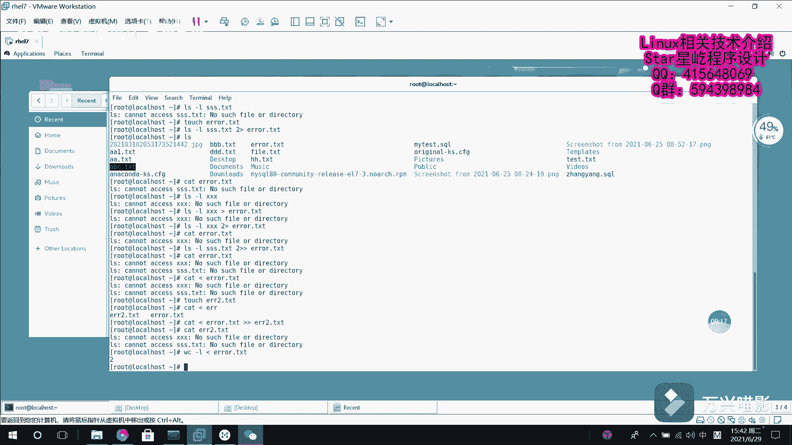

# 【Linux】从入门到精通 ｜ 零基础自学 ｜ 全套教程 ｜ RHCSA ｜ RHCE ｜ Linux爱好者 - P22：022-重定向技术1 - Yo_Holly - BV1Df4y187g7

本视频开始啊，我们呃我们将介绍这个linux重定向技术。linux重定向技术的话，它分为输入重定像和输出重镜像。简单来说啊，这个输入重定像是把文件导入到命令当中攻命令去用。然后这个输出重定像。

它就是把原本要输出到屏幕上的数据信息啊写入到指定的文件当中，在日常学习和工作当中啊，相较于输入重定像，我们更多的去使用的到的是这个输出重定向。然后紧接着啊我要介绍的是把重定向技术呃分分成5种模式。

它的话有5种模式，就是说标准覆盖输出重定向，这块的话就是说是我把这个输出重定向，输出输出这个重定向的话给它分类。呃，标准输出和错误输出。它这个的话都属于输出重定向。

然后首先第一种模式是标准覆盖输出重定向。它的话是用一个向右的。箭头代表标准追加突出重镜项，它是用两个。然后错误覆盖输出重定向的话，呃，它是用一个2，然后一个箭头。

然后代表覆盖错误追加的话是一个2两两个向右的箭头。输输入重定向的话是一个向左的箭头。然后这块啊错误重定错误追加重定向和错误覆盖重定向这一块的时候，写到一个2，它到底有怎样的意思，怎样的含义呢？也就是说。

紧接着就需要谈到三个比较常用的这个输入输出输入输出流。首先第一个是这个标准输入重定向stay in它的对应的文件描述符是0，它呢默认是从键盘输入也可以从其他文件或者是命令输入这块的话。

你只要给它一个输入流就可以了。标准输出重定向的话，呃，标准输出重定向和这个错误输出重定向的话，它们对应的文件描述符分别是一和2，它们其实啊输出嘛，默认的话，你只要不去更改它的输出源，它都是输出到屏幕。

呃，这一块相信大家都了解到的是一句输的比较响的话，都是说linux下一切接文件。呃，在这一块的话，输入输出输入输出重定向操作的话，也是把它当做一项文件。操作。然后既然涉及到文件。

我需要对它就是说是进行呃区别化，然后加入了文件描述符。所以的话在这一块标准输入输出以及错误的话，它都分配了相应的文件描述符来呃唯一的甄别它。呃。

紧接着我们就是通过一些实际的案例去感受一下lininux重定像技术。首先啊我们来到这个呃re7系统界面，然后我们需要做的是刚开始我们先创建一个界面，比如说创建一个文件，比如说是叫菲尔点TST。

然后我往里面写，假如说我先输出一段字符串。它是输出了，直接输出到屏幕了。然后我现在需要把它呃利用标准追加覆标准覆盖追加嗯重定向，然后把它放进这个呃f二点刚才创建的这个TST里面。

然后我在这块看这个f尔点TST。嗯，就写进来了。紧接着比如说我再我再写入一个字符串，然后同样是追加到这个f里面。然后我再次查看。看刚才第一次放入的那个字符串，它就被覆盖了。也就是说这个文件内容的话。

就是说每一次写入的新内容都会覆盖之前的内容。如果我是做这么一件事，我我呃比如说我现在做1个LS杠L，我查这个fre点TST它的各项属性，我我过一段时间我查一下，我我想把我查的记录给它呃。

放到这个文件里面，这个时候该怎么做，还不想让它去覆盖。因为不同时间可能它有些属性呃，不一样。这个时候比如说我要是这样做呃。L杠L点TST。然后比如说我就追加到这个fre点TST里面。现在是我看查看一下。

现在是下午呃3点37的，比如说我现在再再次执行一下这个命令，然后再次查看它的话就成三他它的话就是说是这个其余的肯定是有呃微小的变化。因为这块的话只精确到分。对，比如说我现在啊再再次追加。假如说我杠L。

嗯，看看。这样e，然后W word word，然后我把它放进这个fair里面，这样的话一看就肯定是把刚才的就给覆盖掉了。现在想做的一件事情就是呃我依次往进加。

这个时候就是要使用到这个追加重追加输出重定向。然后也是同样的，我开始做。比如说我写一个hello，然后我同样给它放进去。这个时候我再次查看。他就追加进来了。对，这个的话就能按照我们的要求。

就是说不同时间，我把不同的记录给追加进来。呃，其次啊就谈到刚才说的那个错误，呃，怎样称之为一个错误？比如说我现在LS杠L，我查1个SS点TST，这就是原本不存在的一个文件，我查的话，它就会报呃。

没有这个文件或者是目录，也就是说它就是一条错误信息了。然后我现现在啊比如说我创建一个创建一个文件，叫 error点TST。我想多说是我把这些所有的报错信息啊，都给它放到这个 error点TST里面。呃。

这个时候啊我们需要做的话，就是需要这样做了。呃，同样是拿到这个，然后我首先是二是文件描述符，然后追是追加，这个是覆盖。然后我放到首先演示覆盖，我把它放到这个里面，然后你看。呃。

看一下这个刚才这个arrow。他就把这个对应的这个错误报错信息就给放进去了。比如说咱们现在在LS杠L再查一个呃XX。同样也是一个不存在的。

然后我们现在再把它覆盖到这个这块的话是首先需要加一个这个文件描述符代表错误，我输出进来了。然后我现在查一看这个 error这个文件里面，它现在就变成XS文件的一个报错信息了。

刚才呃刚才的那个文件的报错信息就已经不复存在了。现在我想让不同的报速信息，它依次累加放进去。然后这个时候做的话就是这样的LS杠L。比如说我还是叫之前的STS test，然后追加到ever里面。

然后我再次查看我这个对应的ar文件。这样的话，他就把两条报错信息，就是说根据不同的时间顺序，然后对它进行相应的一个记录。然后紧接着啊介绍的这个是呃输入重输入重镜向。输入的话。

刚才我们介绍到它是把文件内容啊给到命令供命令所用。比如说我们现在需要做的一件事情是can它一之前啊是查看文件的内容。比如说我现在的话，我把这个 error error里面的内容给到它。

让它做一个呃给他给到这个can命令，让他去用。也就是说我把看 error里面的内容显示出来。这个时候就其实说是把 error内容取出来以后，那那个临时的东西也把它当做一项文件，看的话。

它的这个命令后面需要加一个文件，它去显示。也就是说我把这个内容就显示出来了。你看这个的话就是刚才的内容，也可以是这样的。

比如说是我现在在创再创建一个 error air点ST然后我现在啊我查看我这个 error。呃，ar文 error文件让它用cant显示出来。其次我把它再追加到这个ar点TST文件当中。

arrowrowI点TST文件里面。然后我现在查看一下艾2点TST。对应的刚才ar点TST里面的内容就输出输入。就放到这个ar2点TST里面了。然后啊其实这样用的话也可以是这样。

比如说我要统计一个文件的行数，我也我也是可以这样的 error。arrow点TST，然后给到WC杠L，它就会统计出来，总共有两行。这个的话就是纯定向技术。

